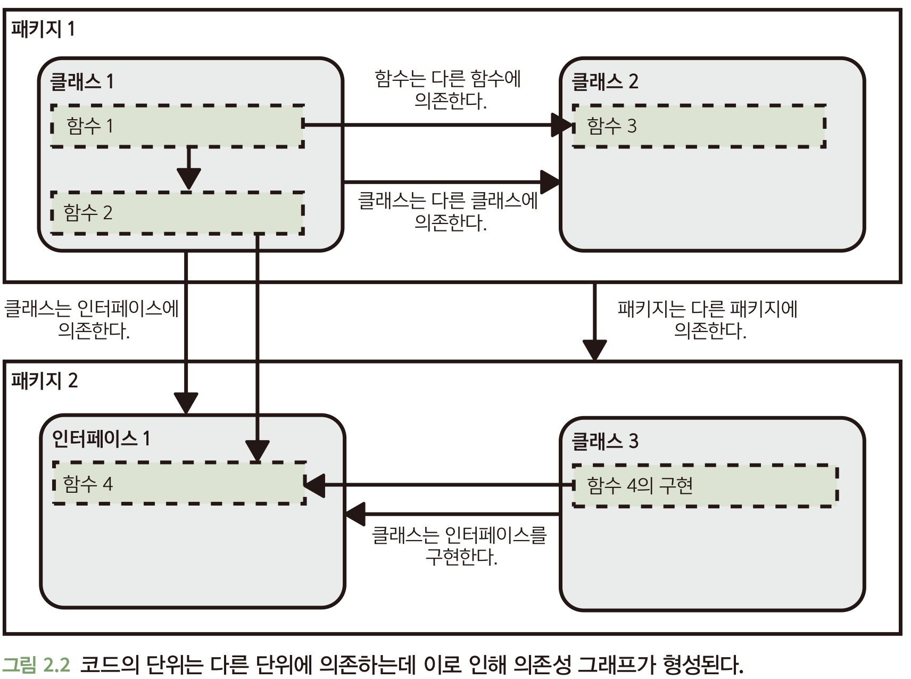

<!-- TOC start (generated with https://github.com/derlin/bitdowntoc) -->

- [2. 추상화 계층](#2--)
    * [2.1 널값 및 의사코드 규약](#21----)
    * [2.2 왜 추상화 계층을 만든는가?](#22----)
        + [2.2.1 추상화 계층 및 코드 품질의 핵심 요소](#221-------)
    * [2.3 코드의 계층](#23--)
        + [2.3.1 API 및 구현 세부 사항](#231-api----)
        + [2.3.2 함수](#232-)
        + [2.3.3 클래스](#233-)
        + [2.3.4 인터페이스](#234-)
            - [모든 것을 위한 인터페이스?](#---)
        + [2.3.5 층이 너무 얇아질 때](#235----)
    * [2.4 마이크로서비스는 어떤가?](#24--)

<!-- TOC end -->

# 2. 추상화 계층

- 코드 작성의 목적은 문제 해결이다
    - 문제는 상위 수준의 문제도 존재하지만 하위 수준의 문제도 존재한다.
- 상위 문제를 풀 때 우리는 무의식적으로 여러 개의 작은 하위 문제로 나눈다.

- 문제를 어떻게 해결하는지도 중요하지만 해결하는 코드를 어떻게 구성할 것인지도 중요하다.
    - 하나에 구현할 것인가 vs 여러 개로 나눌 것인가
    - 나눈다면 어떻게 나눌 것인가

- 코드 구성 방법은 **코드 품질**의 기본적인 측면 중 하나다.
- **간결한 추상화 계층(layers of abstraction)** 을 만드는 것이 코드를 잘 구성하는 방법일 때가 많다.

## 2.1 널값 및 의사코드 규약

- 널값은 믿을 수 없을 정도로 유용하면서 동시에 믿을 수 없을 정도로 문제가 많은 양극단의 역사를 가지고 있다.

- 널이라는 개념 즉, '값이 없다' 또는 '부재한다'라는 개념은 유용하다
    - 값이 제공되지 않거나 함수가 원하는 값을 반환할 수 없는 상황이 존재하기 때문이다.
- 값이 널일 수 있거나 널이면 안되는 경우가 항상 명백한 것은 아니다.
    - 그래서 널과 관련된 문제가 발생한다.

- 어떤 사람은 널값을 사용하지 말아야 한다고 주장한다.
- 혹은 적어도 함수가 널값을 반환하지 않아야 한다고 조언한다.
- 이런 방법은 널 문제를 피하는데 확실히 도움이 되지만 많은 연습이 필요하다.

- 최근 몇 년 동안 널 안정성(null safety) 또는 보이드 안정성(void safety)가 떠오르고 있다.
- 널값이 가능한 변수나 반환값은 그에 맞게 표시해야 한다.
- 또한 컴파일러는 반드시 널값 여부 확인을 해야 한다.

## 2.2 왜 추상화 계층을 만든는가?

- 코드 작성은 복잡한 문제를 계속해서 더 작은 하위 문제로 세분화하는 작업이다.

- 예를 들어 서버에 메시지를 보내는 작업을 다음과 같이 생각할 수 있다.

```java
HttpConnection connection=HttpConnection.connect("server");
        connection.send("Hello");
        connection.close();
```

- 이런 코드를 작성할 때 필요한 개념도 네 가지 간단한 개념이면 충분하다.
    - 서버의 URL
    - 연결
    - 메시지 문자열 보내기
    - 연결 닫기

- 하지만 실제로는 하위에 복잡한 문제들이 존재한다.
    - HTTP 프로토콜, TCP, 신호 변조, 체크섬,, 등등

- 하지만 다른 개발자들이 이미 하위 문제들을 해결해놨다.
- 또한 그것들을 인식할 필요도 없도록 만들어놨다.

- **이러한 것을 추상화 계층(layers of abstraction)** 이라고 한다.

- 추상화 계층을 만들면 같은 층위 내에서는 쉽게 이해할 수 있는 몇 가지 개념들만 다룰 수 있다.
- 이러한 것은 소프트웨어 엔지니어로서 문제를 해결할 때 목표가 되어야 한다.

- 문제가 엄청나게 복잡할지라도 하위 문제들을 식별하고 올바른 추상화 계층을 만듦으로써 그 복잡한 문제를 쉽게 다룰 수 있다.

### 2.2.1 추상화 계층 및 코드 품질의 핵심 요소

- 깨끗하고 뚜렷한 추상화 계층을 구축하면 코드 품질의 네 가지 핵심 요소를 달성할 수 있다.

- 가독성
    - 모든 세부사항을 이해하는 것은 불가능하지만 몇 가지 높은 계층의 추상화를 이해하고 사용하기는 쉽다.
    - 추상화 계층이 깨끗하고 뚜렷하면 한 번에 한두 개 정도의 계층과 몇 개의 개념만 다루면 된다.
- 모듈화
    - 추상화 계층이 하위 문제에 대한 해결책을 깔끔하게 분리해내면 계층 내에서만 구현을 변경하기가 매우 쉬워진다.
- 재사용성 및 일반화성
    - 해결책이 간결한 추상화 계층으로 제시되면 이를 재사용하기가 쉽다.
    - 또한 문제가 적절하게 추상적인 하위 문제로 세분화되면 이를 여러 다른 상황에도 유용하게 일반화할 수 있을 가능성이 크다.
- 테스트 용이성
    - 코드가 추상화 계층으로 깨끗하게 분할되면 각 하위 문제에 대한 해결책을 완벽하게 테스트하는 것이 훨씬 더 쉬워진다.

## 2.3 코드의 계층

- 추상화 계층을 생성하는 방법은 코드를 서로 다른 단위로 분할하여 단위 간의 의존 관계를 보여주는 의존성 그래프를 생성하는 것이다.

- 대부분의 프로그래밍 언어는 코드를 다른 단위로 나누기 위해 몇 가지 언어 요소를 자유롭게 사용할 수 있다.
    - 함수
    - 클래스(및 구조체나 믹스인 등 비슷한 것들)
    - 인터페이스
    - 패키지, 네임스페이스, 모듈



### 2.3.1 API 및 구현 세부 사항

- 우리는 코드를 작성할 때 다음을 고려한다.
    - 코드를 호출할 때 볼 수 있는 내용
        - 퍼블릭 클래스, 인터페이스 및 함수
        - 이름, 입력 매개변수 및 반환 유형이 나타내는 개념
        - 코드 호출 시 코드를 올바르게 사용하기 위해 알아야 하는 추가 정보
    - 코드를 호출할 때 볼 수 없는 내용
        - 구현 세부 사항

- API : Application Programming Interface
- API는 서비스를 사용할 때 알아야 할 것들에 대한 개념을 형식화하고, 서비스의 모든 구현 세부 사항을 이 API 뒤에 감춘다.

- 코드를 API 관점에서 생각하면 추상화 계층을 명확하게 만드는데 도움이 된다.
- 코드를 작성하거나 수정할 때 API에 이 수정 사항에 대한 구현 세부 정보가 새어 나간다면 추상화 계층이 명확하게 구분된 것이 아니다.

### 2.3.2 함수

- 어떠한 로직을 새로운 함수로 구현하면 대부분 유익하다.
- 각 함수에 포함된 코드가 하나의 잘 써진 짧은 문장처럼 읽히면 이상적이다.

- 함수가 다음 중 하나의 일만 하도록 제한하면 함수를 쉽고 단순한 문장으로 표현하는데 도움이 된다.
    - 단일 업무 수행
    - 잘 명명된 다른 함수를 호출해서 더 복잡한 동작 구성

- 일단 함수를 작성했으면 코드를 문장으로 만들어보면 좋다.
- 문장을 만들기 어렵거나 어색하면 함수가 너무 길거나 여러 가지 일을 하고 있는 것이므로 더 작은 함수로 나누는게 좋을 수도 있다.

- 함수를 작게 만들고, 하는 일을 명확하게 만들면 코드의 가독성도 올라가고 재사용성도 올라간다.

### 2.3.3 클래스

- 단일 클래스의 이상적인 크기에 대한 여러 논의가 있었다.
    - 줄 수
        - 경고의 역할을 할 뿐 어떤 것이 옳다는 보장은 아니다
    - 응집력(cohesion)
        - 순차적 응집력
            - 한 요소의 출력이 다른 요소에 대한 입력
        - 기능적 응집력
            - 여러 기능이 하나의 일을 수행하는데 기여하는 경우
    - 관심사의 분리(seperation of concerns)
        - 시스템이 각각 별개의 문제를 다루는 개별 구성 요소로 분리되어야 한다는 설계 원칙

- 응집력과 관심사의 분리를 고려할 때는 어느 정도까지를 하나의 사항으로 간주하는 것이 좋을지 결정해야 한다.
- 하지만 이는 매우 주관적이고 상황에 따라 다르다.

- 이러한 조언을 알고 있는 개발자는 많지만 그럼에도 불구하고 여전히 사람들은 너무 큰 클래스를 작성한다.
- 기존 코드를 수정하거나 새로 짤 때 클래스가 너무 커지는 것이 아닌가 주의해야 한다.

- 클래스의 응집력이나 단일 책임 원칙은 결국 더 높은 품질의 코드를 작성하기 위함이다.
- 하지만 근본적으로 우리가 어떤 것을 성취하고자 하는지도 생각해볼 필요가 있다.
    - 코드 가독성
        - 기능이나 개념이 많으면 가독성이 떨어진다.
    - 코드 모듈화
        - 클래스나 인터페이스를 적절히 사용하면 모듈화를 잘 할 수 있다.
        - 또한 하위 문제에 대한 해결책 교체도 수월하게 할 수 있다.
    - 코드 재사용성 및 일반화
        - 여러 하위 문제를 풀어놓은 클래스가 있다면 하나의 하위 문제를 해결하고 싶을 때 재사용하기 어렵다.
    - 테스트 용이성 및 적절한 테스트
        - 하나의 클래스가 너무 많고 다양한 로직을 갖고 있으면 테스트하기 어렵다.
        - 로직이 여러 클래스로 나뉘면 각 부분을 테스트하기 쉽다.

- 하나의 클래스가 하나의 상위 문제를 해결하고 있다고 하더라도 여러 하위 문제를 해결하는 코드 또한 가지고 있을 수도 있다.
- 이때 관련 하위 문제를 해결하는 것이 상위 문제와는 다른 관심사인지 혹은 본질적으로 같은 문제인지 헷갈릴 수 있다.
- 이때 클래스를 분리해야 할지 고민된다면 코드 품질의 네 가지 핵심 요소를 따르는지 살펴보면 도움이 될 수도 있다.

- 만약 하위 해결책을 분리하기로 결정하면 하위 문제에 대한 해결책을 자체 클래스로 분할하여 개선할 수 있다.
- 이렇게 클래스를 분리하면 다음과 같은 이점이 있다.
    - 각 클래스마다 몇 개의 개념만 파악하면 되니까 가독성이 높아진다.
    - 코드가 조금 더 모듈화되었기에 재구성하기 쉬워졌다.
    - 코드를 재사용하기도 쉬워졌다.
    - 코드를 테스트하기도 쉬워졌다.

- 코드를 적절한 크기의 클래스로 세분화하는 것은 추상화 계층을 잘 만들기 위한 가장 효과적인 도구이기 떄문에 시간과 노력을 들일 가치가 충분히 있다.

### 2.3.4 인터페이스

- 계층 사이를 또렷하게 구분하고 구현 세부 사항이 계층 사이에 유출되지 않도록 하는 방법 중 하나는 인터페이스를 사용하는 것이다.
- 인터페이스를 이용해 어떤 함수를 외부로 노출할지 결정한다.

- 상위 계층은 인터페이스에 의존할 뿐 로직을 구현하는 구체적인 클래스에 의존하지 않는다.

- 하나의 추상화 계층에 대해 두 가지 이상의 구현이 있거나 그럴 것으로 예상되는 경우 인터페이스를 정의하는 것이 좋다.

#### 모든 것을 위한 인터페이스?

- 한 가지 구현만 존재하고 다른 구현을 추가할 계획이 없더라도 인터페이스를 사용할 것인가는 각자 결정할 일이다.
- 몇몇 소프트웨어 공학 철학은 이런 상황에도 인터페이스를 사용할 것을 권고한다.

- 실제로 단일 구현체에 대한 인터페이스를 사용했을 때 장점이 존재한다.
    - 퍼블릭 API를 명확하게 보여준다
    - 한 가지 구현만 필요하다는 추측이 틀릴 수 있다
    - 테스트를 쉽게할 수 있다.
        - 이는 언어에 따라 다르다.
    - 같은 클래스로 두 가지 하위 문제를 해결할 수도 있다.
        - Ex) LinkedList 클래스는 List, Queue 인터페이스 모두 구현한다.
        - 이는 코드의 일반화 가능성을 높인다
- 다만 단점도 있다
    - 더 많은 작업
    - 코드가 복잡해질 수 있다.
        - 매번 인터페이스 -> 구현체 순으로 접근해야 한다.

- 결국 인터페이스를 사용했을 때의 장점이 확실한가를 고민하면서 사용해야 한다.
    - 깨끗하고 뚜렷한 추상화 계층을 만드는데 집중해야 한다.

- 또한 클래스를 작성하거나 수정할 때마다 나중에 필요한 경우 인터페이스를 붙이는 것이 어렵지 않도록 코드를 작성해야 한다.

### 2.3.5 층이 너무 얇아질 때

- 코드를 별개의 계층으로 세분화하면 장점이 많지만 추가 비용도 발생한다.
    - 클래스를 정의하거나 의존성을 가져오기 위한 보일러플레이트 코드로 인해 코드 양이 늘어난다.
    - 로직의 이해를 위해 클래스나 파일 따라갈 때 더 많은 노력이 필요하다.
    - 어떤 상황에 어떤 구현이 사용되는지 알기 어려워 로직을 이해하거나 디버깅하는게 더 어려울 수도 있다.
- 그럼에도 불구하고 일반적으론 장점이 비용보다 크다.
- 분할을 위한 분할은 의미가 없으므로 적절히 적용해야 한다.

- 코드 계층 규모는 잘 정해야 한다.
- 일반적으로 너무 많은 일을 하는 계층은 너무 적은 일을 하는 계층보다 더 문제가 될 수 있다.
- 따라서 여러 개로 나누는 것이 한 계층 안에 모든 코드를 집어넣는 것보단 낫다.

- 계층이 적절한지 결정해주는 마법의 원칙은 없다.
    - 이는 해결하려고 하는 문제에 따라서 다르기 때문이다.
- 따라서 나눈 계층이 코드 품질의 네 가지 요소에 기여하는지 생각해보면서 작업해야 한다.

## 2.4 마이크로서비스는 어떤가?

- 마이크로서비스는 일반적으로 꽤 간결한 추상화 계층을 제공한다.
- 하지만 여전히 그 내부에서 적절한 추상화 계층을 고려하는 것이 필요하다.

- 마이크로서비스는 한 가지 일만 수행하지만 한 가지를 수행하기 위해 해결해야 할 하위 문제가 많다.
- 따라서 마이크로서비스를 개발할 때도 적절한 추상화 및 코드 계층은 중요하다.
