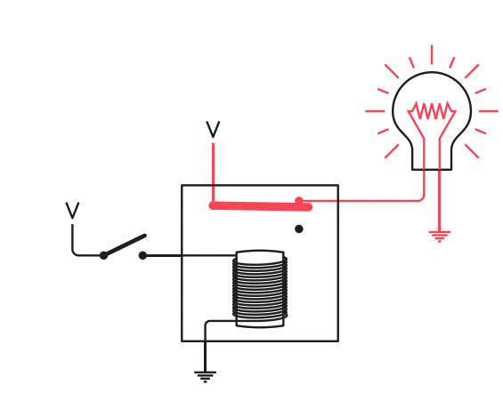

# Chapter 1 친한 친구와의 대화

- 친한 친구와 새벽에 몰래 대화할 때 어떻게 할 것이냐?
- 손전등 사용 => 비효율적
- 모스부호 사용
- 부호 ( CODE )
  - 사람과 사람, 사람과 컴퓨터, 컴퓨터와 컴퓨터간의 정보를 전달하는 체계

# Chapter 2 부호와 조합

- 모스부호는 이진법을 기반으로 함
  - 점과 선의 조합으로 뒤에 추가되는 점 혹은 선을 통해 쉽게 모스 부호를 해석하는 표를 만들 수 있음
- 동전과 같은 이진 개체의 조합과 모스 부호와 같은 이진 부호는 늘 2의 거듭제곱으로 표현할 수 있음

# Chapter 3 점자와 이진 부호

- 모스부호 이전에는 점자 부호가 있었음
- 이 점자체계도 6개의 칸을 기반으로 하는 이진 부호
- 이 점자 부호에는 패턴이 있어서, 행으로 분할시 이전 행에 추가적인 점하나가 늘어나는 구조
- 페이지에서 위치가 약간 바뀌어도 같은 의미를 표현할 수 있는 형태로 정의된 것
  - 부호는 인코딩, 디코딩, 전송 과정에서 오류가 발생할 가능성이 높기 때문에 이런 오류 보정을 위한 기능을 내장한 것
- 이진 요소인 점 6개를 조합해서 64개의 가능한 부호를 만들어내는 것을 살펴 봤음
  - 또한 많은 부호가 문맥에 따라 두 가지 역할과 의미를 부여할 수 있음도 봤음
- 숫자 표시 부호와 숫자 표시 부호를 취소하는 쉬프트 부호, 문자가 대문자임을 나타내기 위한 이스케이프 부호도 존재

# Chapter 4 전등을 분해해 봅시다

- 전지의 음극에서 출발한 전자가 양극으로 돌아오면서 전지의 화학 물질과 반응하여 전기를 만들어 냄
- I = E / R
  - 전류 ( I ) 는 전압 ( E ) 를 저항 ( R ) 으로 나눈 것
  - 회로와 연결되지 않은 전지는 저항이 매우 큰 공기에만 노출되어 있기에 전류가 흐르지 않는 것
- 전선이 매우 낮은 저항을 갖고 있으면 전류가 강해져서 뜨거워지면서 빛을 냄
  - 필라멘트는 이런 원리를 이용해서 전자 에너지를 빛과 열로 바꾸는 것
- P = E x I
  - 전력 ( P ) 는 전압 ( E ) 와 전류 ( I ) 의 곱
  - 손전등이 3V의 전류와 0.75A 의 전압을 사용한다면, 2.25W의 전구를 사용해야 함
- 스위치
  - 회로에 전기를 흐르게 할 지, 안 할 지 제어하는 것

# Chapter 5 가까운 거리에서 이야기 하기

- 공통 연결을 사용하면 두 회로를 합쳐서 전선을 줄여 비용을 아낄 수 있음
- 접지까지 사용하게 된다면, 하나의 회로를 더 줄여서 두 개의 전선으로 양방향 모스부호 회로를 구축할 수 있음
- 이러한 방식을 기반으로 수 천 km 사이의 전신 시스템이 구축 된 것

# Chapter 6 논리와 스위치

- 조지 부울은 대수학의 연산자들이 숫자를 처리해야한다는 개념에서 연산자를 분리하여 연산자가 종류에 대해 적용되는 부울 대수를 만듦

  - 종류라는 것은 어떤 것의 묶음. 간단하게 집합을 생각하면 됨
  - `+` : 합집합
  - `X` : 교집합
  - 1 : 전체
  - 0 : 공집합

- 부울 대수는 교환, 결합, 배분 법칙이 성립하며, 교집합연산에 대한 합집합 연산에도 결합 법칙이 성립함

  - 흰 색 고양이와 검은색 암컷 고양이의 합집합 = 흰색 고양이와 검은색 고양이의 합집합과 흰색 고양이와 암컷 고양의 합집합의 교집합임

- 이런 부울 대수를 기반으로 삼단 논법도 수학적으로 풀어낼 수 있음

  - 인간 : P, 모든 것은 죽는다 : M, 소크라테스 : S 라고 한다면
  - P x M = P ( 모든 인간은 죽는다 )
  - S x P = S ( 소크라테스는 인간이다 )

  - 따라서, S x P = S x ( P x M ) = ( S x P ) x M = S ( 소크라테스는 죽는다 )

- 이러한 부울 대수를 이용하면, 조건에 대한 것을 수식으로 나타내고 이를 통해 논리 검사라는 작업을 할 수 있음

- 논리검사는 수식화된 식에 0과 1을 대입하여 해당 수식을 검사할 수 있음

  - 0 : 기호에 해당하는 조건이 거짓임을 의미
  - 1 : 기호에 해당하는 조건이 진실임을 의미
  - ( M X N X ( W + T ) ) + ( F X N X ( 1 - W ) ) + B 라는 수식이 있을 때, 중성화되지 않은 수컷 황갈색 고양이는 M = 1, N = 0, W = 0, T = 1, B = 0 을 대입할 수 있음
    - 그렇게 대입하면. ( 1 X 0 X ( 0 + 1) ) + ( 0 X 0 X ( 1 - 0 )) + 0 = 0 + 0 + 0 = 0 임. 즉 거짓으로 수식이 나오기 때문에 해당 조건에 맞지 않은 고양이임을 알 수 있음

- 이런 부울 대수를 회로에도 도입할 수 있음

  - 스위치가 켜지고 꺼짐을 0과 1로 표현
  - 직렬 연결을 교집합으로 표현
  - 병렬 연결을 합집합으로 표현
  - 결국, 아까의 예시를 회로로 표현하면 다음과 같아짐
  - 

# Chapter 7 전신과 릴레이

- 장거리 통신을 위해 옛날에는 언덕마다 사람을 배치해서 깃발 부호라는 것을 통해 통신했음
- 전신은 전자석을 기반으로 구성되었음
- 스위치를 이용하여 전선을 통해 부호를 전달하고 수신기는 전자석이 금속레버를 끌어당기는 원리를 이용하여 정보를 수신했음

  - 수신측의 전자석이 위에 달린 금속막대를 끌어당기는 방식으로 동작
  - 

- 하지만 이게 너무 멀어지면, 저항 때문에 소음에 취약한 문제가 있었음. 이를 위해 릴레이를 도입1.

  - 릴레이는 두 통신 사이에서 거리를 조절하기 위한 역할을 함. 전선의 길이가 짧게 여러개로 나뉘기에 저항도 작아져서 릴레이를 거치면 다시 전류를 증폭해서 전달 할 수 있었음

  - 

# Chapter 8 릴레이와 논리 게이트

- 결국 컴퓨터라는 것은 불대수와 전기의 합성으로 이루어진 것

  - 수학과 하드웨어를 적절하게 조합해서 구현한 중요한 요소가 논리 게이트

  - 논리 게이트는 전류의 흐름을 차단하거나 통과시킴으로써 부울 논리에 해당하는 간단한 연산을 수행 할 수 있음

- 위에서 살펴봤듯이 릴레이는 전자석으로 스위치를 제어하고, 신호를 증폭할 수 있음

  - 여기서 우리는 스위치 제어를 전기로 할 수 있다는 것에 초점을 맞춤

- 릴레이는 직렬 혹은 병렬로 여러가지 논리 연산을 수행 할 수 있음

- 릴레이가 직렬로 연결되면, AND 연산과 동일함

​ 

- 두 릴레이의 출력이 연결된다면, 이건 OR 연산과 동일

  

- 보통 릴레이의 아래쪽 접점 ( 열림 출력 ) 에 연결하는 대신, 위쪽 접점 ( 닫힘 출력 ) 에 연결하게 되면 이건 NOT 과 동일한 연산을 하게 됨

- 아래 처럼 릴레이를 구성하게 되면, OR과 정확히 반대 연산을 하는 NOR 연산을 구현할 수 있음

- 아래 처럼 릴레이를 구성하게 되면, AND와 정확히 반대 연산을 하는 NAND 연산을 구현할 수 있음

- 이런 평범한 릴레이는 버퍼라고 불리며, 입력 신호가 약해졌을 때 증폭하기 위한 용도로 사용함

  

  - 가끔 논리 회로에서 하나의 출력을 많은 입력에 넣어야하는 경우가 있는데 이런 것을 팬 아웃이라고 함. 이때 버퍼를 사용하면 전력을 증가시키는데 도움이 됨

- 각각의 게이트를 조합해서 다른 게이트와 동일한 연산을 구현할 수 있음

  - AND 입력 두 개 모두에 인버터를 붙이게 되면, NOR이 됨
  - OR 입력 두 개 모두에 인버터를 붙이게 되면, NAND가 됨
  - 위 두 예시는 드 모르간의 법칙을 회로로 구성한 것
    - 드 모르간의 법칙은 논리식을 간결하게 만들어주기 때문에 매우 중요
