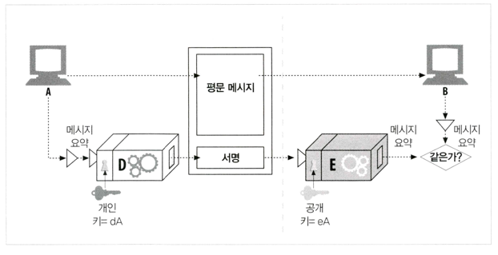
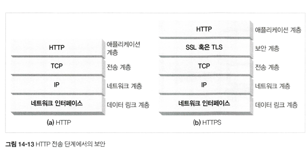

## 14장 보안 HTTP

### HTTP를 안전하게 만들기
> 서버인증, 클라이언트 인증 , 무결성, 암호화, 효율, 편재성, 관리상 확장성, 적응성, 사회적 생존성을 제공하는 HTTP 보안 기술이 필요하다
- HTTPS
  - 요청과 응답이 네트워크로 보내지기전 암호화
  - HTTP 하부에 전송 레벨 암호 보안 계층을 제공하면서 동작함
  - 보안계층 = 안전 소켓 계층 (SSL), 전송 계층 보안(TLS)
### 디지털 암호학
> 암호, 키, 대칭키 암호 체계, 비대칭키 암호 체계, 공개키 암호법, 디지털 서명, 디지털 위증서
- 비밀 코드의 기술과 과학
- 암호
- 암호 기계
- 키가 있는 암호
  - 코드 알고리즘과 기계가 적의 손에 들어가더라도 올바른 다이얼 설정(키 값)이 없으면 디코딩 못함
- 디지털 암호
### 대칭키 암호법
- 키 길이와 열거 공격
  - 대부분의 경우 인코딩/디코딩 알고리즘은 알려져있으므로 키가 중요
  - 무차별적으로 모든 키 값을 대입하는 공격 = 열거공격
- 공유키 발급하기
  - 대칭키 암호의 단점 : 발송자와 수신자가 둘 다 공유키를 가져야함
  - 관리자 입장에서 힘듬
### 공개키 암호법
> 한 쌍의 호스트가 하나의 인코딩/디코딩 키를 사용 X
> 공개키 암호법은 두 개의 비대칭 키를 사용 (인코딩을 위한 키(공개), 디코딩을 위한 키(비공개, 호스트만 알고 있음))
- RSA
  - 공개키, 가로채서 얻은 암호무의 일부, 메시지와 그것을 암호화한 암호문을 알더라도 비밀인 개인 키 계산 X
  - 위를 만족하는 공개키 암호 체계 중 하나가 RSA
- 혼성 암호 체계와 세션 
  - 공개키 알고리즘은 계산이 느리다
  - 노드들 사이의 안전한 의사소통 채널 수립 = 공개키
  - 만들어진 채널을 통해 임시의 무작위 대칭 키 생성/교환 -> 데이터 암호화 = 대칭키 사용
### 디지털 서명
- 서명은 암후 체크섬이다
  - 서명은 메세지를 작성한 저자가 누구인지 알려줌
  - 서명은 메시지 위조를 방지한다
  - 디지털 서명은 보통 비대칭 공개키에 의해 생성됨
  - 
### 디지털 인증서
디지털 인증서(흔히 certs라고 불림)는 신뢰할 수 있는 기관으로부터 보증받은 사용자나 회사에 대한 정보를 담고 있음
- 인증서의 내부
  - 공식적으로 '인증 기관'에 의해 디지털 서명된 정보의 집합이 담겨있음
  - 대상의 이름, 유효 기간, 인증서 발급자, 인증서 발급자의 디지털 서명, 대상에 사용된 서명 알고리즘에 대한 정보, 대상의 정보키
- 서버 인증을 위한 인증서 사용하기
### HTTPS의 세부사항
> HTTPS는 HTTP 프로토콜에 대칭, 비대칭 인증서 기반 암호 기법의 강력한 집합을 결합한것
- HTTPS 개요
  - HTTPS는 암호화되지 않은 HTTP메세지를 TCP를 통해 보내기 전에 그것을 암호화 하는 보안계층으로 보내는것.
  - 
- HTTPS 스킴
  - 만약 URL이 http 스킴을 가지고 있다면 클라->서버에 80번 포트로 연결, 평범한 HTTP 명령
  - 만약 URL이 https 스킴을 가지고 있다면 클라->서버에 443번 포트로 연결, SSL 보안 매개변수를 교환하면서 핸드셰이크를 하고 암호화된 HTTP 명령
- 보안 전송 셋업
  - HTTPS에서， 클라는 먼저 웹 서버의 443 포트(보안 HTTP 기본포트)로 연결한다.
  - 일단 TCP 연결이 되고 나면， 클라와 서버는 암호법 매개변수와 교환 키를 협상하면서 SSL 계층을 초기화한다.
  - 핸드셰이크가 완료되면 SSL 초기화는 완료되며， 클라는 요청 메시지를 보안 계층에 보낼 수 있다. 
  - 이 메시지는 TCP로 보내지기 전에 암호화된다
- SSL 핸드셰이크
  - 암호화된 HTTP 메세지를 보내기 전, 클라와 서버는 SSL 핸드셰이크를 해야한다.
  - SSL 핸드셰이크
    - 프로토콜 버전 번호 교환
    - 양쪽이 알고 있는 암호 선택
    - 양쪽의 신원 인증
    - 채널을 암호화하기 위한 임시 세션 키 생성
- 서버 인증서
  - SSL은 서버 인증서를 클라이언트로 나르고, 다시 클라이언트 인증서를 서버로 나르는 상호 인증을 지원한다
  - BUT 오늘날 클라이언트 인증서는 웹브라우징에서 흔히 쓰이지는 X
  - 보안 HTTPS 트랜젝션은 항상 서버 인증서를 요구
- 사이트 인증서 검사
  - 날짜 검사, 서명자 신뢰도 검사, 서명 검사, 사이트 신원 검사
- 가상 호스팅과 인증서
  - 가상 호스트(하나의 서버에 여러 호스트 명)
  - 보안 트랜잭션을 시작하는 모든 사용자들을 리다이랙트하는 방법

### 진짜 HTTPS 클라이언트
- SSL 클라이언트와 서버 프로그래밍을 쉽게 만들어주는 상용 혹은 오픈 소스 라이브러리
  - OpenSSL
### 프락시를 통한 보안 트래픽 터널링
- 클라가 서버로 보낼 데이터를 서버의 공개키로 암호화 -> 프락시가 HTTP 헤더를 읽을 수 없음 -> 프락시가 요청을 어디로 보내야하는지 모름
- 이를 위해 클라가 프락시에게 어디에 접속하려고 하는지 말해주는 방법을 수정해야한다.
- 인기 있는 기법이 HTTPS 터널링 프로토콜
  - 클라이언트가 프락시에게 자신이 연결하고자하는 안전한 호스트와 포트를 말해준다
  - 클라이언트는 이 내용을 프락시가 읽을 수 있도록 암호화가 시작되기 전에 평문으로 말해줌
  - HTTP가 CONNECT라 불리는 확장 메서드를 이용해 평문으로된 종단 정보를 전송
  - CONNECT 메서드는 프락시에게 희망하는 호스트 와 포트번호로 연결을 해달라고 말해준다
  - 위에서 요청한 연결이 완료되면， 클라이언트와 서버 사이에서 데이터가 직접적으로 오갈 수 있게 해주는 터널을 만든다.
  - CONNECT 메서드는，안전한 원 서버의 호스트명과 포트를 콜론으로 구분된 형태로 제공하는， 한 줄로 된 텍스트 명령
    - 호스트:포트에 뒤이어 스페이스 하나와 HTTP 버전 문 자열과 CRLF가 순서대로 온다.
    - 0개 이상의 HTTP 요청 헤더줄들이 이어진 다음， 빈 줄. 빈 줄 다음에， 만약 커넥션을 수립하기 위한 핸드셰이크가 성공했다면，SSL데이터 전송이 시작된다.