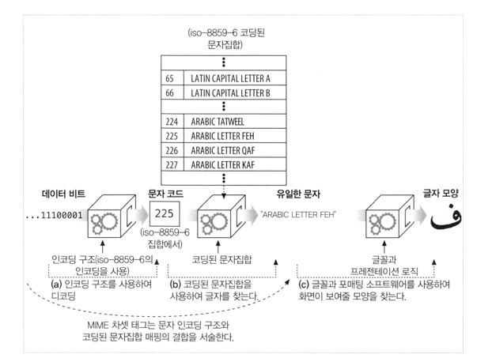

## 16장 국제화
### 국제적인 콘텐츠를 다루기 위해 필요한 HTTP 지원
- 국제 콘텐츠를 지원하기 위해 서버는 클라이언트에게 각 문서의 문자와 언어를 알려줘서 클라이언트가 올바르게 문서를 이루고 있는 비트들을 문자로 풀어내고, 올바르게 처리해서 사용자에게 콘텐츠를 제공해줄 수 있도록 할 필요가 있음
- 서버는 HTTP Content-Type charset 매개 변수와 Content-Language 헤더를 통해 문서의 문자와 언어를 알려줌
- 클라이언트는 Accept-Charset과 Accept-Language 헤더를 통해 자신이 어떤 차셋 인코딩 알고리즘과 언어를 이해하며 무엇을 선호하는지 알려줌

### 문자집합과 HTTP
- 차셋은 글자를 비트로 변환하는 인코딩이다
- 문자 집합과 인코딩은 어떻게 동작하는가
  - 
- 잘못된 차셋은 잘못된 글자들을 낳는다.
- 표준화된 MIME 차셋 값
  - 특정 문자 인코딩과 특정 코딩된 문자집합의 결합을 MIME 차셋이라고 부른다.
- Content-Type charset헤더와 META 태그
- 웹 서버는 클라이언트에게 MIME 차셋 태그를 charset 매개변수와 함께 Content-Type 헤더에 담아 보낸다
- Accept-Charset 헤더
  - HTTP 클라이언트는 서버에게 정확히 어떤 문자 체계를 그들이 지원하는지 해당 헤더를 통해 알려줌

### 다중언어 문자 인코딩에 대한 지침
- 문자 집합 용어
  - 문자, 글리프, 코딩된 문자, 코드 공간, 코드 너비, 사용 가능 문자 집합, 코딩된 문자 집합, 문자 인코딩 구조
- 차셋은 형편없는 이름이다
  - MIME 차셋 태그(Content-Type charset 매개변수와 Accept-Charset 헤더 에서 쓰이는)는 문자집합을 의미하는 것이 결코 아니다.
  - MIME 차셋 값은 데이터 비트를 고유한 문자의 코드로 매핑하는 알고리즘의 이름이다.
  - 이것은 문자 인코딩 구조와 코딩된 문자 집합의 개념을 합친 것이다.
- 문자
- 글리프, 연자 그리고 표현상태
  - 글리프와 문자는 다르다
    - 문자는 유일하고 추상화된 언어의 요소
    - 글리프는 각 글자를 그리는 특정한 방법
    - 각 문자는 미적 양식과 스크립트에 따라 여러가지 글리프를 가진다
- 코딩된 문자 집합
  - US-ASCII, iso-8859, JIS X 0208, JIS X 0212, UCS
- 문자 인코딩 구조
  - 문자 인코딩 구조들은 숫자로된 문자 코드를 콘텐츠 비트들로 변환하고 다른 쪽에서는 그들을 다시 문자 코드로 환원한다
  - 3가지 종류 : 고정폭, 가변폭(비모달), 가변폭(모달)
### 언어 태그와 HTTP
> 언어 태그는 언어에 이름을 붙이기 위한 짧고 표준화된 문자열
- 모든 태그는 대소문자가 구분되지 않는다.
- 첫 번째 서브 태그 : 언어 토큰
- 두 번째 서브 태그 : 국가 토큰
- 나머지 서브 태그 : 8자 이하의 알파벳과 숫자로 이루어져야한다는 규칙을 제외하고 다른 규칙은 없음

### 국제화된 URI
- 오늘날 URI는 국제화를 그다지 지원하지 않는다.

### 기타 고려 사항
국제화된 HTTP 애플리케이션을 작성할 때 명심해야 할 고려사항
- 헤더와 몇세에 맞지 않는 데이터
- 날짜
- 도메인 이름