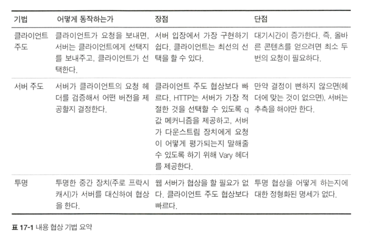

## 17장 내용 협상과 트랜스코딩

### 내용 협상 기법

### 클라이언트 주도 협상
> 서버 입장에서 제일 쉬운 방법은 서버가 클라이언트의 요청을 받았을때, 가능한 페이지의 목록을 응답으로 돌려주어 클라이언트가 선택하게 하는 것
- 기술적으로 서버 -> 클라이언트에게 줄 선택지를 표현하는 방법은 2가지가 있다.
  - 여러 가지 버전에 대한 링크와 각각에 대한 설명이 담긴 HTML 페이지를 돌려주기
  - 300 Multiple Choices 웅답 코드로 HTTP/l.l 웅답을 돌려주기
  - 단점
    - 증가된 대기시간, 페이지당 여러 번의 요청이 필요함
    - 여러개의 URL을 요구
### 서버 주도 협상
- 위에서 살펴본 클라이언트 주도 협상의 단점을 줄이는 방법
- 추가 커뮤니케이션을 줄이기 위한 한 가지 방법은 서버가 어떤 페이지를 돌려줄 것인지 결정하게 하는 것
- 이를 위해 클라이언트는 반드시 자신의 무엇을 선호하는지에 대한 충분한 정보를 서버에게 주어야함
- 서버는 이에 대한 정보를 클라이언트의 요청 헤더에서 얻는다.
  - 내용 협상 헤더들을 살펴본다. 서버는 클라이언트의 Accept 관련 헤더들을 들여 다보고 그에 알맞은 응답 헤더를 준비한다.
  - 내용 협상 헤더 외의 다른 헤더들을 살펴본다.
### 투명 협상
> 투명 협상은 클라이언트 입장에서 협상하는 중개자 프락시를 둠으로써 클라이언트와의 메시지 교환을 최소화하는 동시에 서버 주도 협상으로 인한 부하를 서버를 제거
### 트랜스코딩
- 만약 서버가 클라이언트의 요구에 맞는 문서를 아예 갖고 있지 않다면?
  - 에러로 응답할 수도 있지만, 이론적으로는 서버는 기존의 문서를 클라이언트가 사용할 수 있는 무언가로 변환할 수 있다 = 이를 트랜스코딩이라고 부름!
- 트랜스코딩의 종류
  - 포맷 변환, 정보 합성, 내용 주입
- 트랜스코딩의 대안
  - 웹 서버에서 웹페이지의 여러가지 사본을 만드는 것 = 정적으로 미리 생성해놓기
  - 현실적인 기법이 아님.