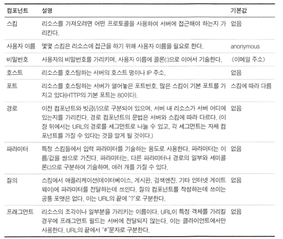
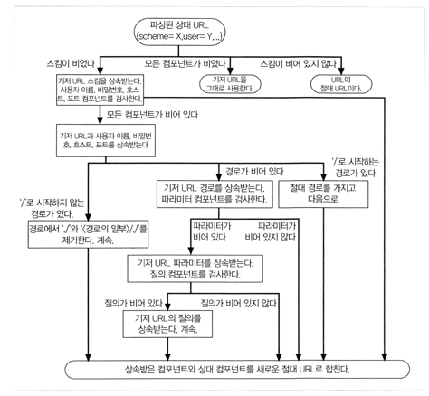

## 2장 URL과 리소스
### 인터넷의 리소스 탐색하기
> URL = 브라우저가 정보를 찾는데 필요한 리소스 위치
- 이를 통해 사람이 HTTP 및 다른 프로토콜를 통해 접근
- URI의 부분 집합, URI와 URN으로 구성된 종합 개념
- 스킴://서버위치/경로

### URL문법
- <스킴>://<사용자 이름>:<비밀번호>@<호스트>:<포트>/<경로>;<파라미터>?<질의>#<프래그먼트>
- 

### 단축 URL
- 상대 URL
  - URL은 상대 URL과 절대 URL로 나뉨
  - 절대 URL은 리소스에 접근 하는데 필요한 모든 정보를 가지고 있지만 상대 URL은 모든 정보를 담고 있지 X
  - 리소스에 접근하는데 필요한 모든 정보를 얻기 위해서는， 기저(base)라고 하는 다른 URL을 사용
  - 
- URL 화장
  - 호스트 명 확장 : yahoo만 입력 -> www.yahoo.com 으로 완성
  - 히스토리 확장 : 이전에 방문했던  http://www.joes -> http://www.joes-hardware.com
### 안전하지 않은 문자
> 어떤 인터넷 프로토콜을 통해서든 안전하게 전송될 수 있도록 URL을 설계하는 것이 중요하다
- SMTP와 같은 프로토콜은 특정 문자를 제거할 수도 있는 전송 방식을 사용된다
- -> 문자가 제거되는 일을 피하고, 안전한 알파벳 문자만 포함해라
### 스킴의 바다
- http, https, mailto , ftp, rtsp, rtspu, file, news, telnet