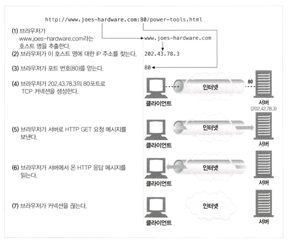

## 4장 커넥션 관리
> HTTP 애플리케이션을 개발하고 있다면 HTTP 커넥션과 그것이 어떻게 사용되는지에 대해 잘 이해하고있어야한다.

### TCP 커넥션

- 신뢰할 수 있는 데이터 전송 통로인 TCP
- TCP 스트림은 세그먼트로 나누어 IP 패킷을 통해 전송된다
  - HTTP가 메세지를 전송하고자 할때는 현재 연결되어 있는 TCP 커넥션을 통해서 메시지 데이터의 내용을 순서대로 보낸다
  -  TCP는 세그먼트라는 단위로 데이터 스트림을 잘게 나누고， 세그먼트를 IP 패킷라고 불리는 봉투에 담아서 인터넷을 통해 데이터를 전달한다
  - IP 패킷
    - IP 패킷 헤더
      - 발신지와 목적지 IP 주소， 크기， 기타 플래그
    - TCP 세그먼트 헤더
      - TCP 포트 번호, TCP 제어 플래그, 데이터의 순서와 무결성 검사를 위해 사용되는 숫자 값
    - TCP 데이터 조각
- TCP 커넥션 유지하기
  - TCP는 포트 번호를 통해 여러개의 커넥션을 유지한다.
  - TCP 커넥션 : 〈발신지 IP 주

### TCP에 대한 성능 고려
- HTTP 트랜잭션 지연
  - 트랜잭션을 처리하는 시간은 TCP 커넥션을 설정하고， 요청을 전송하고， 웅답 메시지를 보내는 것에 비하면 상당히 짧다
  - 클라이언트나 서버가 너무 많은 데이터를 내려받거나 복잡하고 동적인 자원들을 실행하지 않는 한， 대부분의 HTTP지연은 TCP네트워크 지연 때문에 발생
  - 원인
    - 호스트에 방문한 적이 최근에 없으면 DNS 이름 분석 인프라를 사용하여 URI에 있는 호스트 명을 IP 주소로 변환히는데 수 십 초의 시간이 걸림
    - 클라이언트는 TCP 커넥션 요청을 서버에게 보내고 서버가 커넥션 허가 응답을 회신하기를 기다린다. 커넥션 설정 시간은 새로운 TCP 커넥션에서 항상 발생
    - 요청 메시지가 인터넷을 통해 전달되고 서버에 의해서 처리되는 데까지는 시간이 소요
    - 웹 서버가 HTTP 웅탑을 보내는것 역시 시간이 소요
- TCP 커넥션 핸드셰이크 지연
  - 어떤 데이터를 전송하든 새로운 TCP 커넥션을 열 때면， TCP 소프트웨어는 커넥션을 맺기 위한 조건을 맞추기 위해 연속으로 IP 패킷을 교환 ->
    작은 크기의 데이터 전송에 커넥션이 사용된다면 이런 패킷 교환은 HTTP 성능을 크게 저하시킬 수 있음
  - 해결 방법 : 이미 존재하는 커넥션을 재활용
- 확인응답 지연
  - 인터넷 자체가 패킷 전송을 완벽히 보장하지는 않기 때문에 = 인터넷 라우터는 과부하가 걸렸을 때 패킷을 마음대로 파기할 수 있다
  - TCP는 성공적인 데이터 전송을 보장하기 위해서 자체적인 확인 체계를 가짐
  - 각 TCP 세그먼트는 순번과 데이터 무결성 체크섬을 가짐
  - 확인응답은 그 크기가 작기 때문에， TCP는 같은 방향으로 송출되는 데이터 패킷에 확인응답을 편승 시킴 -> 네트워크를 좀 더 효율적으로 사용
  - 확인 응답 지연 알고리즘
    - 확인응답이 같은 방향으로 가는 데이터 패킷에 편승되는 경우를 늘리기 위해서， 많은 TCP 스택은 ‘확인응답 지연’ 알고리즘을 구현한다.
    - 송출할 확인응답을 특정 시간 동안(보통 0.1-0.2초) 버퍼에 저장해 두고， 확인응답을 편승시키기 위한 송출 데이터 패킷을 찾는다.
    - 만약 일정 시간 안에 송출 데이터 패킷을 찾지 못하면 확인응답은 별도 패킷을 만들어 전송된다.
    - BUT 요청과 응답 두 가지 형식으로만 이루어지는 HTTP 동작 방식은， 확인 응답이 송출 데이터 패킷에 편승할 기회를 감소 시켜 **확인 응답 지연 알고리즘 으로 인한 지연이 발생**
- TCP 느린 시작
  - TCP의 데이터 전송 속도는 TCP 커넥션이 만들어진 지 얼마나 지났는지에 따라 달라짐.
  - TCP 커넥션은 시간이 지나면서 자체적으로 ‘튜닝’되어서， 처음에는 커넥션의 최대 속도를 제한하고 데이터가 성공적으로 전송됨에 따라서 속도 제한을 높여나간다
  - TCP 느린 시작은 TCP가 한 번에 전송할 수 있는 패킷의 수를 제한
- 네이글(Nagle) 알고리즘과 TCP_NODELAY
  - 네이글 알고리즘은 네트워크 효율을 위해서， 패킷을 전송하기 전에 많은 양의 TCP 데이터를 한 개의 덩어리로 합친다
  - 이 알고리즘은 세그먼트가 최대 크기가 되지 않으면 전송을 하지 않는다.
  - 확인응답 지연과 함께 쓰일 경우 형편없이 동작
- TIME_WAIT의 누적과 포트 고갈
  - TIME WAIT 포트 고갈은 성능 측정 시에 심각한 성능 저하를 발생시키지만， 보통 실제 상황에서는 문제를 발생시키지 않는다.
  - 포트 고갈 문제를 겪지 않더라도， 커넥션을 너무 많이 맺거나 대기 상태로 있는 제어 블록이 너무 많아지는 상황은 주의해야 한다. 커넥션이나 제어 블록이 너무 많이 생기면 극심하게 느려지는 운영체제도 있다.

### HTTP 커넥션 관리
- 흔히 잘못 이해하는 Connection 헤더
- 순차적인 트랜잭션 처리에 의한 지연
- HTTP 커넥션 성능 향상을 위한 최신기술
  - 병렬 커넥션
  - 지속 커넥션
  - 파이프라인 커넥션
  - 다중 커넥션
### 병렬 커넥션
- 병렬 커넥션은 페이지를 더 빠르게 내려받는다
- 병렬 커넥션이 항상 빠르지는 않다.
  - 일반적으로 빠르기는 하지만, 클라이언트의 네트워크 대역폽이 좁을때는 제한된 대역폭 내에서 각 객체를 전송 받는 것은 느리기 때문에 성능상의 장점은 거의 없어진다.
  - 다수의 커넥션은 메모리를 많이 소모하고 자체적인 성능 문제를 발생시킨다
  - 브라우저는 실제로 병렬 커넥션을 사용하긴 하지만, 대부분 적은수인 4개의 병렬 커넥션만을 허용한다.
- 병렬 커넥션은 더 빠르게 '느껴질 수' 있다
  - 항상 더 빠르게 로드하지는 않지만, 화면에 여러개의 객체가 동시에 보이기 때문에 빠르게 느껴질 수 있음

### 지속 커넥션
> 처리가 완료된 후에도 계속 연결 상태로 있는 TCP 커넥션을 지속 커넥션 이라고 부른다
- 지속 커넥션 VS 병렬 커넥션
  - 병렬 커넥션 단점
    - 각 트랜잭션마다 새로운 커넥션을 맺고 끊기 때문에 시간과 대역폭이 소요된다.
    - 각각의 새로운 커넥션은 TCP 느린 시작 때문에 성능이 떨어진다. 
    - 실제로 연결할수 있는 병렬 커넥션의 수에는 제한이 있다.
  - 지속 커넥션 장점
    - 커넥션을 맺기 위한 사전 작업과 지연을 줄여줌
    - 튜닝된 커넥션을 유지
    - 커넥션의 수를 줄여줌
  - 지속 커넥션 단점
    - 지속 커넥션을 잘못 관리할 경우， 계속 연결된 상태로 있는 수많은 커넥션이 쌓임
    - 이는 로컬의 리소스 그리고 원격의 클라이언트와 서버의 리소스에 불필요한 소모를 발생시킴
- HTTP/1.0+의 Keep-Alive 커넥션
  - 커넥션을 맺고 끊는 데 필요한 작업이 없어서 시간이 단축
  - Keep-Alive와 멍청한(dumb) 프락시
    - 멍청한 프락시에서 keep-alive를 사용할 때 생기는 문제
    - Connection 헤더의 무조건 전달
    - 이런 종류의 잘못된 통신을 피하는 방법
      - 프락시는 Connection 헤더와 Connection 헤더에 명시된 헤더들은 절대 전달하면 안 된다
      - 따라서 프락시가 Connection: Keep Alive 헤더를 받으면 Connection 헤더뿐만 아니라 Keep-Alive란 이름의 헤더도 전달하면 안된다.
      - 또한， Connection 헤더의 값으로 명시되지 않는， Proxy-Authenticate, Proxy- Connection,Transfer-Encoding,Upgrade와 같은 흡별 헤더들 역시 전달하거나 캐시하면 안 된다
- HTTP/1.1 의 지속 커넥션
  - HTTP/1.1 에서는 keep-alive 커넥션을 지원하지 않는 대신， 설계가 더 개선된 지속 커넥션을 지원
  - 지속 커넥션이 기본으로 활성화 되어있음
- 지속 커넥션의 제한과 규칙
  - 클라이언트가 요청에 Connection: close 헤더를 포함해 보냈으면， 클라이언트는 그 커넥션으로 추가적인 요청을 보낼 수 없다. 
  - 클라이언트가 해당 커넥션으로 추가적인 요청을 보내지 않을 것이라면， 마지막 요청 에 Connection: close 헤더를 보내야 한다.
  - 커넥션에 있는 모든 메시지가 자신의 길이 정보를 정확히 가지고 있을 때에만 커넥션을 지속시킬 수 있다.
  - HTTP/1.1 프락시는 클라이언트와 서버 각각에 대해 별도의 지속 커넥션을 맺고 관리해야한다.
  - HTTP/1.1 프락시 서버는 클라이언트가 커넥션 관련 기능에 대한 클라이언트의 지원 범위를 알고 있지 않은한 지속 커넥션을 맺으면 안 된다.
  - 서버는 메시지를 전송하는 중간에 커넥션을 끊지 않을 것이고 커넥션을 끊기 전에 적어도 한 개의 요청에 대해 응답을 할 것이긴 하지만, HTTP/1.1 기기는 Connection 헤더의 값과는 상관없이 언제든지 커넥션을 끊을 수 있다.
  - HTTP/1.1 애플리케이션은 중간에 끊어지는 커넥션을 복구할 수 있어야만 한다. 클라이언트는 다시 보내도 문제가 없는 요청이라면 가능한 한 다시 보내야한다.
  - 클라이언트는 전체 웅답을 받기 전에 커넥션이 끊어지면， 요청을 반복해서 보내도 문제가 없는 경우에는 요청을 다시 보낼 준비가 되어 있어야한다.
  - 하나의 사용자 클라이언트는 서버의 과부하를 방지하기 위해서， 넉넉잡아 두 개의 지속 커넥션만을 유지해야 한다

### 파이프라인 커넥션
- 파이프라인 제약 사항
  - HTTP 클라이언트는 커넥션이 지속 커넥션인지 확인하기 전까지는 파이프라인을 이어서는 안된다.
  - HTTP 웅답은 요청 순서와 같게 와야 한다. HTTP 메시지는 순번이 매겨져 있지 않아서 응답이 순서 없이 오면 순서에 맞게 정렬시킬 방법이 없다.
  - HTTP 클라이언트는 커넥션이 언제 끊어지더라도， 완료되지 않은 요청이 파이프 라인에 있으면 언제든 다시 요청을 보낼 준비가 되어 있어야 한다.
    - 클라이언트가 지속 커넥션을 맺고 나서 바로 10개의 요청을 보낸다고 하더라도 서버는 5개의 요청만 처리하고 커넥션을 임의로 끊을 수 있다.
    - 남은 5개의 요청은 실패할 것이고 클라이언트는 이상치 못하게 끊긴 커넥션을 다시 맺고 요청을 보낼 수 있어야 한다
  - HTTP 클라이언트는 POST 요청같이 반복해서 보낼 경우 문제가 생기는 요청은 파이프라인을 통해 보내면 안 된다.
### 커넥션 끊기에 대한 미스터리
- ‘마음대로’ 커넥션 끊기
- Content-Length와 Truncation
- 커넥션 끊기의 허용， 재시도， 역등성
  - 커넥션은 심지어 에러가 없더라도 언제든 끊을 수 있다
  - HTTP 애플리케이션은 예상치 못하게 커넥션이 끊어졌을 때에 적절히 대응할 수 있는 준비가 되어 있어야 한다.
  - 클라이언트는 POST와 같이 멱등이 아닌 요청은 파이프라인을 통해 요청하면 안 된다.
    - 대부분 브라우저는 캐시된 POST 요청 페이지를 다시 로드하려고 할 때， 요청을 다시 보내기를 원하는지 묻는 대화상자를 보여준다.
- 우아한 커넥션 끊기
  - 전체끊기와 절반끊기
  - HTTP 명세에서는 클라이언트나 서버가 예기치 않게 커넥션을 끊어야 한다면，
  - “우아하게 커넥션을 끊어야 한다”라고 하지만， 정작 그 방법은 설명하지 않고 있다.
  - 일반적으로 애플리케이션이 우아한 커넥션 끊기를 구현하는 것은 애플리케이션 자신의 출력 채널을 먼저 끊고 다른 쪽에 있는 기기의 출력 채널이 끊기는 것을 기다리는 것이다