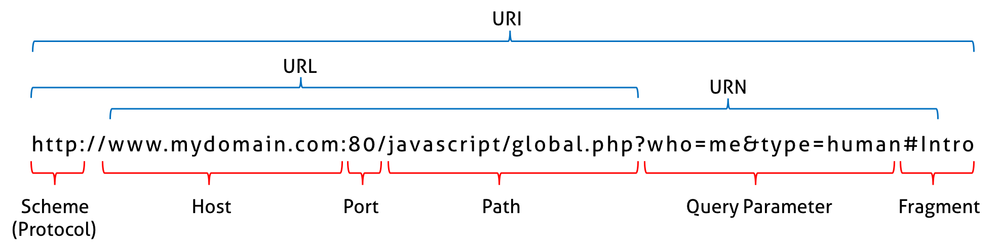
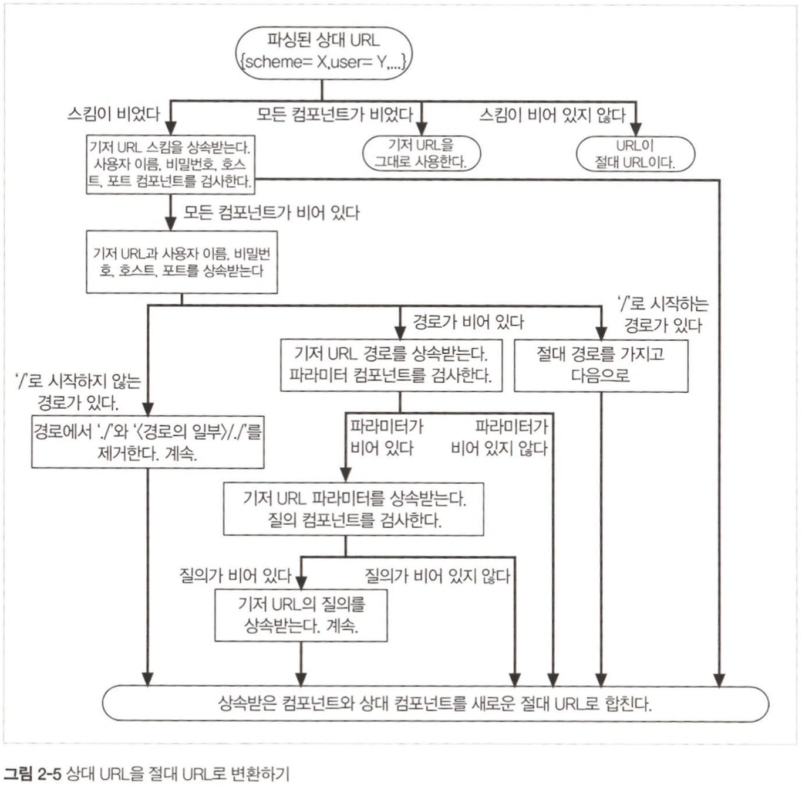
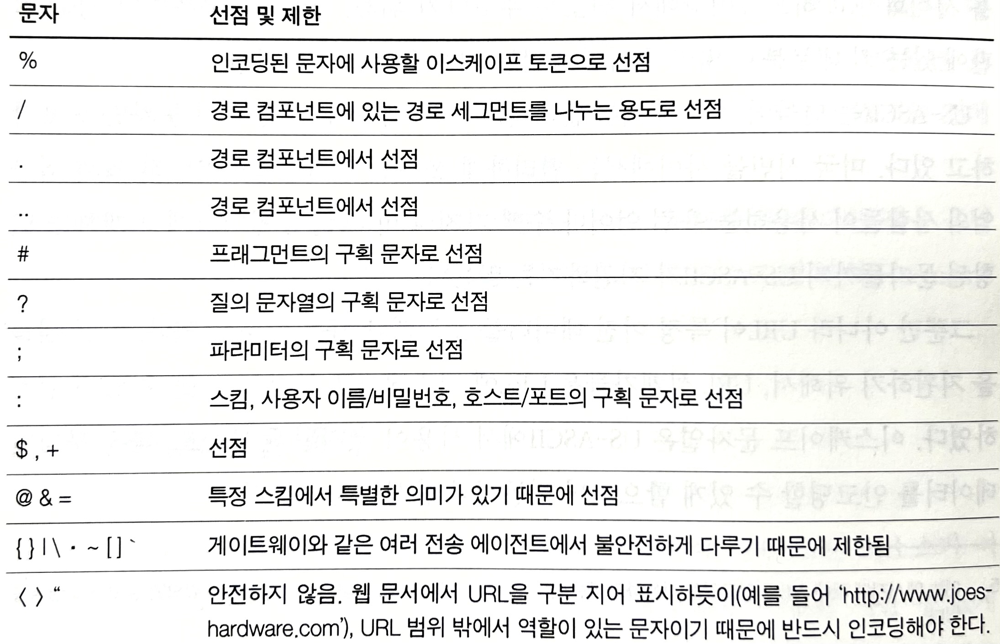

# URL과 리소스

## URL 문법

- 스킴: 사용할 프로토콜(http, https, ftp 등)을 의미한다.
- 사용자이름과 비밀번호: 리소스에 접근하기 위해 간혹 사용자와 비밀번호를 필요로 하는 경우가 있다. DB 주소가 대표적
- 호스트와 포트: 리소스의 위치와 해당 서버가 열어놓은 네트워크 포트를 의미한다.
- 경로: 서버 내부에서 리소스의 위치를 나타낸다.
- 파라미터: 리소스에 전달할 추가 정보를 의미한다.
- 쿼리 문자열: 데이터베이스 같이 좀더 구체적인 리소스를 요청할 때 사용한다.
- 프래그먼트: 리소스 내부의 특정 위치를 가리킬 때 사용한다. 주로 웹 페이지 내부의 특정 위치를 가리킬 때 사용한다.([MDN Mozila](https://developer.mozilla.org/ko/docs/Learn#%EC%8B%9C%EC%9E%91%ED%95%98%EA%B8%B0))

### 단축 URL
- 상대 URL: 현재 문서를 기준으로 한 상대적인 경로를 나타낸다.
- 기저 URL: 상대 URL을 해석할 때 사용하는 기준 URL을 의미한다.

#### 상대 참조 해석하기

### URL 확장
- 브라우저에서 URL을 빠르게 입력하도록 도와주는 기능

- 호스트명 확장: 스킴을 입력하지 않아도, 브라우저가 URL을 완성해준다.
- 히스토리 확장: 이전에 사용자가 방문했던 URL의 기록을 기반으로 완성된 형태의 URL을 보여주고 선택하도록 한다.

## 안전하지 않은 문자

URL은 서로 다른 장치를 가지고 모든 프로토콜이 데이터를 전송하기 위해 설계되었기 때문에, 안전하게 전송하는 게 매우 중요함.
안전한 전송은 정보가 유실될 위험 없이 URL을 전송할 수 있다는 것을 의미함.
`이스케이프`라는 기능을 추가하여, 안전하지 않은 문자를 안전한 문자로 인코딩할 수 있도록 함.

### URL 문자 집합
- URL은 US-ASCII 문자 집합을 사용한다. 하지만 전세계의 모든 문자를 표현할 수 없기 때문에, 이스케이프를 통해 특정 문자와 데이터를 인코딩할 수 있도록 하였다.

### 인코딩 체계
- 퍼센티지 기호(%)로 시작해 ASCII 코드로 표현된 두 개의 16진수 숫자로 이루어진다.

### 문자제한
- 몇몇 문자는 이미 특별한 의미로 예약되어 있기 때문에 사용하기 위해선 반드시 인코딩해야하는 문자들이 존재한다.

## 스킴

다양한 스킴이 존재하는데, 이는 별도로 찾아보길 바람
