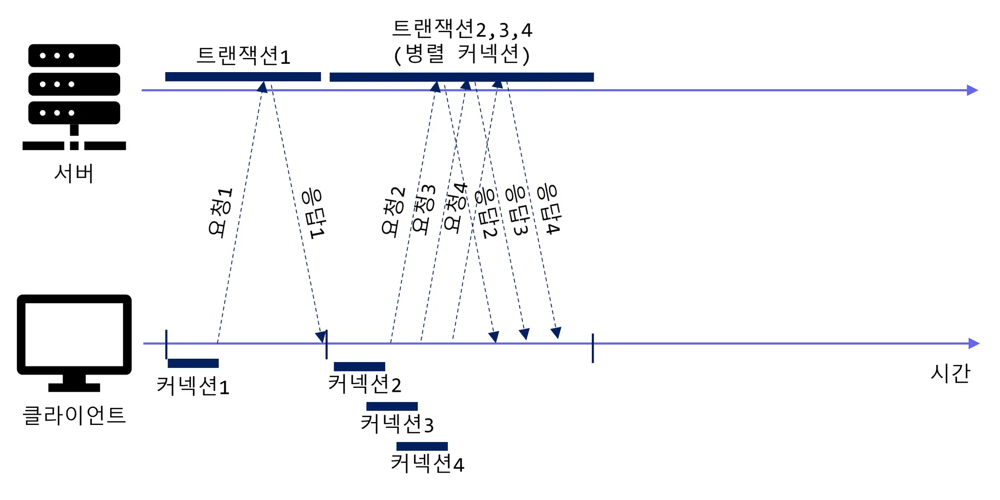
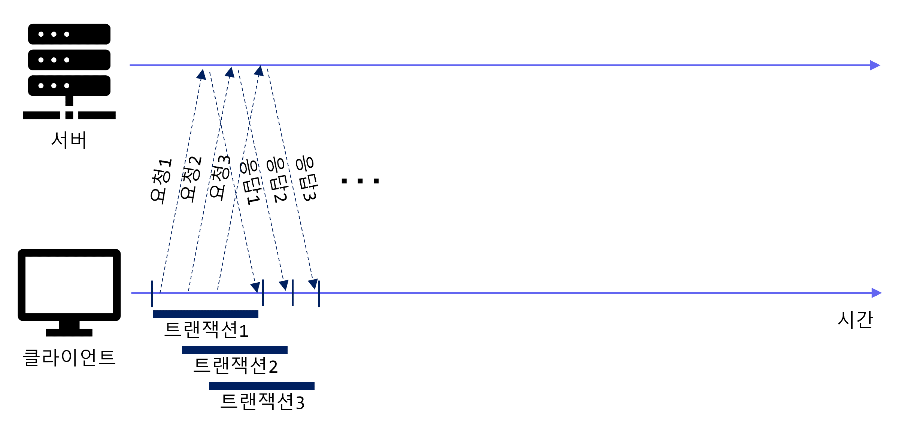

# 커넥션 관리

- HTTP는 어떻게 TCP 커넥션을 사용하는가
- TCP 커넥션의 지연, 병목, 막힘
- 병렬 커넥션, keep-alive 커넥션, 커넥션 파이프라인을 활용한 HTTP의 최적화
- 커넥션 관리를 위해 따라야 할 규칙들

## TCP 커넥션
### 특징
- TCP 커넥션은 신뢰성을 보장한다.
- TCP 스트림은 세그먼트로 나뉘어 IP 패킷을 통해 전송된다.
- TCP 커넥션은 포트 번호를 통해서 여러 개의 커넥션을 유지하는데, TCP 커넥션은 아래의 네 가지 값으로 식별한다.
  - <발신지 IP 주소, 발신지 포트, 수신지 IP 주소, 수신지 포트>

### TCP 성능에 대한 고려

- HTTP 트랜잭션 지연
  - IP와 포트번호를 알기 위해 DNS 쿼리 지연
  - TCP 커넥션 요청에 대한 지연
  - HTTP로 전달된 메시지를 해석하고 처리하는 데 걸리는 시간
  - HTTP 응답을 보내는 시간
- TCP 커넥션 핸드셰이크 지연
  - TCP 커넥션은 Three-way handshake를 통해 연결을 설정하는데, 이 과정에서 전달되는 패킷들의 크기가 꽤 크기 때문에, 크기가 작은 HTTP 요청의 경우 TCP 커넥션이 시간을 더 많이 잡아먹는다.
- 확인응답 지연 
  - TCP는 데이터를 보내면, 데이터가 제대로 도착했는지 확인을 받아야 다음 데이터를 보낼 수 있다. 이 과정에서 지연이 발생할 수 있다.
- TCP Slow Start
    - TCP 커넷션은 시간이 지나면서 자체적으로 `튜닝`되어서 전송 속도가 빨라진다. 이 과정을 `Slow Start`라고 한다.
    - 급작스러운 부하와 혼잡을 방지하기 위해 사용되며, 최초 TCP가 한 번에 전송할 수 있는 패킷의 수도 제한하다가 점차 늘리게 된다.
- 네이글 알고리즘
  - TCP는 데이터를 전송할 때, 데이터를 조각내어 전송하는데, 이 때 네트워크 효율을 위해 많은 양의 TCP 데이터를 한 개의 덩어리로 합치는 데 이걸 `Nagle 알고리즘`이라고 한다.
  - 세그먼트가 최대 크기가 되지 않으면 전송하지 않는데, 모든 패킷이 확인응답을 받았을 경우엔 패킷을 전송한다.
  - 이 때 두 가지 지연 문제가 발생한다.
    - 크기가 작은 HTTP 메시지는 패킷을 채우지 못하기 때문에, 앞으로 생길지 모르는 추가적인 데이터를 기다리며 지연된다.
    - 확인응답 지연과 함께 사용될 경우 지연이 더욱 심해질 수 있다. 네이글 알고리즘은 확인응답이 도착할 때까지 기다리며 확인응답 지연 알고리즘은 확인응답을 100~200밀리초 지연시키기 때문이다.
- TIME_WAIT 지연과 포트 고갈

## HTTP 커넥션 관리
### Connection 헤더의 잘못된 이해
- HTTP 메시지는 클라이언트에서 서버까지 중개 서버들을 하나하나 거치면서 전달된다.
- Connection 헤더에 있는 모든 헤더 필드는 메시지를 다른 곳으로 전달하는 시점에 삭제되어야 한다. 이를 `Hop-by-Hop` 헤더라고 한다.

### 순차적인 트랜잭션 처리에 의한 지연

- 순차적으로 트랜잭션을 처리하면서, 하나의 트랜잭션이 끝나면 새로운 커넥션을 맺기까지를 기다려야 하기 때문에 지연이 발생한다.
- 이를 위해 성능을 향상시킬 수 잇는 기술들이 존재한다.
  - 병렬 커넥션
  - 지속 커넥션
  - 파이프라인 커넥션
  - 다중 커넥션

## 병렬 커넥션

- 병렬 커넥션은 여러 개의 TCP 커넥션을 맺어서, 여러 개의 요청을 동시에 처리하는 방식이다.
- 병렬 커넥션은 여러 개의 요청을 동시에 처리할 수 있기 때문에, 지연 시간을 줄일 수 있다.
- 병렬 커넥션이 항상 더 빠르지는 않느데, 그 이유는 클라이언트의 네트워크 대역폭이 좁을 때는 대부분의 시간을 데이터 전송받는데만 사용하기 때문에 의미가 없다.
- 하지만 더 빠르게 느껴질 수는 있다.

## 지속 커넥션

- 지속 커넥션은 하나의 TCP 커넥션을 여러 개의 요청에 사용하는 방식이다.
- 커넥션을 맺기 위한 사전 작업과 지연을 줄여주고, 튜닝된 커넥션을 유지하며, 커넥션의 수를 줄여준다.
- 하지만 잘못 관리할 경우 게속 연결된 상태로 있는 수많은 커넥션이 쌓이게 될 것이다.
- `Keep-Alive` 헤더 사용을 통해 지속 커넥션을 사용할 수 있다.
- GRPC의 [Keepalive](https://grpc.io/docs/guides/keepalive/)

## 파이프라인 커넥션

- HTTP/1.1은 지속 커넥션을 통해서 요청을 파이프라이닝할 수 있다.
- 응답이 도착하기 전까지 요청이 큐에 쌓이며 요청이 도착지에 도달하면 이어 두 번째와 세 번째 요청이 전달된다.
- 몇 가지 제약사항이 있다.
  - 지속 커넥션인지 확인하기 전까지는 파이프라이닝을 해선 안된다.
  - 응답은 요청 순서와 같게 와야한다.
  - 커넥션이 언제 끊어지더라도 완료되지 않은 요청이 파이프라인에 있으면 언제든 다시 요청을 보낼 준비가 되어 있어야 한다.
  - POST 요청 같이 멱등성이 보장되지않는 요청은 파이프라인을 통해서 보내면 안된다.

