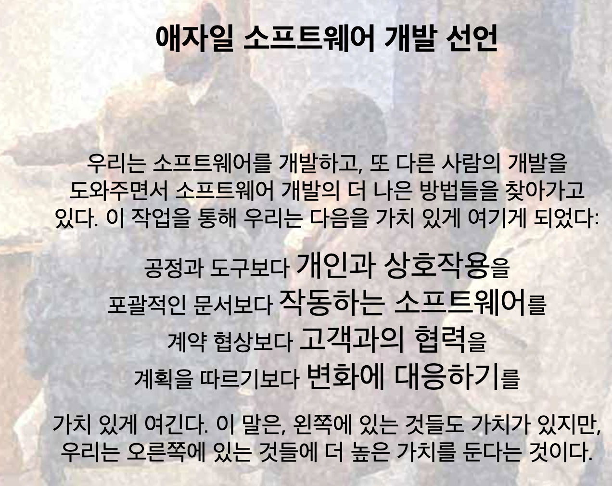

# 1장

## 아키텍트는 개발적 업무, 비개발적 업무를 모두 한다.

## 솔루션 아키텍처가 중요한 이유

- 프로젝트가 지연되고 예산이 초과되며 기능이 제대로 제공되지 않는 일을 방지함
- 경험과 지식을 적용해 이를 개선

## IaaS, PaaS, SaaS 등이 있고 요즘 FaaS도 부상한다.

<aside>
💡

IaaS, PaaS, SaaS, FaaS의 명확한 구분

- IaaS : aoldacloud
- PaaS : Amazon Web Services, Elastic Beanstalk, Microsoft Azure, Heroku, [Force.com](http://force.com/), Google App Engine, and Apache Stratos
- SaaS : gmail, office 365, salesforce, paycom, quickbooks
- FaaS : AWS Lambda, Google Functions, Azure Functions
</aside>

## 클라우드

- 프라이빗 클라우드
- 퍼블릭 클라우드
- 온프레미스
- 멀티 클라우드
- 하이브리드 클라우드

## 클라우드 네이티브

온프레미스는 구축에 시간, 비용, 노력이 많이 들기 때문에 아키텍처가 잘 변화하지 않는다.

클라우드는 온디맨드 확장, 분산 설계가 용이하다.
그렇기 때문에 **장애가 발생한 구성 요소를 수정하는 대신 환경을 교체하는 데 중점**을 둠

# 2장

## 인프라 솔루션 아키텍트

자본 지출을 운영 지출로 전환해 조직의 효율과 ROI를 향상시킴

## 솔루션 아키텍트의 책임

- 프로젝트와 고객을 전담
- 여러 고객과 협력해 제품에 대해 교육하고 솔루션 설계를 검토
- 비기능적 요구사항 고려하기! ⇒ **비즈니스만 고려하다가 비기능적 요소가 고려되지 않아 사용자 경험을 해칠 수 있음**
- 에반젤리스트처럼 일하기

## 애자일 선언문

- 프로세스와 도구를 통한 상호작용
- 소프트웨어에 대한 포괄적인 문서화
  - 다만 문서화를 얼마나 할 지 정해야 한다.
- 계약 협상을 통한 고객 협업
- 계획에 따른 변화에 대응

<aside>
💡

근데 뭔가 기존에 알던 것과 조금 다른 것 같습니다만..?
https://agilemanifesto.org/iso/ko/manifesto.html

</aside>

## 애자일해야하는 이유

- 각 단계에서 고객과의 협업을 하는 동시에 투명성을 제공
- 시장 트렌드를 따라아야 함. 제품을 위한 초기 배포가 필요하며 요구 사항 변경에 적응해야 함.
- 스프린트주기마다 체크포인트를 배치해 중간중간 확인할 수 있다
- 고객과 제품을 함께 만들어나라 수 있다.
