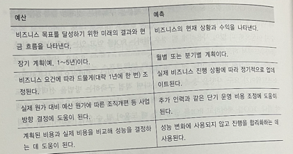
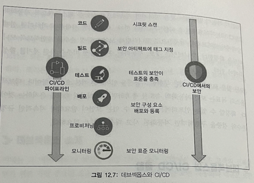

# 11장 비용 고려사항
> - 제품에 대한 비용은 모든 사람의 책임이다. 
> - 비용 최적화는 지속적인 프로세스며 고객 경험을 희생하지 않도록 신중하게 관리해야한다.

- 총 소유 비용 계산
  - 총 소유 비용을 간과하고, 자본 지출만을 기준으로 비용을 산정하면 안된다
  - 총 소유 비용에는 구매와 설치 비용, 운영과 유지관리 비용, 인적 자원과 교육 비용이 포함된다.
- 예산과 예측 계획
  - 예산은 장기적으로 중요한 전략적 계획으로 생각할 수 있으며
  - 예측은 비즈니스 방향을 결정하고자 좀 더 전술적 수준에서 견적을 제공한다
  - 예산과 예측의 명확한 차이를 이해해야함
    - 예산(Budget)과 예측(Forecast)
    - 
- 수요와 서비스 카탈로그 관리
  - 수요 관리
    - (과도한 지출이 발생할 수 있는) 기존 IT환경에서 비용을 절감하기 위해 수요주도 접근 방식을 취할 수 있음
    - 새로운 서비스 도입 X -> 단기적으로 비용 효율성이 높아짐
    - 과거의 데이터를 분석하여 결정
  - 서비스 카탈로그 관리
    - 새로운 서비스에 대한 수요 O and 과거 데이터 적은 경우
    - 가장 자주 사용하는 서비스에 대한 수요를 이해하고 카탈로그 생성
- 지출 추적
  - 조직들은 조직 단위 간에 비용 책임을 공유하기 위해 쇼백 또는 차지백 메커니즘을 도입하기도함
- 아키텍처 복잡성 감소
  - 표준화 없이 자체 사업부에서 애플리케이션을 구현하게 되면 종속성이 많고 중복된 애플리케이션을 유발하는 아키텍쳐가 탄생
  - -> 이는 높은 비용과 위험을 초래하고 경쟁력을 잃게됨.
  - 표준화된 프로세스는 자동화를 적용해 민첩한 환경을 생성할 수 있도록 높은 유연성을 제공 -> 전체 비용을 줄이고 더 많은 ROI를 얻을 수 있음
- IT 효율성 향상
  - 자동화는 전반적인 IT 효율성을 높이는데 좋은 방법이다.
  - 서버 프로비저닝, 모니터링 작업 실행과 데이터 처리를 위해 가능하면 모든 작업을 자동화 해라
  - 비용 최적화를 결정하는 것과 함께 개선된 결과를 얻고자 올바른 절충이 필요하다.

## 12장 데브옵스와 솔루션 아키텍처 프레임워크
> 데브옵스는 제품이나 서비스를 지속적으로 제공하고자 개발자와 운영 팀간의 협업과 조정을 촉진하는 방법론이다.

- 데브옵스 소개
  - 데브옵스 접근방식에서 개발 발 팀과 운영 팀은 소프트 웨어 개발 수명 주기의 구축과 배포 단계 동안 협업해 책임을 공유하고 지속적인 피드백을 제공함.
  - 소프트웨어 빌드는 프로덕션과 유사한 환경에서 빌드 단계 전 반에 걸쳐 자주 테스트되므로 결함을 조기에 발견할 수 있다.
- 데브옵스의 이점 이해
  - 협업, 확장성, 신뢰성, 신속한 배포, 속도, 보안
- 데브옵스 구성 요소 이해
  - CI/CD
  - 지속적인 모니터링과 개선
  - 코드로서의 인프라
  - 구성관리
  - 모든 요소에 대한 모범 사례는 '자동화'다. 
  - 프로세스를 자동화하면 빠르고 안정적이며 반복할 수 있는 방식으로 작업을 효율적으로 수행할 수 있다.
  - 자동화에는 스크 립트, 템플릿, 기타 도구가 포함될 수 있으며 잘 운영되고 있는 데브옵스 환경에서 인프라는 '코드'로 관리된다
- 데브섹옵스 소개
  - 보안 자동화와 대규모 보안 의 구현에 관한 것
  - 전체 프로세스에서 애플리케이션 보안을 보장할 때 필요
  - 데브섹옵스 경근 방식은 보안을 나중으로 미루지 않고 기본으로 제공하는 것
  - 데브옵스는 효율성을 추가해 제품 출시 수명 주기의 속도를 높이는 반면 데브섹옵스는 수명 주기를 늦추지 않고도 모든 구성 요소를 검증한다.
- 데브섹옵스와 CI/CD 결합
  - 데브섹옵스 방식은 CI/CD 파이프라인의 모든 단계에 포함돼야 한다.
  - 
- CD 전략 구현
  - 인플레이스 배포 : 현재 서버에서 애플리케이션 업데이트
  - 롤링 배포 : 기존 서버 제품군에 새 버전을 점진적으로 배포
  - 블루-그린 배포 : 기존 서버를 새 서버로 점진적으로 교체
  - 레드-블랙 배포 : 기존 서버에서 새 서버로 즉시 전환
  - 불변 배포 : 완전히 새로운 서버 세트 구축

## 13장 솔루션 아키텍처를 위한 데이터 엔지니어링
- 빅데이터 아키텍처란
  - 수집된 데이터의 엄청난 양은 문제를 일으킬 수 있다
  - 데이터 솔루션을 설계할 때 어느 정도의 지연시간을 허용한지를 결정하는 가장 좋은 방법은 처리량과 비용의 균형을 맞추는 것
  - 일반적으로 성능이 향상되고 지연시간이 줄어 들면 가격이 높아진다.
- 빅데이터 처리 파이프라인 설계
  - > 수많은 빅데이터 아키텍처가 저지르는 중대한 실수 중 하나는 하나의 도구로 데이 터 파이프라인의 여러 단계를 처리하는 것 -> 장애에 취약하다
- 빅데이터 아키텍처에 적합한 도구를 결정할때 고려해야할 사항
  - 데이터 구조
  - 허용할 수 있는 최대 지연 시간
  - 최소 허용 처리량
  - 시스템 최종 사용자의 일반적인 액세스 패턴
- 관게형 데이터베이스
  - 관계형 데이터베이스는 테이블 간의 복잡한 결합 쿼리가 필요한 트랜잭션 데이터를 매우 잘 처리한다.
- 데이터 웨어하우스
  - 방대한 양의 구조화된 데이터에 대한 빠른 집계 기능을 제공
  - 대량의 동시 쓰기는 최적화 X
- SQL과 NoSQL 데이터베이스
  - NoSQL
    - 컬럼 기반 데이터베이스
    - 도큐먼트 데이터베이스
    - 그래프 데이터베이스
- 레이크 하우스 아키텍처
  - 데이터 레이크와 데이터 웨어하우스의 한계를 해결하고자 등장한 패러다임
  - 주요 측면
    - 개방형 데이터 형식의 데이터 저장
    - 분리된 스토리지와 컴퓨팅
    - 트랜잭션 보장
    - 다양한 소비 요구 사항 지원
    - 보안과 관리
  - 패턴 절차
    - 원시 계층 -> 표준화된 계층 -> 순응 계층 -> 강화 계층 -> 소비자
- 데이터 메시 아키텍처
  - 데이터 메시와 데이터 레이크 아키텍처의 주요 차이점
    - 여러 도메인을 중앙에서 관리되는 데이터 레이크로 결합하는 대신 데이터가 의도적으로 분산된 상태로 남아 있다는 것
  - 원칙
    - 소유권과 아키텍처 도메인 중심 탈 중앙화
    - 제품으로 제공되는 데이터
    - 중앙 집중식 감사 제어를 통한 연합 데이터 거버넌스
    - 데이터를 소비할 수 있게 만드는 공통 엑세스

## 14장 머신러닝 아키텍처
> 대량의 과거 데이터를 검토함으로써 향후의 행동 방침을 예측하는 데 도움이 된다

- 머신러닝이란?
  - 빠르고 정확한 의사 결정 지원
  - 기술을 사용해 트렌드와 패턴을 검출하고 과거의 사실 데이터를 바탕으로 수학적 예측 모델을 계산
- 데이터 과학과 ML관련 작업
  - 훈련 데이터와 레이블의 품질은 ML 모델의 성공에 매우 중요하다
  - 고품질 데이터 -> 더 정확한 ML 모델과 올바른 예측
  - ML 워크플로
    - 전처리 -> 학습 -> 평가 -> 예측
- ML 모델의 평가 : 과적합과 과소적합
  - 과적합 : 트레이닝 세트에서 잘 수행 O , 테스트 세트에서 잘 수행 X
    - 높은 변동량, 데이터의 작은 변경 -> 결과가 많이 달라짐을 의미
  - 과소적합 : 트레이닝 데이터 세트에 필수 규칙을 탐지하지 못함
    - 모형이 너무 단순하거나 설명 변수가 너무 적음을 나타냄
    - 높은 편향, 특정 영역에서 체계적으로 적합하지 않음을 의미
- 지도 및 비지도 머신러닝 알고리듬
  - 지도학슴 : 일련의 트레이닝 예제를 제공, 새로운 데이터 세트의 타깃 값 예측
  - 비지도학습 : 방대한 데이터를 제공받으며 데이터간 패턴과 관계를 찾은 후 추론 도출
  - 강화 학습 : 작업 후에 보상이나 패널티를 줌
- 클라우드 환경에서의 머신러닝
  - 준비와 레이블링
  - 선택과 빌드
  - 트레이닝과 튜닝
  - 배포와 관리
- 머신러닝 추론 아키텍처
- 머신러닝 작업
  - MLOps 원칙
    1. 자동화
    2. 버저닝
    3. 테스팅
    4. 재현성
    5. 배포
    6. 모니터링
- 딥러닝
  - 순전파와 역전파
  - 널리 사용되는 프레임워크 : 텐서플로, MXNet

## 15장 사물인터넷 아키텍처

- 사물 인터넷이란?
  >모든 곳에서 모든 것의 상태를 알려주는 것
- IoT 아키텍처 구성 요소
  - IoT 디바이스 소프트웨어 관리
  - IoT 디바이스 연결과 제어 처리
  - IoT 분석 서비스 수행
- IoT 디바이스관리
  - 마이크로컨트롤러 유닛
    - 메모리가 있는 간단한 프로세서를 포함하는 단일
  - 마이크로프로세서 유닛
    - 엣지 디바이스의 컴퓨팅 및 처리 능력을 확장
- 클라우드 환경에서의 IoT

## 16장 양자 컴퓨팅

- 양자 컴퓨터의 빌딩 블록
  - 양자 컴퓨터의 기본 구성 요소 = 큐비트
- 양자 컴퓨터는 문제 에 대한 모든 답을 병렬로 시도하기 때문에 매우 빠르게 실행됨!
- 양자 컴퓨터의 종류
  - 포획 이온
  - 뤼드베리 원자
- 사용 사례
  - 최적화, 머신러닝, 인터넷 검색, 시뮬레이션, 암호화
- 클라우드에서의 양자 컴퓨팅
  - 퍼블릭 클라우드는 양자 컴퓨터에 접근하고 사용 사례를 시험해볼 수 있는 완벽한 장소이다