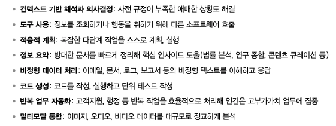
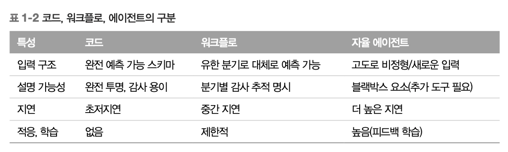

# Ch1. 에이전트
## Agentic System

> 에이전트가 효과적으로 작동하도록 돕는 도구, 메모리, 파운데이션 모델, 오케스트레이션, 지원 인프라 전체를 아우르는 시스템
> 
- **파운데이션 모델** → 자연어 이해와 생성에 강점
    - 단순히 인간이 읽을 결과물을 생성하는 것에 그치지 않고,
    - 함수 시그니처와 파라미터 선택과 같은 구조화된 출력 가능
    
    **[관련 에이전트 능력]**
    
    1. 자연어 이해 - 직관적으로 Input을 해석 및 응답
    2. 컨텍스트 인지 상호작용 - 관련 컨텍스트 유지로 정확도 향상
    3. 구조화된 생성 - 텍스트, 코드, 구조화된 결과 생성
- **강화학습**

머신러닝 모델을 뛰어넘은 이유

1. 학습 데이터의 수집, 정제에 너무 많은 시간을 할애하지 않아도 됨
    
    최근에는 단일 모델이 추가 학습 없이도 광범위한 과제에 사용할 수 있게 됨 → 대현 사전학습 생성 모델을 API 호출 한 번으로 사용할 수 있게 된 것! 
    
2. 훨씬 뛰어난 유연성
    
    컨텍스트 기반 해석과 의사결정, 도구 사용, 적응적 계획, 정보 요약, 비정형 데이터 처리, 코드 생성, 반복 업무 자동화, 멀티모달 통합
    
    

## Agent 유형

**The Information에서 7가지 유형으로 정의함*

1. 비즈니스 업무 에이전트 
    - 사전에 정의한 워크플로 자동화
    - 특정 이벤트로 트리거되어 결정적 단계 실행
    - 컨텍스트 추론 최소화
    - e.g. UiPath RPA, 마이크로소프트 파워 오토메이트, Zapier
2. 대화형 에이전트 (챗봇, 고객지원)
    - 자연어 인터페이스로 사용자와 상호작용
    - 대화 관리, 의도 인식에 최적화
3. 리서치 에이전트
    - 정보 수집, 통합, 요약 수행
    - e.g. Perplexity AI, Elicit
4. 분석 에이전트
    - 구조화된 데이터를 해석해 인사이트, 대시보드, 리포트 생성
    - Enterprice Data Warehouse와 통합되어 자연어 질의 지원
    - e.g. Power BI Copilot, Glean
5. 개발 에이전트
    - 코딩 보조 도구
    - 코드 생성, 리팩토링, 해설 등을 도와 IDE와 통합
    - e.g. Cursor, Windsurf, GitHub Copilot
6. 도메인 특화 에이전트
    - 법률, 의료, 금융 등 전문 영역에 맞게 튜닝
    - e.g. Harvey(법률), 히포크라틱 AI(의료), 금융
7. 브라우저 활용 에이전트
    - 웹사이트 탐색, 상호작용, 정보 추출, 행동까지 인간 개입 없이 수행
    - 언어 이해, 시각, 지각, 동적 계획을 결합해 상황에 맞게 브라우저 사용

## 모델 선택

**작업 복잡도, 모달리티 지원, 지연시간, 비용 제약, 통합 요구사항을 균형 있게 고려하는 방법**

> https://crfm.stanford.edu/helm/capabilities/latest/#/leaderboard
> 
> 
> **추론, 평가 성능 비교 자료* 
> 
- OpenAI, Anthropic, Google, Meta, Deepsik : 범용 능력이 뛰어난 최신 파운데이션 모델 제공
- [오픈 웨이트 모델] Llama, Mistral, Gemma : 로컬/파인튜닝까지 적용 영역 확장
- 증류, 양자화, 합성 데이터 기법이 발달하면서 작은 모델도 대형 모델의 능력을 이어받고 급속히 발전하는 추세

모델의 종류는 매우 다양하며, 만능은 존재하지 않는다. 

### 에이전틱 시스템에 맞는 모델을 어떻게 선정할까?

- 정의가 분명하고, 지연에 민감하거나 비용 제약이 큰 작업 → 작은 모델이 비용 측면에서 유리
- **멀티모델 시스템** 도입도 고려해볼 수 있음 (최근에는 **자동 모델 선택 방식**이 등장) ⭐
    - 간단한 질의 → 빠르고 저렴한 소형 모델
    - 복잡한 추론 → 대형 모델
- 우선 잘 모르겠다면 OpenAI, Anthropic 등 선도 기업의 최신 범용 모델 써보기
- 모델 선택을 최적화하는 것도 중요하지만, 단순하게 시작해서 시간이 지나며 **작은 모델 실험, 파인튜닝, 검색 추가** 등으로 성능과 비용을 개선하는 것도 좋은 선택지

## 동기 → 비동기 전환

- 자율 에이전트는 비동기식을 전제로 설계됨
    - 변화하는 조건에 따라 우선순위를 동적으로 조정함
- 비동기 처리를 통해, 유휴시간을 줄이고 자원 활용을 최적화해 효율을 크게 높일 수 있음

## 자율 에이전트의 활용 사례

https://github.com/MichaelAlbada/BuildingApplicationsWithAIAgents/tree/main/src/common/evaluation/scenarios

- 고객지원 에이전트
- 금융 서비스 에이전트
- 의료 접수, 분류 에이전트
- IT 헬프데스크 에이전트
- 법률 문서 검토 에이전트
- 보안 운영센터(SOC) 분석 에이전트
- 공급망, 물류 에이전트

## 워크플로와 에이전트

[4가지 선택 기준]

1. 입력의 가변성
2. 필요한 추론 복잡도
3. 성능/컴플라이언스 제약
4. 유지보수 부담

### 1. 간단한 스크립트

**파운데이션 모델, 머신러닝을 쓰지 않아도 되는 케이스*

1. **입력의 형태가 정해진 경우**
    - 모든 입력이 완전히 예측 가능하고 모든 출력을 미리 기술할 수 있다면, 머신러닝 파이프라인보다 더 빠르고 저렴!
2. **성능과 설명 가능성을 엄격하게 따져야 하는 경우**
    - 지연시간이 매우 짧은 경우 → LLM API 호출 시간 부담
3. **문제의 도메인이 고정되어 있는 경우**
    - 규제가 엄격한 도메인 (의료, 항공, 금융 등) → 의사결정 과정이 완전히 확정적이고 감사 가능해야 함
    - 내부 동작을 해석하기 어려우므로 신경망 모델은 부적합

### 2. 결정적/반자동 워크플로

- 로직을 유한한 단계나 분기로 표현 가능하고, 어디서 인간 개입이나 추가 에러 처리가 필요한지 사전에 아는 경우에 적합
    - 모든 결정 분기를 미리 나열할 수 있고, 각 분기를 엄격하게 통제해야 하는 경우
    - 깊은 의미론적 이해 X
    - 즉, 예외를 처리하려면 수동 업데이트가 끊임없이 필요함
- e.g. 다양한 포맷(CSV,JSON,PDF)의 파일이 들어올 때, 형식에 따라 Parser를 라우팅하고 중간에 문제가 생기면 인간에 전달
- 워크플로 엔진이 에러 경로를 더 명확하게 통제할 수 있음 → LLM보다 유리
    - Airflow, AWS Step Function, 잘 구조화한 스크립트

### 3. 챗봇/RAG

- 자율 에이전트와 달리 피드백 루프 학습 능력은 없기 때문에 추가 행동, 다단계적인 계획 수립을 스스로 결정하지 않음
- 지식 베이스를 검색하는 경우, RAG은 문서를 벡터스토어에 임베딩 → 관련 구절을 찾아 컨텍스트에 맞는 응답 생성
- 문서 기반 Q&A가 메인이고 외부 API 호출, 의사결정 orchestration이 크게 필요하지 않다면 RAG이 적절

### 4. 완전 자율 에이전트

- 입력의 변동성이 크고 상황에 따라 계획이 바뀌거나 지속적 학습이 필요한 경우
    - 코드, 워크플로, RAG으로 해결이 어려운 경우
- 병렬 하위 작업이 많은 환경에 적합
    - 비동기로 실시간 데이터에 맞춰 재우선순위화 → 한번에 여러 단계를 병렬로 수행 가능
    - e.g. 보안 운영 에이전트가 동시에 위협 시 인텔 API 질의, Network Telemetry 스캔, 의심 바이너리 샌드박스 분석 수행
- 파운데이션 모델 기반 에이전트 - 의도 파악, 엔티티 추출, 지식 베이스 조회, 적절한 답안 초안 작성, 필요 시 인간 인계까지 사전 정의 없이 수행 가능

## 효과적인 에이전틱 시스템 구축 원칙

1. **확장성(Scalability)**
    
    분산 아키텍처, 클라우드 인프라, 병렬 처리 지원 알고리즘을 통해 증가하는 부하와 다양한 작업을 처리한다
    
2. **모듈성(Modularity)**
    
    명확한 인터페이스로 연결된 독립적이고 교환 가능한 구성요소로 설계한다
    
3. **지속 학습(Continuous learning)**
    
    경험에서 배우는 메커니즘을 구축하고 사용자 피드백을 통합한다
    
4. **회복탄력성(Resilience)**
    
    오류, 보안 위협, 타임아웃, 예상치 못한 상황을 우아하게 처리하는 아키텍처를 갖춰야 한다
    
5. **미래 대비(Future-proofing)**
    
    개방형 표준과 확장 가능한 인프라를 중심으로 설계하고 실험 문화를 유지한다
    

## 에이전틱 프레임워크

*최근에는 스킬 통합, 메모리 관리, 계획, 오케스트레이션, 경험 학습, 멀티 에이전트 협력 등 핵심 기능을 다루는 다양한 프레임워크가 등장하고 있다*

### LangGraph

> 방향 그래프 기반 모듈식 오케스트레이션 프레임워크
> 

**구성**

- **`노드`** - 개별 로직 단위 (주로 파운데이션 모델 호출)
- **`엣지`** - 복잡하고 순환 가능한 워크플로

**강점**

- 개발자 경험이 우수하며, 비동기 워크플로와 재시도를 기본 지원함

**트레이드오프**

- 고급 계획과 메모리에는 맞춤 로직 필요
- 멀티 에이전트 협업에 대한 내장 지원이 상대적으로 부족

**적합 대상**

- 견고한 단일 에이전트 or 경량 멀티 에이전트 시스템을 구축하는 팀
- 명시적이고 검증 가능한 흐름 제어가 필요한 경우

### Autogen

> 강력한 멀티 에이전트 오케스트레이션
> 

**강점**

- 동적 역할 할당
- 메시지 기반 에이전트 간 유연한 상호작용

**트레이드오프**

- 단순한 사용 사례에는 무겁거나 복잡할 수 있음
- 에이전트 상호작용 패턴에 대해 다소 고집스러운 편

**적합 대상**

- 여러 에이전트 간 대화가 핵심인 연구 및 프로덕션 시스템
- e.g. 매니저-워커, 자기성찰 루프

### CrewAI

**강점**

- 배우기 쉽고 사용하기 편리
- 프로토타이핑을 위한 빠른 설정
- `crew` , `tasks`와 같은 유용한 추상화

**트레이드오프**

- 오케스트레이션 내부에 대한 세밀한 커스터마이징, 제어가 제한적
- 복잡한 워크플로에서는 비교적 성숙도가 낮음

**적합 대상**

- 여러 에이전트 간 대화가 핵심인 연구 및 프로덕션 시스템
- e.g. 매니저-워커, 자기성찰 루프

### OpenAI Agents Software Development Kit

**강점**

- 오픈AI 도구 생태계와의 깊은 통합
- 안전하고 사용하기 쉬운 함수 호출
- 메모리 프리미티브
- 도구 라우팅

**트레이드오프**

- 오픈AI 인프라에 강하게 결합 → 맞춤형 에이전트 스택이나 오픈소스 도구체인에서 유연성, 이식성이 떨어질 수 있음

**적합 대상**

- 이미 오픈AI를 사용 중이며 최소한의 스캐폴딩으로 도구를 활용하는 안전한 에이전트를 빠르게 구축하려는 팀
