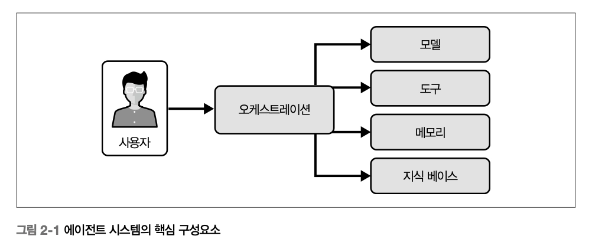
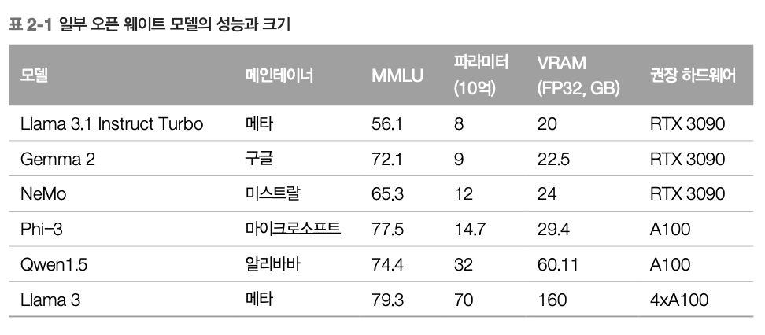
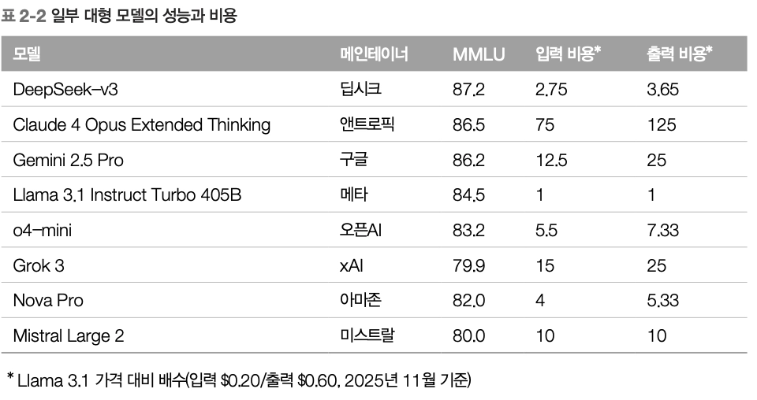

# Ch2. 에이전트 시스템 설계
## 에이전트 시스템 구축하기

### Step1. 에이전트 개발

> 우선 돌아가는 모델을 만들기!
> 
- 반복적인 프로세스 → 자동화에 매우 적합하지만, 작업 범위를 명확하게 정해야 함
    - 특정 규칙과 가이드라인을 따르는 작업이라면, 파운데이션 모델을 기반으로 시스템을 설계하는 정도로 자동화가 가능함
- 명확한 경계가 있는 작업에 집중하면 구체적인 입력, 구조화된 출력, 짧은 피드백 루프를 확보할 수 있다
    1. 시스템 프롬프트에 모델이 할 일 명시
    2. 도구 호출 여부 결정
    3. 최종 확인 텍스트 생성

### Step2. 에이전트 평가

> 에이전트의 성능, 장단점, 실패 지점 파악하기
> 
- 올바른 도구를 호출했는가? → `도구 재현율`
- 올바른 파라미터를 전달했는가? → `파라미터 정확도`
- 고객에게 명확하고 정확한 확인 메시지를 보냈는가? → `확인 품질`

→ 각 평가 기준을 테스트 도구를 통해서 다양한 엣지 케이스를 검증하고 수치화할 수 있음

## 에이전트 시스템의 핵심 구성요소

→ 각 구성요소는 에이전트의 **능력, 효율, 적응성**을 결정한다

### A. 모델 선택

> 에이전트의 의사결정, 상호작용, 학습 역량을 결정
> 
- 시스템의 성능, 확장성, 지연시간, 비용에 직접적인 영향을 미침

[모델 선택 기준]

1. 작업 복잡도 평가
    - **대형 파운데이션 모델(GPT, 클로드 코드)** - 개방형 환경에서 컨텍스트 이해, 유연한 추론, 창의적 생성이 필요한 에이전트에 적합
        - 일반화가 뛰어나고 **모호성, 문맥적 뉘앙스, 다단계 작업**에 강함
        - 높은 연산 자원, 클라우드 인프라, 더 큰 지연시간을 요구함
    - **소형 모델(ModernBERT 파생 모델, Phi-4)** - 정의가 명확한 반복 작업에 적합
        - 고객 지원, 정보 검색, 데이터 라벨링과 같이 **구조화된 환경**에 유용
        - 실시간 응답성, 자원 제약이 중요한 경우 큰 모델보다 실용성이 뛰어나기도 함
2. 입력 데이터의 특성 (modality)
    - 텍스트, 이미지, 오디오, 구조화 데이터 등 Input의 형태가 다양해짐
    - **멀티 모달 모델(GPT, 클로드)** - 다양한 입력을 결합하여 해석
        - 여러 형태의 정보를 통합한 의사결정이 필요한 도메인에 유용
        - e.g. 의료, 로보틱스, 고객 지원
    - **텍스트 전용 모델** - 텍스트 중심 과제에는 단순성과 추론 속도 측면에서 적합
3. 인프라 제약 - 개방성, 커스터마이징 가능성
    - **오픈소스 모델(라마, 딥시크)** - 투명하고, 필요에 따라 파인튜닝이나 수정 가능
    - **상용 모델(GPT-5, 클로드, Cohere)** - API를 통해 강력한 능력과 관리형 인프라, 모니터링, 성능 최적화를 제공
4. 일반성-속도-정밀성의 트레이드오프
    - 범용 사전학습 모델 vs 맞춤형 모델에 대한 선택은 **도메인의 특수성과 민감도**에 달려 있음
    - 실제 배포에서는 비용과 지연시간이 모델 선택의 결정적 요인이 되기도 함 → 대부분 대형+소형 하이브리드 전략을 채택
        - 복잡한 요청 → 강력한 모델 / 일상적인 요청 → 경량 모델 동적 라우팅으로 비용과 품질 최적화
    - 큰 모델이 더 나은 성능을 보이는 게 추이지만, 항상 성립하는 것은 아님 → 즉, 중간 수준의 성능만 필요하다면 훨씬 작은 비용으로 달성이 가능하다는 것!

- ***Open Weight Model*** : 모델 아키텍처와 가중치(weight) 파라미터를 대중에게 무료로 공개한 경우
    - 필요한 하드웨어만 있으면 누구나 모델을 로드하고 추론에 사용 가능한 형태
    
    
    
- ***대형 플래그십 모델***
    - 이 모델들로 합리적 성능을 내려면 최소 12개의 GPU 필요
    - ⇒ 거의 대형 데이터센터 서버에서 사용함
    
    
    

### B. 도구

> ***도구는 에이전트가 해결하고자 하는 과제에 맞춰 설계된다***
> 
> - 에이전트가 특정 작업을 수행하고 문제를 해결할 수 있도록 한다
> - 다양한 조건과 컨텍스트 하에 에이전트가 어떻게 작업을 수행할지 고려해야 함
- 에이전트의 기능적 빌딩 블록으로 작업 실행과 사용자 및 다른 시스템과의 상호작용을 가능하게 함
- 도구의 범위와 정교함이 **에이전트의 효과**를 결정
- 도구 개발에서 모듈형 설계는 필수 → 쉽게 통합/교체할 수 있도록 **독립적인 모듈**로 설계되어야 함

[3가지 유형]

- **로컬 도구**
    - 에이전트가 외부 의존성 없이 내부 로직과 계산만으로 작업 수행
    - 주로 규칙 기반이거나 사전에 정의된 함수를 실행하는 방식
    - e.g. 수학 계산, 로컬 DB 조회, 미리 정한 규칙에 따른 간단한 의사결정
- **API 기반 도구**
    - 에이전트가 외부 서비스나 실시간으로 데이터 소스와 상호작용하도록 함 (로컬 환경 이상)
- **MCP (Model Context Protocol)**
    - 표준 스키마 https://github.com/modelcontextprotocol 를 통해 사용자 프로필, 대화 이력, workspace 상태, 작업 메타데이터 등 **구조화된 실시간 컨텍스트**를 프롬프트에 직접 전달하고 **도구 호출을 표준화된 방식**으로 지원
    - 대화 상태 보존, 실시간 상황 인식을 모델에 주입하는 데 효과적

### C. 메모리

> 에이전트가 정보를 저장하고 검색할 수 있게 하는 핵심 구성 요소
> 
- 메모리를 통해 에이전트는 컨텍스트를 유지하고 과거 상호작용에서 학습하며 시간이 지남에 따라 더 나은 의사결정을 내릴 수 있다
- 효과적인 메모리 관리는 변화하는 환경에서도 효율적으로 작동하고 과거 데이터 기반으로 새로은 상황에 적응할 수 있게 한다
    
    <aside>
    
    ***효과적인 메모리 관리란?***
    
    > 저장된 데이터를 체계적으로 **구성**(에이전트와의 연관성 기준으로 분류)하고 인덱싱해 필요할 때 쉽게 **검색**할 수 있게 하는 것
    > 
    </aside>
    

[2가지 유형]

- **단기 메모리**
    - 에이전트가 현재 작업이나 대화와 관련된 정보를 저장하고 관리하는 능력
        - 상호작용 중 컨텍스트 유지하는 데 사용
        - 실시간으로 일관된 의사결정을 내리도록 도움
    - `구현` rolling context window
        - 최근 정보를 일정 범위 내에서 계속 갱신하며 오래된 데이터를 버릴 수 있게 함
        - 챗봇, 가상비서와 같이 최근 대화 내용 기억이 더 중요한 케이스에 유용
- **장기 메모리**
    - 에이전트가 오랜 기간에 걸쳐 지식과 경험을 저장하도록 하여, 과거 정보를 바탕으로 향후 행동을 결정하는 능력
        - 시간이 지날수록 발전해야 하거나 개인화된 경험을 제공해야 하는 경우
    - `구현` DB, Knowledge Graph, 파인튜닝 모델
        - 사용자 선호도, 과거 성능 지표와 같은 구조화된 데이터를 저장하고 검색할 수 있음

## 오케스트레이션

- 도구나 스킬 등의 개별 기능을 E2E 솔루션으로 전환하여 배치하고, 상황에 따라 실행하여 전체 과정을 감독하는 방식
    - 각 단계가 다음 단계로 자연스럽게 이어지며 명확한 목표를 이루게 함
- ⭐ 핵심 - 도구나 스킬 호출의 가능한 순서를 평가하고 그 결과를 예측하며 여러 단계를 거치는 작업에서 **가장 성공 가능성이 높은 경로를 선택**하는 것
    - 에이전트는 주로 점진적으로 계획을 구축하고, 워크플로에 대해 재평가&업데이트 하는 과정을 거친다
- 우선순위가 뒤바뀌거나 자원이 부족해지는 등 다양한 상황에 대비하기 위해, 지속적으로 모니터링하고 필요에 따라 워크플로 일시 중단, 경로 재조정으로 목표에 최대한 부합하도록 하는 것이 중요함
- 견고한 오케스트레이션 계층이 없다면, 전체 방향이 어긋나거나 실행을 멈출 위험이 있다

## 설계 트레이드오프

### A. 성능

> *속도와 정확도의 균형을 맞추는 것이 중요하다*
> 
1. 성능 ↑ - 빠른 처리 및 실시간 의사결정 ⇒ 정밀도 ↓
    - e.g. 자율주행 차량, 트레이딩 시스템
2. 정확도 ↑ - 복잡한 모델이나 계산 집약적 기법 필요 ⇒ 전체 속도 ↓
    - e.g. 법률 분석, 의료 진단
3. 하이브리드 전략 
    - 에이전트가 먼저 빠르고 대략적인 결과를 제시한 뒤 추가로 시간과 데이터를 활용 이를 정교하게 보완하는 방식
    - e.g. 추천 시스템, 진단 시스템

### B. 확장성

> *현대의 에이전트 시스템은 딥러닝 모델과 실시간 처리에 크게 의존하여 확장성은 중요한 기술적 과제이다*
> 
> - 시스템 규모가 커질수록 **데이터량, 동시 처리 작업 수, 연산 리소스(GPU)**의 효율적인 관리가 핵심!
> - GPU 리소스에 크게 의존할수록 GPU 효율을 극대화하고 latency를 최소화하며 동적인 워크로드를 안정적으로 처리하는 균형 잡힌 접근이 필요하다

**[GPU 리소스 최적화 전략] **가장 비싸고 제약이 많음***

1. 동적 GPU 할당 - 실시간 수요에 따라 GPU 배정 (고정 할당보다 효율 good)
2. 탄력적 CPU 프로비저닝 - 클라우드나 온프레미스 GPU 클러스터를 이용해 현재 워크로드에 따라 자동으로 리소스 확장/축소
3. 우션순위 큐잉 + 지능형 작업 스케줄링 - 중요한 작업에는 즉시 GPU 접근 권한을 부여 / 덜 중요한 작업은 피크 시간대에 대기
    1. 비동기 작업 실행 → 작업 간 유휴시간 최소화
4. 다중 GPU 병렬 처리 - ***분산 시스템 전반에 GPU 작업을 균형 있게 배분하자***
    1. 동적 로드 밸런싱 - 활용률이 낮은 GPU로 작업 분산하여 GPU 병목 최소화 
        - GPU 연산에 대한 의존도가 높을수록 단순 GPU 수를 늘리는 것만으로는 한계가 있음
    2. 수평 확장 - 시스템의 처리 능력을 높이기 위해 GPU 노드를 추가하는 방식
5. 하이브리드 클라우드 인프라 - 온프레미스 GPU 리소스 + 클라우드 기반 GPU 결합 
    - 요청이 몰릴 때 *→ **burst scaling***으로 클라우드 GPU에 일시적으로 작업 분산
    - 수요가 낮고 요금이 저렴한 비피크 시간대 → 클라우드 GPU 인스턴스를 활용해 운영 비용을 절감하면서 필요시 빠르게 확장할 수 있는 유연성 확보

### C. 신뢰성

> *에이전트가 일정한 기간 동안 일관되고 정확하게 작업을 수행할 수 있는 능력*
> 
> - 신뢰성 향상을 위해서는 **시스템 복잡성, 비용, 개발 기간** 측면의 일정한 절충이 필요하다
1. 장애 허용(fault tolerance)
    - 오류나 예기치 못한 사건을 감지 → 비정상 종료 or 예측 불가능한 오작동 없이 처리하게 하는 것
    - 일반적으로 **중복(redundancy) 구조**를 사용함 - 주요 구성 요소, 프로세스를 복제하는 방식
2. 일관성과 견고성
    - 다양한 시나리오,  입력, 환경에서 일관된 성능을 유지하는 것
    - → 이를 위한 접근
        1. 철저한 테스트 - 단위 테스트, 통합 테스트, 시뮬레이션 테스트 등 다양한 검증 과정 필수
        2. 모니터링과 피드백 루프 - 에이전트가 환경으로부터 학습하고 성능을 점진적으로 향상시킬 수 있음

### D. 비용

> *에이전트의 개발/배포/유지 비용은 기대 이익과 투자 수익률(ROI)을 기준으로 평가되므로, 비용은 매우 중요한 고려 요소이다.*
> 
- 에이전트 시스템의 비용은 그 가치로 정당화되어야 한다
    - 중요도가 낮은 작업 → 단순하고 저비용의 에이전트 사용
    - 중단하면 안 되는 작업 → 복잡하고 고성능의 에이전트에 과감히 투자
- 비용에 대한 모든 의사결정은 시스템의 전체 목표와 예상 수명을 고려하여 이루어져야 한다

- **개발 비용**
    - 대규모 데이터셋, 전문 인력, 막대한 연산 자원이 필요한 머신러닝 모델을 사용하는 경우 등 비용은 요구사항에 따라 증가
    - + 전문 인력, 방대한 테스트 인프라 등의 비용이 수반됨
- **운영 비용**
    - 실시간 의사결정이나 지속적인 데이터 처리가 필요한 시스템의 경우, 고성능 연산 필수
        - 딥러닝 모델, 복잡한 알고리즘을 구동하는 에이전트 - 종종 GPU나 클라우드 서비스와 같은 고가의 하드웨어에 의존
        - 방대한 데이터 처리, 대규모 메모리를 유지하는 에이전트 - 데이터 저장 및 대역폭 비용이 크게 잡아먹음
    - +) 버그 수정, 시스템 개선 등 정기적인 유지보수, 업데이트

**[비용 최적화 전략]**

1. **경량 모델**
2. **클라우드 기반 리소스 - 초기 인프라 구축 비용 절감과 사용량 기반 과금 모델**
3. **오픈소스 모델과 도구**

## 아키텍처 디자인 패턴

> 아키텍처 설계는 에이전트가 어떤 구조로 이루어져 있으며 환경과 어떻게 상호작용하고 어떤 방식으로 작업을 수행하는지를 결정한다
> 

### 단일 에이전트 아키텍처

- 가장 단순하고 직관적인 설계 형태 **(단순성이 강점!** ⭐**)**
- 하나의 에이전트가 시스템 내 모든 작업을 관리하고 실행 (다른 에이전트의 도움 X)
- **협업이나 분산 처리가 필요하지 않은 좁은 범위의 업무**에 유용
    - e.g. 기본적인 고객 문의 챗봇, 데이터 입력이나 파일 관리 등의 특정 작업 자동화
- **문제 도메인이 명확하고 작업이 단순** ⇒ 대규모 확장이 필요하지 않은 환경에서 효과적

### 멀티 에이전트 아키텍처

**작업의 여러 측면을 전문화된 에이전트가 분담하거나 병렬 처리를 통해 효율성과 확장성을 높일 수 있는 상황에 적합*

**👍🏻 장점**

- 협업과 전문화
- 병렬성
- 확장성 향상
- 중복성과 복원력

**👎🏻 단점**

- 조율과 통신의 복잡성
- 복잡성 증가
- 효율성 저하

## 모범 사례

### 1. 점진적 설계

- 처음부터 완벽한 결과물을 목표로 하기 보다 작동하는 작은 프로토타입을 만들고 피드백을 반영해 여러 차례에 개선하라
- 신속하게 문제를 발견하여 설계 결함이나 성능 병목을 조기에 발견할 수 있다
- 이해관계자와 최종 사용자, 개발자 사이에 빈번한 피드백을 받으며 세밀한 조정이 가능하다
- 시스템의 성숙도가 높아지면서 기능과 역량을 단계적으로 추가해 배포 전에 충분히 검증할 수 있다

**[원칙]**

1. *프로토타입을 빠르게 개발한다*
2. *테스트하고 피드백을 수집한다*
3. *개선하고 반복한다*

### 2. 평가 전략

- 에이전트가 실제 환경을 처리하고 다양한 조건에서 작동하며 성능 기대치를 충족하는지 확인하는 과정
- 종합적인 **평가 프레임워크**를 구축하라

**[기능 테스트의 초점]**

1. *정확성 - 일관되게 정확하고 기대한 출력을 제공하는지*
2. *경계 테스트 - 매우 큰 데이터셋, 이례적 질의, 모호한 지침 등의 엣지 케이스를 어떻게 처리하는가*
3. *작업별 지표 - 도메인 특성을 반영한 요구사항 충족*

**[사용자 피드백 유형]**

1. 사용자 만족도 점수 (NPS, CSAT)
2. 작업 완료율
3. 명시적 신호
4. 암묵적 신호

### 3. 실환경 테스트

- 에이전트를 실제 운영 환경에 배포하고 현실 조건에서의 작동 방식을 관찰하는 과정
- 라이브 환경의 예측 불가능성과 복잡성을 처리할 수 있도록 보장
- 설계나 테스트 단계에서 고려하지 못했던 엣지 케이스를 드러낼 수 있음
- 높은 작업량이나 사용자 수요 증가 상황에 대한 부하 테스트
