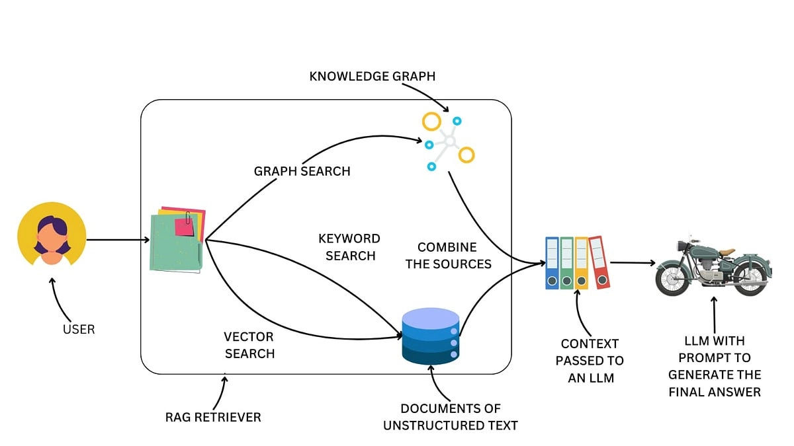
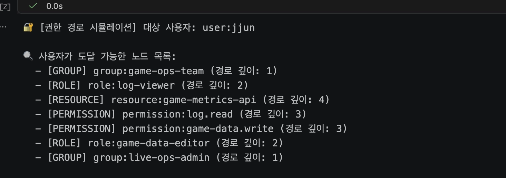
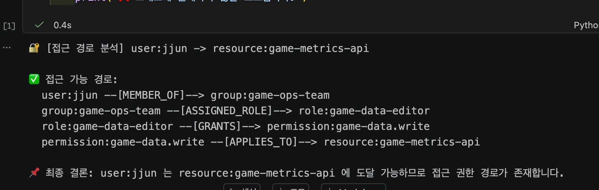

# Vector RAG vs Graph RAG
## Vector RAG의 한계는?

> 단순 Vector RAG로는 코드/문서 간 관계 추적이 어렵다
> 
<details>
<summary>🌳 **Vector RAG의 기본 구조 이해하기**   https://youtu.be/NbrN-NwKvuc?si=PznBPotBX_tVeoFa</summary>
    
### 1. RAG란?

> Retrieval(검색), Augmented(강화된), Generation(생성)
> 
> 
> → 검색한 자료로 AI의 답변을 강화하는 기술
> 
- RAG는 LLM이 오픈북 시험을 볼 수 있도록 하는 것에 비유할 수 있음
- <**질문 → 검색 → 답변**> 과정이 전부!
- LLM은 학습이 끝난 시점에 멈추지만, 그 외로 필요한 자료를 끌어오는 데 RAG가 메워주는 것

### 2. Embedding, Vector

> 텍스트 → 숫자로 바꾸는 핵심 원리
> 
- 위치를 표현하는 것
    - 마트에서 비슷한 상품을 가까이 배치하듯이, 텍스트의 의미를 숫자로 표현해서 **비슷한 의미끼리 가까운 위치**에 놓는 것
    - 즉, 비슷한 의미들은 숫자 공간에서 가까이에 위치하게 된다
- 사용자의 Input(텍스트)이 Embedding 모델이라는 **의미 분석 엔진**을 통과하면, 수백~수천 개로 이루어진 **고차원 배열**로 변환됨
    
    
    - 차원이 높을수록 의미를 더 세밀하게 표현할 수 있지만, 저장공간이 늘어나고 속도가 느려지므로 정확도-속도의 적절한 균형을 찾아 차원을 결정하는 것이 중요하다
- 이는 시맨틱 서치의 원리로 작용한다 : ***단어가 아닌, 의미로 검색***
    
    

### 3. Chunking, Parsing

> 문서를 어떻게 잘라야 검색이 잘 될까?
> 
- 100페이지 짜리 문서가 있을 때, 이를 통째로 임베딩하기는 어렵다
    - 텍스트 길이 제한, 내용이 방대할수록 의미가 희석되기 때문
- **`청크(chunk)`**란?  텍스트 정보 조각
    - → **LLM에게 전달되기 전 검색되는 정보 조각**
    
    **[청킹 전략]**
    
    1. 길이 기반 청킹 
        - 정보가 쪼개져 검색 폼질이 저하됨
        - 정보 손실 감내
        - 실험 요소 다양
    2. 의미/문단 레벨 청킹
        - 의미 보존은 되나,
        - 문단을 정확히 정의하기 어렵고 구현이 매우 어려움
        - 처리 속도 느림
- 청킹은 정보 손실을 최소화하면서 나누는 것이 핵심이다 → RAG의 성능을 결정
    - 다루는 문서의 형태는 테이블, OCR 문서 스캔, 이미지 등 매우 다양하므로 청킹을 예쁘게 하는 것 자체가 쉽지 않음
    
    
- **`Parser`**의 역할 : **텍스트 변환 엔진**
    - Parser를 어떻게 적용하느냐가 청킹 품질을 결정짓는 관문으로 작용
    - 즉, 좋은 Parser = 좋은 청킹의 시작
    - https://www.upstage.ai/products/document-parse → 성능이 우수하고 도입해보기 좋음

### 4. Vector Database

> 숫자들(청킹한 것들)을 어디에 저장하고 어떻게 검색하는지?
> 
- 일반 DB와 달리 정확한 조건 매칭이 아닌 **유사도 기반 검색**을 지원함
- RAG 검색 흐름
    
    
    [RAG 기본 구조] 사용자가 질문을 하면, 그 질문을 임베딩으로 바꿔서 벡터 데이터베이스에서 가장 비슷한 청크들을 찾아오고, 그 청크들을 LLM에게 컨텍스트로 넘겨서 답변을 생성한다.
    
    → 자르고, 숫자로 바꾸고, 비슷한 숫자를 찾는다
    
    **청크들은 개별 임베딩되어 독립적으로 처리됨 (앞뒤 맥락을 모르는 상태)*
    

<aside>
🚨

**대부분 RAG의 문제가 되는 지점**

*Generation(답변 생성 파트)* << *Retrieval(검색 파트)*

- 검색 대상 문서가 수백~수천 개로 늘어나는 순간 검색 품질이 급격히 떨어진다
- 모델이 답변을 못 만드는 게 아니라, 엉뚱한 청크가 올라가서 엉뚱한 답변이 나오는 것
- 즉, 청크 자체의 품질을 높이는 게 가장 중요
</aside>

<aside>
🚨

**초기 디버깅 루틴**

1. 질문 선정 : 실제 필드에서 자주 받는 질문 5~10개 선정
2. 청크 확인 : 질문별 벡터 검색 결과 1위~20위 직접 눈으로 확인

---

여기서 이상한 청크가 올라와 있다거나, 있어야 할 정보가 누락되어 있는지 등을 확인하며 감 잡기! → *RAG 고도화의 첫걸음*

</aside>

### 5. Dense Embedding, Sparse Embedding, Hybrid Search

> 의미 검색과 키워드 검색을 함께 써야 하는 이유
> 
- 시맨틱 서치만으로는 못 잡는 영역이 존재함
- Dense Embedding
        
    *위에서 설명한 의미 기반 검색 원리
    
- Sparse Embedding
    
    - 키워드 기반 검색(e.g. BM25)이 대표적
    - 문서에 특정 단어가 몇 번 등장하는지, 그 단어가 얼마나 희귀한지 기반으로 점수를 매김
    - 대부분의 차원이 0이고, 특정 단어가 있는 자리에만 숫자가 채워지는 **희소 벡터** 형태
- **[비교]** Dense Embedding VS Sparse Embedding
    
    
    → 현실에서는 둘 다 필요함! 
    
    - 특히 도메인 특수성이 강한 산업군에서는 명사/키워드/전문 용어의 정확한 매칭이 검색 기여도가 더 높은 경우가 꽤 많다고 함
- 그래서 등장한 것이 Hybrid Search
    
    둘다 동시에 돌리고 합쳐서 최종 검색 결과를 만드는 방식
    
    - 이 두 결과의 가중치를 조절하는 것이 핵심임 → 가중치만 잘 잡아도 검색 품질이 완전 달라짐
    - 일반적으로 범용 문서는 Dense를, 전문 용어면 Sparse를 높게 잡음

### 6. Reranker

> 검색 결과를 다시 정밀하게 평가하는 기법
> 
- 1차 검색 (기본 조건) → 정밀 비교 (청크와 질문을 나란히 두고 꼼꼼하게 따지는 과정)
    - *해당 청크가 질문에 대한 정보를 정확하게 담고 있는가*
- Trade-off : 정확도-속도
    - Reranker를 추가하면 검색 정확도가 올라가지만, 속도는 느려짐
    - 상황에 따라 판단할 것
        - 개인용, 신뢰도가 중요한 상황, 속도가 느려도 된다면 권장
        - 다수 사용자 서비스라면 사용자 경험이 연관되어 있으므로 충분히 고민해볼 것

### 7. [고급] Contextual Retrieval, Late Chunking

- 기본 RAG의 가장 큰 약점 : 청킹 시 맥락이 잘림
- ***Contextual Retrieval***
    - https://www.anthropic.com/engineering/contextual-retrieval가 이 문제를 정면으로 해결함
    - 각 청크를 임베딩하기 전에, LLM을 사용해서 그 청크가 전체 문서에서 어디에 위치하는지 설명하는 짧은 맥락을 붙여주는 방식
    - → 검색 시 청크가 질문에 정확히 매칭될 수 있음
        
    - 하지만 이렇게 청크마다 맥락을 붙이면 LLM 호출 비용이 어마어마하게 증가하기 때문에, 이를 해결하고자 **바이너리 판별 로직**이라는 것이 추가됨
        - 모든 청크에 맥락을 다 붙이는 것이 아니라 청크가 의미있는 정보를 담고 있는지의 판단을 바이너리를 통해 분기치는 방식
        - 청크 자체가 의미 있는 경우에만 맥락 붙이기
            
            
        - → 상당한 비용 절감을 이룸!
    - 이렇게 검색 품질을 확보하면, 이후 프롬프트 튜닝, 모델 교체 시에도 안정적인 베이스라인을 보장할 수 있음
- ***Late Chunking***
    - 청크에 맥락을 붙이는 방식이 아닌 **순서를 뒤집는** 새로운 접근 방식
    - 문서 전체를 먼저 긴 컨텍스트 임베딩 모델에 넣어서 토큰 단위 임베딩을 한번에 만듦 → 이후 청크로 자르는 과정
        
    - → 긴 컨텍스트를 처리할 수 있는 임베딩 모델이 필요하다는 제약이 있지만, 각 청크의 맥락이 자연스럽게 연결될 수 있음
    - → Contextual Retrieval(청크마다 LLM 호출)에 비하면 비용은 오히려 낮은 편

### 8. RAG는 정말 죽었을까?

***RAG is dead?***

- 에이전틱 서치의 성능이 압도적으로 좋다?!
    - 에이전틱 서치란 터미널 도구(grep, glob)로 직접 탐색하는 방식
    - Cursor는 내부 구현을 공개하지 않으나, 벡터 검색 기반 코드베이스 인덱싱을 사용하는 것으로 알려져 있고, 클로드 코드는 인덱싱 없이 직접 파일 탐색을 사용함
- grep VS embedding
    - `grep` - 함수명 검색, 변수명 추적, 파일 경로 등 정확한 문자열을 찾는 데 특화
    - `embedding` - 유사 코드 탐색, 의미 기반 검색, 자연어 질의에 특화
    - 코드 검색 시에는 **구조화된 데이터 → 정확한 매칭**이 우선되어야 하므로 grep이 더 유리함
    - 비정형 텍스트 데이터를 다룬다면 grep의 한계가 분명히 존재하므로, 의미적 연결 탐색을 하는 embedding, RAG는 아직 유효하다
- RAG의 본질은 **검색**에 있으며, 검색이 죽을 일은 없다. 검색 방식이 단지 에이전트 안에 녹아들어가는 방향으로 진화하고 있는 것
- RAG는 죽은 게 아니라 ***컨텍스트 엔지니어링***이라는 이름으로 리브랜딩된 것이라는 주장도 있음
    - 즉 요구사항이 더 정교해지고 구현이 복잡해진 것임
    - 결론은 RAG를 꾸준히 공부하고 배워라 → 검색 아키텍처를 설계하는 시야를 갖추게 될 것
    

</details>

### 1. 관계/경로를 **직접 보존·탐색하기 어려움**

- 각 chunk는 독립적으로 임베딩되므로, retrieval 단계에서 chunk 간 관계나 경로를 **명시적으로 보존·탐색하기 어려움**
- ***relation-heavy problem*** : 데이터 자체보다 데이터 간 관계가 더 중요한 문제
    
    **[예시] RBAC IAM 시스템 (User-Group-Role-Permission 구조)**
    
    - IAM에서 최종 권한 판단은 개별 엔티티 하나보다, User-Group-Role-Permission-Resource 간의 경로와 정책 조합에 의해 결정되는 경우가 많다.
    
    IAM 시스템에서 엔티티 간 관계를 chunk 단위로 쪼개고 임베딩하는 경우 : chunk1, 3만 가져올 경우 2가 누락되어 엉뚱한 해석이 될 수 있음
    
    ```java
    [Chunk1] User는 Group에 속함
    [Chunk2] Group은 Role을 가짐
    [Chunk3] Role은 Permission을 가짐
    ```
    
    **[특징]**
    
    1. 핵심 정보가 개별 node 자체보다 **node 간 관계(edge)** 에 더 많이 담기는 경우가 많음
    2. multi-hop이 기본 - 반드시 여러 단계에 걸쳐서 조회해야 함
    3. 결과가 집합이 아닌 경로임 - 특정 리스트를 던져주고 끝나는 게 아니라 경로에 대한 설명이 덧붙어야 함
    4. Explainability가 중요 (단순 결과만 X)
    
- ***entity-relation problem*** : 질문이 **엔티티와 그 사이의 관계**를 중심으로 구성되는 경로 탐색형 문제
    
    ```java
    // User A가 Resource B에 접근 가능한가?
    (User A) --[has permission?]--> (Resource B)
    ```
    
    1. **Entity disambiguation 실패**
        - e.g. “Admin”이라는 키워드가 포함될 때 이게 Role인지 Group인지 구분 X
    2. **Relation loss** : 임베딩 기반 retrieval에서는 관계가 텍스트 의미 안에 암묵적으로 흡수되기 때문에, 그래프처럼 명시적인 관계 구조를 그대로 유지하기 어려움
    3. Vector search는 관계형 DB의 **JOIN처럼 명시적 관계 결합**을 기본 retrieval 연산으로 제공하지 않음

### 2. multi-hop 관계 질의를 **retrieval 단계에서 직접 다루기 어려움**

- Vector retrieval은 보통 개별 chunk의 의미 유사도를 기준으로 동작하므로, multi-hop 관계를 경로 단위로 안정적으로 복원하기 어려움
    - 즉, 각 hop은 분리되므로 연결된 상태로 가져오지 못함
    - 중간 노드가 없다면 전체 reasoning 이 깨짐
- 단순 Vector RAG만으로는 3~4 hop 이상의 관계형 질의를 일관되게 처리하기 어려운 경우가 많음
    
    Q. 유저가 해당 리소스에 접근 가능한 이유는? 
    A. User → Group → Role → Permission → Resource (4-hop)
    

### 3. Top-K retrieval의 구조적 한계

- Top-K = 유사도가 가장 높은 K개
- 위 자료에서도 언급했듯이 K개가 모두 유의미한 chunk라는 보장이 없음 (검증을 통해 chunking 자체를 최적화하는 과정 필요)
- 질문과 직접적인 연관성이 없는 chunk 가 상위에 노출되면, 핵심 정보가 누락되며 엉뚱한 답변을 할 확률이 높음

### 4. context fragmentation

- chunk 단위로 쪼개지므로, **LLM이 연결해서** 해석해야 함
- 관계 복원이 retrieval 단계에서 충분히 되지 않으면, LLM이 누락된 연결을 추론에 의존하게 되고 그만큼 할루시네이션 위험이 커질 수 있음

즉, Vector RAG는 관련 정보 조각을 찾는 데는 강하지만, **최종 응답에 필요한 관계 구조나 경로를 retrieval 단계에서 직접 복원하는 데 한계가 있다.**

## Graph RAG의 구성

> 그래프 기반으로 정보를 탐색해서 LLM에 전달하는 RAG
> 

### Vector RAG vs Graph RAG

- Vector RAG : 문서나 코드를 컴퓨터가 이해할 수 있는 숫자(벡터)로 변환해서, 숫자의 거리가 가까운(의미가 비슷한) 데이터를 찾아오는 방식
    - *의미와 유사도로 찾는 “연관 검색어”*
    - **비유:** 포털 사이트에서 '사과'를 검색하면 의미가 비슷한 '바나나', '과일', '농장' 등의 결과가 출력됨
- Graph RAG : 데이터를 단순한 텍스트 뭉치가 아니라, 점(Node)과 그 점들을 잇는 선(Edge)으로 연결하여 지식 그래프(Knowledge Graph)를 만드는 방식
    - *명확한 관계를 따라가는 "지하철 노선도"*
    - **비유:** 강남역(Node)과 양재역(Node)이 신분당선(Edge)으로 연결되어 있다는 '지하철 노선도'를 미리 그려두고 길을 찾는 것
    - **한계점:** 처음에 시스템을 만들 때 '어떤 것을 점(클래스/함수)으로 두고, 어떤 것을 선(의존성/호출)으로 둘 것인지' 뼈대(Ontology)를 정밀하게 설계해야 하므로 구축 난이도가 높음
- 따라서 의미 기반 검색이 필요한 영역에는 Vector retrieval을, 명시적 경로 탐색이 필요한 영역에는 Graph retrieval을 적용하는 **hybrid 접근**이 유의미한 대안이 될 수 있다
    
    
    
    *출처 - https://levelup.gitconnected.com/how-to-enhance-rag-with-knowledge-graphs-1c89ccfd3a6b
    

### 동작 흐름

```java
[질문]
  ↓
[엔티티 추출]
  ↓
[그래프에서 질문과 관련된 시작(anchor) 노드 식별]
  ↓
[그래프 탐색 (traversal)]
  ↓
[관련 path/subgraph 구성]
  ↓
[LLM에 전달 → 설명 생성]
```

### 내비게이션에 비유하면?

1. Graph Storage (지도 보관소)  *보통 `Neo4j` 같은 그래프 전용 DB를 사용함
2. Graph Traversal (길 찾기 알고리즘): "여기서 출발하면 어디로 이어져?"를 계산하는 두뇌 → 아래 **`NetworkX`**가 수행하는 역할
3. LLM Generation (내비게이션 성우)**:** 길 찾기 결과를 받아서 자연어로 설명 (LLM의 역할)
- Retrieval 단위가 문서 → **Subgraph**로 바뀜
- Top-K 유사도 → **Traversal** (연결된 경로 탐색)
- 결과 : 문서 리스트 → **관계 구조** (path)

## **Ontology / Entity / Edge 설계**

### Ontology

> 그래프에서 어떤 엔티티와 관계를 사용할지 정의한 스키마 — **“어떤 질문을 어떤 구조로 풀 것인가”를 결정하는 모델**
> 
- 질문 중심으로 설계하기
- 너무 단순하거나 복잡해도 안 됨
- e.g. IAM Ontology 
- [Entity] User, Group, Role, Permission, Resource
- [Relation] MEMBER_OF, ASSIGNED_ROLE, GRANTS, APPLIES_TO, DENIES

### Entity

> 그래프의 노드(Node)로 표현되는 실제 객체 — **탐색의 anchor가 되는 단위**
> 
- granularity - e.g. Permission을 어떻게 쪼갤 것인가
- identity (Unique ID 필수)
- metadata 포함 여부 고려

### Edge

> 엔티티 간의 의미 있는 관계 표현 — **traversal 가능한 방향성**과 필요 시 **조건(condition)** 같은 속성을 함께 설계할 수 있음
> 
- 방향성을 가져야 함 - traversal이 가능한지 기준으로 설계
- edge에 정보를 넣을 것인지 결정
    
    ```java
    GRANTS {
      condition: "region=KR"
    }
    
    ---
    User ──MEMBER_OF──> Group
    Group ──ASSIGNED_ROLE──> Role
    Role ──GRANTS──> Permission
    Permission ──APPLIES_TO──> Resource
    ```
    

### Knowledge Graph 구축 파이프라인

> 탐색보다 먼저 해결해야 할 것 — **"그래프를 어떻게 만드는가"**
> 

Graph RAG에서 실제로 가장 어려운 부분은 탐색이 아니라 **비정형 소스에서 그래프를 구축하는 과정**이다.

```
[원본 소스 (코드 / 문서 / 텍스트)]
  ↓
[파싱 / 엔티티 추출]
  - 코드베이스: tree-sitter로 클래스·함수·호출 관계를 AST 파싱
  - 비정형 문서: LLM으로 엔티티·관계 추출 (e.g. Microsoft GraphRAG 방식)
  ↓
[관계 정규화 → JSON / 중간 포맷으로 저장]
  ↓
[Graph DB 적재]
  - 실험 단계: NetworkX (인메모리)
  - 실서비스:  Neo4j 등 persistent graph DB
  ↓
[탐색 가능한 Knowledge Graph 완성]
```

**소스 유형별 구축 방식 비교**

| 소스 유형 | 추출 방법 | 특징 |
| --- | --- | --- |
| 코드베이스 | tree-sitter (AST 파싱) | 관계가 명시적 — 정확도 높음 |
| 구조화 문서 (IAM 정책 등) | 규칙 기반 파서 | 스키마가 고정된 경우 적합 |
| 비정형 텍스트 | LLM 엔티티·관계 추출 | 유연하지만 추출 품질이 프롬프트에 의존 |

> 어떤 방식이든 **Ontology를 먼저 정의한 상태에서 추출**해야 노드·엣지가 일관되게 쌓인다.
추출 품질이 곧 탐색 품질을 결정하므로, 구축 단계가 전체 Graph RAG 성능의 병목이 되는 경우가 많다.
> 

## `NetworkX`를 활용한 초간단 **IAM 권한 경로 분석기**

- ***NetworkX 라이브러리란?***
    
    > 그래프(네트워크) 구조를 메모리 상에서 만들고, 노드 간 연결 관계를 탐색하는 Python 라이브러리
    > 
    - 파이썬이 실행되는 동안 RAM 위에서 노드와 엣지, 복잡한 길 찾기 계산을 고속으로 수행
        - 핵심 기능 - 최단 경로 찾기(`shortest_path`), 연결된 모든 하위 노드 찾기(`descendants`), 네트워크 중심성 분석 등 그래프 이론의 수학적 알고리즘이 모두 구현되어 있음
    - Graph 기반 retrieval 실험에서는 관계 경로를 추적하고 질의하는 핵심 도구로 활용 가능
    - 초기 실험 단계에서는 별도의 Graph DB 없이도 NetworkX로 traversal 기반 retrieval을 단순하게 구현 및 검증할 수 있다
        1. **수집:** Tree-sitter로 파싱한 연결 관계를 가벼운 JSON 파일로 저장
        2. **검색 (NetworkX):** 사용자가 질문하면(`Impact Explorer` 실행), 파이썬이 JSON을 읽어 `NetworkX` 메모리에 지도를 쫙 펼침 →  `nx.descendants()`로 영향받는 경로를 찾아냄
        3. **생성 (LLM):** 찾은 경로를 LLM에게 던져줌
    - 단, NetworkX는 인메모리 구조이므로 대용량 데이터나 실서비스에서는 Neo4j 등 persistent graph DB로 교체가 필요하다
    
    ---
    
    IAM 맥락에서는 다음 역할을 할 수 있다
    
    - User / Group / Role / Permission / Resource를 노드로 표현
    - MEMBER_OF / GRANTS / APPLIES_TO 같은 관계를 엣지로 표현
    - 특정 사용자에서 특정 리소스까지의 권한 경로를 탐색
    - shortest path, descendants 같은 알고리즘으로 권한 전파 구조를 분석

- 어떤 사용자가
- 어떤 경로를 통해
- 어떤 리소스 권한을 가지게 되었는가

를 검색하는 시스템을 만든다고 하자. 아래 구조를 가지게 될 것이다. 

<aside>

**단순한 allow-only 시스템이라고 가정할 때*

- source user = 권한을 조회할 사용자
- target resource = 접근 여부를 알고 싶은 리소스
- shortest path = 권한 경로를 단순화해서 설명하기 위한 대표 경로 예시
- relation = MEMBER_OF / GRANTS / APPLIES_TO 같은 관계 타입
</aside>

- 사용자가 도달 가능한 **전체 노드** 조회
    
    ```python
    import networkx as nx
    
    # 1. IAM 그래프 초기화
    # 방향 그래프를 쓰는 이유:
    # User -> Group -> Role -> Permission -> Resource 처럼
    # "권한이 어떻게 전달되는가"의 방향이 중요하기 때문
    G = nx.DiGraph()
    
    # 2. 노드 간 관계 추가
    # 예시:
    # jjun은 game-ops-team 그룹에 속하고,
    # game-ops-team은 game-data-editor 역할을 가지며,
    # game-data-editor는 game-data.write 권한을 부여받고,
    # 그 권한은 game-metrics-api 리소스에 적용된다.
    
    G.add_edge("user:jjun", "group:game-ops-team", relation="MEMBER_OF")
    G.add_edge("group:game-ops-team", "role:game-data-editor", relation="ASSIGNED_ROLE")
    G.add_edge("role:game-data-editor", "permission:game-data.write", relation="GRANTS")
    G.add_edge("permission:game-data.write", "resource:game-metrics-api", relation="APPLIES_TO")
    
    # 추가 예시: jjun이 다른 경로로도 권한을 가질 수 있음
    G.add_edge("user:jjun", "group:live-ops-admin", relation="MEMBER_OF")
    G.add_edge("group:live-ops-admin", "role:log-viewer", relation="ASSIGNED_ROLE")
    G.add_edge("role:log-viewer", "permission:log.read", relation="GRANTS")
    G.add_edge("permission:log.read", "resource:game-metrics-api", relation="APPLIES_TO")
    
    # 3. 분석 대상 사용자 설정
    target_user = "user:jjun"
    print(f"🔐 [권한 경로 시뮬레이션] 대상 사용자: {target_user}\n")
    
    # 4. 그래프 탐색
    try:
        reachable_nodes = nx.descendants(G, target_user)
    
        print("🔍 사용자가 도달 가능한 노드 목록:")
        for node in reachable_nodes:
            depth = nx.shortest_path_length(G, source=target_user, target=node)
    
            if node.startswith("group:"):
                node_type = "GROUP"
            elif node.startswith("role:"):
                node_type = "ROLE"
            elif node.startswith("permission:"):
                node_type = "PERMISSION"
            elif node.startswith("resource:"):
                node_type = "RESOURCE"
            else:
                node_type = "UNKNOWN"
    
            print(f"  - [{node_type}] {node} (경로 깊이: {depth})")
    
    except nx.NetworkXNodeNotFound:
        print("해당 사용자가 그래프에 존재하지 않습니다.")
    ```
    
    - `nx.descendants()` - 특정 사용자가 도달 가능한 권한/리소스 집합 조회
    
    
    
- 특정 리소스까지의 `경로` 조회
    
    ```python
    import networkx as nx
    
    G = nx.DiGraph()
    
    G.add_edge("user:jjun", "group:game-ops-team", relation="MEMBER_OF")
    G.add_edge("group:game-ops-team", "role:game-data-editor", relation="ASSIGNED_ROLE")
    G.add_edge("role:game-data-editor", "permission:game-data.write", relation="GRANTS")
    G.add_edge("permission:game-data.write", "resource:game-metrics-api", relation="APPLIES_TO")
    
    source_user = "user:jjun"
    target_resource = "resource:game-metrics-api"
    
    print(f"🔐 [접근 경로 분석] {source_user} -> {target_resource}\n")
    
    try:
        path = nx.shortest_path(G, source=source_user, target=target_resource)
    
        print("✅ 접근 가능 경로:")
        for i in range(len(path) - 1):
            from_node = path[i]
            to_node = path[i + 1]
            relation = G[from_node][to_node]["relation"]
            print(f"  {from_node} --[{relation}]--> {to_node}")
    
        print(f"\n📌 최종 결론: {source_user} 는 {target_resource} 에 도달 가능하므로 접근 권한 경로가 존재합니다.")
    
    except nx.NetworkXNoPath:
        print("❌ 접근 불가: 해당 사용자에서 리소스까지 도달 가능한 권한 경로가 없습니다.")
    
    except nx.NetworkXNodeNotFound:
        print("❌ 그래프에 존재하지 않는 노드입니다.")
    ```
    
    - `nx.shortest_path()` - 특정 리소스에 대한 접근 경로를 복원
    
    **Q. jjun이 game-metrics-api에 접근 가능한 이유는?**
    
    **A. 권한이 왜 존재하는지를 설명할 수 있다**
    
    
    

> *jjun은 여러 그룹에 속해 있고, 그 그룹을 통해 role을 받고, 그 role이 permission을 부여하며, 결국 game-metrics-api 리소스에 도달한다*
>

*실제 서비스에서는 **정책 엔진이 최종 allow/deny를 판정하고**, Graph는 그 경로를 설명/분석하는 데 쓰일 수 있을 것
