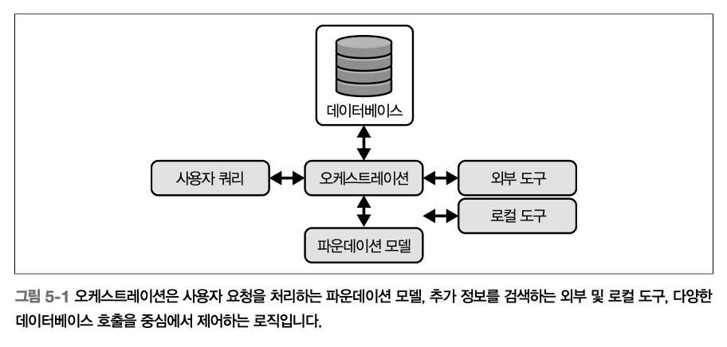
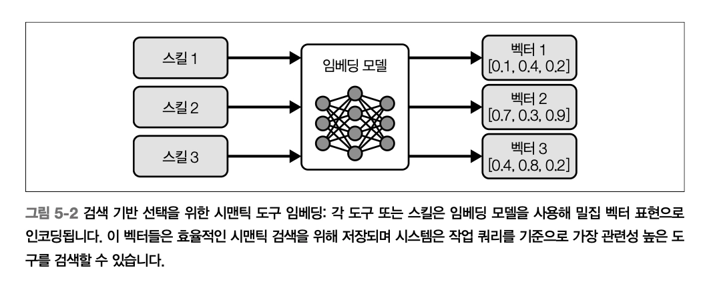
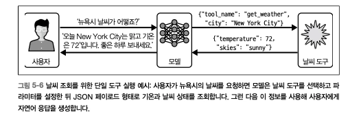
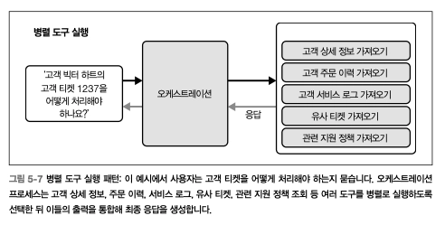

# Ch5. 오케스트레이션

> 어떤 도구를 언제 호출할지 결정하고, 각 모델 호출에 적합한 컨텍스트를 구성해 효과적이고 근거 있는 행동을 유도하는 과정

- **단순한 작업** - 하나의 도구와 최소한의 컨텍스트만으로 충분함
- **복잡한 워크플로** - 각 단계를 정확하게 수행하기 위해 정교한 계획, 메모리 검색, 동적 컨텍스트 조합이 필요함

_→ 오케스트레이션은 시스템이 보유한 리소스를 활용해 사용자 요청을 효과적으로 처리하도록 하는 핵심 로직이다_

## 에이전트 유형

_“ 에이전트 유형의 선택은 시스템의 성능, 비용, 기능을 좌우한다. 유형별 특성을 이해하면, 애플리케이션의 요구와 제약에 맞는 에이전트를 설계할 수 있으며 각 유형 내에서 오케스트레이션 패턴, 도구 선택, 컨텍스트 구성 방식이 어떻게 결합되어 효과적이고 신뢰할 수 있는 결과를 만드는지 알 수 있다_

| **에이전트 유형**     | **강점**                   | **약점**                          | **최적 사용 사례**          |
| --------------------- | -------------------------- | --------------------------------- | --------------------------- |
| 반사형 에이전트       | 밀리초 단위 응답           | 다단계 추론 불가                  | 키워드 라우팅, 단순 조회    |
| 리액트 에이전트       | 유연한 적응력              | 더 높은 지연시간과 비용           | 탐색형 워크플로, 트러블슈팅 |
| 계획 후 실행 에이전트 | 명확한 작업 분해           | 계획 수립 오버헤드                | 복잡한 다단계 프로세스      |
| 쿼리 분해 에이전트    | 근거가 명확한 검색 정확도  | 다수의 도구 호출 필요             | 리서치, 사실 기반 Q&A       |
| 성찰형 에이전트       | 초기 오류 감지             | 추가 연산 및 지연시간             | 고위험, 안전이 중요한 작업  |
| 심층 리서치 에이전트  | 다단계 및 적응형 조사 관리 | 높은 연산 비용과 매우 긴 지연시간 | 전문의 문헌 리뷰            |

### 반사형 에이전트

> 입력과 행동을 직접 연결하며 내부 추론 과정을 거치지 않고 즉각적인 반응 제공

- 조건이 참이면 도구 실행 (**_if-condition, then-action_**) 규칙을 따름
  - 사전에 정의된 트리거 감지 → 즉시 적절한 도구 호출

**`장점`**

- latency가 매우 짧고 성능이 예측 가능함
- 키워드 기반 라우팅, 단일 단계 데이터 조회, 간단한 자동화 등의 용도에 적합

**`단점`**

- 표현력이 제한적
- 다단계 추론이나 입력 외부의 컨텍스트를 요구하는 작업은 처리 불가

### 리액트 에이전트

> 추론과 행동을 반복 루프 내에서 교차 수행

- 모델이 **사고** 생성 - 도구를 선택해 호출 - 결과 관찰 - 다시 계획을 갱신하는 방식
- 복잡한 작업을 **여러 관리 가능한 단계로 분할**하고, 중간 결과를 반영하여 계획을 조정할 수 있게 함

**`장점`**

- 탐색적 시나리오에 강함
  - e.g. 동적 데이터 분석, 다중 소스 통합, 문제 해결
- 중간에 전략을 조정할 수 있는 유연성
- 도구 호출, 관찰 결과, 단계별 의사결정 등 실행 과정의 흔적이 로그로 남기 쉬워 디버깅과 감사에 유리

**`단점`**

- 루프 구조에 의해 API 비용과 응답 시간이 늘어날 수 있음

### 계획 후 실행 에이전트

> 작업을 **계획 단계 / 실행 단계** 2개로 뚜렷하게 나누어서 진행

- 계획 단계 : 모델이 다단계 계획을 생성 → 장기적인 추론에 집중
- 실행 단계 : 계획된 각 단계를 도구 호출을 통해 수행 → 불필요한 LLM 호출 없이 필요한 툴만 호출

**`장점`**

- 명확한 분해
- 디버깅 용이성
- 비용 효율성

### 쿼리 분해 에이전트

> 복잡한 질문을 반복적으로 하위 질문으로 나누고 각 하위 질문마다 검색이나 다른 도구를 호출한 뒤 최종 답을 종합적으로 도출

- 모델이 스스로에게 ‘어떤 후속 질문이 필요한지?’ → 검색 호출 → ‘다음 질문은?’ → .. → ‘최종 답은?’ 과 같이 **_self-ask with search_** 의 패턴을 가짐
- 외부 지식 검색이 필요한 상황에 특히 효과적
- 최종 응답 잗성 전에 각 사실이 도구 출력에 기반을 두도록 보장

### 성찰 및 메타추론 에이전트

> 생각과 행동을 교차시키는 것에 그치지 않고 다음 단계로 진행하기 전에 과거 단계를 검토해 실수를 찾아내고 수정 → **리액트 패러다임의 확장판**

- **목표 상태에 대한 성찰**을 바탕으로 자신의 추론을 지속적으로 정렬
  - [Reflexion: Language Agents with Verbal Reinforcement Learning](https://proceedings.neurips.cc/paper_files/paper/2023/file/1b44b878bb782e6954cd888628510e90-Paper-Conference.pdf)
  - https://velog.io/@g2min/Reflexion-self-reflect-%EA%B0%80-%EA%B0%80%EB%8A%A5%ED%95%9C-%ED%94%84%EB%A0%88%EC%9E%84%EC%9B%8C%ED%81%AC
- 현재 상태를 의도한 결과와 비교하면서 어긋남이 생기면 계획 조정
- 성찰형 프롬프트 - 모델이 자신의 추론 과정을 비판적으로 검토하고 논리적 오류를 수정하며 성공적인 전략을 강화하도록 유도
- 고위험 워크플로(초기 오류가 연쇄적으로 이어져 비용이 큰 실패로 이어질 수 있는 케이스), 정확성과 신뢰성이 더 중요한 작업에 적합
  - e.g. 금융 거래 오케스트레이션, 의료 진단 지원, 중대 사고 대응
- 각 행동에 성찰 단계를 대응시키면 에이전트는 도구 출력이 기대에서 벗어났을 때 이를 감지 → 되돌릴 수 없는 작업을 실제로 실행 전에 재계획하거나 롤백 가능

### 심층 리서치 에이전트

> 개방형이고 매우 복잡한 조사 과제를 전문적으로 다루는 방식 (적응적 계획 + 종합 능력)

- 광범위한 외부 지식 수집, 가설 검증, 통합이 필요한 작업에 적합
  - e.g. 문헌 리뷰, 과학적 발견, 전략적 시장 분석 등
- 장문의 전문가 수준 작업에 적합함
- 주로 여러 패턴을 결합하는 형태
  - 연구 워크플로를 설계하는 **계획 및 실행 단계** + 큰 질문을 목표 지향 검색으로 쪼개는 **쿼리 분해** + 새로운 발견에 따라 가설을 반복적으로 다듬는 **리액트 루프**
- 작동 과정
  1. 전체 연구 아젠다 계획 (e.g. 핵심 하위 토픽이나 데이터 소스 식별)
  2. 각 하위 토픽을 `SELF_ASK`와 같은 자문 기법을 통해 구체적인 쿼리로 분해
  3. 학술 검색 API~도메인 특화 DB까지 다양한 도구를 호출하고 각 결과의 관련성과 신뢰성을 성찰
  4. 각 단계에서 LLM 기반 요약과 비평을 활용해 통찰을 점진적으로 발전하는 보고서나 추천안으로 통합

**`장점`**

- 전문 DB, 고복잡도, 다단계, 조사를 처리할 수 있는 역량
- 새로운 증거가 나타날 때마다 연구 방향을 조정하는 적응성
- 명시적인 계획과 분해 단계 → 방법론 감시 및 검토 투명

**`단점`**

- 광범위한 파운데이션 모델 사용 + 다수 API 호출 → 연산 및 토큰 비용이 큼
- 계획, 분해, 성찰 계층에 의한 추가 지연 발생
- 외부 데이터 소스의 품질과 가용성에 크게 의존 → 오류 처리, 폴백 필수

## 도구 선택

| **기법**         | **장점**                              | **단점**                                                                                              |
| ---------------- | ------------------------------------- | ----------------------------------------------------------------------------------------------------- |
| 표준 도구 선택   | 구현이 단순함                         | 도구의 수가 많아지면 확장성이 떨어짐                                                                  |
| 시맨틱 도구 선택 | 매우 많은 수의 도구로 확장성이 뛰어남 | 시맨틱 충돌(semantic collision) 때문에 선택 정확도가 떨어지는 경우가 많음보통 구현 시 지연시간이 낮음 |
| 계층적 도구 선택 | 매우 많은 수의 도구로 확장성이 뛰어남 | 연속으로 파운데이션 모델을 여러 번 호출해야 해서 더 느림                                              |

효과적인 도구 선택은 대부분 각 기능을 어떻게 서술하느냐에 달려 있다 (**명료함과 구체성을 높이는 것이 중요**)

1. 모든 도구에 간결하고 설명적인 이름 붙이기 (e.g. `process_numbers` → `calculate_sum`)
2. 그 뒤에 도구의 고유 목적을 한 문장으로 요약한다
3. 설명에 예시 호출 및 전형적인 입력, 출력 예시를 보여주기
4. 입력 타입과 범위를 명시해 제약 강제하기

**_→ 모델이 관련 없는 도구는 후보에서 제외하며, 더 명확하게 도구를 이해할 수 있다!_**

### 표준 도구 선택

> 도구, 정의, 설명을 파운데이션 모델에 제공 → 주어진 컨텍스트에 가장 적합한 도구를 선택하도록 모델에 요청

- 구현이 쉽고 추가적인 학습이나 임베딩, 도구 계층 구조 없이 사용 가능
- 주요 단점은 지연시간 (응답을 생성하는 동안 파운데이션 모델을 한 번 더 호출하므로)
- 인컨텍스트 러닝에 적합
- 작은 도구 모음에서는 잘 확장되나, 도구 라이브러리가 커질수록 정확도를 유지하고 오선택을 피하기 위해서는 도구 설명을 정교하게 설계하는 작업 필수

### 시맨틱 도구 선택

> 모든 사용 가능한 도구를 시맨틱 표현으로 인덱싱하고 시맨틱 검색으로 가장 관련성 높은 도구를 가져오는 것

- 선택해야 할 도구 수가 줄어들고, 더 작은 후보 집합 안에서 파운데이션 모델이 올바른 도구와 파라미터를 선택할 수 있게 됨
- 사전에 각 도구 정의, 설명을 OpenAI의 Ada, Amazon의 Titan, Cohere의 Embed, ModernBERT 등 **인코더 전용 모델**을 사용해 임베딩
  
  - 각 도구는 작업 쿼리와의 시맨틱 유사도에 기반해 효율적으로 검색될 수 있도록 벡터 표현으로 임베딩됨
- 과정
  [사전 도구 카탈로그 세팅]
  1. 각 도구 설명에 대한 임베딩 생성
  2. 도구 데이터베이스 (\*여기서는 벡터 스토어) 설정 \***_한 번만 계산해두면 이후부터는 빠르게 조회 가능_**
     [사용자 쿼리~응답 반환]
  3. 사용자 쿼리 (e.g. _이 방정식을 풀어줘. 2x+3=7_)
  4. 런타임에 현재 컨텍스트를 같은 임베딩 모델로 임베딩
  5. 벡터DB에서 가장 관련성 높은 상위 도구를 검색
  6. 파운데이션 모델은 그 중 어떤 도구를 호출할지와 파라미터를 결정
  7. 선택한 도구를 호출하고 도구의 출력을 통합해 최종 사용자 응답 생성
     ⇒ 도구: `query_wolfram_alpha` / 파라미터 : `expression=2x+3=7`
- 표준 도구 선택보다 빠르고 성능 및 확장성 우수

### 계층적 도구 선택

> 도구를 여러 그룹으로 조직하고 각 그룹에 대한 설명을 제공 - 그룹 선택 후 2차 검색으로 도구를 선택

- 적합한 상황
  - 시나리오에 포함된 도구 수가 매우 많은 경우
  - 도구 중 상당수가 시맨틱하게 서로 비슷한 경우
  - 높은 지연시간, 복잡성을 감수하더라도 도구 선택 정확도를 개선하고 싶은 경우
- 과정
  1. 사용자 쿼리 (e.g. _이 방정식을 풀어줘. 2x+3=7_)
  2. 쿼리가 먼저 적절한 도구 그룹으로 라우팅
  3. 그 그룹 안에서 단일 도구로 세분화하여 선택
     ⇒ 도구: `query_wolfram_alpha`
- 더 느리고 병렬화 비용도 많이 들지만, 전체적인 도구 선택 정확도를 높여줌
- 도구 그룹 설계/유지에는 비용이 꽤 드는 점이 한계

<aside>

### 도구 선택 전략

1. **단순성**: 표준 선택
2. **확장성**: 시맨틱 / 계층적
3. **trade-off** 1. 정확도 ↓ (시맨틱) 2. latency ↑ (계층적)
</aside>

# 도구 실행

- **_Parameterization_**
  - 언어 모델에서 도구 실행을 안내할 파라미터를 정의하고 설정하는 과정
  - 모델이 작업을 어떻게 해석하고 특정 요구사항을 충족하도록 응답을 어떻게 조정할지 결정
- 파라미터는 도구 정의에 따라 결정된다
  - 에이전트의 현재 상태 → 추가 컨텍스트로 반영, 파운데이션 모델에 함수 호출의 예상 입력 타입에 맞게 파라미터를 적절한 타입으로 채우도록 지시
  - **기본 파서** 사용하기 : 입력이 데이터 타입의 기본 조건을 만족하는지 확인하고, 파운데이션 모델이 형식을 수정하도록 지시하기 위핢
- 파라미터가 설정되면 도구 실행 단계 시작
  - 실행 과정에서 다양한 API, DB, 기타 도구와 상호작용하며 정보 수집/계산 수행/추가 액션 실행

# 도구 토폴로지

에이전트에 충분한 범위의 도구를 제공하면, 도구들을 유연하게 배열하고 올바른 순서로 적용해 더 다양한 문제를 해결하도록 할 수 있다. 즉, 에이전트가 작동할 수 있는 도구와 도구 토폴로지를 구현해두고, 구체적인 조합은 현재 컨텍스트와 작업에 따라 동적으로 설계되게끔 할 수 있다

\***_도구 토폴로지의 스펙트럼_**

### 단일 도구 실행

> 정확히 하나의 도구만 필요로 하는 작업

- 작업을 해결하는 데 가장 적합한 도구 택 1
- 단순하지만 이 최소 정의가 복잡한 다단계 계획 및 도구 오케스트레이션 전략을 구축하는 기반이 됨
- Workflow
  1. 사용자 쿼리가 모델로 전달됨
  2. 모델은 도구 모음에서 적절한 도구 선택
  3. 도구 출력을 이어서 전달받음
  4. 이를 사용해 사용자에게 전달할 최종 응답 구성
- 예시 (뉴욕시의 현재 날씨 조회)
  

### 병렬 도구 실행

> 하나의 입력에 대해 여러 기능을 동시에 수행하는 작업

- 몇 개의 도구를 실행할 것인가 → 복잡도 결정
- 여러 소스로부터 포괄적인 정보를 한 번에 효율적으로 수집 가능
- 응답 생성 전에 결과를 통합해, 전체 지연시간 최소화 & 풍부한 출력 제공
- Workflow
  1. 시맨틱 도구 선택을 통해 실행될 수 있는 도구의 최대 개수를 먼저 가져옴
  2. 이를 가지고 파운데이션 모델 한 번 더 호출
  3. 작업에 필요한 도구만 선택하도록 범위를 좁힘
     - 추가 컨텍스트를 전달하며 더 이상 도구를 추가하지 않기로 결정할 때까지 계속 도구 추가 가능
  4. 도구 선택이 완료되면, 각각 독립적으로 파라미터 설정 및 실행
  5. 모든 도구 실행이 완료되면, 그 결과를 파운데이션 모델에 전달해 최종 응답 작성
- 예시 (고객 티켓 처리 방안 질문)
  

### 체인

> 일련의 작업을 순차적으로 실행하는 패턴

- 복잡성을 증가시키는 요소 중 하나
- 계획 단계에서 특정 목표를 달성하기 위해 어떤 작업을 어떤 순서로 수행해야 하는지 결정 → 각 작업이 끊김 없이 다음 작업으로 이어지도록 보장
  - 체인 계획 시, 각 작업 간의 의존성을 면밀히 고려해 원하는 결과로 활동 흐름이 일관되게 오케스트레이션 되도록 해야 함
- 단계별 절차, 선형 워크플로가 필요한 작업에서 흔히 사용됨
- `LCEL (LangChain Expression Language)` : 체인을 직접 Chain 객체로 구성하지 않고 기존 Runnable을 합성하는 방식으로 체인을 구축하는 선언적 문법
  - 내부적으로 모든 체인을 동일한 인터페이스(_Runnable_)로 구현하고 있어, 어떤 LCEL 체인이든 invoke(), batch(), stream() 호출 가능
  - 보일러플레이트 코드를 줄이면서 고급 실행 기능을 활용할 수 있다

<aside>

### 에이전트식 체인 실행 패턴

- 사용자 프롬프트가 모델에 전달되면,
- 모델은 추론을 수행하고 도구를 호출하여 환경과 상호작용함
- 그 결과로 얻은 관찰값은 작업 완료까지 추가 추론을 위해 다시 모델로 피드백 됨
</aside>

### 그래프

> 노드 = 개별 도구 호출/논리적 단계
>
> 엣지 = 에이전트가 어떤 조건에서 단계 간 전이를 할 수 있는지 명시

- 조건부 엣지와 병합 엣지를 모두 정의할 수 있음 ⇒ 병렬 경로가 다시 공유 노드로 합쳐지게끔 구성 가능
  - 서로 다른 핸들어에서 얻은 결과를 하나의 다운스트림 노드에서 통합할 수 있는 것
- 여러 의사결정 지점을 포함하는 지원 시나리오에 적합
  - 의사결정 로직을 명시적으로 유지
  - 도구 호출의 올바른 순서 강제
  - 각 도구 호출 실행 전에 잘못된 전이 미리 차단 가능
- `한계`
  - 전체 그래프 실행이 일반적으로 체인보다 훨씬 더 많은 파운데이션 모델 호출 수반 ⇒ 지연시간, 비용 ↑
    - **더 많은 LLM 호출, 더 깊은 라우팅 로직의 오버헤드를 막기 위해** 그래프 깊이, 분기 수에 상한을 두는 것이 중요
  - 사이클, 도달 불가능한 노드, 상충하는 상태 병합 등 새로운 유형의 오류를 만들어 낼 수 있음
- 그래프를 효과적으로 활용하기 위해 항상 설계를 구체적인 사용 사례의 요구사항에 단단히 기반을 두고 간단하게 구조를 구성하는 것이 중요

<aside>

## _Guide_

- **`체인`** : 작업이 엄격하게 선형적인 경우라면 먼저 체인으로 시작하기
  - e.g. 프롬프트 → 모델 → 파서
  - 추론과 디버깅이 쉬움
- **`그래프`** : 여러 정보 스트림을 분기했다가 나중에 다시 합쳐야 하는 경우에 도입하기
  - e.g. 하나의 요약으로 모이는 병렬 분석 단계

---

### 설계

1. 종이에 토폴로지 스케치
2. 각 노드에 도구나 논리 단계를 라벨링
3. 허용된 전이를 화살표로 그리며 다시 합쳐지는 지점 표시

### 구현

1. 그래프의 깊이, 분기 수에 상한을 두기
2. 각 라우터에 대한 단위 테스트 작성
3. **랭그래프의 내장 트레이싱 기능 ⇒ 모든 경로가 종단 노드에 도달하는지 검증**

\*_설계한 것을 점진적으로 복잡도를 높여가며 구축!_

</aside>

# 컨텍스트 엔지니어링

> 사용자 메시지, 검색된 지식, 워크플로 상태, 시스템 프롬프트 등 모든 입력을 동적으로 조합해 작업 성능을 최대화하는 구조적이고 토큰 효울적인 컨텍스트 윈도를 만드는 작업
>
> **→ 메모리, 지식, 오케스트레이션이 교차하는 지점에 위치**

- \***_프롬프트 엔지니어링 - 효과적인 지침을 작성하는 데 집중_**
- 에이전트 계획의 각 단계가 효과적으로 작동하는 데 필요한 올바른 정보와 지침을 갖추도록 보장
  - 오케스트레이션이 워크프롤에서 어떤 단계를 수행할지 결정한다면, 컨텍스트 엔지니어링은 각 단계가 효과적으로 실행되는 데 필요한 올바른 정보를 갖추도록 책임짐
  - 계획-실행을 이어 주며 에이전트 워크플로가 일관되고 현실에 기반하며 사용자 목표와 정렬된 상태를 유지하도록 만들어야 함
  - 어떤 정보를 포함할지 최대한 명료하고 관련성 있게 보이도록 어떻게 구조화할지, 토큰 한도 내에서 얼마나 효율적으로 담을지를 결정 — **동적 컨텍스트 구성**
- **에이전트 유형**
  - 계획 후 실행 에이전트 - 정돈된 계획 출력이 실행 단계의 컨텍스트로 정확히 전달되는 것에 의존
  - 리액트 에이전트 - 다음 추론 사이클을 안내받기 위해 관련 툴 결과가 프롬프트 안에 명확하게 포함되어야 함
- **핵심 실천 사항**
  1. 메모리나 지식 베이스에서 큰 텍스트 덩어리를 무작정 붙이기보다 가장 유용한 정보만 검색하고 선택하여 관련성을 우선
  2. MCP 같은 구조화된 포맷이나 스키마를 사용해 상태와 검색된 지식을 예측 가능하고 해석 가능한 방식으로 모델에 전달하여 명료성 유지
  3. 히스토리가 길어지면 요약을 적용해 중요한 핵심 정보 보존, 불필요한 표현은 제거하여 토큰 사용량 최적화
  4. 각 추론 스텝마다 컨텍스트가 에이전트의 현재 목표, 워크플로 단계, 사용자 입력을 반영하도록 동적으로 조립
