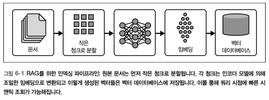
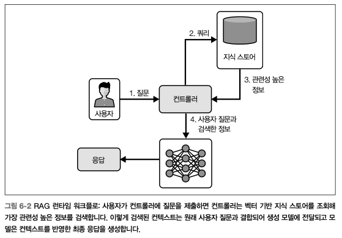
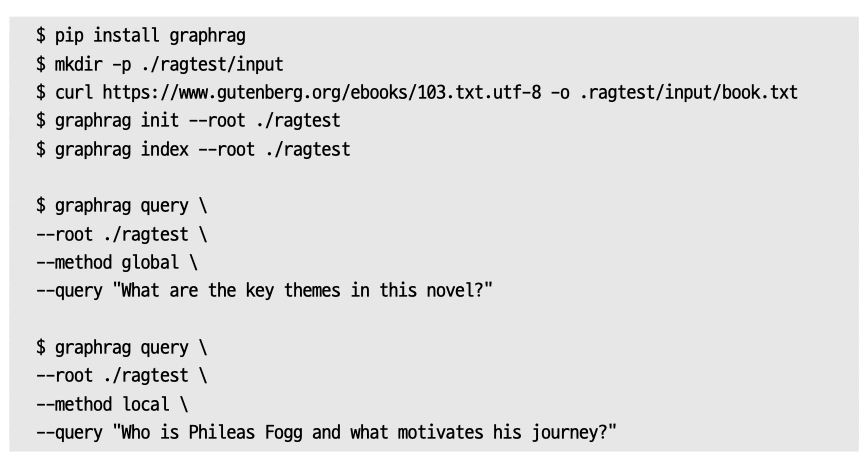
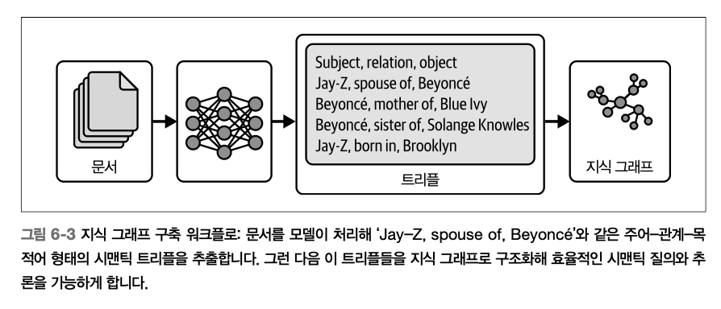
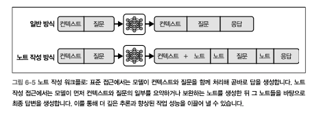

# Ch6. 지식과 메모리

> **`목표`** 메모리 시스템이 컨텍스트 엔지니어링 파이프라인과 어떻게 통합되어 특정 목표와 환경에 잘 정렬된 견고하고 유능한 에이전트를 만들 수 있는지 이해하기!

# 개요

<aside>
🤔

**_모델의 가중치에 들어 있는 것 이상의 추가 정보를 알기 위해서는?_**

1. 지식 (주로 RAG로 구현) : 기술 스펙, 정책 문서, 상품 카탈로그, 고객/시스템 로그 같은 사실, 도메인 특화 콘텐츠를 생성 시점에 끌어와 에이전트가 즉각적인 대화를 넘어 검증 가능한 정보를 **알도록** 만든다 → **모델 자체의 가중치와 편향에 저장된 정보를 보완**
2. 메모리 : 에이전트 자신의 히스토리를 포착하는 과거의 사용자 대화, 도구 출력, 상태 업데이트 등이 이에 해당 → **여러 턴과 세션에 걸쳐 연속성 유지 및 과거 상호작용 이력을 활용해 의사결정 가능**

→ 서로 상호 보완적 관계에 있으며, 구별되는 방식임

</aside>

### _In Context Engineering,_

오케스트레이션이 컨텍스트 엔지니어링을 최고의 결과를 얻기 위해 모델의 컨텍스트 윈도에 들어갈 모든 입력을 동적으로 선택, 구조화, 조합하는 기법이라면, 메모리는 컨텍스트 엔지니어링을 가능하게 하는 기반임

- 메모리 = 지식이 저장되는 장소
- 컨텍스트 엔지니어링 = 그 지식을 활용해 지능적인 행동을 이끌어 내는 방법

## LangGraph

> 애플리케이션을 노드와 엣지로 이루어진 방향 그래프로 정의하고, 개발자가 복잡한 다단계 프로세스를 선언적으로 모델링할 수 있도록 제공하는 프레임워크

- **`노드`** 파운데이션 모델 호출, 메모리 업데이트, 도구 호출 등의 순수 함수
- **`엣지`** 제어 흐름 전이

[특징]

- runtime에 그래프 전체를 통과하는 애플리케이션 상태를 TypeDict와 같은 타입 명시로 검증
- 순환과 조건 분기를 기본 지원 (루프, 재시도, 동적 의사결정 경로 등 추가 구현 필요X)
- 결과 스트리밍, 체크포인팅 내장 → 중단 지점부터 재시작 가능

### 에이전트 메모리에 적용하면?

- **`노드`** 롤링 컨텍스트 윈도, 키워드 추출, 시맨틱 검색 등의 메모리 메커니즘
- **`엣지`** 메모리 업데이트가 LLM 호출의 순서를 정리

[특징]

- 메모리 로직을 모듈화하고 테스트 가능하도록 유지함
- 에이전트가 항상 적절한 시점에 올바른 컨텍스트를 주입받도록 함
- 상태 및 메모리 내용을 체크포인팅 & 재개할 수 있으므로 에이전트의 연속성 유지
  - 실패 시 동일한 그래프 프레임워크 내에서 복구 가능

# 메모리 기본 사용법

\*_단순하지만 넓은 범위의 사례에 적용 가능한 case_

## Context Window 관리

> 파운데이션 모델의 rolling context window에 의존하는 방법

- Context Window란?
  - 한 번의 호출에서 파운데이션 모델에 입력으로 전달되는 정보
  - **_Context_** = 해당 요청에서의 작업 메모리에 해당
- **컨텍스트 길이(context length)** : 파운데이션 모델이 입력 1회 에 대해 주의를 기울일 수 있는 최대 토큰 수
  - 토큰 1개 = 평균 약 3/4 단어 (≈ 약 4글자)
  - e.g. 1,000토큰 = 약 750개 영어 단어
  - 대부분의 모델은 약 4,000토큰 (≈ 3000단어, 약 12페이지) ~ 8,000토큰 (≈ 6,000단어, 약 24페이지) 한계를 거쳐 발전함
  - GPT-5, Claude 3.7 Sonet - 최대 272,000 토큰 / Gemini 2.5 - 최대 100만 토큰까지 제공
- **Context Window는 개발자가 얼마나 효과적으로 쓰느냐가 매우 중요한 자원임**
  - 윈도 하나에 담을 수 있는 정보를 제어해야 함 → 제한된 토큰 예산을 어떻게 배분하는지가 중요
- 가장 단순한 방식 - 현재 질문 + 현재 세션에서의 모든 이전 상호작용을 포함
  - _Rolling Context Window_
  - 윈도가 가득 차면 가장 오래된 컨텍스트가 제거되며 가장 최근 컨텍스트로 대체됨 **(FIFO)**
  - 👍🏻 구현이 쉽고 복잡도가 낮으며 많은 사용 사례에서 잘 작동함
  - 👎🏻 정보의 중요도나 관련성에 무관하게 오래되면 정보가 사라짐
- 파운데이션 모델에서는 긴 프롬프트에서 가장 관련성 높은 컨텍스트를 강조하고 프롬프트의 뒤쪽에 가까이 배치할수록 사용될 가능성이 높아짐

## Full-Text Search

> **_#키워드 중심의 접근_**
>
> 대규모 검색 및 검색 증강 시스템의 기반 ⇒ 파운데이션 모델을 사용하는 에이전트에 과거 컨텍스트 주입을 정밀하고 견고하게 접근함

- **_inverted index_**
  1. 모든 텍스트를 전처리하면서 tokenization, 정규화(소문자 변환, stemming), stop-word 제거 수행
  2. 각 용어를 해당 용어가 등장하는 메시지 청크나 문서 목록에 매핑
- 저장된 모든 메시지를 스캔하지 않고도 매우 빠른 조회 가능
- 쿼리 키워드를 포함하는 구절만 정확히 가져오기 위해 해당 용어의 posting list를 따라가기만 하면 됨
- **`BM25 scoring 함수`**
  - 각 구절을 아래 조건에 따라 가중하는 방식
    1. 용어 빈도 : 쿼리 용어가 얼마나 자주 등장하는가
    2. 역문서 빈도 : 코퍼스 전체에서 해당 용어가 얼마나 희귀한가
    3. 문서 길이 정규화 : 너무 길거나 짧은 청크에 패널티를 주는 요소
  - 상위 K개 후보 구절 목록을 **점수 순으로 정렬**해 반환하면, 모델이 컨텍스트 길이를 소진하지 않고도 가장 관련성 높은 과거 컨텍스트를 가져올 수 있음
  - 즉, 상위로 순위가 매겨진 구절들을 프롬프트에 직접 주입하면 모든 과거 메시지를 전달하지 않고도 모델이 핵심 과거 컨텍스트 확보 및 한도 내에 머무르게 할 수 있음

# 시맨틱 메모리와 벡터 스토어

> _시맨틱 메모리란? 일반적인 지식, 개념, 과거 경험을 저장하고 검색하는 장기 메모리의 한 유형_

→ 이를 구현하는 대표적인 방법이 **벡터 데이터베이스**를 사용하는 것

- 대규모 환경에서 빠른 인덱싱과 검색이 가능
- 에이전틱 시스템에서는 더욱 깊이 있고 관련성 높은 방식으로 쿼리를 이해하고 응답할 수 있게 함

## Semantic Search

> 쿼리 뒤에 있는 컨텍스트와 의도를 이해하는 것을 목표로, 정확한 문자열 일치보다는 **단어와 구의 ‘의미’**에 초점을 맞추어 더 정확하고 의미 있는 검색 결과를 제공

- **임베딩** : 대규모 텍스트 코퍼스에서의 사용 맥락을 바탕으로 단어의 의미를 포착한 벡터 표현
  - 대량의 텍스트 → 조밀한 수치 표현으로 projection **_by 파운데이션 모델이나 기타 자연어 처리(NLP) 기법_**
  - 저장/검색에 유용한 풍부한 표현 생성 가능
  - 대표적인 임베딩 모델 - Word2Vec, GloVe, BERT
- 정확히 같은 키워드를 공유하지 않는 문서 전반에서 의미적으로 관련된 정보를 검색하는 측면에서 에이전틱 시스템 내부 메모리의 성능을 향상시키는 데 유용함

## Vector Store

- _임베딩 모델을 통해 벡터 표현으로 인코딩한 정보는 어디에 저장될까?_
  - **벡터 데이터베이스**가 이 역할을 하며, 고차원 벡터 표현을 효율적으로 다루도록 설계되어 있음
- 대표적인 Vector Store
  - VectorDB, https://ai.meta.com/tools/faiss/, https://github.com/spotify/annoy
  - **빠른 유사도 검색**을 위해 설계되어 있으며, 주어진 쿼리 임베딩과 시맨틱하게 비슷한 임베딩을 빠르게 찾아낼 수 있음
  - 효율적인 검색 경로를 마련하는 기반이 됨
- 벡터 스토어에서 가장 관련성 높은 임베딩을 찾아오면 → 에이전트는 저장된 시맨틱 메모리에 접근 → 정보에 기반한 컨텍스트에 맞는 응답 제공

## RAG (검색 증강 생성)

> _Retrieval-Augmented Generation (검색 기반 기법 + 생성 모델의 장점을 결합)_

- 검색 메커니즘을 파운데이션 모델과 통합함으로써 에이전틱 시스템이 더 풍부한 컨텍스트를 바탕으로 정보를 생성하고 애플리케이션의 성능을 향상시킴
- 외부 지식을 활용해 생성 과정에 통합
  - 특히 도메인, 회사 고유의 정보나 정책을 반영해 출력 결과에 영향을 주는 데 매우 유용함
- 주요 Flow
  [Indexing]
  
  1. 시스템이 질문에 답하는 데 도움이 될 수 있는 문서 집합 준비
  2. 문서를 더 작은 청크로 분할 (긴 리소스 대신 작은 관련 부분만 있으면 된다는 아이디어)
  3. 청크들을 인코더 모델로 임베딩
  4. VectorDB에 인덱싱
     [Retrieval]
     
  - 시스템이 대규모 문서 코퍼스나 임베딩 Vector Store에서 주어진 쿼리, 컨텍스트에 관련된 정보 조각을 탐색
  - 효율적인 검색 메커니즘에 의존해 관련 정보를 빠르게 식별하고 추출
  - 생성 단계에서 검색된 정보는 생성 파운데이션 모델로 전달 → 모델은 이 컨텍스트를 활용해 일관되고 상황에 맞는 응답 생성

## Semantic Experience Memory

시맨틱 경험 메모리(Semantic Experience Memory)는 다음 두 가지 문제를 완화한다.

1. 에이전트가 매 세션을 ‘백지 상태’에서 시작
2. 장기 실행되거나 복잡한 작업의 컨텍스트가 점차 컨텍스트 윈도 밖으로 밀려나는 현상

- 컨텍스크 윈도의 일부는 시맨틱 경험 메모리에서 검색된 최적 일치 결과들을 위해 예약되고 나머지 공간은 시스템 메시지, 최신 사용자 입력, 가장 최근 상호작용에 할당됨
- 이를 통해 축적된 경험을 바탕으로 응답과 행동을 조정, 더욱 적응적이고 개인화된 행동이 가능

# 그**래프** RAG

> 그래프 기반 데이터 구조를 도입해 검색 과정을 향상시키는 고급 RAG 확장 기법

- 정보 조각들 사이의 복잡한 상호 관계와 의존성을 관리 및 활용 가능 ⇒ 생성되는 컨텐츠의 풍부함과 정확성을 크게 높임
- Vector RAG 시스템의 한계가 드러나는 상황
  1. 답이 여러 문서에 흩어져 있는 정보를 연결해야 할 때
  2. 쿼리가 데이터셋 전체에 걸친 상위 수준의 의미론적 주제를 요약하기를 요구할 때
  3. 데이터셋이 크고 정리가 덜 되었거나 개별적인 사실이 아닌 서사형 구조로 구성되어 있을 때
- 그래프 RAG은 데이터셋으로부터 엔티티와 관계로 구성된 지식 그래프를 구축함으로써 multi-hop 추론, 관계 체이닝, 구조화된 요약을 가능하게 하여 위 문제를 해결함
- `검색 단계` | 관련 문서나 스니펫 뿐만 아니라 데이터 안의 복잡한 관계와 컨텍스트를 표현하는 그래프에서 노드와 엣지를 분석하고 검색

## 구성 요소

1. **지식 그래프** : 데이터를 그래프 형식으로 저장해 엔티티(노드)와 이들의 관계(엣지)를 명시적으로 정의 → 서로 연결된 데이터를 관리하고 여러 hop이나 다중 관계를 포함하는 복잡한 쿼리를 처리하는 데 매우 효율적
2. **검색 시스템** : 그래프DB를 효율적으로 질의해 입력 쿼리나 컨텍스트와 가장 관련성이 높은 SubGraph, 노드 클러스터를 추출하도록 설계됨
3. **생성 모델** : 그래프 형태로 검색된 관련 데이터를 기반으로, 정보를 종합해 일관되고 컨텍스트 풍부한 응답 생성

## 지식 그래프 구축하기

> _지식 그래프는 그래프RAG 시스템을 포함한 지능형 시스템의 역량을 강화하는 구**조화되고 시맨틱하게 풍부한 정보를 제공**하는 데 핵심적인 역할을 한다 → 그래프RAG의 성능을 좌우_

<aside>

#### 구현 라이브러리

- neo4j-graphrag-python
  - https://github.com/neo4j/neo4j-graphrag-python
  - https://www.ncloud-forums.com/topic/572/
  - https://wikidocs.net/291312
- Neo4j 연결을 설정하고 Embedder, Retriever를 정의하기만 하면 완전한 그래프RAG 기능을 활용할 수 있음
  - 교육, 로컬 테스트용 - https://github.com/gusye1234/nano-graphrag
- https://github.com/microsoft/graphrag
  - 문서 컬렉션을 인덱싱하고 질의하기 위한 Command Line 워크플로 제공
    

</aside>

- 큰 규모의 데이터 위에서 추론해야 하는데 표준 청킹과 벡터 검색 기반 RAG이 한계라면, 그래프RAG이 더 비싸고 복잡함에도 더 나은 결정일 수 있음!

### 지식 그래프를 구성하는 방법론

1. 데이터 수집
   - 폭넓은 지식을 포괄하기 위해 소스의 다양성과 품질을 확보하는 것이 중요
   - 에이전트 행동에 영향을 주는 핵심 정보
   - e.g. 데이터베이스, 텍스트 문서, 사용자 생성 콘텐츠, 조직의 정책, 문서 모음 등
2. 데이터 전처리
   - 관련성이 없거나 중복된 정보 제거
   - 오류 수정 및 데이터 형식 표준화
   - → 데이터의 노이즈 줄임으로써 이후 엔티티 추출 과정의 정확도를 높임
3. 엔티티 인식 및 추출
   - 핵심 요소(엔티티=노드)를 식별하는 단계
   - NER(Named Entity Recognization) 등의 기법이 사용되며, 대규모 데이터셋으로 학습된 머신러닝 모델을 활용해 엔티티를 정확하게 인식 및 분류할 수 있음
4. 관계 추출
   - 데이터 파싱 → 엔티티를 연결하는 술어(관계어) 추출 → 그래프의 엣지로 구성
   - 비정형 데이터에서는 관계 추출이 까다롭지만, 파운데이션 모델의 성능이 지속적으로 개선되면서 효과적으로 처리할 수 있게 됨
5. Ontology 설계
   - 지식 그래프 내의 범주와 관계를 정의 (그래프의 뼈대 역할)
   - 엔티티 유형과 이들 사이에 가능한 관계 유형을 포괄하는 **스키마**를 정의 → 효과적인 질의와 데이터 검색 지원
6. 그래프 채우기(graph population)
   - 엔티티와 관계를 그래프에 채워 넣는 단계
   - Ontology 구조에 따라 그래프DB에 노드와 엣지를 생성하는 작업
   - _대표적인 그래프DB - Neo4j, OrientDB, Amazon Neptune_
     - Neo4j는 native graph storage와 index-free ajacency를 제공해 그래프가 수십억 개의 노드와 관계로 확장되더라도 거의 일정한 수준의 traversal 성능을 보장 (Enterprise 환경에 적합)
7. 통합 및 검증
   - 기존 시스템과 통합 → 중복 Entity Resolution
   - 정확성, 유용성 검증 — 그래프가 실제 지식 도메인을 정확하게 반영하는가
   - 사용자 테스트, 자동화된 점검을 통해 검증 ⇒ 완전성, 활용 가능성 보장
8. 유지보수와 업데이트
   - 최신 상태 유지를 위해 정기적인 업데이트와 유지보수 필요
   - 새로운 데이터 추가 및 기존 정보 갱신을 통해 새로운 유형의 엔티티나 관계가 등장함에 따라 ontology를 개선하는 작업
   - 자동화, 머신러닝 모델 활용

> 일반적으로 **RDF(Resource Description Framwork) 데이터 모델을 기반으로 Semantic Triples을 추출하는 방식**으로 수행된다

- Semantic Triple = 주어-술어-목적어(subject-predicate-object) 표현으로 이루어짐
- 그래프RAG은 이러한 트리플 추출에 상당히 뛰어난 성능을 보임

## 동적 지식 그래프

- 실시간 애플리케이션에서 지식을 관리하고 활용하는 방식에서 큰 진전을 의미
  - 동적 실시간 정보 처리는 실시간 데이터를 통합할 수 있는 동적 지식 그래프 덕분에 큰 폭으로 향상됨
  - 뉴스, 소셜 미디어, 실시간 모니터링 시스템 등의 환경에 유리
- [특징] 적응형 학습
  - 주기적인 재학습, 수동 업데이트 없이도 새로운 데이터로부터 스스로를 계속 갱신함
  - 의학, 기술, 금융 등 빠르게 변화하는 분야에서 중요
- [한계점] 유지보수의 복잡성, 자원 집약성, 보안 및 프라이버시 우려, 의존성과 과도한 신뢰
  - → 자동화 도구와 프로레스를 활용한 검증 메커니즘 구축, 암호화/접근 제어/비식별화 기법 등 도입, 사람의 검토 의무화 등이 대안으로 제시됨

- 최근에는 모델 아키텍처의 발전으로 컨텍스트 윈도 길이 자체가 늘어나면서 한 번에 전체 문서를 기억하고 처리할 수 있게 됨
  - Index-free RAG 시스템은 GPT-4.1과 같은 Long Context Model 안에 자체 검색 로직을 내장해 외부 벡터 스토어나 역인덱스 없이도 내부적으로 청킹과 관련도 점수를 계산할 수 있음
  - 지식을 이러한 확장된 컨텍스트 안에 직접 주입하면 파이프라인이 단순해질 수 있음
- 더 큰 모델 / 컨텍스트 윈도 / 연산이 정교한 텍스트 검색과 벡터 DB 기반의 시맨틱 검색을 구시대의 것으로 만들 수 있지만, 여전히 하이브리드 아키텍처가 유의미한 선상에 있음

## 노트 작성

> 파운데이션 모델이 질문에 바로 답하려 하지 않고 입력 컨텍스트에 대한 ‘노트’를 의도적으로 생성하도록 프롬프트하는 기법

- 질문이 주어지기 전에 수행되며, 이후 현재 작업을 처리할 때 노트+컨텍스트를 섞어서 함께 사용함
- 여러 추론 및 평가 작업에서 좋은 성능을 보임 **→ 표준 추론 워크플로를 강화시킴**

