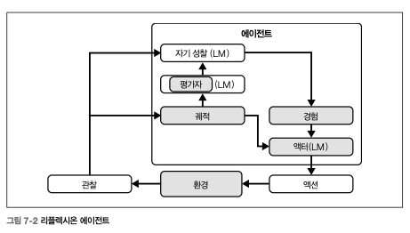
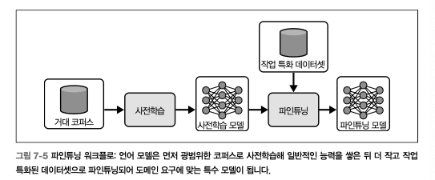
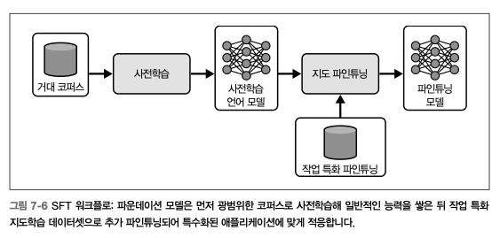
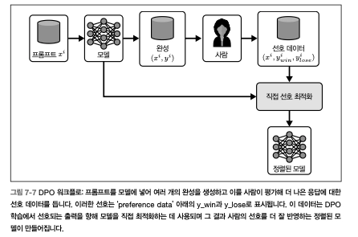
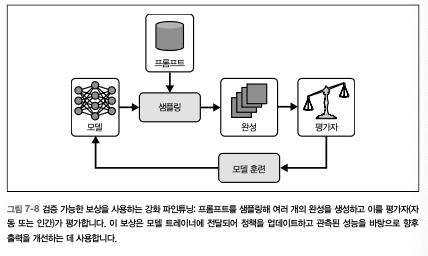

# Ch7. 에이전틱 시스템의 학습

> **에이전틱 시스템에 학습을 적용하고 통합하는 다양한 기법**

- 학습 = 환경과의 상호작용을 통해 에이전틱 시스템의 성능을 향상시키는 것
  - 변화하는 조건에 적응하고 자신의 전략을 정교화하여 전반적인 효율을 향상시키게 함
- 학습 기능은 에이전트 설계의 필수 구성 요소는 아니며, 추가적인 <설계-평가-모니터링>이 필요하여 애플리케이션 마다 투자 가치가 달라진다

# 비모수적 학습

> 관련 모델의 파라미터를 바꾸지 않고도 자동으로 성능을 변경하고 개선하는 기법

## 예시 학습 (example learning)

- 에이전트가 작업을 수행하는 동안 품질에 대한 측정값 제공 → 이 예시들로 향후 성능 개선
- 컨텍스트 내 학습을 위한 **_few-shot_** 예제로 사용되는 것
  1. **고정 few-shot** : 정적인 예제 집합을 프롬프트에 하드코딩 & 변경X
  2. **동적 few-shot** : 런타임에 메모리에서 가장 관련성이 높은 예제를 검색 → 더 적응적이고 컨텍스트 적합한 작업 프롬프트 구성
- 각 상호작용의 컨텍스트, 수행한 액션, 결과, 피드백 등을 저장하는 **_메모리 뱅크_** 를 구축하는 것이 일반적 (\*마치 인간의 기억처럼 동작)
  - 비슷한 상황에서 더 나은 결정을 내릴 수 있도록 참조 가능한 데이터 포인트를 제공함
  - 이 방식으로 에이전트의 성능 향상에 활용할 수 있는 지식 저장소 구축
  - 과거에 무엇이 잘 되었는지 or 잘 되지 않았는지를 기준으로 접근 방식 조정 & 높은 유연성 제공
- 즉, 성공적인 예제를 영속 저장소에 보관 → 다시 검색하여 프롬프트의 예제로 제공하면 성능이 크게 향상되는 것을 경험할 수 있음
- 성공적인 예제가 점점 많아지면, 유형별 / 텍스트 기반 / 의미론적 검색 등을 사용해 관련성 높은 성공 사례를 검색하게 하는 등 고도화 가능

## Reflexion

> 에이전트에 언어 기반 간단한 자기 비판 습관을 부여하여, 각 시도의 실패 뒤에 잘못된 부분 - 개선사항에 대한 짧은 성찰을 작성하는 방식

- 시간이 지나면 이 성찰 내용은 **메모리 버퍼**에 저장됨 (에이전트의 과거 행동, 관찰이 저장되는 곳과 동일)
- Reflexion Loop 동작 흐름
  
  1. 액션 시퀀스 수정 : 프롬프트 기반 계획을 사용해 환경과 상호작용
  2. 시도 내역 로그에 기록 : 수행한 모든 단계를 영속 저장소의 로그에 추가
     - 단계 종류 - 실행한 액션, 받은 관찰, 성공/실패 여부
     - 영속 저장소 유형 - JSON 파일, DB 테이블
  3. 성찰 생성 (reflection prompt 구성)
     - 성찰에 포함되는 내용 - 최근 상호작용 기록, 어떤 전략을 놓쳤는지, 다음 시도에는 무엇을 다르게 해야 하는지 (템플릿 형태로 구성 가능)
  4. 메모리 업데이트
     - `update_memory()` : 시도 로그를 읽고 → 성찰 프롬프트에 대해 LLM 호출 → 생성된 새 성찰을 에이전트의 메모리 구조에 다시 저장
  5. 다음 실행에 성찰 주입
     - 에이전트가 동일/유사 작업을 재시도할 때, 가장 최근 성찰들을 프롬프트 앞부분에 추가
     - 모델이 개선된 전략을 따르도록 유도하기 위함
- 특징
  - 매우 가벼움 ← 모델의 가중치에는 손대지 않고, 파운데이션 모델 자체를 코치로 사용하는 방식
  - 숫자 피드백(e.g. 성공 flag), 자유 형식의 코멘트 모두 수용
  - 코드 디버깅~다단계 추론 등 다양한 작업에서 성능을 끌어올릴 수 있음
- 모델을 자기 자신의 코치로 바꾸기 위해 3가지 부분으로 구성
  1. **간단한 프레임 설정 지침**
  2. **Instruction:**
  3. **Action/Observation 대화 내역**
     - 모든 검색, 클릭, 내부 생각, STATUS: FAIL로 끝남 등 모든 구체적인 정보를 진단 근거로 활용

## 경험 학습(ExpeL)

> 에이전트가 자신의 경험을 데이터베이스에 계속 모으는 것은 동일하나, 그 경험 전반에 걸쳐 인사이트를 집계해 미래의 정책을 개선하는 추가 단계 적용

- 과거 실패를 돌아보고 향후 비슷한 상황에서 성능을 개선하는 새로운 기법을 개발하고자 할 때 유용
- 경험 저장소로부터 동적으로 인사이트 추출 - 승격 - 강등하는 과정을 수행
  - **모델은 성공/실패 경험 사례로부터 인사이트를 추출하고 이를 시간에 따라 승격/강등하면서 간결한 고수준 인사이트 목록(일반적 고수준 비판 + 규칙 세트)을 증류함**
    - 이 증류된 인사이트는 향후 의사결정에 영향을 주며, 에이전트가 시간이 지남에 따라 여러 작업에서 성능을 개선할 수 있게 함
  - 새로 생성된 인사이트는 다른 규칙들과의 상대적 중요도에 따라 정기적으로 재평가 & 조정
    > _Prompt> 과거의 실패한 실험과 성공한 실험을 비교하고 기존 규칙 목록과 대조함으로써 다음과 같은 작업을 수행할 수 있습니다. ADD, EDIT, REMOVE, AGREE입니다. 이렇게 해서 새로운 규칙 목록이 실패한 실험이나 제안된 사고 방식에 대한 일반적이고 고수준의 비판이 되도록 하세요. 그러면 향후 다른 질문에서 비슷한 실패를 피하는 데 사용할 수 있습니다. 특히 더 나은 사고Thought와 액션Action을 수행하는 방법을 비판하는 데 중점을 두세요. (출처: ExpeL, https://oreil.ly/uTz6X)_
  - 경험에서 파생되는 규칙은 기존 규칙을 정기적으로 재평가하고 개선하며 조정됨
    > _Prompt>_ 사용 가능한 작업은 다음과 같습니다. AGREE(기존 규칙이 해당 작업에 매우 관련 있는 경우), REMOVE (기존 규칙 이 다른 규칙과 모순되거나 유사/중복되는 경우), EDIT(기존 규칙이 충분히 일반적이지 않거나 개선될 수 있는 경우), ADD (기존 규칙과 구별되며 다른 작업에도 관련 있는 새로운 규칙을 추가하는 경우). 각 작업은 아래 형식을 엄격히 따라야 합니다(편집되지도, 동의되지도, 제거되지도 않은 기존 규칙은 그대로 복사된 것으로 간주합니다).
  ```sql
  AGREE <EXISTING RULE NUMBER>: <EXISTING RULE>
  REMOVE <EXISTING RULE NUMBER>: <EXISTING RULE>
  EDIT <EXISTING RULE NUMBER>: <NEW MODIFIED RULE>
  ADD <NEW RULE NUMBER>: <NEW RULE>
  ```

# 모수적 학습

> 파운데이션 모델의 파라미터를 명시적으로 조정하며 학습하거나 파인튜닝하는 기법

- 비모수적 학습에서는 예제와 인사이트를 프롬프트에 추가하는 것부터 리소스를 수반하므로, 충분한 수의 예제가 확보되었을 때 에이전틱 시스템이 수행하는 작업의 성능 개선을 위해 모델 파인튜닝을 고민해볼 수 있다
- **_파인튜닝이란?_** 사전학습된 모델의 파라미터를 소폭 조정해 새로운 작업이나 데이터셋에 적응시키는 일반적인 접근 방식

## 대형 파운데이션 모델 파인튜닝

- GPT-5, Claude Opus, Gemini 등의 모델을 사용하는 방식 — 이미 방대한 범용 데이터셋으로 post-training 과정을 거쳐 어휘적, 개념적 지식을 대량으로 내재하고 있음
- 에이전틱 시스템 구축 초기 단계에 빠르고 쉽게 뛰어난 성능으로 구현 가능
- **_이 모델을 파인튜닝 한다면?_**
  
  - 특정 작업이나 도메인에 맞게 **파라미터를 표적 조정**하는 것을 의미
  - 모델의 방대한 지식 + 애플리케이션 특수성을 결합해 효율을 높일 수 있음
- **_파인튜닝 도입 Best / Worst Practice_**
  👍🏻
  1. **도메인 특화가 중요한 경우** - 지도 파인튜닝(SFT), 직접 선호 최적화(DPO)를 통해 전문성 고정 가능
  2. **일관된 톤과 형식이 중요한 경우** - 복잡한 프롬프트 엔지니어링 없이 정교한 템플릿에 따라 안정적으로 올바른 구조 생성 가능
  3. **도구 및 API 호출이 매우 정확해야 하는 경우** - 함수 호출 파인튜닝으로 miscall을 크게 줄이고, 엣지케이스를 우아하게 처리할 수 있음
  4. **충분한 고품질 데이터와 예산이 있는 경우** - 수백~수천 개의 선별된 예제, RFT를 위한 전문가 평가자, GPU 시간 등의 리소스가 충분한 경우에 적합
  5. **재학습 주기를 감당할 수 있는 경우** - 버전 관리, 재학습 일정, 호환성 검증 고려
     👎🏻
  6. **빠른 프로토타이핑 단계 or 사용량이 적은 경우** - 처음에는 비모수적 학습/프롬프트 엔지니어링 → 그 다음 활용 사례와 데이터 파이프라인이 충분히 안정되었을 때 파인튜닝을 고려하는 게 좋음
  7. **모델의 진화 속도가 투자 대비 너무 빠른 경우** - 더 나은 베이스 모델은 계속해서 출시되므로 파인튜닝에 대한 투자와 베이스 모델의 진화 속도를 함께 고려해야 함

     → 다음 세개 베이스 모델의 등장에 대한 재학습 / 마이그레이션 계획을 항상 분명히 가지고 있어야 함

  8. **자원이 제약된 경우** - (1)GPU 가용성이 낮거나 (2)라벨링 비용이 비싸거나 (3)추론 속도가 특히 중요한 경우, RAG 등의 비모수적 전략 고려

- 판단 기준
  **⇒ 파인튜닝은 성능 요구사항, 데이터 가용성, 운영 역량이 모두 맞아떨어지는 경우에만 수행해야 한다**
  - _기존 사전학습, 인스트럭션 튜닝된 모델이 프롬프트 엔지니어링/비모수적 학습/경량 적응 기법만으로 요구사항 충족할 수 있는지 검토 후에 확신이 서지 않는다면 최대한 파인튜닝 안 하는 쪽이 나음_
  - 특정 도메인에 미묘한 패턴까지 내재화되려면, 대표성 있는 예제를 충분히 봐야 하며 데이터셋을 수집/라벨링/검증하는 작업에서 시간이 많이 들고 주의 깊게 처리하지 않으면 편향을 초래할 수 있음
- 언어 모델 파인튜닝의 주요 방법
  | **방법** | **작동 방식** | **적합한 용도** |
  | --- | --- | --- |
  | 지도 파인튜닝 (SFT) | (프롬프트, 이상적인 응답) 쌍을 ‘정답(ground truth)’ 예제로 제공한다. OpenAI 파인튜닝 API를 호출해 모델 가중치를 조정한다. | 분류, 구조화된 출력, 지침 수행 실패 보정 |
  | 비전 파인튜닝 | 이미지-레이블 쌍을 제공해 시각 입력에 대한 지도학습을 수행한다. 이를 통해 이미지 이해와 멀티모달 지침 수행 능력을 향상시킨다. | 이미지 분류, 멀티모달 지침 수행 안정성 |
  | 직접 선호 최적화 (DPO) | 각 프롬프트에 대해 ‘좋은’ 응답과 ‘나쁜’ 응답을 함께 제공하고 어느 쪽이 더 바람직한지 표시한다. 모델은 더 높은 품질의 출력을 선호하도록 학습한다. | 요약 집중도 조정, 톤/스타일 제어 |
  | 강화 파인튜닝 (RFT) | 후보 출력들을 생성하고 전문가 평가자가 점수를 매긴다. 그런 다음 정책 경사(policy gradient) 스타일 업데이트를 사용해 고득점 추론 과정을 강화한다. | 복잡한 추론, 도메인 특화 작업(법률, 의료 등) |

## 소형 모델

- 더 적은 자원을 사용하는 대안으로 계산 자원이 제한되어 있거나 응답 시간이 중요한 많은 애플리케이션에 적합
- **_#경량\_아키텍처 #단순성_**
  - 비교적 파라미터 수가 적고 아키텍처가 단순함
  - 구조가 가볍고 더 빠르게 적응 및 다양한 학습 설정을 실험해볼 수 있어, 특정 작업에 정교하게 파인튜닝되면 매우 효과적인 방식
  - 모델의 의사결정 과정을 분석하고 출력에 영향을 미치는 요인을 이해하기 더 쉬움
  - **설명 가능성**이 필수적인 분야에 적합 (e.g. 금융, 헬스케어, 규제 도메인)
- 애자일 개발 워크플로를 가능하게 함
  - 관련성 유지를 위해 새로운 데이터로 자주 업데이트 되어야 하는 **연속 학습, 점진적 학습**에 이상적
- 임베디드 디바이스, 모바일 애플리케이션, 사물인터넷 네트워크 등의 실시간 시스템에 효과적으로 배포 가능
  - **소형 모델의 축소된 계산 풋프린트** ⇒ 낮은 지연시간이 필수적인 상황에서 전체 시스템의 응답성을 해치지 않으며 효율적인 처리가 가능함
- 비용과 접근성 측면의 용이함
  - 오픈 소스로 제공되는 경우가 많음 (e.g. 라마, 파이)
- 적합한 케이스
  1. 특정하고 좁게 정의된 작업 ***(*대형 모델에 능가하는 결과 달성 가능)\***
     - 컨텍스트에 특화, 모든 용량을 집중, 데이터 경계가 명확하고 잘 정의된 경우
     - 데이터가 제한된 애플리케이션에서 특히 가치가 있음
     - 과적합 없이 효과적으로 작동할 수 있도록 커스터마이징 가능
  2. 잦은 업데이트, 재학습이 필요한 환경
     - 소셜 미디어 감성 분석, 실시간 사기 탐지, 개인화 추천 등 데이터 환경이 빠르게 변하는 시나리오
     - 높은 재학습 비용 없이도 자주 업데이트 가능
  3. 데이터 프라이버시 이슈로 분산된 데이터 소스 전반에서 학습해야 하는 연합 학습 환경
     - 엣지 디바이스에서 효율적으로 파인튜닝함으로써 프라이버시를 보존하는 AI 솔루션 구현 가능
- https://hai.stanford.edu/ai-index/2025-ai-index-report
  - 최근 떠오르는 모델 - DeepSeek-v3, Llama 3.1 Instruct Turbo (70B), Qwen2.5 Turbo (72B), Palmyra

## SFT: 지도 파인튜닝

> _Supervised fine-tuning_
>
> 선별된 입력/출력 예제를 통해 행동을 정밀하게 조정할 수 있게 해주는 기초적인 기법

- 에이전트에 ‘어떻게 응답해야 하는지’를 명시적인 예제로 보여줌으로써 에이전트의 행동을 정밀하게 조정하는 기본 접근 방식
  - e.g. 에이전트에 외부 API를 언제, 어떻게 호출해야 하는지 정확히 가르치기 — ‘함수 호출’을 파인튜닝해 에이전트가 도구 호출을 올바르게 포맷하는 것뿐 아니라 호출 자체가 필요한지 여부까지 추론하도록 만드는 것
  - 프롬프트 엔지니어링만으로 부족한 경우, 더 높은 제어력과 일관성 제공
  - 에이전트가 도구 사용에 신뢰성 있게 의존해야 하는 경우 (e.g. 캘린더 항목 조회, 명령 실행, 데이터베이스 쿼리)
  - 에이전트가 함수 호출 여부를 선택하고 인자를 정확히 채우고 결과를 적절히 래핑해야 하는 구조화된 예제를 모델에 제시
- 워크플로
  
  - 주의 깊게 선별된 (프롬프트, 응답) 쌍 → 모델이 원하는 출력 스타일/구조/행동을 학습
  - 동일한 기술로 에이전트를 일관된 톤이나 구조화된 출력에 맞추거나, 도구 사용을 정밀하게 맞추는 데 활용
  - 파인튜닝된 에이전트가 잘 형식화되고 안전한 함수 호출만 생성하려면, 각 API/도구에 대한 명시적인 스키마를 정의하고 강제해야 함 = **에이전트가 따라야 할 계약(contract)**
    - _JSON Schema, Typescript/Zod 스키마 등의 machine-readable 형식으로 코드화 (Zod, Ajv, Pydantic 등의 라이브러리로 실행 전 검증)_
    - → 이를 기반으로 정확히 일치하는 구조화된 예제들이 파인튜닝 데이터셋을 구성하여 모델에 내재화할 수 있음
    - → 모델이 ‘무엇을 호출해야 하는지’ 뿐만 아니라, ‘JSON Payload를 정확히 어떻게 구성해야 하는지’까지 학습
  - 추가 데이터 큐레이션, 계산 자원, 유지 관리 등을 수반
- (예제) LoRA(Low-Rank Adaption) 어댑터를 사용하는 언어 모델 지도 파인튜닝의 최소 작동 패턴
  1. <think> / <tool_call> 구간에 특수 토큰 부착 → 모델이 자신의 생각와 API 액션을 쉽게 구분할 수 있도록 함
  2. LoRA를 사용해 특정 레이어만 효율적으로 적응시킴
  3. SFTTrainer로 올바른 (프롬프트, 응답) 쌍 데이터셋에 대해 모델 학습

## DPO: 직접 선호 최적화

> _Direct Preference Optimization_
>
> 순위가 매겨진 응답 쌍으로부터 학습해 더 나은 출력을 덜 좋은 출력보다 선호하도록 모델을 학습시키는 파인튜닝 기법

- 단순히 모델에 ‘정답’만을 그대로 따라 하도록 가르치는 SFT에 선호 학습을 도입해 출력이 사람의 품질 순위 판단에 더 가깝게 정렬되도록 함
- 단순히 예제를 복제하는 것이 아닌, 출력의 ‘품질’ 자체를 조정하는 데 특히 유용



## RLVR: 검증 기능 보상 강화 학습

> _Reinforcement Learning with Verifiable Rewards_
>
> 명시적이고 측정 가능한 보상 함수에 대한 정책 최적화를 도입한 것
> **→ 선호 학습 + 가치 기반 정책 최적화의 결합**

- 자동화 지표, 규칙 기반 검증기, 외부 스코어링 모델, 인간 평가자 등 구축할 수 있는 어떤 평가자와도 연결해 모델을 해당 보상에 직접 최적화할 수 있음
- 검증 가능한 평가 신호를 정의할 수 있는 대부분의 작업에 확장 가능하고 표적화된 개선 가능
- 정적인 선호 학습(e.g. 요약 품질, 도구 호출의 정확성, 지식 검색의 사실성, 안전 제약 준수 여부 최적화) → **일반적이고 확장 가능한 강화 학습 프레임워크**로 전환
- 순위가 매겨진 선호 데이터가 있거나 출력을 평가할 수 있는 신뢰 가능한 스코어링 함수를 구축할 수 있을 때 특히 효과적임
- 보상이 희소하거나 직접적인 인간 라벨링만으로는 대규모로 평가를 확보하기에 비용이 너무 큰 상황에서 지속적인 품질 향상이 필요한 시나리오에 이상적


