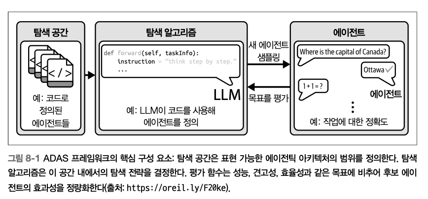

# Ch8. 단일 에이전트에서 멀티 에이전트로

- 모놀리식 → MSA로의 전환과 비슷한 설계 원칙
- 모듈 단위로 독립적인 검증/테스트/통합 및 재사용 가능한 더 작은 에이전트들로 시스템을 분리하기 위함

## 에이전트 개수의 결정 근거

- 가능한 단순한 접근으로 시작해서 성능을 개선할 필요가 있을 때만 복잡성을 추가하는 것이 좋음
- 결정 요인 - 작업 난이도, 도구 개수, 환경의 복잡성 등

### 단일 에이전트 시나리오

> 하나의 에이전트가 사용자에게 응답하기 전, 필요한 경우 정해진 제한 횟수까지 도구를 호출할 책임을 지는 방식 — 스스로 작업 중에 **언제 도구를 호출할지, 언제 답변을 제출할지** 결정

- 적합한 환경 - 난이도 ↓, 도구 개수 제한, 환경의 복잡성 ↓
  - 지연시간이 중요한 상황 \*_멀티 에이전트 시스템은 에이전트 간 여러 번의 상호작용을 수반하므로, 사용자 입장에서 지연시간이 늘어나게 됨_
  - 빠른 확장과 저비용이 요구되는 상황
  - 작업 범위가 제한적이고 성능 요구사항이 빡빡한 상황
- 매우 복잡하거나 다면적인 작업으로의 확장에는 한계가 있을 수 있음
  - **복잡성, 도구셋, 작업 조율 요구사항이 단일 에이전트가 감당할 수 있는 범위를 넘어설 때**만 멀티 에이전트 전환을 고려해도 괜찮음
  - 도구 집합이 늘어날수록 에이전트의 시스템 프롬프트에 모든 가능성을 설명해야 하므로, 혼란이나 최적 이하의 선택을 야기할 수 있음
  - 대부분의 경우에는 **도구와 책임의 개수가 늘어날 때** 핵심 병목이 생김

### 멀티 에이전트 시나리오

> 여러 에이전트가 공통 목표를 달성하기 위해 협력하는 방식 — 각 에이전트에 특정 역할이나 전문 분야를 할당해 시스템이 각 에이전트의 강점을 효과적으로 활용

- 적합한 환경 - 복잡한 작업, 다양한 도구 모음, 병렬 처리, 동적인 환경에 대한 적응력 요구
  - 작업에 여러 도메인에 걸친 전문성이 필요한 경우
  - 필요한 도구 수가 하나의 에이전트가 안정적으로 관리할 수 있는 범위를 넘어선 경우
- **전문화된 업무 부담**을 통해 에이전트는 작업이 명확히 정의된 측면에 집중 → 효율 향상, 가장 필요한 곳에 전문화된 도구를 적용하도록 보장
  - 역할과 책임의 분리
  - _Manager Coordination_
    - 완전 합의(full consensus) 과정에 따르는 오버헤드 없이 의사결정 간소화
  - 전문가 노드는 서로 독립적으로 작업을 처리하며 도구를 호출하고 응답
  - 병렬 처리를 통해 처리량을 높일 수 있음 (여러 전문가로 folk하는 개념)
- 적응성, 장애 발생에 대한 복원력, 시스템 탄력성 측면에서도 우수함
- 도전 과제 - 에이전트 간 조율의 복잡성, 정교한 통신, 동기화 메커니즘
  - 에이전트가 정렬 상태를 유지하고 중복 작업을 피하기 위해 자주 정보를 교환하는 과정을 수반하기 때문
  - 이러한 통신 오버헤드는 대규모 애플리케이션에서 시스템을 느리게 만들고 추가적인 리소스 부담을 유발할 수 있음

### 스웜(Swarm)

> 많은 수의 단순한 에이전트가 개별적으로는 지능이 거의 없지만, **국소적인 상호작용과 단순한 규칙**을 통해 **집단적으로 지능적인 창발적 행동**을 만들어내는 독특한 에이전틱 시스템 설계 방식

- 적합한 환경 - 중앙 집중식 제어가 비현실적이거나 바람직하지 않은 환경
  e.g.
  - 대규모 데이터 발견 작업, 여러 소스를 가로지르는 리서치, 분산 의사결정에 유용
  - 엣지 컴퓨팅, 센서 네트워크, 실시간 협업 시스템 등 정밀도나 중앙 통제보다 유연성, 견고성이 더 중요한 분야에서 점점 더 중요해지고 있음
- 멀티 에이전트 시스템과 달리, 탈중앙화와 자기 조직화를 강조
- 시스템 전체에 대한 전역적인 관점 없이 자신만의 로컬 정책이나 행동 규칙을 따름
- _그럼 상호작용은 어떻게?!_
  - 작은 업데이트도 broadcast
  - 이웃에 반응하고 공유된 신호에 기반해 적응
    → 변화하는 조건에 반복적인 국소 상호작용을 통해 적응하고 복잡한 문제를 해결하며 견고한 그룹 수준 행동을 보일 수 있음
    → 이러한 국소적인 행동의 누적이 전역적인 행동으로 자연스레 나타남
- 장점
  1. 확장성 - 최소한의 조율 오버헤드로 수백, 수천 개의 에이전트까지 확장 가능
  2. 견고성 - SPOF가 없음
  3. 유연성 - 실시간으로 동적/예측 불가능한 시나리오에 적응
  4. 분산 문제 해결 - 탐색, 모니터링, 합의 형성, 분산 검색 등은 **[Swarm Dynamics](https://swarmdynamics.ai/)**를 통해 효과적으로 해결 가능

## 에이전트 추가 원칙

1. 작업 분해
   - 복잡한 작업을 더 작고 관리 가능한 하위 작업으로 나눈다
   - 책임 분리, 효율성 증가, 개별 에이전트의 성능 향상
2. 전문화
   - 에이전트가 자신의 강점에 부합하는 역할을 맡도록 하여 시스템의 집합적 역량 극대화
   - 높은 정밀성, 빠른 작업 수행 속도, 복잡하고 다학제적인 작업 처리
3. 파시모니(Parsimony)
   - 원하는 기능과 성능을 달성하는 데 필요한 최소한의 에이전트만 추가한다
   - 시스템에 추가되는 모든 에이전트는 통신 오버헤드, 조율 복잡성, 리소스 요구를 더한다 ⇒ 각 에이전트의 역할을 신중히 평가하고 각 추가가 분명한 가치를 제공하도록 규올된 방식으로 할당 및 관리할 것을 강조
4. 조율
   - 에이전트 간 정렬 상태를 유지하고 조화롭게 동작하도록, 견고한 통신 프로토콜을 구축해 정보 공유를 효율적으로 하고 충돌 위험을 줄임
   - 충돌 해결 프로토콜의 구축 - 에이전트의 작업이나 리소스 요구가 겹치는 상황 대비
   - 동적인 시나리오에 효율적으로 대응 가능
5. 견고성
   - 이중화 - 다른 에이전트의 실패 시, 대신 역할을 수행할 수 있는 에이전트를 추가해 연속적인 운영을 보장하는 백업을 제공하는 것
   - 장애 허용, 탄력성
6. 효율성
   - 에이전트 추가에 대한 잠재적 복잡성과 리소스 요구 사이의 trade-off를 평가하는 기준

## 멀티 에이전트 조율

### 민주적 조율

> 시스템 내 모든 에이전트는 각자 동등한 의사결정 권한을 가지며, 행동과 솔루션에 대해 합의에 도달하는 것을 목표로 한다

- **`견고성`** 리더가 없는 탈중앙화된 제어가 특징임 → SPOF가 없음
  - 에이전트들은 정보를 동등하게 공유하고 협업, 집단적으로 결정을 내리는 방식
- **`유연성`** 개방적으로 협업하며 집단 입력을 갱신하는 방식으로 환경 변화에 빠르게 적응
  - 민첩한 대응이 중요한 동적인 환경에서 필수적
- 단, 합의에 이르는 과정에서 에이전트 간 광범위한 통신이 필요해 통신 오버헤드가 상당하게 발생
  - 에이전트가 자신의 관점을 제시하고 조율해야 하므로 전체적인 의사결정 과정이 느려지기 때문
- (1)공정성, 견고성을 중시하는 애플리케이션, (2)각 에이전트의 기여가 중요하고 합의가 시스템 성공에 필수적인 분야에 적합 - e.g. 분산 센서 네트워크, 협업 로보틱스

### 관리자 중심 조율

> 중앙집중적인 접근 방식을 취하며 하나 이상의 에이전트를 관리자로 지정해 하위 에이전트의 행동을 감독하고 지시하는 책임을 맡긴다
>
> `관리자` = 의사결정을 내리고 작업을 분배하며 자신이 관리하는 에이전트들 사이의 충돌을 해결하는 감독 역할

- 👍🏻 장점
  - 의사결정 과정이 간소화됨
  - 에이전트들이 노력을 중복하거나 충돌을 일으키지 않고 특정 목표에 집중 가능
  - 통신 경로가 단순해지고 (주로 지정된 관리자와 통신), 조율 복잡성이 줄어듦
- 👎🏻 단점
  - SPOF 존재 == 관리자
  - 시스템이 커질수록 확장성이 문제가 될 수 있음 ← 관리자가 이를 감당하지 못할 경우
  - 적응성을 떨어뜨림 - 하위 에이전트 환경에서의 실시간 변화를 충분히 반영해 최선의 결정을 내리기 어렵기 때문

### 계층형 조율

> 에이전트가 여러 수준으로 조직되는 구조화된 계층을 통해 중앙집중식 제어와 탈중앙화 제어 요소를 결합하는 다단계 조직 방식

- 상위 수준 에이전트는 하위 수준 에이전트를 감독하고 지시하며, 동시에 일정 수준의 자율성을 부여
  - `상위` = 전략적 의사결정 및 권한 라인 / `하위` = 전술적 실행
  - → 책임 분리를 통해 운영 간소화
- 👍🏻 장점
  - 계층 구조는 조율 책임을 여러 수준에 분산시킬 수 있어 확장성에 유리
  - 완전한 중앙집중식보다 훨씬 많은 수의 에이전트를 더 효율적으로 관리할 수 있음
  - 중복성 확보 → 장애 허용성 향상
- 👎🏻 단점
  - 계층형 시스템 설계의 복잡성 ↑ - 각 계층 간의 조율이 원활하도록 세심한 설계가 필요
  - 정보가 모든 에이전트에 도달하기 전에 여러 수준에 걸쳐 전달되므로 통신 지연↑ 긴급한 변화에 대한 반응 속도↓

### 액터-크리틱 접근법

> 평가 주도 방법을 가볍게 적용한 형태
>
> `액터` - 답변, 계획, 행동과 같은 후보 출력 생성 / `크리틱` - 사전에 정의된 평가 기준에 따라 출력을 승인 or 거부하는 품질 게이트

- 액터가 출력을 원하는 품질 임계값에 도달할 때까지 계속해서 후보를 만들어 내고 크리틱이 이를 판정함
- 신뢰성, 성능을 높이기 위해 추가 추론 사이클을 사용하는 테스트 시점 연산의 한 형태
- 연산 비용이 크지만, 결과 품질이 눈에 띄에 향상되는 경우가 많음
- 적합한 케이스
  1. 명확한 평가 기준이나 체크리스트(e.g. 정답성, 완전성, 톤)가 있을 때
  2. 더 높은 품질이 주는 이득에 비해 추가 출력을 생성하는 비용이 수용 가능할 때
  3. 한 번의 시도로는 성능이 떨어지지만, 재랭킹이나 필터링을 거친 접근 방식이 더 잘 작동하는 모호하거나 생성적인 작업일 때
     → 생성보다 평가가 더 쉬울 때 특히 유용함

## 에이전틱 시스템의 자동 설계 (ADAS)

> _ADAS, Automated Design of Agentic Systems_
>
> 수작업으로 만든 아키텍처에서 벗어나, 스스로를 설계하고 평가하며 반복적으로 개선할 수 있는 시스템으로 나아가는 에이전트 개발의 변혁적 접근

- 에이전트의 각 구성 요소를 사람이 직접 만드는 대신, 더 상위 수준의 메타 에이전트 탐색(MAS) 알고리즘이 에이전틱 시스템을 자동으로 생성하고 평가하고 개선하도록 하는 데 있음
  > _MAS 알고리즘이란?_
  >
  > 메타 에이전트가 어떻게 에이전트 시스템을 자율적으로 생성하고 개선할 수 있는지를 보여 주는 구체적 방법
  >
  > - 메타 에이전트 - 설계자로서 행동하며 새로운 에이전트를 정의하는 코드를 작성하고 이 에이전트를 다양한 작업에 대해 테스트한다
  > - 성공적인 설계 → 아카이브에 보관 / 이후 에이전트 생성에 정보를 제공하는 지속적으로 성장하는 지식 베이스를 형성 (성공 패턴 재활용)
  >
  > \*_성공적인 형질이 보존되고 새로운 도전에 적응하기 위해 반복적으로 수정되는 생물학적 시스템의 진화를 반영한 것_
  - 핵심 구성 요소 - 프롬프트를 위한 파운데이션 모델 에이전트 베이스, 반복적 진화를 수행하는 탐색 루프, 적합도 점수를 위한 평가 함수
    - 이는 그리드 퍼즐(ARC) / 객관식 추론(MMLU) 같은 작업을 위한 에이전트를 동적으로 발명하고 성능이 좋은 에이전트를 아카이브해 이후 재활용
  - 에이전트가 스스로 완전히 새로운 구조와 모듈을 발명할 수 있게 함
  - 동적으로 새로운 프롬프트, 제어 흐름, 도구 사용 방식을 진화시킴
- 역사적으로 머신러닝에서 손으로 설계한 솔루션이 학습 기반/자동화된 대안으로 대체되어 왔다는 점에 기반
- In ADAS,
  - 파운데이션 모델 : 에이전트 아키텍처 내에서 유연한 범용 모듈 역할
    - 사고 연쇄 추론, 자기 성찰, toolformer 기반 에이전트의 전략을 구동하는 모델들이 더 특수화된 기능이나 작업별 역량을 쌓을 수 있는 기반을 제공함
  - 백본(Backbone) : 코드를 통해 에이전트를 정의한다는 개념
    - 튜링 완전한 프로그래밍 언어 ⇒ 에이전트가 생각할 수 있는 어떠한 구조나 행동들을 발명할 수 있도록 함
    - +) 복잡한 워크플로, 창의적인 도구 통합, 인간 설계자가 미처 예상치 못한 혁신적인 의사결정 프로세스
- ADAS를 통해 설계된 에이전트들은 새로운 도메인과 모델에 적용되더라도 높은 성능을 유지하는 경향을 보임
  - MAS가 발견한 에이전트 → 사고 연쇄(CoT), 자가 개선, LLM을 통한 검증 등의 수작업 기반 베이스라인을 능가하는 결과를 보임 (fyi. https://arxiv.org/abs/2408.08435)
  - MAS로 생성된 에이전트가 단발성 작업에만 최적화된 것이 아니며, 도메인 간 견고성을 통해 환경의 세부 조건이 바뀌어도 뛰어난 성능을 발휘할 수 있음
- 윤리적, 기술적 측면에서 신중한 고려 필요 — 안전하고 예측 가능한 범위 내에서 작동할 수 있도록
- ADAS의 궤적은 에이전틱 시스템이 최소한의 인간 개입으로 스스로 적응하고 개선하며 점점 더 넓은 범위의 작업을 다룰 수 있는 미래를 시사함

## 에이전트 통신 기법

- 점차 단일 → 멀티 에이전트 분산 시스템으로 확장되면, 통신 아키텍처의 중요성이 더욱 커짐
- 에이전트 간의 통신, 조율, 작업 흐름 관리
- 개발 공수, 지연 시간, 확장성, 신뢰성, 비용 측면에서의 trade-off

### 로컬 통신과 분산 통신

- 에이전트가 서비스/컨테이너/노드에 걸쳐 분산되는 통신 방식은 명시적이고 비동기적이며 장애 허용성을 갖춰야 함
- [LOCAL] https://github.com/microsoft/autogen - 메모리 내 라우터를 사용하여 에이전트 간 메시지 전달과 도구 호출을 조율
  - → 단일 스레드, 단일 에이전트 설정의 연구 및 프로토타이핑 단계에 적합

### A2A 프로토콜

> 이기종 에이전트가 HTTP 기반 전송 계층 위에서 상호 운용하는 방식

- A2A(Agent-to-agent) 프로토콜은 자율 에이전트들이 협력하여 더 복잡한 목표를 달성할 수 있도록 돕는 유망한 시도임
- MSA 간의 API 호출처럼 보편적인 멀티 에이전트 협업 언어를 형성할 잠재력 보유
- **⭐ 핵심 - Agent Card**
  > 각 에이전트가 자신의 identity, 기능, 엔드포인트, 지원 인증 방식(e.g. OAuth2, API Key)을 알리기 위해 발행하는 기계 판독 가능한 JSON 기술서
  - 에이전트는 이 카드를 통해 상대 에이전트(peer)를 탐색하고 기능을 평가하며 보안 통신 채널을 협상할 수 있음
  - 기능 - 입출력 스키마와 함께 명시적으로 정의되어 에이전트 워크플로를 구조적으로 구성할 수 있게 함
    - e.g. generateReport, summarizeLegalDocument
  - 버전 관리, 미디어 지원 등의 선택적 메타데이터는 에이전트 탐색과 호환성을 강화함
- 공용 엔드포인트에서 에이전트를 식별할 수 있어, gRPC/WebSocket 등의 다양한 프로토콜로 확장 가능
- 위임과 조율을 위한 모듈식 접근과 런타임 비종속적인(runtime-agnostic) 환경을 제공
- 해결과제
  1. Authorization - 견고한 권한 부여
  2. 요청 제한
  3. 신뢰 수립
  4. 오남용 방지 \*여전히 보안 취약점, 구현상의 미비, 잦은 명세 변경 가능성을 염두에 두고 신중하게 접근할 필요가 있음

# 에이전트 조율 기법

| **접근 방식**      | **핵심 개념**                                                                                                           | **이점**                                                  | **과제**                                                 | **사용 사례와 예시**                                                                         |
| ------------------ | ----------------------------------------------------------------------------------------------------------------------- | --------------------------------------------------------- | -------------------------------------------------------- | -------------------------------------------------------------------------------------------- |
| 단일 컨테이너 배포 | 하나의 컨테이너에 모놀리식 에이전트/서비스를 배치하고 동기식 호출, 인메모리 상태/오케스트레이션 사용                    | 설정이 간단함, 지연시간이 낮음, 프로토타이핑이 쉬움       | 단일 장애 지점, 확장성 부족 등                           | 프로토타입에서의 기본적인 공급망 질의, 제한된 에이전트/도구만 사용하는 빠른 실험             |
| A2A 프로토콜       | 에이전트 카드(Agent Card)를 통한 표준화된 디스커버리, 협상, 구조화된 요청(JSON-RPC), 전송 방식에 독립적(HTTP/gRPC)      | 이기종 에이전트 간 상호운용 가능, 모듈화, 안전한 채널     | 초기 단계(보안 공백, 사양 변화 중), 디스커버리 오버헤드  | 동적인 에이전트 생태계에서의 협업 (예: 한 에이전트가 다른 에이전트에 요약 요청)              |
| 메시지 브로커      | 퍼블리시/구독 기반의 디커플된 비동기 메시징 (카프카는 높은 영속성, 레디스 스트림은 낮은 지연시간, NATS는 실시간 최적화) | 느슨한 결합, 확장성, 장애 허용, 재실행                    | 최종적 일관성, 복잡한 오류 처리, 지연시간 증가 가능성    | 분산된 공급망 작업 라우팅 (예: 슈퍼바이저가 스트림에 퍼블리시하고 에이전트가 구독 후 처리)   |
| 액터 프레임워크    | 상태를 가진 액터가 메시지를 순차적으로 처리 (레이는 파이썬/분산, 올리언스는 가상 액터, 아카는 JVM/성능 지향)            | 상태와 행동의 통합, 복원력(자동 복구), 위치에 투명한 확장 | 인프라 투자 필요, 프레임워크 종속, 액터별 순차 처리 한계 | 공급망에서 세션별로 분리된 에이전트 (예: 작업 상태를 유지하며 동적으로 액터를 생성하는 경우) |

## 메시지 브로커와 이벤트 버스

> 송신자와 수신자의 결합을 분리하고 에이전트들이 공유 통신 패브릭을 통해 비동기적으로 상호작용할 수 있게 하는 패턴

- 에이전트 기반 시스템의 확장에 따라 point-to-point 통신 방식은 점차 불안정해지고 유연성이 떨어지고 있음
  - → 이에 대한 대안이 메시지 브로커나 이벤트 버스를 도입하는 것
- loosely coupled 멀티 에이전트 아키텍처에서 확장 가능하고 장애 허용성이 있으며, 관측 가능한 워크플로를 확립해줌
  - 공유 topic에 작업을 발행하고, 전문가는 비동기적으로 구독하여 관련 메시지만 처리하게 됨
  - 이를 통해 에이전트가 분리되므로, 독립적인 확장 및 내결함성이 확보됨 — 그래프 재작성 없이도 쉽게 새로운 에이전트 추가 가능
- 대표적인 구현 방식
  1. Apache Kafka
  2. Redis Stream, Rabbit MQ
  3. NATS(Neural Autonomic Transport System) \*_경량 클라우드 네이티브 메시징 시스템_
- 메시지 버스는 에이전트 간 느슨한 결합을 지원하며, 확장성을 유연하게 확보하고 로깅 파이프라인을 통한 관측 가능성을 높여 실패하거나 놓친 메시지를 재생할 수 있음
  - 규정하지 않은 구성 요소 간의 비동기 이벤트 라우팅을 통해 데이터 흐름에만 집중
  - 최종 일관성 이슈 & 복잡한 오루 처리가 해결 과제임

## 액터 프레임워크

> 메시징과 연산을 하나의 통합된 모델로 제공하는 방식

- 액터는 메시지 교환 뿐만 아니라 자체 상태와 기능을 캡슐화함
- 순차 처리를 보장하여 스레드 기반 시스템의 race condition, 공유 상태로 인한 버그를 원천적으로 제거함
- **모놀리식 접근 (동기식 파운데이션 모델 추출 + 중앙 집중식으로 로직 처리 + 인메모리 오케스트레이션에 의존)**과는 뚜렷하게 대조됨
- 에이전트 수가 10~20개 이상을 넘어서거나 가변적인 워크로드를 처리하는 경우에야 액터 모델의 도입을 고려해볼만 하며, 규모가 작고 트래픽이 적으면 모놀리식 서비스가 더 낫다
- 👍🏻 장점
  - 단순하여 프로토타입에는 적합
  - 정교한 분산 처리, 복원력, 동적 확장이 필요한 상황에서 유리
    - e.g.
      - 각 에이전트의 지속적인 메모리(대화 이력, 학습된 행동)가 필요한 멀티 에이전트 시뮬레이션
      - 실시간 입찰
      - IoT 제어 등의 고동시성 환경
      - 클러스터 전반에 걸쳐 이기종 에이전트를 통합하는 시스템
      - 다운타임 비용이 큰 프로덕션 에이전트 스웜
      - 로컬 프로토타입 → 클라우드 네이티브 환경으로 전환하는 경우
  - 코드 수정 없이 액터 마이그레이션 및 복제가 가능한 위치 투명성 제공
  - 장애 발생 시 자동 복구를 위한 supervision 기능 내장
- 👎🏻 단점
  - 규모가 커지면 병목이 생기기 쉬움
  - SPOF에 취약
  - 유휴 시간 동안의 자원 사용이 비효울적
  - 동시성 제어 없이 병렬화가 어려움
- 대표적인 프레임워크
  1. Ray - 파이썬 네이티브 분산 컴퓨팅 프레임워크. 리소스 인지 스케줄링, 선택적 재시작과 재시도를 통한 장애 허용, 대규모 배포를 위한 클러스터링 지원 등 분산 처리를 자동으로 관리
  2. Orleans - 논리적 주소를 통해 액터에 접근 가능하며, 상태 영속성, 동시성, 라이프사이클 관리를 처리함. 분산 시스템의 복잡성을 추상화하여, 에이전트 형태의 구성요소를 자연스럽게 확장 가능
  3. Akka - JVM 생태계의 액터 프레임워크. 장애 허용 분산 시스템 구축에 적합하며, 샤딩, 영속성, 감독, 적응형 로드 밸런싱 등의 고급 기능 지원
- 각 에이전트가 고유한 정체성, 역할, 내부 상태를 유지하는 멀티 에이전트 조율과 자연스럽게 맞닿아 있으며, 공유 상태나 전역 제어 대신 메시지 전달로 에이전트를 동적으로 호출하고 이벤트에 반응하며 복잡한 워크플로를 관리할 수 있음

## 오케스트레이션 및 워크플로 엔진

- 멀티 에이전트 시스템에서의 오케스트레이션은?
  - 작업 순서를 정하고 재시도를 처리하며 의존성을 추적하고 에이전트 전반의 실패를 관리하는 로직
- 워크플로 오케스트레이션 도구
  - 복잡한 에이전틱 시스템에서 높은 수준의 추상화, 지속성, 복구 가능성을 보장함
  - 신뢰할 수 없는 외부 의존성 (API, 파운데이션 모델, 사람의 승인), 실패 가능성, 장시간 실행이 프로세스에 포함될 때 특히 유용함
  - 높은 추상화로 조율 로직을 통신 메커니즘과 분리 → 멱등성, 복구 가능성, 영속 상태를 보장
- **_Temporal_** https://temporal.io/
  - 장기 실행 작업, 재시도, 실패 복구 기능을 갖춘 지속적이고 상태 유지형 워크플로 제공
  - 각 에이전트가 비동기 다단계 작업을 수행하는 멀티 에이전트 시스템을 관리하는 데 적합
  - 여러 서비스, 에이전트에 걸쳐 장시간 수행되는 비즈니스 로직, 영속성과 관련된 복잡성을 깔끔하게 캡슐화하는 추상화 제공
- **_Apache Airflow_**
  - DAG를 통해 에이전트 흐름을 조율하는 데 사용되기도 함
  - ETL 작업이나 머신러닝 모델 학습처럼 주기적이고 특정 도구에 종속되지 않는 오케스트레이션 분야의 필수 도구
  - 주기적이고 의존성이 복잡한 파이프라인, 시각화가 필요한 경우에 적합

## 상태와 영속성 관리

| **접근 방식**                                 | **장점**                                    | **단점**                         | **적합한 용도**                        |
| --------------------------------------------- | ------------------------------------------- | -------------------------------- | -------------------------------------- |
| 상태 저장 데이터베이스 (예: PostgreSQL/Redis) | 유연하고 질의 가능하며 비용 효율적          | 수동 관리 필요, 일관성 문제 가능 | 맞춤형, 질의가 많은 시스템             |
| 벡터 스토어 (예: Pinecone)                    | 시맨틱 검색, 확장 가능한 임베딩             | 더 높은 비용, 특수한 설정 필요   | 지식 집약적인 에이전트                 |
| 오브젝트 스토리지 (예: S3)                    | 저렴하고 대용량 데이터에 대한 영속성이 높음 | 느린 접근, 기본 제공 인덱싱 없음 | 아카이브용 출력물                      |
| 상태 저장 오케스트레이션 프레임워크           | 자동 복구, 보일러플레이트 코드가 적음       | 프레임워크 종속                  | 복원력이 높고 장시간 실행되는 워크플로 |

- 멀티 에이전트에서의 공유 상태, 에이전트 메모리, 작업별 메타데이터는 PostgreSQL, Redis 등의 상태 저장 DB나 벡터 스토어에 의존해 작업 결과, 상호작용 로그, 에이전트 메모리에 영속화해야 함
- 이때 스키마 설계, 읽기/쓰기 일관성, 캐싱, 복구 로직 등의 관리가 추가적으로 필요
- 비구조화, 대규모 출력 (e.g. 계획, 도구 트레이스, JSON Blob) → Amazon S3, Azure Blob Storage 등의 오브젝트 스토리지 활용
- 결정 기준 - **필요한 메모리와 조율 방식의 특성**
  1. 에피소드 메모리 (수명이 짧은 작업 특화 상태) - 메모리 내 저장, 최소한의 영속성만 가진 일시적 저장소로 충분할 수 있음
  2. 시맨틱 메모리 (여러 상호작용에 걸친 장기 지식) - 보통 검색이나 벡터 인덱싱 기능을 갖춘 영속 저장소 필요
  3. 워크플로 내구성 (프로세스 중간 장애에 대한 복원력) - 진행 상황과 상태를 자동으로 체크포인팅하는 Temporal, Orleans 등의 통합 엔진에서 큰 이점을 얻음
