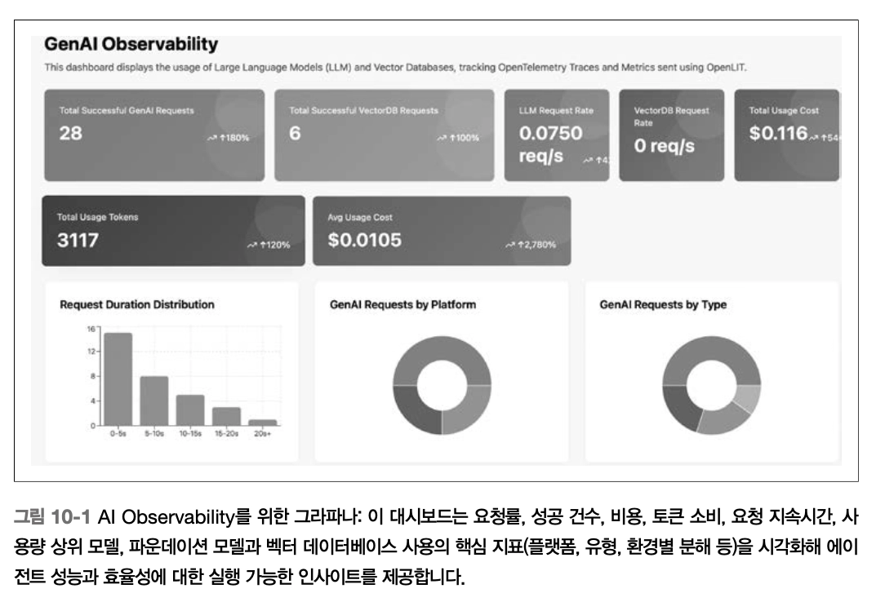

# Ch10. 운영 환경 모니터링

> ⭐ 핵심 : 모니터링 스택은 단순히 장애를 감지하는 도구가 아니다. 엔지니어링·ML·프로덕트가 "시스템이 무엇을 하고, 얼마나 잘하는지, 어디를 개선해야 하는지"에 대해 **같은 언어로 대화하도록 해주는 인터페이스**다.
> 

기존 소프트웨어는 에러를 내고 죽지만, 에이전트는 **조용히 이상해진다**. 도구는 성공했는데 연쇄 오류가 누적되고, LLM 출력은 유창하지만 오도한다. 모니터링은 에이전트 인프라의 **신경계** 역할을 해야 한다.

## **무엇을 측정할 것인가**

| 계층 | 지표 | 예시 조치 |
| --- | --- | --- |
| **인프라** | CPU/메모리, 업타임, P50/P95/P99 지연시간 | 자동 확장, 캐싱 조정, 장애 대응 트리거 |
| **워크플로** | 작업 성공률, 토큰 사용량, 도구 호출 성공/실패율, 재시도·폴백 빈도, 도구 사용 요청 제한 초과
****Runtime Event*** | 실패 분석, 래퍼 패치, 계획 로직 개선, 호출 빈도 조절 |
| **출력 품질** | 할루시네이션 지표, 입력/출력 토큰, 임베딩 드리프트 | 그라운딩 도입, LLM 크리틱 추가, 모델 파인튜닝 |
| **사용자 피드백** | 재질의 비율, 작업 포기율, 명시적 평점 | 의도 인식 개선, 플로 간소화, 평가용 선별 |
- 상세 보기
    
    
    
    
    

### **진짜 실패 vs 기대 변동 구분**

> 확률적 시스템 모니터링의 핵심 과제는 **진짜 ‘실패’ (수정이 필요한** **체계적 버그)와 기대 가능한 변동(출력은 다르지만 허용 가능한 비결정성)을 구분**하는 일이다.
> 

[의사결정 순서]

1. 출력이 성공 기준(예: 평가 점수 > 0.8) 충족? → 추세만 모니터링하되, 즉각 조치 X
2. 미충족 시 3~5회 재실행. 실패율 80% 초과? → **체계적 버그**, 엔지니어링 검토
3. 재현 안 됨 → 신뢰도와 분산 평가 (LLM 점수 > 0.7, **KL(쿨백-라이블러) 발산 < 0.2** 경계 안이면 기대 변동)
4. 경계 밖 (**PSI > 0.1** 등) → 비정상 실패, 재학습이나 가드레일 트리거

이 플로우차트를 Grafana 같은 도구에 적용하면 **노이즈에 과잉 반응하지 않으면서 실제 성능 저하를 조기 포착**할 수 있다.

### **실패 = 테스트 케이스 (좌측 이동)**

*핵심 마인드셋 전환*

> 실패를 장애 하나로 보지 말고 테스트 케이스로 봐라. 에이전트가 운영에서 실패할 때마다 그 시나리오를 캡처해 **회귀 테스트로 전환**하라. 성공도 마찬가지 — 복잡한 사례를 잘 처리한 트레이스는 **골든 패스로 보존**할 가치가 있다.
> 

실패 트레이스 + 모범 성공 사례 = 실환경을 반영하는 **살아 있는 CI/CD 코퍼스**. 이 실천이 모니터링을 '좌측 이동(shift-left)'시켜 개발 초기에 이슈를 포착하게 한다.

## **모니터링 스택**

오픈 소스 참조 스택:

| 역할 | 도구 |
| --- | --- |
| 계측 | **OpenTelemetry** |
| 로그 집계·검색 | **Loki** |
| 분산 트레이스 | **Tempo** |
| 시각화·알림 | **Grafana** |

### **대안 스택 비교**

| 스택 | 핵심 강점 | 적합한 대상 | 트레이드오프 |
| --- | --- | --- | --- |
| **Grafana + Loki/Tempo** | 조합 가능성, 시각화 | 엔터프라이즈 운영 | 관리 컴포넌트 많음 |
| **ELK 스택 (Elasticsearch, Logstash/Fluentd, Kibana)** | LLM 출력에 대한 고급 전문 검색과 벡터 검색, 예측 알림을 위한 내장 ML 이상 탐지 (예: 신뢰도 < 0.7 할루시네이션 이벤트 쿼리), 클러스팅을 통한 대용량 로그 수집 확장성 | 대규모 로그 | 리소스 사용량 큼 (ES 메모리 집약) |
| **Arize Phoenix** | LLM 트레이싱·평가 특화, 머신러닝 워크플로를 위한 주피터 통합, RAG 품질·할루시네이션 자동 채점 | 개발 반복, 리서치/ML | 프로덕션 확장 한계(운영 < 개발 지향, 트레이스/평가에 제한됨 |
| **SigNoz** | 통합형(지표+트레이스+로그), ClickHouse 백엔드 경량 자체 호스팅 | 스타트업·ML 팀 | 생태계(플러그인 수)·시각화 한계  |
| **Langfuse** | LLM 네이티브 지표(e.g. 토큰 비용 추적, 프롬프트 A/B 테스트), 세션 리플레이, PostgreSQL 자체 호스팅 | 시맨틱 모니터링 | 인프라 커버리지 좁음 (CPU, 비 LLM 텔레메트리 확장성 등은 약함) |

**[현실적 전략]**

1. 이미 Splunk·Datadog·New Relic 같은 엔터프라이즈 스택이 있다면 → 새 시스템 도입보다 **OTel 계측을 기존 스택으로 확장**하는 편이 현실적
2. LLM 특화 자동 평가가 꼭 필요하면 → Langfuse나 Phoenix를 추가
3. 고급 검색 필요하면 → ELK
4. 신규 프로젝트면 → Grafana·SigNoz가 폭넓게 커버

### **민감 데이터 관측 파이프라인 설계**

🛡️ 관측 데이터에는 사용자 메시지, 도구 입력, 중간 LLM 생성물이 포함되기 때문에 **컴플라이언스와 프라이버시 고려가 필수**다.

→ RBAC이 적용된 별도 모니터링 클러스터 구성 필요 (암호화/감사가 적용된 백엔드로 라우팅. 디버깅과 성능 분석은 가능하도록 하기 위함

| 요구사항 | 구현 방식 |
| --- | --- |
| **접근 통제** | RBAC가 적용된 **별도 모니터링 클러스터** |
| **저장 보안** | 저장 시 암호화(encryption-at-rest), 접근 감사 |
| **경계 보호** | 민감 데이터를 격리된 백엔드로 라우팅 — 신뢰·컴플라이언스 훼손 없이 디버깅·성능 분석 가능 |
| **PII 처리** | 관측 로그 내보내기 전 PII 편집·해시·마스킹 |
| **세밀한 통제** | **OpenTelemetry 스팬 내보내기 중 데이터 정제 훅** — 애플리케이션 경계를 넘어가는 데이터에 대해 세밀 통제 |

## OpenTelemetry 계측

**LangGraph + OpenTelemetry 통합**: LangGraph는 비동기 함수 호출 그래프이고, 각 노드는 계획·도구 호출·LLM 생성 같은 기능적 단계로 이미 분리돼 있다 → 각 단계를 OTel 스팬으로 감싸기만 하면 된다. (계측이 매우 간단함!)

```python
from opentelemetry import trace
tracer = trace.get_tracer("agent")

async def call_tool_node(context):
    with tracer.start_as_current_span("call_tool", attributes={
        "tool": context.tool_name,
        "input_tokens": context.token_usage.input,
        "output_tokens": context.token_usage.output,
    }):
        result = await call_tool(context)
        return result
```

- **스팬에 포함할 정보** (계측 범위의 황금률 — 지나치면 노이즈, 부족하면 근본 원인 분석 불가)
    - **공통**: 사용자 요청 ID, 세션 메타데이터, 에이전트 구성 상태, 스킬 이름, 평가 시그널
    - **도구 호출 노드**: 도구 이름, 호출 메서드, 응답 지연시간, 성공/실패 상태, 알려진 에러 코드
    - **LLM 생성 노드**: 프롬프트 식별자, 토큰 수, 모델 지연시간, 할루시네이션 위험 플래그, 신뢰도 점수
    - **스팬 이벤트**: 폴백 트리거, 재시도, 예외 자동 태깅, 하위 스팬(다운스트림 API 호출 측정용)
- **분산 트레이싱 컨텍스트는 비동기 호출 전반에 자동 전파**되므로 복잡하고 분기된 에이전트 워크플로에서도 작동 과정을 쉽게 파악할 수 있다.
- **템포로 가능한 심층 쿼리 예시** → 트레이스 백엔드 역할
    - 계획 단계가 1.5초를 초과한 트레이스만 필터링
    - 특정 에러 코드로 실패한 도구 호출이 포함된 트레이스만 검색
    - 실제 다단계 실행 조건에서만 드러나는 미묘한 이슈 디버깅
- **로키의 강점과 한계** → 로그 집계 레이어
    - 구조화된 JSON 로그에 잘 맞고, 스팬/트레이스 ID로 주석을 달아 로그·트레이스 상관분석 가능
    - 단, 전문 검색·역할 기반 보기·높은 수집 처리량이 필요하면 Elasticsearch·Datadog Logs·Honeycomb을 고려

## **시각화와 알림**

> 관측 가능성 | 시그널 → 스토리, 지표 → 실행으로 전환하게 해주는 가장 영향력 있는 레이어
> 

**[Grafana 대시보드 예시** (GenAI Observability)]



**스팬 계층: 사용자 쿼리 수신 - 계획 선택 - 도구 호출 - 최종 출력 구성 (에이전트가 거친 각 단계와 타이밍을 시각화하여 볼 수 있음)*

- 에이전트별 시간당 토큰 사용량 (모델 장황함 회귀 탐지)
- 도구 호출·계획 노드의 P95 지연시간
- 프롬프트 템플릿 버전별 작업 성공률
- 도구·스킬별 폴백 빈도
- 사용자 쿼리 임베딩 유사도 기반 드리프트
- 파운데이션 모델·벡터 DB 요청률·비용·토큰 소비

**알림 임계값 예시**

| 조건 | 의미 |
| --- | --- |
| 최근 30분 할루시네이션 비율 > 5% | 품질 회귀 |
| 단일 세션 재시도 루프 > 3회 | 계획 불안정 |
| 핵심 도구 평균 응답 시간 50% 이상 증가 | 통합 저하 |

**확장 옵션**:

- **PagerDuty** 통합: 온콜 팀으로 구조화 대응 워크플로 (호출·확인)
- **Sentry**: 에이전트 코드 예외·스택 트레이스·브레드크럼·릴리스 상태 — 확률적 버그 디버깅에 특히 유용, OTel과 통합 가능
- **AgentOps.ai**: 에이전틱 전용 올인원, 시맨틱 모니터링(출력 품질 자동 채점) — 벤더 종속 주의

## **모니터링을 고려한 개발 패턴**

| 패턴 | 방식 | 용도 |
| --- | --- | --- |
| **섀도 모드** | 새 버전이 프로덕션 옆에서 병렬 실행, 출력은 사용자 미노출 | 노출 없이 행동 차이 관찰 |
| **카나리 배포** | 트래픽 1~5%에만 노출, 버전 태그로 지표 필터링 | 점진적 검증 + 빠른 롤백 |
| **회귀 트레이스 수집** | 프로덕션 실패를 자동으로 테스트 스위트로 내보내기 | 지속 갱신되는 회귀 코퍼스 |
| **자가 치유 에이전트** | 자체 텔레메트리 실시간 읽고 폴백 실행 | 반복 실패 시 단순 경로로 우회 |
- **섀도 모드 (Shadow Mode)**
    - OTel로 프로덕션·섀도 에이전트 모두 계측 + **공유 요청 ID 부착** → 로키/템포에서 라벨링해 직접 비교
        - 도구 선택, 지연시간, 토큰 사용량, 할루시네이션 빈도
    - 동일한 입력을 처리하지만, 사용자에게 출력은 제공하지 않음
        - 실제 환경에서 새 에이전트의 작동 과정을 로그, 트레이스로 관찰하되, 사용자 경험에는 영향X
- **카나리 배포 (Canary Deployments)**
    - 버전 태그로 모든 지표·트레이스 필터링 → 카나리와 기준 에이전트를 성공률·지연시간·도구 사용·에러 건수에서 나란히 비교, 유의미한 회귀·이상 시 알림
    - 새 에이전트 버전을 실제 사용자 일부(e.g. 트래픽의 1~5%)에게만 제공, 나머지는 기준 버전과 상호작용하게 하는 방식
        - 작동 양호 시 점진적으로 확대, 그렇지 않으면 즉시 롤백 (사용자 영향 최소화 상태)
- **회귀 트레이스 수집**
    - 프로덕션에서 실패할 때마다 실패 트레이스/로그 스냅샷을 테스트 suite로 자동으로 내보내면, 지속적으로 갱신되는 회귀 코퍼스 구축 가능
    - 프로덕션의 실패 → 학습 시그널 → 새로운 테스트 케이스
        - 엣지 케이스가 쌓이며 평가 집합은 강화되고, 동일한 실패 양상의 재발을 방지할 수 있음
- **자가 치유 에이전트**
    - 도구 호출 반복 실패 → 단순 폴백 계획으로 우회 또는 사용자에게 명확화 요청
    - 지연시간 급증 → 선택적 추론 단계 건너뛰기
    - 할루시네이션 점수 높음 → 고지문 제시 또는 사람 상담원 전달
    - 각 폴백 결정을 로그·트레이스로 기록 → 언제·왜 트리거됐고 문제 해결에 도움됐는지 분석

## **사용자 피드백 통합**

| 피드백 유형 | 예시 | 모니터링 처리 |
| --- | --- | --- |
| **암시적** | 재질의, 작업 포기, 머뭇거림 | Loki 로깅, Grafana 시각화 |
| **명시적** | 엄지 내림, 별점, 텍스트 코멘트 | Tempo 특정 트레이스와 연결, 불만 급증 알림 |

낮은 평점과 연관된 트레이스를 평가 세트로 직접 내보내 사후 검토에 활용 → 피드백 루프의 핵심 입력

## **분포 변화 탐지**

에이전트 환경의 통계적 특성이 바뀌면(용어 진화, API 변경, 모델 업데이트) 명시적 에러를 일으키지 않을 수 있지만, 성능 저하, 불일치한 출력, 폴백 사용 증가로 이어질 수 있다. 

| 기법 | 대상 | 특성 | 임계값 해석 |
| --- | --- | --- | --- |
| **KS 검정** (Kolmogorov–Smirnov) | 연속형 특성 (질의 길이, 지연시간) | 두 데이터셋의 경험적 누적 분포함수(ECDF)를 비교해 동일한 분포에서 나왔는지 판단하는 비모수 검정

  • **정규성 가정 없음
  •**  p-value 동반 | KS 통계량 > 0.1 (p < 0.05) → 의미 있는 발산 |
| **KL 발산** (Kullback–Leibler) | 확률 분포 차이 (토큰 분포, 개념 드리프트) | 한 확률분포가 다른 분포와 얼마나 다른지를 측정해 토큰 분포의 변화를 정량화 → 개념 드리프트를 탐지하는 데 자주 사용

  **• 비대칭** KL(P‖Q) ≠ KL(Q‖P)
  • 현재 Q가 과거 P와 크게 어긋날 때 값 증가 | > 0.5 → 개념 변화 가능성 |
| **PSI** (Population Stability Index) | 범주형·구간화 변수 (도구 사용 범주) | 범주형 or 구간화된 연속형 변수에서 과거와 현재의 비율 분포를 비교해 변화를 탐지

  • 버킷 단위 비율 차이 × 로그 비율 합산
  • 정규성 불필요 | < 0.1 안정 / 0.1~0.25 경미 / > 0.25 중대(재학습 우선) |

```python
# KS 검정
from scipy import stats
ks_stat, p_value = stats.ks_2samp(historical, current)
if ks_stat > 0.1:
    print(f"Drift detected: KS = {ks_stat}")

# KL 발산 (log(0) 회피용 epsilon)
def kl_divergence(p, q, epsilon=1e-10):
    p = (p + epsilon) / np.sum(p + epsilon)
    q = (q + epsilon) / np.sum(q + epsilon)
    return np.sum(p * np.log(p / q))

# PSI
def psi(expected, actual):
    expected_percents = expected / np.sum(expected)
    actual_percents = actual / np.sum(actual)
    psi_values = ((actual_percents - expected_percents) *
                  np.log(actual_percents / expected_percents))
    return np.sum(psi_values)
```

- **추가 지표**
    - 정확도 급감 (24시간 5~10% 이상)
    - 작업 포기율 증가 (> 15%)
    - 재시도 급증 (> 20%)
    - 질의 임베딩 평균 코사인 유사도 < 0.8
- **자동화**: Evidently AI 같은 라이브러리 → Grafana 자동 알림
- **대응 원칙**
    - 일시적 변화 → 임계값 조정·파싱 로직 업데이트로 흡수
    - 지속적 변화 → 워크플로 재학습·새 API 적응
    - **심각도 우선순위**: PSI가 48시간 이상 0.25 초과 → 재학습 우선
    - 수정 후엔 A/B 테스트로 검증
    - 성능 저하 트레이스 로깅·내보내기 피드백 루프로 **일시적 vs 구조적 판단**

## **지표 소유권과 기능 간 거버넌스**

에이전트는 기존 팀 경계(인프라·프로덕트·ML)를 따르지 않는다. 파운데이션 모델 응답은 **단순 모델 산출물이 아니라 그 자체가 제품**이고, 계획 지연 5초는 모델 한계가 아니라 **대개 프로덕트 팀의 프롬프트·워크플로 설계 결정의 결과**다.

책이 경고하는 전형적 실패 양상:

> *"파운데이션 모델은 느리다"고 팀에서 생각해 장황한 프롬프트·불필요한 재시도·비대한 계획이 에이전트 곳곳에 지연을 심는다. 엄격한 트레이스 기반 계측이 없다면 이런 드리프트는 감지되지 않고, 결국 시스템 전체가 굼떠진다. 인프라가 부족해서가 아니라 **프로덕트와 ML 팀이 지연을 불가피한 것으로 정상화**해버렸기 때문이다.*
> 

핵심 원칙:

- 에이전트의 로그·트레이스·평가 시그널은 **서비스 상태·시스템 지표와 함께 코어 관측 플랫폼에** 있어야 함
- 에이전트 지표가 프로덕트 대시보드나 모델 노트북에만 있으면 시스템적 문제를 가릴 가능성 큼

**공유 대시보드 요건** (각 역할별 관찰 포인트):

- **프로덕트 리드**: 계획 지연시간·폴백 비율이 작업 포기와 어떻게 상관하는지
- **ML 엔지니어**: 할루시네이션 비율·드리프트를 사용자 피드백과 함께
- **인프라/SRE**: 토큰 급증·도구 간헐적 불안정 → 시스템 신뢰성 영향

**RACI 매트릭스** (에이전트 모니터링)

*`R`esponsible(수행), `A`ccountable(결과 책임), `C`ousulted(자문), `I`nformed(통보)

| 지표/활동 | 프로덕트 팀 | ML 엔지니어 | 인프라/SRE |
| --- | --- | --- | --- |
| 지연시간 (계획·도구 호출) | `A` (사용자 영향) / `C` (UX 임계값) | `R` (프롬프트·모델 최적화) / `I` (회귀 통보) | `R` (인프라 원인) / `C` (스케일링) |
| 할루시네이션 비율 | `C` (사용자 피드백 컨텍스트) / `I` (추세 통보) | `A`/`R` (평가 탐지·완화) | `I` (알림 설정) |
| 작업 성공률 | `A` (제품 목표) / `R` (성공 기준 정의) | `C` (모델 개선) | `I` (신뢰성 연계) |
| 토큰 사용량·비용 | `C` (비즈니스 영향) | `R` (생성 최적화) / `I` (급증 통보) | `A` (예산·스케일링) / `R` (효율 모니터링) |
| 분포 변화 (입력 드리프트) | `I` (프로덕트 조정 통보) | `A`/`R` (임베딩·평가 탐지) | `C` (데이터 파이프라인 안정성) |
| 폴백·재시도 빈도 | `C` (UX 폴백) | `R` (계획 로직 개선) | `A` (신뢰성) / `I` (패턴 통보) |
| 사용자 피드백·감성 | `A`/`R` (집계·우선순위) | `C` (모델 연계) | `I` (운영 알림) |
| 대시보드 유지보수·트리아지 의식 | `C` (프로덕트 컨텍스트) | `C` (ML 인사이트) | `A`/`R` (플랫폼 소유, 기능 간 리뷰 주관) |

⚠️ **책의 예시 경고**: 도구가 루프 안에서 4번 호출되고 이어 긴 생성·모호한 응답·사용자 이탈로 끝나는 트레이스는 단지 엔지니어링 세부가 아니라 **프로덕트의 실패**다. 이 현상은 로키·템포 같은 공유 플랫폼으로 로그와 스팬을 라우팅할 때만 보인다. **단절된 지표 탭에 숨겨져 있으면 보이지 않는다**.

실천법:

- 버전 태그와 시맨틱 지표를 갖춘 **공유 관측 가능성 대시보드**
- 스팬·로그에 **제품 컨텍스트 태깅** (피처 플래그, 사용자 등급, 워크플로 ID)
- 출시·큰 회귀 후 **프로덕트·인프라·ML이 함께하는 기능 간 트리아지 의식**
- **이중 잣대 피하기**: 파운데이션 모델 지연을 다른 서비스와 다른 기준으로 보지 않기 — 사용자에게 영향 주는 느림은 모두의 문제
