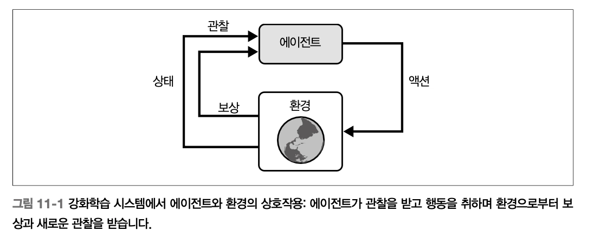
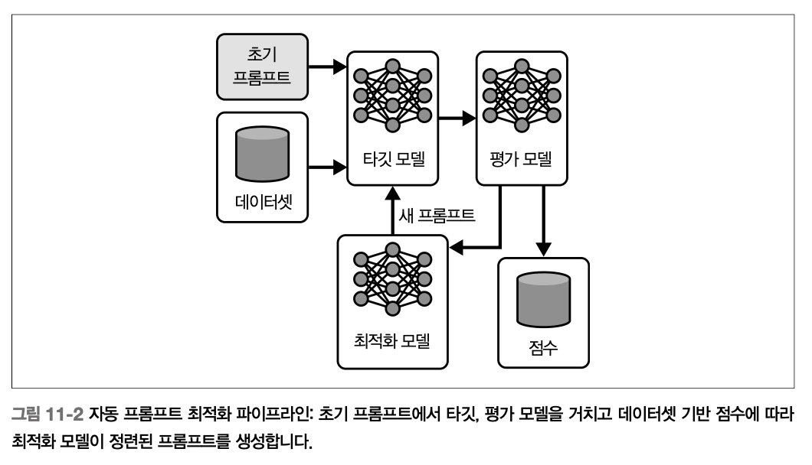
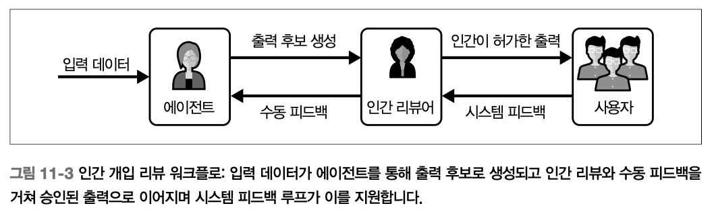

# Ch11. 개선 루프


> *자기 개선 시스템은 고장 난 것을 고치는 게 아니라, 모든 실패·인사이트·실험이 성장의 연료가 되도록 **워크플로를 설계하는 것**이다.*
> 

복잡한 멀티 에이전트 시스템에서 실패는 피할 수 없다. 진짜 시험대는 실패 여부가 아니라 **얼마나 잘 학습하는가**다.



**지속적 개선의 세 기둥**

| 기법 | 목적 | 강점 | 한계 | 사용 시점 |
| --- | --- | --- | --- | --- |
| **피드백 파이프라인** | 자동 도구, 사람 리뷰로부터 관찰·분석·우선순위화로 인사이트 생성 | 확장 가능한 자동화 + 사람 감독 | 데이터 품질 의존, 신종 이슈 놓침 | 실패 진단, 개선 백로그 구축 |
| **실험 프레임워크** | 통제 환경에서 변경 검증 (섀도 배포, A/B 테스트 등의 기법) | 데이터 기반, 리스크 최소화 | 유의성 데이터 필요, 리소스 집약 | 점진적 롤아웃, 변형 비교 |
| **지속 학습** | 상호작용 기반 동적 적응 내재화 (인컨텍스트 전략, 주기적 오프라인 업데이트) | 실시간 적응성, 개인화 | 과적합·회귀 위험, 모니터링 필요 | 변화하는 사용자 요구 대응 |

<aside>

예시: **보안 운영 센터(SOC) 분석가 에이전트**

[도구]
`lookup_threat_intel`, `query_logs`, `triage_incident`, `isolate_host`, `send_analyst_response`

시스템 프롬프트에는 6단계 조사 방법론(알림 분석 → 위협 인텔 조회 → 로그 검색 → 인시던트 분류 → 호스트 격리 → 보고)이 정의되어 있다.

**드리프트 시나리오 예시**: 에이전트 프롬프트가 구식 위협 패턴(IP 기반 로그인)을 가정할 때 공격자가 자격 증명 채우기로 이동하면 반복적 False Negative 발생 → 엔지니어가 최신 예시로 프롬프트를 정제하거나 도구에 검증 단계를 추가해 수정 (문구를 다듬고 제약을 조정하고 추론 단계의 순서를 재배치)

</aside>

## **피드백 파이프라인**

### **핵심 자동 최적화 프레임워크**

| 도구 | 개발처 | 특징 |
| --- | --- | --- |
| **DSPy** | Stanford NLP | 프롬프트를 **선언적 모듈**로 취급, **시그니처** 정의 + 모듈 구성 (ChainOfThought·ReAct) + 옵티마이저 (BootstrapFewshot·MIPROv2) 적용. Exact Match·시맨틱 유사도 같은 지표로 프롬프트·퓨샷 예시 자동 생성. OpenAI·Anthropic API 통합 |
| **Trace** | 마이크로소프트 | **그래디언트 없이** 일반 피드백 시그널(점수·자연어 평·쌍대 비교)로 엔드투엔드 학습. 최적화를 **생성적 과정**으로 취급 — 블랙박스 시스템에 적합. 클러스터링된 오류 피드백을 흡수해 추론 전략·도구 호출 진화 |
| **APO** | - | Automatic Prompt Optimization, 초기 프롬프트 → 타깃 모델 → 평가 모델 → 최적화 모델의 반복 루프 |

→ 위와 같은 프레임워크를 통해 실패 패턴을 실행 가능한 인사이트로 도출할 수 있음

→ 패턴 식별, 변경 제안에는 능하지만, 문맥적 뉘앙스를 완전히 반영하거나 더 넓은 전략적 목표에 따라 개선의 우선순위를 정할 수는 없음

### **자동 이슈 탐지와 RCA**

> 에이전트 워크플로 전반에서 반복되는 문제를 체계적으로 식별하는 것이 핵심!
> 

**[파이프라인이 찾는 패턴]**



- 특정 스킬·도구의 반복 실패
- 에러율이나 응답 시간 급증
- 사용자 참여·만족도 이상
- 에이전트 버전·배포 환경 간 상이한 작동
- 서서히 드러나는 경향성 포착 (w/ ML, 통계 기법)
    - 의사결정 패턴의 점진적 드리프트
    - 특정 사용자 입력과 후속 실패의 상관관계

**구체적 예**: SOC에서 `query_logs` 호출 실패 급증 + 원인이 잘못 구성된 `query` 파라미터(과도하게 복잡한 SQL 유사 쿼리)일 때, Trace가 각 호출을 로깅하고 `invalid query syntax` 유사 오류를 클러스터링해 프롬프트 선행 추론 단계와 상관시킨다.

**[효과적인 RCA의 단계]**

1. **워크플로 추적** – 실패까지 엔드투엔드 체인 재구성
2. **결함 국소화** – 오작동 지점 분리 (잘못 해석된 프롬프트, 부적절한 스킬 선택, 제약적 파라미터 로직 도구 등)
3. **패턴 인식** – 고립 사건 vs 반복 추세 (특정 사용자 코호트, 데이터 입력, 시스템 상태 영향)
4. **영향 평가** – 빈도·심각도로 대응 우선순위

<aside>
❗

**핵심 인사이트** 

에이전트 실패는 순수 기술적 원인만으로 발생하지 않는다. 모호한 작업 정의, 학습 데이터 간극, 시스템 설계 범위 밖 사용자 기대 변화, **잘못된 행동을 유도하는 성공 지표**나 **더 이상 사용자 요구에 맞지 않는 워크플로** 같은 **조직적 사각지대**가 원인인 경우가 많다.

</aside>

### **인간 개입 리뷰**

> **자동화를 위한 안전망이자, 가장 복잡/모호/영향이 큰 시스템 이슈에 인간 판단을 투입하는 구조화된 보고 프로세스**
> 



- 자동 분석만으로 부족한 영역 ⇒ 피드백 파이프라인이 효과적이고 포괄적이며 더 넓은 조직 목표와 정렬되도록 보장함
    - 모호한 사용자 의도
    - 윤리적 뉘앙스
    - 상충하는 목표
    - 새로운 엣지 케이스
    
    **SOC 예시**: 자동 RCA가 모호한 트리아지(VPN 때문인 오탐일 수도 있고 실제 침해일 수도 있는 '의심스러운 로그인')를 표시 → 인간에게 전달 → 보안 엔지니어가 트레이스를 검토해 프롬프트 해석 검증 + "핵심 운영 영향을 확인하기 전에는 호스트 격리 금지" 같은 윤리 지침 추가
    
- **전달 기준 예시**
    - 사전에 정의된 임계값 초과
    - 설명되지 않은 패턴
    - 미해결 상태의 충돌이 있는 인시턴트
    - 명확한 기술 설명 없이 지속되는 오류
    - 규제·윤리 함의가 있는 워크플로 이상
    - 고가치·미션 크리티컬 작업 실패
    - 자동 도구 간 상충하는 권고·진단
- **올바른 사례만 전달하기** (인간 과부하 방지)
    
    
    | 기법 | 방식 | 예시 임계값 |
    | --- | --- | --- |
    | **자가 평가 확신도** | LLM이 응답 끝에 `certainty: 0~1` 출력 | 0.7 미만 → 전달 |
    | **로짓 엔트로피** | 확률적 출력의 엔트로피가 높으면 모호 | - |
    | **앙상블 추론** | 3~5회 수행 후 일치도 측정 | 20% 초과 불일치 → 전달 |
    | **외부 평가자** | 2차 파운데이션 모델 비평자로 일관성 채점 | - |
    | **위험 점수** | 불확실성 × 결과 영향 | 임계값 초과 → 전달 |
    | **DSPy 오프라인 최적화** | 과거 데이터로 임계값 조정 | 전체의 10% 미만 유지 |
    
    SOC에서는 **확신도 0.8 미만의 위협 분류 + 높은 심각도 인시던트(데이터 유출 가능성) + 핵심 자산(관리자 계정) 영향 시** 전달하는 방식이 일반적
    
- **리뷰 절차**
    1. **문맥 분석** – 통제 환경에서 실패 재현
    2. **트레이스 점검** – 로그·트레이스·의사결정 체인 검사, 에이전트가 사용자 의도를 어떻게 해석했는지 명확화
    3. **영향 평가** – 기술 정확도와 UX 모두 고려
    4. **해결안 설계** – 프롬프트 정제, 워크플로 재설계, 신규 스킬 개발, 사용자 대면 기능 변경. 예: 드리프트로 호스트를 과도하게 격리하는 문제 → `isolate_host` 도구에 확인 단계 추가
    
    **다학제 팀**(엔지니어, PM, 데이터 사이언티스트, UX)의 협업이 핵심 — 결정·근거·결과를 기록해 향후 인시던트 참고 자료
    

### **프롬프트와 도구 정제**

**전형적 프롬프트 문제 → 대응 *“표적 개선을 구현하자”***

1. 프롬프트의 설계 - 언어 모델에 제공하는 지시와 컨텍스트
    
    
    | 문제 | 대응 |
    | --- | --- |
    | 지시가 모호해 일관성 없음 | 명료성을 위한 재작성 |
    | 과도하게 광범위 → 할루시네이션·엉뚱한 출력 | 범위 좁히기, 제약 추가 |
    | 지나치게 경직 → 일반화 실패 | 긍정/부정 예시 추가 |
    | 작업 경계·전달·에러 처리 불명확 | 작업 분해 (중간 추론 단계) |
    | 컨텍스트 부족 | 컨텍스트 확장 (배경·제약) |
    - 고급 피드백 시스템에서는 관찰된 실패 패턴에 반응해 프롬프트 조정을 자동화할 수 있음
    - 회귀, 의도치 않은 부작용을 막기 위해 모든 변경은 오프라인 테스트와 라이브 섀도 배포 모두에서 검증하는 것이 바람직
    
    - **DSPy로 ReAct 모듈 자동 최적화**
        
        ```python
        import dspy
        dspy.configure(lm=dspy.LM("gpt-5-mini"))
        
        # 소수의 합성 테스트 케이스 (실무는 100개+)
        trainset = [
            dspy.Example(
                alert="Suspicious login attempt from IP 203.0.113.45 to admin account.",
                response="Lookup threat intel for IP, query logs for activity, "
                         "triage as true positive, isolate host if malicious."
            ).with_inputs('alert'),
            # ... 더 많은 예시
        ]
        
        react = dspy.ReAct("alert -> response",
                           tools=[lookup_threat_intel, query_logs])
        
        tp = dspy.MIPROv2(
            metric=dspy.evaluate.answer_exact_match,
            auto="light", num_threads=24
        )
        optimized_react = tp.compile(react, trainset=trainset)
        ```
        
2. 외부 도구의 구성 및 호출 - 에이전트가 사용할 함수, API, 액션
    
    
    | 문제 |
    | --- |
    | 주어진 사용자 작업에 대해 잘못되었거나 비최적의 도구 선택 |
    | 도구 호출 파라미터 불일치나 잘못된 입력 |
    | 도구셋의 공백 (도구 부재/불완전으로 인해 수행 불가한 작업) |
    | 도구 체이닝 실패 (한 단계의 출력이 다음 단계의 입력에 맞게 포맷되지 않음) |
    
    **[도구 정제 수준]**
    
    - **내부 로직 정제**: 도구 내부 프롬프트·모델 최적화
        - 외부 데이터에서 위협 수준을 정확히 분류할 수 있음
        - 명확한 근거를 문서화 (어떤 문제가 관찰되었는가, 어떤 변경을 했는가, 효과를 어떻게 측정할 것인가)
    - **기능 확장**: 더 넓은 시나리오 커버 (결과 없음 / 부분 일치 / 새로운 위협 등)
    - **통합 개선**: 도구 체이닝 포맷 정합성
    
    - **위협 분류기 시그니처 예시** (DSPy `ChainOfThought` + `BootstrapFewShotWithRandomSearch`)
        
        ```python
        class ThreatClassifier(dspy.Signature):
            """인디케이터의 위협 수준을 'benign'/'suspicious'/'malicious'로 분류"""
            indicator: str = dspy.InputField(...)
            threat_level: str = dspy.OutputField(...)
        
        class ThreatClassificationModule(dspy.Module):
            def __init__(self):
                super().__init__()
                self.classify = dspy.ChainOfThought(ThreatClassifier)
        
            def forward(self, indicator):
                return self.classify(indicator=indicator)
        
        optimizer = dspy.BootstrapFewShotWithRandomSearch(
            metric=threat_match_metric,
            max_bootstrapped_demos=4, max_labeled_demos=4
        )
        optimized_module = optimizer.compile(
            ThreatClassificationModule(), trainset=trainset
        )
        ```
        
    
    각 정제는 **관찰된 문제 / 변경 내용 / 측정 방법**을 문서화해 추적성과 재현성을 확보한다. 오프라인 평가(홀드아웃·합성) + 통제된 라이브 실험(섀도·A/B) 양쪽에서 반복 검증해야 한다.
    

### **집계와 우선순위화**

- **집계**
    
    > 흩어진 데이터를 일관된 개선 백로그로 전환
    > 
    - **중복 제거**: 유사 이슈 클러스터링 → 노력의 분절 방지
    - **태깅·분류**: 근본 원인·영향 워크플로·사용자 임팩트·컴포넌트 기준
    - **컨텍스트 연결**: 로그·트레이스·사용자 리포트·RCA 문서 첨부
    
    *플랫폼 종류 - 중앙 대시보드, 관측 가능성 도구, 구조화된 이슈 트래커 등
    
- **우선순위화 5차원**
    
    > 모든 개선이 동일한 가치를 지니지 않도록, 차원을 균형 있게 구성
    > 
    
    | 차원 | 질문 |
    | --- | --- |
    | **빈도** | 얼마나 자주 발생? 사소하지만 잦은 이슈는 누적 부담 |
    | **심각도/영향** | 비즈니스·사용자 영향은? 보안 리스크, 큰 불만 유발하는 이슈는 최상위 |
    | **실행 용이성** | 퀵윈인가 복잡한가? 적은 노력으로 큰 효과 우선 |
    | **전략 정렬** | 제품 목표·예정 기능·컴플라이언스 부합? 빈도 낮아도 규제 마일스톤 가능케 하는 수정은 필수 |
    | **재발 가능성/리스크** | 방치 시 유사 실패 반복? 아키텍처·학습 데이터·추론에 뿌리 둔 시스템적 이슈는 심층 대응 |
    
    도구: 영향/노력 매트릭스, 애자일/칸반. 개선 백로그는 정적 할 일이 아니라 **살아 있는 산출물** — 정기 리뷰, 버그 트리아지 미팅, 기능 간 동기화로 지속 재평가
    

## **실험**

| 기법 | 작동 방식 | 적합한 상황 | 주의점 |
| --- | --- | --- | --- |
| **섀도 배포** | 프로덕션 옆에서 병렬 실행, 출력 미노출 | 큰 폭 프롬프트 수정, 워크플로 업데이트 | 대화형 흐름에는 하이브리드 필요 |
| **A/B 테스트** | 트래픽 50/50 분할, 정면 승부 | 측정 가능한 미세 조정 | 장기 상태 저장 시 고정 배정 필요 |
| **베이지안 밴딧** | 실험 도중 학습해 승자로 이동 | 빠른 적응 필요 | 보상 정합성·초기화 주의 |

### **섀도 배포**

**강점**:

- **현실적 검증** – 실제 사용자 행동의 전 스펙트럼, 통제 환경에서 놓치는 창발적 이슈 표면화
- **안전한 탐색** – 과감한 개선·아키텍처 변화 시도 가능
- **엣지 케이스 발견** – 비정형 입력, 모호한 지시, 통합 특이점
- **보완 전략과 통합** – 섀도 후 블루/그린으로 무중단 롤아웃 or 카나리로 점진 노출

**정교한 계측이 핵심** — 트레이스·지표(정확도·지연)·출력을 엄밀히 비교, 불일치를 교차 검증해 돌파구와 버그 구분.

**한계**: 사용자에게 승인 요청을 보내는 에이전트 같은 **인간 개입 흐름**은 섀도에서 상호작용 불가 → 과거 이력 재현, 합성 응답, 스테이징·A/B 하이브리드 접근으로 적용 가능

### **A/B 테스트**

**강점:**

- **현실 적합성** - 실제 사용자 행동과 입력 다양성 반영 (고립된 테스트 케이스보다 근거가 강함)
- **직접 비교** - 라이브 트래픽을 대조군(A) / 실험군(B)으로 분할해 어떤 버전이 더 우수한 결과를 내는지 빠르게 판단 가능
- **통계적 엄밀성** - 관찰된 차이가 우연이나 편향 샘플링의 결과가 아님을 보장

**가치 극대화 체크리스트**:

- 명확하고 실행 가능한 지표 정의
- 통계적 유의성을 위한 충분한 표본 크기 (거짓 양성/음성 최소화)
- **교차 오염 방지** (세션 내 버전 오가기 금지) — 결과 무결성
- **단기·장기 효과 모두** 모니터링 — 어떤 변경은 초기 이득 후 장기 문제

**정성 리뷰 병행**: B에서 완료율이 낮아졌다면 단순 실패가 아니라 **더 깊고 숙고된 참여**를 반영한 것일 수 있음.

**장기 상태 저장 에이전트 대응**:

- **고정 배정(sticky assignment)**: 사용자가 시간이 지나도 같은 변형에 머물게
- **세션 수준 테스트**: 사용자 수준이 아니라
- **상태 관리 격리**: 테스트 그룹별 상태 저장소 복제 or 버전 관리

**도구**: LaunchDarkly, Optimizely, 커스텀 대시보드

### **베이지안 밴딧**

> A/B 테스트가 고정 비율 분할이라면, 베이지안 밴딧은 **실험 도중 학습**해 승자 쪽으로 사용자를 점차 이동시킨다. **탐색(새 아이디어 시도)과 활용(효과가 입증된 선택 고수)의 동적 균형**
> 

각 "팔"이 시스템 변형. 상호작용 진행 → 보상(작업 성공, 낮은 지연, 사용자 평점) 관측 → 베이지안 업데이트로 각 팔 성능 신념 갱신 → 유망한 팔에 더 많은 트래픽, 다른 팔도 소량 탐색해 숨은 우수안 발견.

**SOC 예시**: 모호한 위협 쿼리 해소용 추론 체인 3종 → 초기 균등 분배 → 한 체인이 위협 분류 정확도 15% 향상 → 70% 재할당, 나머지는 계속 탐색 (사용자 행동 변화 대비).

**특수 프레임워크**: **KABB (Knowledge-Aware Bayesian Bandits)** — 의미적 인사이트로 전문가 에이전트 동적 조합·선택, 지식 집약적 쿼리에서 협업 조정.

**주요 장점**:

- **반응성**: 거의 실시간 학습, 기회비용 감소
- **효율성**: 성능 낮은 변형에 트래픽 낭비 안 함
- **확장성**: 매우 많은 파라미터로도 확장, 고정 실험 연속 구성보다 행동 공간 탐색 빠름

**필수 주의사항**:

| 항목 | 내용 |
| --- | --- |
| **지표 정합성** | 보상이 실제 시스템 목표(사용자 만족·작업 성공)를 반영해야 함 — 잘못된 프록시 최적화 방지 |
| **신중한 초기화** | 중립 사전 prior + 정규화로 조기 편향 방지 |
| **면밀한 감독** | 장기 목표 해치는 단기 추세 과잉 활용, **병적 피드백 루프** 경계 |

## **지속 학습**

| 메커니즘 | 범위 | 지속성 | 위험 |
| --- | --- | --- | --- |
| **인컨텍스트 학습** | 단일 세션 | **휘발성** (세션 종료 시 소멸) | 낮음 |
| **오프라인 재학습** | 시스템 전체 | 영속적 | 중간 (과적합·회귀) |

### **인컨텍스트 학습**

> 파운데이션 모델 기반 시스템에서 **가장 즉각적이고 유연한 적응 수단**. 모델 파인튜닝·아키텍처 변경 없이 단일 세션 안에서 에이전트 작동을 동적 변경. 프롬프트에 예시·중간 추론 단계·문맥 신호 직접 포함
> 

→ 에이전트에 즉성으로 새로운 행동을 가르치며, 고정된 사전학습 가중치에만 의존하지 않고 런타임에 적응하도록 함

**강점**:

- **사용자 맞춤 적응** — 개별 선호·반복 이슈에 맞춘 개인화
- **실시간 피드백 반영** — 사용자 정정·추가 지시에 즉각 반응
- **유도된 추론** — 명시적 추론 단계·중간 출력으로 신뢰·해석 가능한 결론

**컨텍스트 관리 기법** (컨텍스트 윈도 유한함) → 견고한 컨텍스트 관리가 핵심!

- 롤링 컨텍스트 윈도
- 시맨틱 압축
- 벡터 기반 메모리 검색

**결정적 한계**: 세션 안에서 이루어진 변경은 **휘발성** — 세션 종료 시 학습 소멸

**권고**: 인컨텍스트 학습은 적응의 **최전선이자 저위험 실험장**. 라이브 상호작용에서 고속으로 개선 시험 → 성공 전략은 반드시 **프롬프트 엔지니어링 / 워크플로 업데이트 / 전체 모델 재학습 같은 영속적 메커니즘으로 승격**해야 지속적 성과

### **오프라인 재학습**

> 피드백·실험으로 축적된 데이터(사용자 질의, 에이전트 출력, 라벨링된 결과 등)를 배치로 수집 → 비프로덕션 환경에서 프롬프트·도구·모델 업데이트. 세션 한정 인컨텍스트와 달리 **체계적 이슈**(추론·도구 사용 반복 불일치) 해결에 적합
> 

**절차**:

1. **데이터 큐레이션** — 프로덕션 트레이스에서 예시 수집·라벨링, 편향 피하기 위해 다양성·균형 확보
2. **모델 업데이트** — 홀드아웃 데이터에 퓨샷 최적화 or 전체 파인튜닝, 정확도·지연시간 지표 집중
3. **검증** — 오프라인 벤치마크 시험 → 배포 전 섀도 배포

**SOC 예시**: 공격 벡터 진화로 위협 트리아지 오탐 패턴 → 과거 로그·주석 데이터셋 → DSPy로 프롬프트 최적화 or **LoRA 경량 어댑터로 베이스 모델 파인튜닝** (7장 참고).

**강점과 주의점**

| 강점 | 주의점 |
| --- | --- |
| 지속성 (세션·사용자 전반 유지, 장기 정렬) | 과거 데이터 과적합 주의 |
| 확장성 (배치 업데이트, 대규모 데이터셋) | 새 추세 간과 방지 |
| 리스크 완화 (오프라인 특성상 철저한 테스트) | 연산 비용 큼 — **LoRA** 같은 효율 기법으로 완화 + 정기 일정 필요 |
