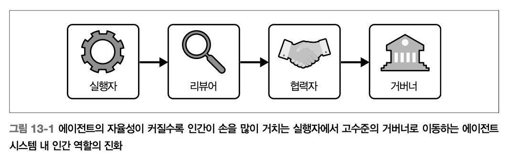

# Ch13. 인간과 에이전트의 협업

앞선 모든 기술적 논의(측정·모니터링·개선·보안)가 결국 지향하는 목적지는 **에이전트가 얼마나 뛰어난지가 아니라, 사람과 어떻게 함께 작동하는가**에 있다.

## 역할과 자율성

### 에이전트 시스템에서 인간의 역할

> **설계 원칙**: 인간-에이전트 협업 설계는 오늘의 상호작용뿐 아니라 **사용자와 조직이 내일 어떤 역할로 성장해 갈지**를 함께 계획하는 일이다.
> 

에이전트 자율성이 커질수록 인간의 역할은 수동 실행에서 정책 거버넌스로 이동한다. 이 궤적은 네 단계로 이해할 수 있다.

→ 사람은 고수준 목표를 설정하고 미묘한 판단, 예외처리, 윤리적 판단이 필요할 때 개입

| 역할 | 인간이 하는 일 | 에이전트 자율성 | 필요한 인터페이스 |
| --- | --- | --- | --- |
| **실행자** (Executor) | 작업 업로드, 모든 출력 검토 | 최소 (항상 감독) | 단계별 안내, 촘촘한 피드백 루프 |
| **리뷰어** (Reviewer) | 핵심 출력만 샘플 검토 | 중간 (일상 업무 처리) | 예외 관리와 감사 가시성을 위한 대시보드, 예외 플래그, 신뢰도 점수 |
| **협력자** (Collaborator) | 우선순위 조정, 공동 주석 | 높음 (초안·실행, 사람 감시 필요) | 공동 계획 UI, 컨텍스트 기반 주석 |
| **거버너** (Governor) | 정책 수립, 의사결정 감사 | 거버넌스 규칙 내 자율성 | 정책 설정 화면, 감사 로그, 설명 가능성 도구 |

### 이해관계자 정렬과 도입 추진

아무리 뛰어난 에이전트도 현장에서 신기한 장난감이나 방해 요소로 인식되면 실패한다. 도입을 단순한 소프트웨어 배포가 아니라 **사람 중심의 변화 관리 과제**로 다뤄야 한다.

**팀별 기대 차이와 정렬 실패의 위험**:

| 이해관계자 | 주요 관심사 | 미정렬 시 위험 |
| --- | --- | --- |
| 엔지니어 | 효율성 | '있으면 좋은' 도구로만 사용 |
| 법무팀 | 규제 준수 | 컴플라이언스 위반 |
| 최종 사용자 | 사용 편의성 | 소극적 저항·우회 행동 |

**성공적 도입을 위한 체크리스트**:

- 단순 테스터가 아닌 **공동 설계자**로 이해관계자 참여 (설계 초기부터)
- 구체적 목표 정의: "에이전트가 개선해야 할 성과는 무엇인가", "어떤 의사결정을 맡기고 어떤 것은 사람이 담당하는가", "성공·실패를 어떻게 정의하는가"
- **성공 지표는 기술 성능만으론 부족** — 작업이 빠르더라도 신뢰를 떨어뜨리거나 마찰을 늘리는 에이전트는 결국 쓰이지 않음
- 교육·피드백 루프·신속한 지원에 지속 투자

## 협업 확장

에이전트의 역할은 고립된 어시스턴트에서 팀·부서·전략 워크플로 전반에 내재된 협업 참여자로 진화한다.

### 에이전트 범위와 조직 역할

| 범위 | 거버넌스 주체 | 주요 시스템 | 에이전트 자율성 | 대표 사례 |
| --- | --- | --- | --- | --- |
| **개인** | 개인 사용자 | 개인 캘린더·이메일·클라우드 | 낮음 | 개인 어시스턴트 |
| **팀** | 팀 리드/관리자 | 프로젝트 관리·공유 문서·협업 도구 | 보통 | 회의 요약·지식 관리 에이전트 |
| **프로젝트** | PM/크로스펑셔널 리더 | 프로젝트 도구·공유 데이터 저장소 | 보통~높음 | 프로젝트 추적·리소스 조정 에이전트 |
| **기능(부서)** | 부서장 | CRM, HRIS, 재무 시스템 | 높음(도메인 한정) | HR·컴플라이언스·마케팅 에이전트 |
| **조직 전체** | 리더십/IT/CIO | 엔터프라이즈 시스템·분석 | 높음 또는 제한적 | 전사 분석·AI 헬프 데스크 |

**범위별 거버넌스 요구사항 *에이전트 범위와 위험**

| 범위 | 자율성 수준 | 위험 프로필 | 거버넌스 요구사항 |
| --- | --- | --- | --- |
| **개인** | 낮음~보통 | 낮음 | 사용자 관리 선호 설정, 최소 감독, 설명 가능성 선택 사항 |
| **팀** | 보통 | 보통 | 공유 메모리 경계, 동료 수준 전달 경로, 신뢰 수준 조정 |
| **프로젝트** | 보통~높음 | 보통~높음 | 크로스펑셔널 가시성, 로깅, 갈등 해결 메커니즘 |
| **기능(부서)** | 높음(도메인) | 높음 | **RBAC**, 감사 로그, 컴플라이언스 정합성 |
| **조직 전체** | 높음 또는 제한적 | 매우 높음 | 다단계 승인, 거버넌스 보드 검토, 지속적 윤리 감사·추적성 |

**핵심 설계 원칙**:

- **차등화된 접근 제어**: 개인 에이전트는 해당 사용자 권한을 상속 가능, 기능·조직 에이전트는 엔터프라이즈 시스템이 부여한 **명시적 권한** 필요
- **차별화된 정책**: 이메일 발송·회의 일정은 개인 에이전트가 자율 처리 가능, 재무 부서 에이전트는 모든 행동에 사람 개입 승인 흐름 요구
- **에이전트 범위 정의 = 거버넌스 결정** — 기술 아키텍처 결정이 아님
    - 에이전트 설계는 조직 문화, 인센티브, 워크플로와 정렬되어야 하는 사회기술적 과제임
    - 에이전트가 조직 워크플로에 점점 더 필수적인 존재가 될수록 범위는 에이전트가 무엇을 할 수 있는지뿐 아니라 무엇을 해야 하는지, 누구의 감독 아래 작동해야 하는지를 규정한다

### 공유 메모리와 컨텍스트 경계

범위가 넓은 메모리는 강력하지만 그만큼 더 민감하다. **팀 에이전트가 일대일 비공개 채팅 내용을 끌어오거나, 부서 에이전트가 여러 사업 부문의 기밀 데이터를 노출하면 신뢰 붕괴·컴플라이언스 위반**으로 이어진다.

**범위별 메모리 정책**

| 범위 | 메모리 정책 |
| --- | --- |
| **개인** | 기본적으로 고립된 메모리, 명시적 허용 시에만 공유 |
| **팀·부서** | 접근이 제어되는 공유 메모리 공간 안에서만 작동 |
| **조직 전체** | 보존 규칙·로깅·감사 가능성을 강제하는 정책 기반 시스템 안에서만 작동  |
| **모든 범위** | 에이전트가 무엇을 왜 기억하는지 설명 가능, 사용자가 언제든 확인·삭제 가능 |

**아래로 갈수록 비즈니스 전반 패턴에 대한 장기 메모리를 구축해야 한다*

**설계자가 고려할 컨텍스트 흐름 질문**:

- 메모리가 상위로 이동해야 하는가? (개인 에이전트 → 프로젝트 에이전트)
- 에이전트가 서로의 컨텍스트를 질의할 수 있어야 하는가, 아니면 철저히 분리되어야 하는가?
- 의도치 않은 정보 유출·범위 확장을 막으려면 어떤 경계가 필요한가?

**→ 메모리를 투명하게 만드는 것이 중요하다!**

**메모리 투명성 요구사항**:

- 인터페이스에서 메모리를 **눈에 보이게** 드러내기
- 사용자가 메모리를 끌 수 있는 기능 제공
- 에이전트가 오래되거나 비공개 데이터에 기반해 숨은 가정을 하지 못하게 방지

> 메모리는 단순한 기술 기능이 아니라 **권한, 신뢰, 위험의 원천**이다. 상태 유지 시스템의 부가 기능이 아니라 명시적 거버넌스가 필요한 자산으로 다뤄야 한다.
> 

## 신뢰, 거버넌스, 컴플라이언스

기술적 성능만으로는 충분하지 않다. 에이전트가 효과적인 파트너가 되려면 투명하게 행동하고, 경계를 존중하며, 명확히 정의된 거버넌스 프레임워크 안에서 작동해야 한다.

목표 - 협업이 안전하고 정렬된 상태를 유지하도록 하는 것

### 신뢰의 라이프사이클

> 신뢰는 이분법적 상태가 아니라 **진화하는 개념**이다. 일관된 성과, 투명한 행동, 명확한 경계를 통해 서서히 쌓이고, 에이전트가 선을 넘거나 조용히 실패하면 빠르게 무너진다.
> 
- **신뢰 구축 메커니즘**
    - **투명성**: 에이전트가 신뢰도·의사결정 요인·불확실성 여부를 선제적으로 드러냄
    - **점진적 위임**: 처음엔 신중하게 행동, 검토·승인은 사람에게 → 신뢰성 입증 후 자율성 확장
        - 팀 에이전트: 초기엔 상태 보고서 초안만 → 나중엔 직접 발송
        - 재무 에이전트: 초기엔 읽기 전용 → 이후 감독 아래 거래 제출
    - **가시적 신뢰 신호**: 명확한 버전 관리, 변경 이력, 감사 추적 제공
    - **불확실성 표현**: 숨기지 않고 드러냄
    - **사용자 개입 수단**: 마찰 없이 에이전트 행동을 무시하거나 수정할 수 있는 수단 제공
- **신뢰 회복 메커니즘**
    - 에이전트가 실수했을 때 행동을 **초기화·재훈련·기능 제한**할 수 있는 방법 준비
    - 이 회복 경로가 없으면 작은 실수도 오랜 기간 신뢰를 갉아먹음

### 책임성 프레임워크

> 책임성 없이는 기술·윤리·운영 실패가 방치되고, 사용자·이해관계자는 문제 제기 수단을 잃는다.
> 

**책임성 프레임워크 — 즉시 활용 가능한 템플릿/리소스**

| 프레임워크 | 기관 | 핵심 구조 | 활용 방식 |
| --- | --- | --- | --- |
| **NIST AI RMF** | 미국 NIST | 거버넌스·매핑·측정·관리 4기능 | AI RMF 프로파일·워크시트 다운로드 → 위험 수준 매핑·완화 전략 기록·진행 추적 |
| **공동 설계 AI 영향 평가 템플릿** | AI 실무자·컴플라이언스 전문가 | EU AI Act·NIST AI RMF·ISO 42001 정렬 | 시스템 목적·이해관계자 영향·편향·공정성 점검·완화 계획 문서화 |

**윤리 감사 구성 요소**

| 구성 요소 | 내용 |
| --- | --- |
| **출력 평가** | 에이전트 행동이 의도한 목표·윤리 지침에 부합하는가 |
| **편향·공정성 점검** | 출력의 편향 패턴·불공정 처리 방식 식별 |
| **의사결정 경로 분석** | 에이전트가 추천·결론에 어떻게 도달했는지 검토 |
| **이해관계자 영향 평가** | 다양한 사용자 그룹에 미치는 영향 고려 |

**공정성은 감사의 부차적 요소가 아니라 1급 목적(first-class objective)으로 다뤄져야 한다.* 

점검 항목:

- 인구집단별로 상이한 영향(disparate impacts)
- 편향을 증폭시키는 피드백 루프
- 정확도·효율성만 최적화하면서 생기는 의도치 않은 결과

**윤리 감사는 일회성이 아니라 지속·반복 프로세스**. 모델 업데이트·재훈련·새 데이터 노출 때마다 재평가. 독립적 제3자 감사로 추가 투명성 확보 가능

**로깅·추적성 시스템 구성**

| 로그 종류 | 포함 내용 |
| --- | --- |
| **의사결정 로그** | 에이전트가 특정 결정을 내린 이유·사용된 입력·중간 추론 단계·최종 출력 |
| **사용자 상호작용 로그** | 사용자 입력·에이전트 응답 세부·타임스탬프 |
| **오류·실패 로그** | 작업 실패 시점·이유, 의도치 않은 출력 생성 문서화 |

**추적성은 로깅을 한 단계 더 확장해 **특정 상황에서 에이전트 행동을 재구성**할 수 있게 한다. "왜 이 결과를 추천했는가?", "어떤 데이터가 이 결정에 영향을 미쳤는가?", "외부 요인(API 실패, 상충 지시)이 결과에 영향을 미쳤는가?" — 의료·금융·형사 사법 같은 **고위험 도메인에서 특히 중요***

**로그 보안 요구사항**:

- 암호화, 접근 제어, 데이터 익명화 필수
- 개발자·감사자·이해관계자가 실제로 **해석할 수 있는** 형태로 설계 (명확한 문서·시각화 도구)

### 대응 절차(Escalation) 설계와 감독

> 고위험, 모호한 상황에서 에이전트가 권한을 넘어 행동하지 못하도록 보장하는 정책 및 인프라 레이어
> 
> 
> → 에이전트가 불확실성·모호성·윤리적 위험에 직면했을 때 작동하는 명확한 메커니즘이 필요하다.
> 

**잘 설계된 대응 절차 프레임워크의 요소**:

- **임계값 명확히 정의**: 의사결정 유형·위험 수준·신뢰도 범위에 따라 인간 개입 조건 명시

| 시나리오 예시 | 자동 처리 | 대응 절차 |
| --- | --- | --- |
| 고객 지원 에이전트 | 일상 문의 자율 처리 | 청구 분쟁 → 사람 관리자, 악용 가능성 → 신뢰성·안전 담당자 |
| 구매 에이전트 | $1,000 이하 자동 승인 | $1,000 초과 → 다자간 승인 절차 |
- **기술 시스템과 조직 역할 양쪽에 인코딩**: 에이전트는 언제 대응 절차를 시작할지 인식하고, 넘겨받는 사람에게 충분한 컨텍스트 제공 (무엇을 시도했는지, 왜 전달하는지, 다음 단계에 필요한 정보)
- **선제적 감독**: 지정된 개인·위원회가 에이전트 행동을 선제적으로 모니터링·로그 검토·정책 정제 — AI 운영 애널리스트·에이전트 거버넌스 담당자 같은 새로운 직무가 필요할 수 있음
- **피드백 루프 지원**: 사람이 대응 절차를 통해 해결한 결정 → 정책 업데이트·재훈련·프롬프트 튜닝으로 에이전트 행동 개선

<aside>
❗

대응 절차는 실패의 신호가 아니라 **책임 있는 자율성을 구성하는 핵심 요소**다. 명확한 대응 절차 로직이 없는 시스템은 근거 없는 자신감으로 사용자를 좌절시키거나 불확실성에 마비된 것처럼 보인다.

</aside>

### 프라이버시와 규제 컴플라이언스

**주요 규제 프레임워크**

| 규제 | 적용 범위 | 핵심 요구사항 |
| --- | --- | --- |
| **EU AI Act** | EU 전역 AI 시스템 | 위험 기반 분류(최소·고위험·허용 불가), 위험 수준별 투명성·책임성·인간 감독 의무 |
| **GDPR** | 전 세계 데이터 프라이버시 | 데이터 최소화, 사용자 동의, 삭제·정정 경로 제공 |
| **CCPA** | 캘리포니아 거주자 | 데이터 보호·투명성 권리, 사용자 동의·데이터 접근권 |
| **HIPAA** | 헬스케어 분야 | 환자 데이터 엄격한 프라이버시·보안 요구사항 |
| **PCI DSS** | 결제 처리 | 에이전트의 결제 데이터 접근·처리 제약 |
| **SOX** | 재무 보고 | 무결성 요구사항, 에이전트 행동·데이터 접근 추가 제약 |

규제는 매우 빠르게 변화한다. 오늘 준수한 것으로 간주되는 요소가 내일엔 부족할 수 있다.

**컴플라이언스를 개발 파이프라인에 통합하는 핵심 전략**

| 전략 | 방식 |
| --- | --- |
| **자동화된 컴플라이언스 게이트** | 각 빌드에서 자동 테스트 — PII 유출 스캔, 공정성 벤치마크 프롬프트 검증, 데이터 처리 정책 준수 확인. 실패 시 빌드 실패 처리 |
| **코드형 정책** (policy-as-code) | **Open Policy Agent** 같은 프레임워크로 데이터 사용·프라이버시 규칙을 코드로 명시. 정책 테스트를 단위·통합 테스트와 나란히 포함 → 정책 드리프트 배포 전 탐지 |
| **모델 카드·데이터시트** | 릴리스마다 계보·학습 데이터 통계·알려진 한계·의도된 사용 사례를 '모델 카드'로 생성해 내부 레지스트리 게시. 새 학습·파인튜닝 데이터셋마다 '데이터시트' 업데이트 |

**기술적 기반**: 최소 데이터 수집, 가능한 경우 PII 제거, 저장·전송 시 강력한 암호화, 권한 부여된 사용자·시스템에만 접근 허용

## ⭐ 4가지 실천 원칙

| 원칙 | 내용 |
| --- | --- |
| **실험** (Experiment) | 위험이 낮은 도메인에서 에이전트를 시험 운영 |
| **측정** (Measure) | 시작하기 전에 성공 지표를 정의 |
| **거버넌스** (Govern) | 초기 단계부터 감독과 로깅을 수립 |
| **확장** (Scale) | 신뢰와 자율성 임계값을 반복적으로 조정하며 확장 |

*"가장 효과적인 팀은 곧바로 완전 자동화를 향해 도약하지 않는다. 대신 신뢰를 점진적으로 쌓고, 결과를 엄격하게 평가하며, **처음부터 거버넌스를 심어 둔다**."*
