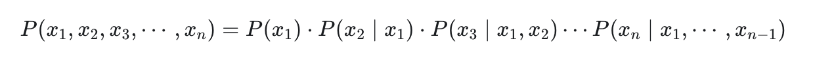
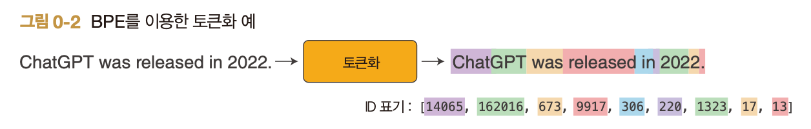
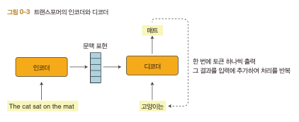
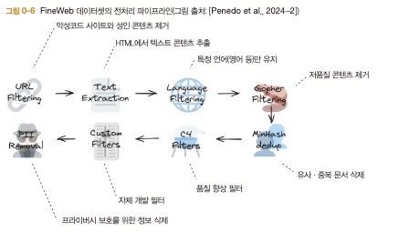
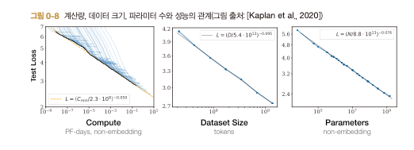

# Ch0. LLM이 만들어지기까지
## 개요

- 트랜스포머 → 사전 학습 → SFT → DPO/GRPO
- CodeBot / StoryBot / WebBot

LLM의 기본 패턴

1. 토크나이저 : 텍스트를 모델이 이해할 수 있는 토큰 ID sequence로 변환
    - BPE(Byte Pair Encoding) 알고리즘 구현
    - 텍스트가 어떤 원리로 효율적인 ID열로 변환되는가 → 알고리즘을 최적화할수록 속도가 개선되는 것을 확인
2. 모델 : 토큰 ID sequence로부터 다음 토큰 예측
    - 트랜스포머 아키텍처
    - 어텐션 기술 - 어떻게 정보를 주고받는지, 마스크를 활용하는지
3. 학습 : 대량의 텍스트에서 언어 패턴을 익히고, 사람의 지시에 따르도록 조정
    - 사전 학습
    - 지도 학습 (SFT, Supervised Fine-Tuning)
    - 강화 학습
        1. GRPO(Group Relative Policy Optimization)
        2. DPO(Direct Preference Optimization)

CodeBot : 파이썬 코드를 작성해주는 챗봇

- GPT-2 모델 구현
- 소규모 데이터셋(약 6MB)
- 간단한 대화, 계싼 처리
- 지시에 따라 파이썬 코드 작성
- 결과 품질이 그닥 좋지는 않아서 LLM의 핵심 기술을 두루 체험하는 것이 목표

StoryBot : 어린이용 이야기 생성 LLM

- GPT-2 기반
- 더 큰 데이터셋(약 2GB)
- 토크나이저의 처리 속도를 높이고, 더 큰 데이터셋에서 효율적으로 학습 가능
- 고급 학습 기법으로 텍스트 생성 깊이 체험

WebBot 

- 인터넷 상의 대규모 데이터 (10GB 이상)
- 실무 LLM 구축에 가까운 경험

### 실습 환경

- GPU 권장
- 무료 GPU 환경 제공 서비스
    - https://colab.research.google.com/
    - https://www.kaggle.com/code
- 고성능 GPU 클라우드
    - RunPod
    - Lambda
    - Vast.ai

## 구성 요소

- 언어 모델 : 주어진 문자열이 ‘얼마나 자연스럽고 적절한지’를 확률로 나타내는 모델
    - 텍스트 데이터만으로 학습 가능
    - (입력, 정답) 레이블 쌍을 자동 생성하는 방식
        
        → 어떤 입력이 주어졌을 때 다음에 오는 단어는? 의 답을 사람의 개입 없이 자동으로 만들어 효율적으로 모델을 발전시킬 수 있음
        
- **‘다음 단어 예측’으로 문장의 확률을 계산하는 방식**
    - 문장 전체의 확률은 조건부 확률의 연쇄 법칙에 따라 다음과 같이 분해할 수 있다.
        
        
        
        - 여기서 각각은 문장을 구성하는 단어에 대응됨
        - 이 식으로부터, 각 위치에서 ‘그때까지의 단어가 주어졌을 때 다음 단어의 확률’을 계산하고, 그 값들을 모두 곱하여 문장 전체의 확률을 구할 수 있다
- 토큰화
    - LLM은 문장을 토큰 단위로 처리한다
    - BPE(Byte Pair Encoding) 기법
        
        
        
        - 대량의 텍스트 데이터에서 자주 등장하는 패턴 학습 → 분할 규칙 도출
        - 공백 문자도 단어 경계를 나타내는 주요 정보로 취급됨
- 트랜스포머
    - 2017년에 구글에서 제안한 신경망 아키텍처
    - GPT, Llama 등의 모델에서 핵심 기술로 쓰임
        - 디코더 전용 모델
            
            
            
            - 토큰 ID열 → 다음 토큰의 확률 분포 계산 방식으로 문장 생성
    - 어텐션 - 어떤 토큰에 주목해야 하는가를 동적으로 계산하는 트랜스포머의 핵심 기술

## LLM의 사전 학습

> 대량의 텍스트를 읽으며 언어의 쓰임과 일반적인 지식을 익히는 과정
> 
- 인터넷에서 수집한 텍스트 데이터를 사용 (여러 단계의 정제 필요)
- 연구용 데이터셋 - FineWeb https://huggingface.co/datasets/HuggingFaceFW/fineweb
    
    
    
    - 40TB 이상의 방대한 규모 보유
- 토크나이저 학습
    - 텍스트 → 토큰ID(int) 로 변환하는 역할
    - 모델은 이 토큰ID열로 다음 토큰을 예측하므로, **토크나이저의 품질이 모델 전체 성능에 큰 영향을 미침**
    - ChatGPT는 토크나이저와 모델의 학습 데이터셋이 서로 다른 것으로 알려짐
- 모델 학습
    - 모델의 크기나 학습 데이터 양을 늘릴수록 성능이 향상되는 **스케일링 법칙(Scaling Law)**을 기본으로 함
        
        > *계산량-데이터 크기-파라미터 수 3요소와 모델 성능 사이에는 멱법칙(power law)을 따르는 예측 가능한 관계가 존재한다*
        > 
        > 
        > 
        > 
- 베이스 모델의 특성
    - 주어진 프롬프트 뒤에 이어질 텍스트를 생성
    - 대화/지시 능력은 따로 갖추지 X
    - In-Context 학습 : 프롬프트로 주어진 예만 단서로 삼아, 파라미터 갱신 없이 새로운 과제에 대응하는 능력
        - few-shot prompting 기법도 이와 유사

## LLM의 사후 학습

> LLM의 출력을 사람의 가치관과 선호에 맞추는 정렬을 구현하기 위한 핵심 과정
> 
- **SFT(지도 파인튜닝)**
    - 베이스 모델에 비서로서 행동하는 법을 가르치는 것
    - 기존의 방대한 데이터셋 기반에서 대화로부터 지식을 끌어내 **적절한 형태로 출력하는 방식**을 배움
    - 사람이 직접 작성한 대화를 데이터셋으로 사용하며, 이는 모델이 학습할 수 있는 형태로 변환되어야 함
        
        **[대화 구조화 방법]**
        
        - ChatML(Chat Markup Language) : `<|im_start|>`, `<|im_sep|>`, `<|im_end|>`와 같은 특수 토큰으로 모델에 특별한 의미를 전달
        - `<|im_sep|>` - 역할 / 발언 내용을 구분
        - 사용자 vs 비서 중 어느 쪽에서 말할 차례인지 등의 정보를 담음
- **강화 학습**
    - 에이전트(행동 주체)가 환경과 상호작용하며 가장 큰 보상을 얻는 최적 행동을 학습하는 기법
    - 보상 설계 방법을 기준으로 구분됨
        1. 사람의 피드백을 활용한 강화 학습
            - RLHF(Reinforcement Learning from Human Feedback)
                - 보상 모델을 사용
                - 텍스트 입력 → 그 답변이 얼마나 좋은지 수치로 평가
                - ‘선호 데이터’를 사용하여 비교 데이터를 학습하는 방식으로 훈련
            - DPO(Direct Preference Optimization)
                - 선호 데이터를 직접 이용해 모델 최적화 (보상 모델을 거치지 X)
                - 더 효율적이고 안정적인 학습 가능
        2. 검증 가능한 보상을 활용한 강화 학습
            - 답변이 올바른지 자동으로 판정할 수 있는 기준을 활용 (주관성 ↓) → 단계적으로 사고하는 능력을 익히는 방식
                
                > 
                > 
                > 
                > *다음은 사용자와 비서의 대화입니다. 사용자가 질문하고, 비서가 이를 해결합니다.
                > 비서는 먼저 마음속으로 사고 과정을 거친 후, 사용자에게 답을 제시합니다.
                > 사고 과정과 답은 각각 <think> </think>와 <answer> </answer> 태그로 감쌉니다.
                > 사용자: prompt
                > 비서:*
                > 
                - 추론 모델은 <think> 태그 안에서 더 긴 추론을 전개하며 답을 도출해나감
            - DeepSeek-R1-Zero가 이 기법을 활용
                - 고성능 베이스 모델 + 강화 학습만 적용하여 높은 성능을 달성함