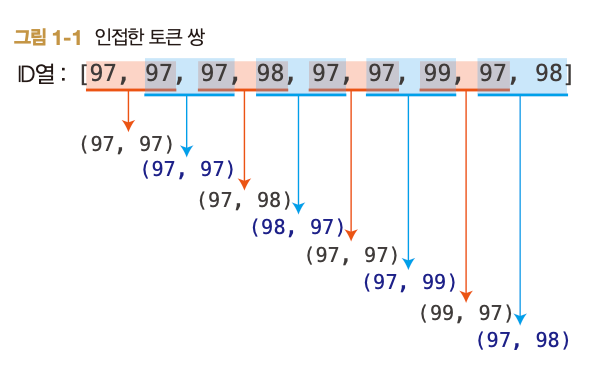

# Ch1. 토크나이저 (기본편)

- BPE(Byte Pair Encoding): 효율적인 토큰 목록(어휘)을 학습하는 알고리즘
- 토큰화 : 텍스트를 토큰 단위로 분할하여, 모델이 다룰 수 있는 숫자(ID) 시퀀스로 변환하는 작업

## 문자 단위 토큰화

> 문자 → 숫자(ID) 변환 시 **유니코드 코드 포인트**를 활용

- 인코딩 : 텍스트 → ID 시퀀스 변환
- 디코딩 : ID 시퀀스 → 텍스트 복원

```python
class CharTokenizer:
    def encode(self, text):
        return [ord(char) for char in text]

    def decode(self, ids):
        return ''.join(chr(i) for i in ids)

# 사용 예시
tokenizer = CharTokenizer()
text = "hello월드😁"

ids = tokenizer.encode(text)
print(ids)
# [104, 101, 108, 108, 111, 50900, 46300, 128513]

decoded = tokenizer.decode(ids)
print(decoded)
# hello월드😁
```

**[문자 단위 토크나이저의 문제점]**

유니코드에는 약 15만 개의 문자가 존재해, 문자 단위 토크나이저의 어휘 크기도 매우 커짐

- 모델의 임베딩/출력 계층 파라미터 증가
- 계산 비용과 메모리 사용량 증가
- 거의 사용되지 않는 문자까지 어휘에 포함
- 새로운 문자를 별도로 처리해야 할 수 있음

## 바이트 단위 토큰화

> 문자열을 UTF-8 바이트열로 변환

```python
class ByteTokenizer:
    def encode(self, text):
        return list(text**.encode("utf-8")**)

    def decode(self, ids):
        return **bytes(**ids).decode("utf-8")


# 사용 예시
tokenizer = ByteTokenizer()
text = "hello월드😁"

ids = tokenizer.encode(text)
print(ids)
# [104, 101, 108, 108, 111, 236, 155, 148, 235, 147, 156, 240, 159, 152, 129]

print(tokenizer.decode(ids))
# hello월드😁
```

- 문자별 UTF-8 크기
  1. 영문 ASCII - 1byte
  2. 한글 - 3byte
  3. 일부 이모지 - 4byte
  → 문자에 따라 필요한 바이트 수가 다르지만, 결국 0~255의 정수로 이루어진 열로 변환됨
- 각 바이트의 값을 하나의 토큰으로 간주하면 어휘 크기를 단 256개로 고정 가능

**[바이트 단위 토크나이저의 문제점]**

- 토큰 열이 길어짐
- 계산 효율 저하 : 계산 비용, 메모리 사용량 증가
- 학습 효율 저하 : 하나의 의미 덩어리가 여러 토큰으로 나뉘어 패턴 학습이 어려워짐

## BPE의 학습 알고리즘

> 대량의 텍스트 데이터에서 **자주 출현하는 바이트열(토큰 쌍)**을 찾고, 이를 묶어 하나의 새로운 토큰으로 처리하는 것

- 학습 과정
  1. 초기화 : 텍스트를 바이트열(0~255 정수열)로 변환
  2. 쌍 빈도 계산 : 인접한 토큰 쌍의 출현 횟수 계산

     

  3. 병합 : 가장 자주 출현하는 쌍을 새로운 토큰으로 치환
     - BPE(Byte Pair Encoding): 효율적인 토큰 목록(어휘)을 학습하는 알고리즘
- 토큰화 : 텍스트를 토큰 단위로 분할하여, 모델이 다룰 수 있는 숫자(ID) 시퀀스로 변환하는 작업

## 문자 단위 토큰화

> 문자 → 숫자(ID) 변환 시 **유니코드 코드 포인트**를 활용

- 인코딩 : 텍스트 → ID 시퀀스 변환
- 디코딩 : ID 시퀀스 → 텍스트 복원

```python
class CharTokenizer:
    def encode(self, text):
        return [ord(char) for char in text]

    def decode(self, ids):
        return ''.join(chr(i) for i in ids)

# 사용 예시
tokenizer = CharTokenizer()
text = "hello월드😁"

ids = tokenizer.encode(text)
print(ids)
# [104, 101, 108, 108, 111, 50900, 46300, 128513]

decoded = tokenizer.decode(ids)
print(decoded)
# hello월드😁
```

**[문자 단위 토크나이저의 문제점]**

유니코드에는 약 15만 개의 문자가 존재해, 문자 단위 토크나이저의 어휘 크기도 매우 커짐

- 모델의 임베딩/출력 계층 파라미터 증가
- 계산 비용과 메모리 사용량 증가
- 거의 사용되지 않는 문자까지 어휘에 포함
- 새로운 문자를 별도로 처리해야 할 수 있음

## 바이트 단위 토큰화

> 문자열을 UTF-8 바이트열로 변환

```python
class ByteTokenizer:
    def encode(self, text):
        return list(text**.encode("utf-8")**)

    def decode(self, ids):
        return **bytes(**ids).decode("utf-8")


# 사용 예시
tokenizer = ByteTokenizer()
text = "hello월드😁"

ids = tokenizer.encode(text)
print(ids)
# [104, 101, 108, 108, 111, 236, 155, 148, 235, 147, 156, 240, 159, 152, 129]

print(tokenizer.decode(ids))
# hello월드😁
```

- 문자별 UTF-8 크기
  1. 영문 ASCII - 1byte
  2. 한글 - 3byte
  3. 일부 이모지 - 4byte
  → 문자에 따라 필요한 바이트 수가 다르지만, 결국 0~255의 정수로 이루어진 열로 변환됨
- 각 바이트의 값을 하나의 토큰으로 간주하면 어휘 크기를 단 256개로 고정 가능

**[바이트 단위 토크나이저의 문제점]**

- 토큰 열이 길어짐
- 계산 효율 저하 : 계산 비용, 메모리 사용량 증가
- 학습 효율 저하 : 하나의 의미 덩어리가 여러 토큰으로 나뉘어 패턴 학습이 어려워짐

## BPE의 학습 알고리즘

> 대량의 텍스트 데이터에서 **자주 출현하는 바이트열(토큰 쌍)**을 찾고, 이를 묶어 하나의 새로운 토큰으로 처리하는 것

- 학습 과정
  1. 초기화 : 텍스트를 바이트열(0~255 정수열)로 변환
  2. 쌍 빈도 계산 : 인접한 토큰 쌍의 출현 횟수 계산

     !image.png

  3. 병합 : 가장 자주 출현하는 쌍을 새로운 토큰으로 치환

     !image.png

     ID열: [256, 97, 98, 256, 99, 97, 98]
     어휘 크기: 257
     병합 규칙: {(97, 97): 256}

  4. 반복 : 목표 어휘 크기에 도달할 때까지 2~3단계 반복
- 핵심 동작
  - 1. 인접 토큰 쌍 세기
    ```python
    from collections import defaultdict

    def count_pairs(ids):
        counts = defaultdict(int)

        for pair in zip(ids, ids[1:]):
            counts[pair] += 1

        return counts


    # 사용 예시
    ids = [1, 2, 3, 1, 2]

    counts = count_pairs(ids)
    print(dict(counts))
    # {(1, 2): 2, (2, 3): 1, (3, 1): 1}

    **## zip() 활용
    zip(ids, ids[1:])

    ids         = [1, 2, 3, 1, 2]
    ids[1:]     = [2, 3, 1, 2]

    결과:
    (1, 2), (2, 3), (3, 1), (1, 2)**
    ```
  - 2. 선택한 토큰 쌍 병합하기
    ```python
    def merge(ids, pair, new_id):
        merged_ids = []
        i = 0

        while i < len(ids):
            if (
                i < len(ids) - 1
                and (ids[i], ids[i + 1]) == pair
            ):
                merged_ids.append(new_id)
                i += 2
            else:
                merged_ids.append(ids[i])
                i += 1

        return merged_ids


    # 사용 예시
    ids = [1, 2, 3, 1, 2]

    merged = merge(ids, (1, 2), 4)
    print(merged)
    # [4, 3, 4]
    ```
- BPE 학습 구현 코드
  ```python
  def train_bpe(text, vocab_size):
      # 문자열을 UTF-8 바이트 ID로 변환
      ids = list(text.encode("utf-8"))

      # 기본 바이트 어휘는 256개
      num_merges = vocab_size - 256
      merge_rules = {}

      for step in range(num_merges):
          counts = count_pairs(ids)

          # 더 이상 합칠 쌍이 없는 경우
          if not counts:
              break

          # 가장 자주 등장한 쌍
          best_pair = max(counts, key=counts.get)

          # 새 토큰 ID
          new_id = 256 + step
          merge_rules[best_pair] = new_id

          # 모든 해당 쌍 병합
          ids = merge(ids, best_pair, new_id)

      return merge_rules
  ```

  - 필요한 병합 횟수 = 최종 어휘 크기(vocab_size) - 초기 어휘 크기(256)
  - `max(counts, key=counts.get)` 으로 가장 빈번한 쌍 선택
    - 토큰 ID 크기 같은 추가 기준을 지정하면, 결과를 하나로 고정할 수 있음
      ```python
      best_pair = max(counts, key=lambda pair: (counts[pair], pair[0], pair[1]))
      ```

## BPE를 적용한 인코딩/디코딩

- **BPE 토크나이저**
  ```python
  class BPETokenizer:
      def __init__(self, merge_rules):
          self.merge_rules = merge_rules

          # 기본 토큰 0~255
          self.id_to_bytes = {
              i: bytes([i])
              for i in range(256)
          }

          # 병합 토큰의 실제 바이트열 구성
          for (left, right), new_id in merge_rules.items():
              self.id_to_bytes[new_id] = (
                  self.id_to_bytes[left]
                  + self.id_to_bytes[right]
              )

          self.vocab_size = len(self.id_to_bytes)
  ```

  - 토큰ID-바이트열 대응표 초기화 → 이후 학습된 병합 규칙으로 새로운 토큰ID에 대응하는 바이트열 구축
  - e.g. `(72, 101) → 259`
    72 → b"H"
    101 → b"e"
    259 → b"He"
- 인코딩 : 문자열을 UTF-8 바이트로 바꾼 후, **학습된 병합 규칙을 학습 순서대로** 적용
  ```python
  def encode(self, text):
      ids = list(text.encode("utf-8"))

      for pair, new_id in self.merge_rules.items():
          ids = merge(ids, pair, new_id)

      return ids
  ```

  - 병합 규칙 적용 순서가 중요 (뒤쪽 규칙에서 앞쪽의 병합 결과를 이용하므로)
- 디코딩 : 토큰 ID를 바이트열로 바꾼 후 모두 연결하고 UTF-8로 디코딩
  ```python
  def decode(self, ids):
      byte_list = [
          self.id_to_bytes[token_id]
          for token_id in ids
      ]

      text_bytes = b"".join(byte_list)

      return text_bytes.decode(
          "utf-8",
          errors="replace",
      )
  ```
- 기본 동작
  ```python
  # 학습된 병합 규칙
  merge_rules = {
      (105, 115): 256,  # "is"
      (256, 32): 257,   # "is "
      (105, 110): 258,  # "in"
      (72, 101): 259,   # "He"
  }

  # 토크나이저 생성
  tokenizer = BPETokenizer(merge_rules)

  # 텍스트 인코딩
  text = "Hello월드😁"
  ids = tokenizer.encode(text)
  decoded = tokenizer.decode(ids)

  print(ids)
  # [259, 108, 108, 111, 236, 155, 148, 235, 147, 156, 240, 159, 152, 129]

  print(decoded)
  # Hello월드😁
  ```

## LLM용 토크나이저 구현

### 1. 특수 토큰

- 언어 모델이 다음 토큰을 예측하고, 그 중 하나를 선택하는 샘플링을 반복하며 문장을 생성하는데, 어디에서 멈추어야 하는지에 대한 신호가 필요함
- `<|endoftext|>` - 문서나 텍스트의 끝을 나타내는 GPT 시리즈의 대표적인 특수 토큰
  - 모델은 이 토큰이 출력되면 해당 지점에서 생성을 마친다
  - `document1<|endoftext|>document2<|endoftext|>document3` → 독립된 문서 3개 연결
  - 주요 용도
    - 문장 또는 문서의 종료 표시
    - 서로 다른 학습 문서의 경계 구분
    - 텍스트 생성을 종료할 시점 학습
    - 여러 문서를 하나의 긴 학습 데이터로 연결
  - 실제 GPT 계열에서는 더 다양한 특수 토큰이 사용됨
    <|endoftext|>
    <|endofprompt|>
    <|im_start|>
    <|im_end|>
- 특수 토큰을 고려한 BPE 학습
  - split()으로 텍스트 분할 → BPE 토큰 쌍의 출현 횟수 카운트 → 가장 자주 출현하는 쌍을 새로운 토큰으로 병합
  ```python
  # 학습 전 특수 토큰을 기준으로 문서 분리
  texts = input_text.split("<|endoftext|>")

  # 여러 문서의 인접 쌍 빈도 집계
  from collections import defaultdict

  def count_pairs(ids, counts=None):
      if counts is None:
          counts = defaultdict(int)

      for pair in zip(ids, ids[1:]):
          counts[pair] += 1

      return counts
  ```

  - 목표 어휘 크기가 260인 경우,
  - 기본 바이트 토큰: 256개
  - BPE 병합 토큰: 3개
  - 특수 토큰: 1개
    합계: 260개

### 2. 사전 토큰화

> BPE를 학습하기 전에 단어와 구두점 등 적절히 분리하는 처리 기법
> **→ BPE 토크나이저의 학습 효율을 크게 좌우하는 중요한 전처리**

- 같은 단어라도 구두점이 뒤에 붙으면 별도의 토큰으로 처리됨 → 어휘 낭비
  - e.g. “hello!” ≠ “hello?” ≠ “hello.”
- GPT-2 방식 사전 토큰화
  ```python
  import regex as re

  GPT2_PATTERN = re.compile(
      r"""'(?:[sdmt]|ll|ve|re)""" # 영어의 축약형 ('s, 'd, 'm, 't, 'll, 've, 're)
      r"""| ?\p{L}+""" # 단어(앞에 공백 포함 허용)
      r"""| ?\p{N}+""" # 연속된 숫자
      r"""| ?[^\s\p{L}\p{N}]+""" # 구두점이나 기호
      r"""|\s+(?!\S)""" # 공백 문자
      r"""|\s+"""
  )

  def pretokenize(text):
      return GPT2_PATTERN.findall(text)
  ```
  \*_파이썬 기본 `re`가 아니라 유니코드 문자 클래스 `\p{L}`, `\p{N}`을 지원하는 `regex` 라이브러리를 사용_
- BPE 학습에 사전 토큰화 적용
  1. 특수 토큰으로 분할 : 입력 텍스트를 <|endoftext|>로 분할
  2. 사전 토큰화 : 각 텍스트 조각에 pretokenize() 적용
  3. BPE 학습 : 위와 동일하게 토큰 쌍의 빈도 계산 후 병합
  [인코딩]
  ```python
  def encode(self, input_text, show_progress=False):
      pattern = f"({re.escape(self.end_token)})"
      parts = re.split(pattern, input_text) # 1. 텍스트 분할

      all_ids = []

      for part in parts: # 2. 분할된 각 사전 토큰에 BPE 인코딩 개별 적용
          if part == self.end_token:
              all_ids.append(self.end_token_id)
              continue

          for piece in pretokenize(part):
              ids = self._encode_text(piece)
              all_ids.extend(ids)

      return all_ids
  ```

## TinyCodes 데이터셋으로 학습

\*_코드, 주석, docstring 등을 담은 데이터셋 (약 2만 개 보유)_

!image.png

```python
vocab_size = 1000

with open(
    "codebot/tiny_codes.txt",
    encoding="utf-8",
) as file:
    text = file.read()

# 병합 규칙을 학습하여 파일로 저장
merge_rules = train_bpe(
    text,
    vocab_size=vocab_size,
)

##pickle 파일 형식 사용
with open("codebot/merge_rules.pkl", "wb") as file:
    pickle.dump(merge_rules, file)

-----
# 저장된 병합 규칙으로부터 토크나이저 생성
tokenizer = BPETokenizer.load_from(
    "merge_rules.pkl"
)
```

- e.g. 어휘 크기 1000
  기본 바이트 토큰 256개 + 학습된 병합 토큰 743개 + <|endoftext|> 1개 = 총 1000개

## 토크나이저 평가

- 학습된 토큰 확인하기 (처음에 학습된 10개 vs 마지막에 학습된 10개)
- 압축 효율 측정 - 토큰 하나당 평균 몇 바이트를 표현하는지 측정
  - `compression_ratio = byte_count / token_count`
  - 압축률이 높을수록 같은 텍스트를 더 적은 토큰으로 표현할 수 있음을 의미
- 상용화 토크나이저 비교
  | 토크나이저  | 어휘 크기 | 압축률 |
  | ----------- | --------- | ------ |
  | CodeBot     | 1,000     | 2.12   |
  | GPT-2       | 50,257    | 3.09   |
  | cl100k_base | 100,277   | 3.97   |
  - 어휘 크기가 크면 압축률은 좋아지지만 모델의 임베딩·출력 계층 파라미터와 계산량이 증가한다
  - 즉, 작은 모델에서는 반드시 큰 어휘가 좋은 것은 아니다
    ID열: [256, 97, 98, 256, 99, 97, 98]
    어휘 크기: 257
    병합 규칙: {(97, 97): 256}
  4. 반복 : 목표 어휘 크기에 도달할 때까지 2~3단계 반복
- 핵심 동작
  - 1. 인접 토큰 쌍 세기
    ```python
    from collections import defaultdict

    def count_pairs(ids):
        counts = defaultdict(int)

        for pair in zip(ids, ids[1:]):
            counts[pair] += 1

        return counts


    # 사용 예시
    ids = [1, 2, 3, 1, 2]

    counts = count_pairs(ids)
    print(dict(counts))
    # {(1, 2): 2, (2, 3): 1, (3, 1): 1}

    **## zip() 활용
    zip(ids, ids[1:])

    ids         = [1, 2, 3, 1, 2]
    ids[1:]     = [2, 3, 1, 2]

    결과:
    (1, 2), (2, 3), (3, 1), (1, 2)**
    ```
  - 2. 선택한 토큰 쌍 병합하기
    ```python
    def merge(ids, pair, new_id):
        merged_ids = []
        i = 0

        while i < len(ids):
            if (
                i < len(ids) - 1
                and (ids[i], ids[i + 1]) == pair
            ):
                merged_ids.append(new_id)
                i += 2
            else:
                merged_ids.append(ids[i])
                i += 1

        return merged_ids


    # 사용 예시
    ids = [1, 2, 3, 1, 2]

    merged = merge(ids, (1, 2), 4)
    print(merged)
    # [4, 3, 4]
    ```
- BPE 학습 구현 코드
  ```python
  def train_bpe(text, vocab_size):
      # 문자열을 UTF-8 바이트 ID로 변환
      ids = list(text.encode("utf-8"))

      # 기본 바이트 어휘는 256개
      num_merges = vocab_size - 256
      merge_rules = {}

      for step in range(num_merges):
          counts = count_pairs(ids)

          # 더 이상 합칠 쌍이 없는 경우
          if not counts:
              break

          # 가장 자주 등장한 쌍
          best_pair = max(counts, key=counts.get)

          # 새 토큰 ID
          new_id = 256 + step
          merge_rules[best_pair] = new_id

          # 모든 해당 쌍 병합
          ids = merge(ids, best_pair, new_id)

      return merge_rules
  ```

  - 필요한 병합 횟수 = 최종 어휘 크기(vocab_size) - 초기 어휘 크기(256)
  - `max(counts, key=counts.get)` 으로 가장 빈번한 쌍 선택
    - 토큰 ID 크기 같은 추가 기준을 지정하면, 결과를 하나로 고정할 수 있음
      ```python
      best_pair = max(counts, key=lambda pair: (counts[pair], pair[0], pair[1]))
      ```

## BPE를 적용한 인코딩/디코딩

- **BPE 토크나이저**
  ```python
  class BPETokenizer:
      def __init__(self, merge_rules):
          self.merge_rules = merge_rules

          # 기본 토큰 0~255
          self.id_to_bytes = {
              i: bytes([i])
              for i in range(256)
          }

          # 병합 토큰의 실제 바이트열 구성
          for (left, right), new_id in merge_rules.items():
              self.id_to_bytes[new_id] = (
                  self.id_to_bytes[left]
                  + self.id_to_bytes[right]
              )

          self.vocab_size = len(self.id_to_bytes)
  ```

  - 토큰ID-바이트열 대응표 초기화 → 이후 학습된 병합 규칙으로 새로운 토큰ID에 대응하는 바이트열 구축
  - e.g. `(72, 101) → 259`
    72 → b"H"
    101 → b"e"
    259 → b"He"
- 인코딩 : 문자열을 UTF-8 바이트로 바꾼 후, **학습된 병합 규칙을 학습 순서대로** 적용
  ```python
  def encode(self, text):
      ids = list(text.encode("utf-8"))

      for pair, new_id in self.merge_rules.items():
          ids = merge(ids, pair, new_id)

      return ids
  ```

  - 병합 규칙 적용 순서가 중요 (뒤쪽 규칙에서 앞쪽의 병합 결과를 이용하므로)
- 디코딩 : 토큰 ID를 바이트열로 바꾼 후 모두 연결하고 UTF-8로 디코딩
  ```python
  def decode(self, ids):
      byte_list = [
          self.id_to_bytes[token_id]
          for token_id in ids
      ]

      text_bytes = b"".join(byte_list)

      return text_bytes.decode(
          "utf-8",
          errors="replace",
      )
  ```
- 기본 동작
  ```python
  # 학습된 병합 규칙
  merge_rules = {
      (105, 115): 256,  # "is"
      (256, 32): 257,   # "is "
      (105, 110): 258,  # "in"
      (72, 101): 259,   # "He"
  }

  # 토크나이저 생성
  tokenizer = BPETokenizer(merge_rules)

  # 텍스트 인코딩
  text = "Hello월드😁"
  ids = tokenizer.encode(text)
  decoded = tokenizer.decode(ids)

  print(ids)
  # [259, 108, 108, 111, 236, 155, 148, 235, 147, 156, 240, 159, 152, 129]

  print(decoded)
  # Hello월드😁
  ```

## LLM용 토크나이저 구현

### 1. 특수 토큰

- 언어 모델이 다음 토큰을 예측하고, 그 중 하나를 선택하는 샘플링을 반복하며 문장을 생성하는데, 어디에서 멈추어야 하는지에 대한 신호가 필요함
- `<|endoftext|>` - 문서나 텍스트의 끝을 나타내는 GPT 시리즈의 대표적인 특수 토큰
  - 모델은 이 토큰이 출력되면 해당 지점에서 생성을 마친다
  - `document1<|endoftext|>document2<|endoftext|>document3` → 독립된 문서 3개 연결
  - 주요 용도
    - 문장 또는 문서의 종료 표시
    - 서로 다른 학습 문서의 경계 구분
    - 텍스트 생성을 종료할 시점 학습
    - 여러 문서를 하나의 긴 학습 데이터로 연결
  - 실제 GPT 계열에서는 더 다양한 특수 토큰이 사용됨
    <|endoftext|>
    <|endofprompt|>
    <|im_start|>
    <|im_end|>
- 특수 토큰을 고려한 BPE 학습
  - split()으로 텍스트 분할 → BPE 토큰 쌍의 출현 횟수 카운트 → 가장 자주 출현하는 쌍을 새로운 토큰으로 병합
  ```python
  # 학습 전 특수 토큰을 기준으로 문서 분리
  texts = input_text.split("<|endoftext|>")

  # 여러 문서의 인접 쌍 빈도 집계
  from collections import defaultdict

  def count_pairs(ids, counts=None):
      if counts is None:
          counts = defaultdict(int)

      for pair in zip(ids, ids[1:]):
          counts[pair] += 1

      return counts
  ```

  - 목표 어휘 크기가 260인 경우,
  - 기본 바이트 토큰: 256개
  - BPE 병합 토큰: 3개
  - 특수 토큰: 1개
    합계: 260개

### 2. 사전 토큰화

> BPE를 학습하기 전에 단어와 구두점 등 적절히 분리하는 처리 기법
> **→ BPE 토크나이저의 학습 효율을 크게 좌우하는 중요한 전처리**

- 같은 단어라도 구두점이 뒤에 붙으면 별도의 토큰으로 처리됨 → 어휘 낭비
  - e.g. “hello!” ≠ “hello?” ≠ “hello.”
- GPT-2 방식 사전 토큰화
  ```python
  import regex as re

  GPT2_PATTERN = re.compile(
      r"""'(?:[sdmt]|ll|ve|re)""" # 영어의 축약형 ('s, 'd, 'm, 't, 'll, 've, 're)
      r"""| ?\p{L}+""" # 단어(앞에 공백 포함 허용)
      r"""| ?\p{N}+""" # 연속된 숫자
      r"""| ?[^\s\p{L}\p{N}]+""" # 구두점이나 기호
      r"""|\s+(?!\S)""" # 공백 문자
      r"""|\s+"""
  )

  def pretokenize(text):
      return GPT2_PATTERN.findall(text)
  ```
  \*_파이썬 기본 `re`가 아니라 유니코드 문자 클래스 `\p{L}`, `\p{N}`을 지원하는 `regex` 라이브러리를 사용_
- BPE 학습에 사전 토큰화 적용
  1. 특수 토큰으로 분할 : 입력 텍스트를 <|endoftext|>로 분할
  2. 사전 토큰화 : 각 텍스트 조각에 pretokenize() 적용
  3. BPE 학습 : 위와 동일하게 토큰 쌍의 빈도 계산 후 병합
  [인코딩]
  ```python
  def encode(self, input_text, show_progress=False):
      pattern = f"({re.escape(self.end_token)})"
      parts = re.split(pattern, input_text) # 1. 텍스트 분할

      all_ids = []

      for part in parts: # 2. 분할된 각 사전 토큰에 BPE 인코딩 개별 적용
          if part == self.end_token:
              all_ids.append(self.end_token_id)
              continue

          for piece in pretokenize(part):
              ids = self._encode_text(piece)
              all_ids.extend(ids)

      return all_ids
  ```

## TinyCodes 데이터셋으로 학습

\*_코드, 주석, docstring 등을 담은 데이터셋 (약 2만 개 보유)_

```python
vocab_size = 1000

with open(
    "codebot/tiny_codes.txt",
    encoding="utf-8",
) as file:
    text = file.read()

# 병합 규칙을 학습하여 파일로 저장
merge_rules = train_bpe(
    text,
    vocab_size=vocab_size,
)

##pickle 파일 형식 사용
with open("codebot/merge_rules.pkl", "wb") as file:
    pickle.dump(merge_rules, file)

-----
# 저장된 병합 규칙으로부터 토크나이저 생성
tokenizer = BPETokenizer.load_from(
    "merge_rules.pkl"
)
```

- e.g. 어휘 크기 1000
  기본 바이트 토큰 256개 + 학습된 병합 토큰 743개 + <|endoftext|> 1개 = 총 1000개

## 토크나이저 평가

- 학습된 토큰 확인하기 (처음에 학습된 10개 vs 마지막에 학습된 10개)
- 압축 효율 측정 - 토큰 하나당 평균 몇 바이트를 표현하는지 측정
  - `compression_ratio = byte_count / token_count`
  - 압축률이 높을수록 같은 텍스트를 더 적은 토큰으로 표현할 수 있음을 의미
- 상용화 토크나이저 비교
  | 토크나이저  | 어휘 크기 | 압축률 |
  | ----------- | --------- | ------ |
  | CodeBot     | 1,000     | 2.12   |
  | GPT-2       | 50,257    | 3.09   |
  | cl100k_base | 100,277   | 3.97   |
  - 어휘 크기가 크면 압축률은 좋아지지만 모델의 임베딩·출력 계층 파라미터와 계산량이 증가한다
  - 즉, 작은 모델에서는 반드시 큰 어휘가 좋은 것은 아니다
