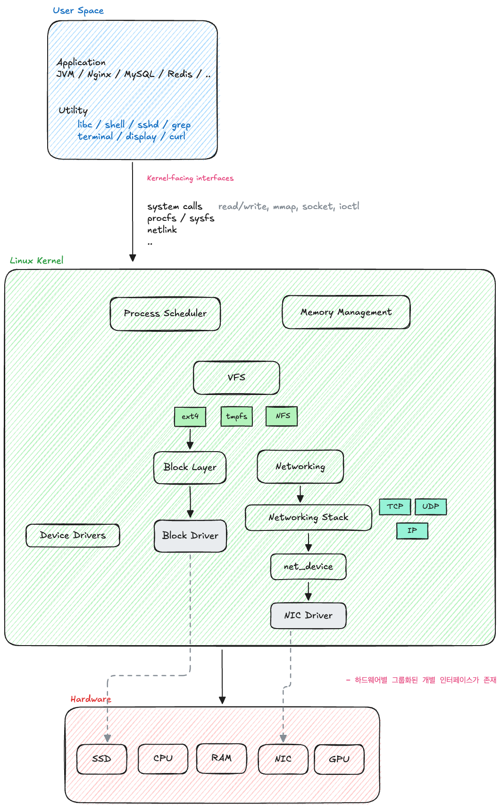
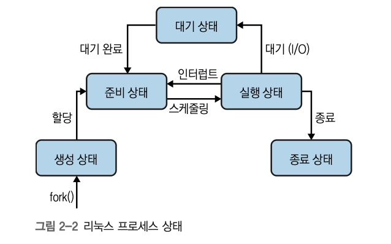
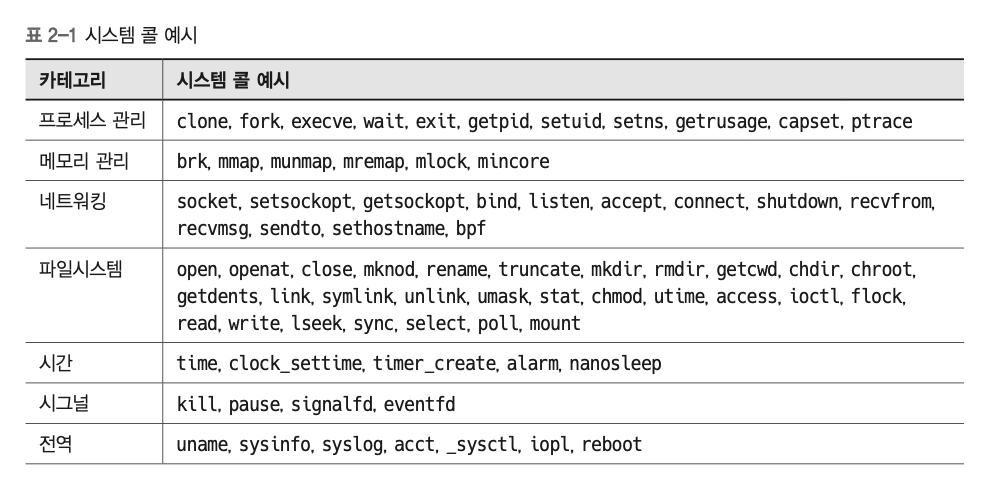
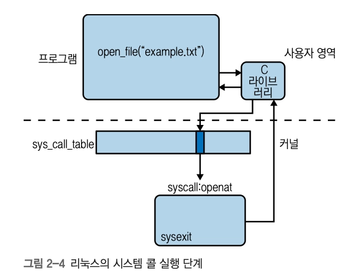
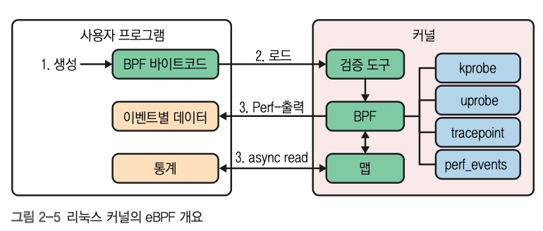

# 2장. 리눅스 커널

## 리눅스 아키텍처



1. 하드웨어 계층
   - CPU, 메인 메모리, 디스크 드라이브, 네트워크 인터페이스, 디바이스
2. 커널 계층 ⭐
3. 사용자 영역 계층
   - 사용자 모드 vs 커널 모드 — 하드웨어로의 접근 권한 및 추상화 수준에 따른 구분
   - → 커널과의 상호작용을 아는 것이 책에서 다루는 핵심

- **a~b 간의 통신을 위한 하드웨어별 그룹화된 인터페이스 모음이 존재 ⬇️**
- b~c 간의 통신을 위한 다양한 인터페이스 형태의 system 서비스(syscall, netlink, procfs 등)가 존재

## CPU 아키텍처

> CPU 인터페이스

- 리눅스 커널은 다양한 CPU 아키텍처별 코드를 지원하여 빠르게 새 하드웨어에 이식하여 사용할 수 있다
- 현재 실행 중인 CPU 파악하기
  - a. `lscpu` CPU 아키텍처와 topology 등의 요약 정보
  - b. `cat /proc/cpuinfo` CPU별 상세 정보
  - c. `uname -m` 현재 machine architecture 확인

    ```bash
    $ uname -m
    aarch64
    ```

  - d. BIOS와 상호작용하는 dmidecode 전용 도구 사용

- 자체 부트스트랩 시스템 : BIOS(Basic I/O System) \*모던 환경에서는 UEFI(Unified Extensible Firmware Interface)로 대체됨

### 종류

1. x86 아키텍처
   - 퍼블릭 클라우드의 기반
   - 에너지 효율이 높지 않음
   - Meltdown 등의 보안 이슈가 있음
     - out-of-order execution + speculative execution + microarchitectural state + 권한 검사/분기 예측의 타이밍이 결합되어 발생하는 취약점
2. ARM 아키텍처
   - RISC 기반
   - 최소한의 전력 소비에 초점 → x86보다 빠르고 저렴하며 발열량이 적고, 스펙터 위험X
   - 휴대용 디바이스, IoT 임베디드 시스템에서 주로 사용
3. RISC-V 아키텍처
   - open standard RISC
   - https://shapr.github.io/posts/2019-06-08-riscv-linux.html

## 커널 구성요소

- 리눅스 커널 맵 - https://makelinux.github.io/kernel/map/
- 리눅스 커널은 모놀리식 커널로 구성됨
  > **_Linux는 modular monolithic kernel이다. 주요 subsystem은 동일 kernel address space에서 동작하지만, 일부 기능과 driver는 loadable kernel module로 동적으로 추가/제거할 수 있다_**
  - 논리적으로는 모듈화되어 있어, 기능 블록 단위로 코드베이스가 나뉘어짐 ⬇️

### **프로세스 관리**

> 실행 파일 기반의 프로세스 시작

- CPU 아키텍처 관련 사항 (Interrupt) / 프로그램 실행, 스케줄링에 중점을 두는 파트로 나눌 수 있음
- 리눅스 프로세스 단위
  1. 세션 `SID` : job-control 단위. 선택적으로 tty가 연결된 상위 수준의 사용자 대면 유닛
  2. 프로세스 그룹 `PGID` : controlling terminal이 있는 경우 하나의 프로세스 그룹이 foreground 프로세스 그룹으로 지정됨
  3. 프로세스 `PID` : 주소 공간/스레드/소켓 등 여러 리소스를 그룹으로 추상화
  4. 스레드 `TID` / `TGID` : 커널에 의해 프로세스로 구현된 유닛 (프로세스 컨텍스트상에서의 실행 유닛)
     - 공유된 TGID는 멀티스레드 프로세스를 의미
  5. 태스크 - https://elixir.bootlin.com/linux/latest/source/include/linux/sched.h#L661 에 정의된 task_struct 데이터 구조로 프로세스와 스레드 구현의 기반을 형성

     ```bash
                      task_struct

            ┌─────────────┴─────────────┐
            │                           │

     single-thread process      multi-thread process

      task                       task ─── TID 100
      PID/TGID=100               task ─── TID 101
                                 task ─── TID 102
                                       │
                                    TGID 100
     ```

     - 이 작업 데이터 구조가 스케줄링에 관한 정보를 가진다
       
       리눅스 커널 관점 - 기본 스케줄링 엔티티 = 태스크
       | 프로세스 상태 | 표시 (`ps`/`top`) | 의미 | 다음 전환 조건 |
       | ---------------------- | ----------------- | ------------------------------------------------------------ | --------------------------------- |
       | 실행 중 / 실행 가능 | `R` | CPU에서 실행 중이거나, CPU 할당을 기다리는 상태 | CPU 할당 또는 선점 |
       | 인터럽트 가능한 대기 | `S` | 특정 이벤트나 자원을 기다리며 잠든 상태 | 이벤트 발생, 자원 확보, 신호 수신 |
       | 인터럽트 불가능한 대기 | `D` | 주로 디스크 I/O 등 커널 작업이 끝나기를 기다리는 상태 | 해당 작업 또는 자원 대기 완료 |
       | 중지됨 | `T` / `t` | 신호나 디버거에 의해 실행이 일시 중지된 상태 | `SIGCONT` 수신 등 |
       | 좀비 | `Z` | 실행은 끝났지만 부모가 종료 상태를 아직 회수하지 않은 상태 | 부모가 `wait()` 호출 |
       | 종료됨 | `X` | 완전히 종료되는 순간의 상태로, 일반적으로 거의 관찰되지 않음 | 프로세스 테이블에서 제거 |

### **메모리 관리**

> 프로세스에 메모리 할당, 파일을 메모리에 매핑 — 메인 메모리 인터페이스

- 메모리 관리는 프로세스 수준의 페이지 테이블을 통해 여러 가상 페이지가 동일한 물리 페이지를 가리키도록 해 최적으로 가상공간을 활용하는 방법
- CPU는 프로세스가 가상 페이지에 접근할 때마다 물리 주소로 변환하는 과정을 거쳐야 하는데, 이 속도를 높이기 위해 최신 CPU 아키텍처에서는 **TLB(translation lookaside buffer)**라는 조회용 on-chip(아주 작은 캐시)을 지원함
  - 커널 v2.6.3부터는 huge page를 지원
  - 64bit 리눅스 기준 - 최대 128TB의 가상 주소, 약 64TB의 물리 메모리 사용 가능
- `/proc/meminfo` 인터페이스
  - 사용 가능한 RAM의 양과 같은 메모리 관련 정보 파악에 유용한 도구

### **네트워킹**

> 네트워크 인터페이스 관리, 네트워크 스택 제공

- 리눅스의 네트워크 스택 계층
  1. 소켓
  2. TCP/UDP
  3. IP
- HTTP/SSH 같은 애플리케이션 계층 프로토콜은 주로 사용자 영역에서 구현됨
- `ip link` - 네트워크 인터페이스 개요 조회

### **파일시스템**

> 파일 관리, 파일 생성/삭제 지원, 블록 디바이스 드라이버 인터페이스

- 리눅스는 파일시스템을 사용해 HDD, SSD, Flash Memory 같은 저장 디바이스의 파일과 디렉터리를 구성한다
- 가상 파일시스템(VFS)을 통해 다양한 유형의 파일 시스템 제공 & 하나의 파일 시스템 인스턴스 여러 개 사용 가능
  - 최상위 계층 - open/close/write/read 등 공통 API 추상화
  - 최하위 계층 - 파일시스템에 대한 플러그인

### **캐릭터 디바이스와 디바이스 드라이버 관리**

> 캐릭터 디바이스, 하드웨어 인터럽트, 키보드, 터미널, 기타 I/O 등의 입력 디바이스

- 드라이버는 커널에서 실행되는 코드로, 실제 하드웨어 디바이스나 pseudo 디바이스(/dev/pts/)를 관리함
  - 정적 빌드 / 동적 로드(모듈 형태의 빌드로 지원) 모두 가능
- https://en.wikipedia.org/wiki/Graphics_processing_unit
- 드라이버 모델 - https://www.kernel.org/doc/html/latest/driver-api/driver-model/index.html

  > 핵심 - 리눅스 커널 안의 모든 하드웨어를 ***device, driver, bus***라는 공통 객체 모델로 정리하고, **bus가 device와 driver를 매칭해서 `probe()`를 호출**하는 구조
  > | 개념 | 역할 | 핵심 포인트 |
  > | -------------------- | --------------------------------- | ------------------------------------------------------------------------------------------------------ |
  > | struct device | 커널이 보는 “장치 객체” | 실제 하드웨어/가상 장치를 공통 방식으로 표현. 부모-자식 계층, 버스, sysfs 노출, 참조 카운트 등을 가짐 |
  > | struct device_driver | 커널이 보는 “드라이버 객체” | 특정 장치들을 제어할 수 있는 드라이버. `probe`, `remove`, `suspend`, `resume` 같은 콜백을 제공 |
  > | struct bus_type | 장치와 드라이버를 연결하는 중재자 | PCI, USB, platform 같은 버스가 여기에 해당. `match()`로 “이 드라이버가 이 장치를 지원하나?” 판단 |
  > | probe() | 바인딩 성공 후 초기화 진입점 | 매칭된 장치를 실제로 초기화하고, 드라이버 전용 상태를 붙이는 함수. 성공하면 device-driver binding 완료 |
  > | remove() | 장치/드라이버 제거 시 정리 | 할당한 리소스 해제, 연결 해제, sysfs 링크 제거 등을 처리 |
  > | sysfs | 유저스페이스에 보이는 장치 모델 | `/sys/bus/...`, `/sys/devices/...` 같은 계층으로 장치/버스/드라이버 관계를 노출 |
  > | devres | managed resource 관리 | 드라이버가 잡은 리소스를 장치 생명주기에 묶어 자동 정리하기 쉽게 해줌 |
  > [흐름]

  ```
  device_register()
      ↓
  bus가 등록된 driver 목록 순회
      ↓
  bus->match(device, driver)
      ↓
  매칭 성공
      ↓
  driver->probe(device)
      ↓
  성공하면 device와 driver가 bind됨
      ↓
  /sys에 관계가 노출됨
  ```

  \*드라이버가 나중에 로드되는 경우

  ```
  driver_register()
      ↓
  bus가 등록된 device 목록 순회
      ↓
  **아직 driver 없는 device와 match()**
      ↓
  probe()
  ```

- 디바이스 정보 조회
  - 드라이버와 상호작용할 수 있는 정보를 파악할 때 활용

## system call (syscall)

- 커널이 노출하는 서비스 인터페이스와 해당 사용자 영역의 엔티티 호출 모두 syscall의 모음이다
  - 약 300개 이상의 syscall이 존재
    
- 프로그램에서는 C 표준 라이브러리 형태로 syscall을 호출한다
  
  1. sys_call_table(함수 포인터 배열)에서 시스템 콜과 해당 핸들러 추적
  2. system_call() (멀티플렉서처럼 동작)를 사용해 하드웨어 컨텍스트 스택에 저장 & 검사 수행 → 해당하는 call의 인덱스로 점프
  3. sysexit로 시스템 콜 완료 신호를 받으면 래퍼 라이브러리가 하드웨어 컨텍스트를 복원하고 프로그램을 실행시킴
- `strace`
  - syscall의 실제 내부 흐름을 확인할 때 사용하는 도구
  - 사용자 영역~커널 사이에 이벤트 라이브 스트림을 가로채는 방식

  ```bash
  $ strace ls  # ls가 사용하는 시스템 콜을 캡쳐하라
  execve("/usr/bin/ls", ["ls"], 0x7ffe29254910 /* 24 vars */) = 0 # execve 시스템 콜 : /usr/bin/ls를 실행해 셸 프로세스 교체
  brk(NULL) = 0x5596e5a3c000 # brk 시스템 콜 : 메모리를 할당하는 오래된 방식
  ...
  access("/etc/ld.so.preload", R_OK) = -1 ENOENT (No such file or directory) # access 시스템 콜 : 프로세스가 특정 파일에 접근할 수 있는지 확인
  openat(AT_FDCWD, "/etc/ld.so.cache", O_RDONLY|O_CLOEXEC) = 3 # openat 시스템 콜 : O_RDONLY|O_CLOEXEC 플래그를 사용해 디렉터리 FD와 연관된 /etc/ld.so.cache 파일을 연다
  ...
  read(3, "\177ELF\2\1\1\0\0\0\0\0\0\0\0\0\3\0>\0\1\0\0\0p\0\0\0\0\0\0"..., 832) = 832 # read 시스템 콜 : FD로부터 832byte를 버퍼로 읽는다
  ```

  - **성능 진단에도 유용함 ⭐**
    - curl 명령의 시간이 어디서 주로 소비되는지 확인 → 아래에서는 mmap, read 에서 거의 보내는 것 확인 가능
    ```bash
    $ strace -c curl -s https://mhausenblas.info > /dev/null
    % time     seconds  usecs/call     calls    errors syscall
    ------ ----------- ----------- --------- --------- ----------------
      0.00    0.000000           0         2           eventfd2
      0.00    0.000000           0         8           fcntl
      0.00    0.000000           0         3         2 ioctl
      0.00    0.000000           0         2         1 statfs
      0.00    0.000000           0         3         1 faccessat
      **0.00    0.000000           0        65        17 openat**
      0.00    0.000000           0        55           close
      0.00    0.000000           0         2           getdents64
      0.00    0.000000           0         6           lseek
      **0.00    0.000000           0       101           read**
      0.00    0.000000           0         5           write
      0.00    0.000000           0        21           pread64
      0.00    0.000000           0        11           ppoll
      0.00    0.000000           0         5           newfstatat
      0.00    0.000000           0        51         1 fstat
      0.00    0.000000           0         1           set_tid_address
      0.00    0.000000           0        28           futex
      0.00    0.000000           0         1           set_robust_list
      0.00    0.000000           0        44           rt_sigaction
      0.00    0.000000           0         3           rt_sigprocmask
      0.00    0.000000           0        15           getpid
      0.00    0.000000           0         1           geteuid
      0.00    0.000000           0         5           socket
      0.00    0.000000           0         4         4 connect
      0.00    0.000000           0         3           getsockname
      0.00    0.000000           0         6           sendto
      0.00    0.000000           0        20         5 recvfrom
      0.00    0.000000           0         5           setsockopt
      0.00    0.000000           0         1           getsockopt
      0.00    0.000000           0        22           brk
      0.00    0.000000           0         2           munmap
      0.00    0.000000           0         1           clone
      0.00    0.000000           0         1           execve
      **0.00    0.000000           0       109           mmap**
      0.00    0.000000           0        41           mprotect
      0.00    0.000000           0         1           prlimit64
      0.00    0.000000           0         2           getrandom
      0.00    0.000000           0         1           rseq
    ------ ----------- ----------- --------- --------- ----------------
    100.00    0.000000           0       657        31 total
    ```

## 커널 확장

- 커널 버전 조회 → 커널 소스 코드에 기능을 추가해 커널 외부로 확장하자!
- 모듈이란? 요청 시 커널에 로드할 수 있는 프로그램 (recompile, reboot 불필요)
  - 최근의 리눅스는 대부분의 하드웨어를 자동으로 감지하여 모듈을 자동 로드한다
- `lsmod` - /proc/modules를 통해 조회 가능
  - pseudo 파일시스템 인터페이스를 통해 정보를 노출하는 커널

### eBPF


https://prototype-kernel.readthedocs.io/en/latest/bpf/ebpf_maps.html

- 현대의 커널 확장 기능으로 떠오르는 기술
- `bpf` syscall을 사용해 리눅스 커널 기능을 안전하고 효율적으로 확장
- 맞춤형 64bit RISC 명령어 세트를 사용한 커널 내 가상머신으로 구현됨
- 활용 사례
  1. 쿠버네티스 pod networking 활성화 플러그인 https://github.com/cilium/cilium
  2. Observability
     - 리눅스 커널 추적 https://github.com/bpftrace/bpftrace
     - 쿠버네티스 네트워크/보안 추적 https://github.com/cilium/hubble
  3. CNCF https://falco.org/에서 활용한 컨테이너 런타임 스캔
  4. Facebook의 L4 로드밸런싱에 활용 https://github.com/facebookincubator/katran

## Reference

커널

https://kernelnewbies.org/

https://www.cs.cornell.edu/courses/cs614/2007fa/Slides/kernel%20architectures.pdf

https://developer.ibm.com/articles/l-linux-kernel/

https://linux-kernel-labs.github.io/refs/heads/master/lectures/intro.html

https://github.com/udoprog/kernelstats

메모리 관리

https://www.kernel.org/doc/gorman/pdf/understand.pdf

https://hammertux.github.io/slab-allocator

디바이스 드라이버

https://opensource.com/article/18/11/how-install-device-driver-linux

https://www.apriorit.com/dev-blog/195-simple-driver-for-linux-os

시스템 콜

Linux Interrupt - https://www.cs.montana.edu/courses/spring2005/518/Hypertextbook/jim/media/interrupts_on_linux.pdf

https://faculty.nps.edu/cseagle/assembly/sys_call.html

---
