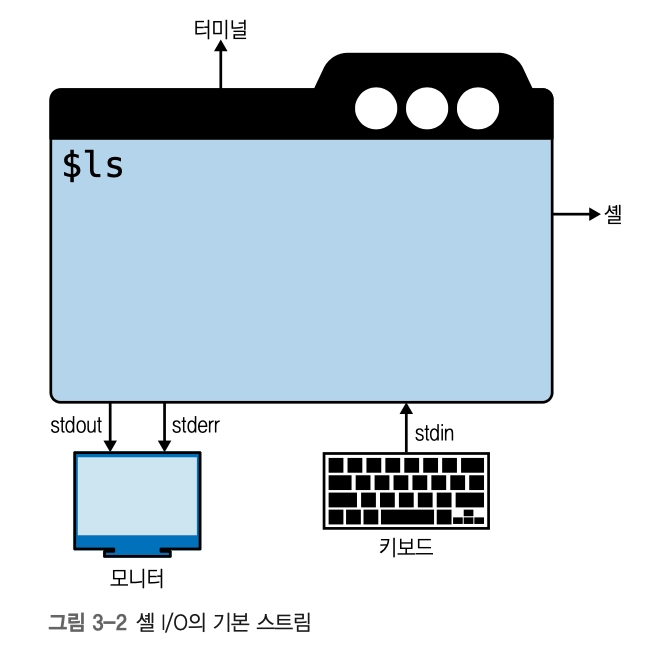
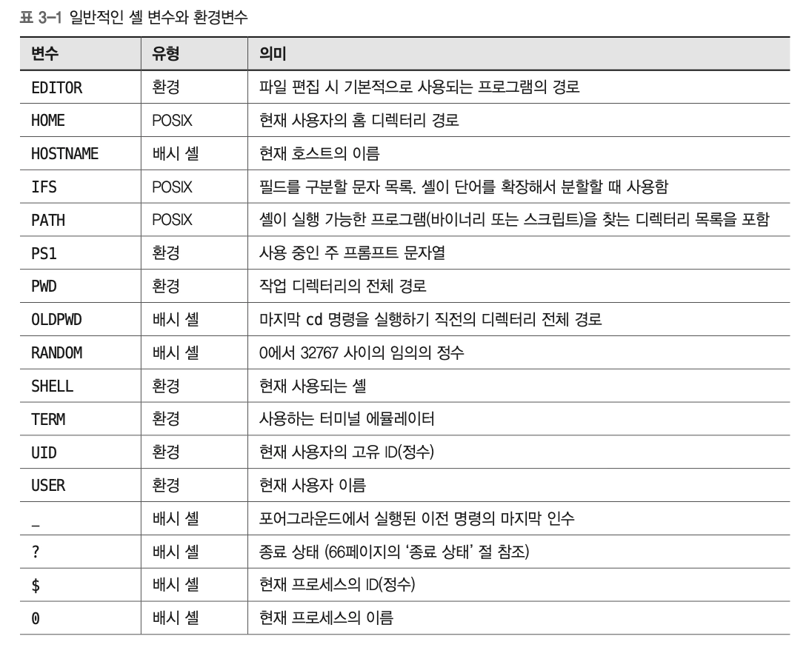
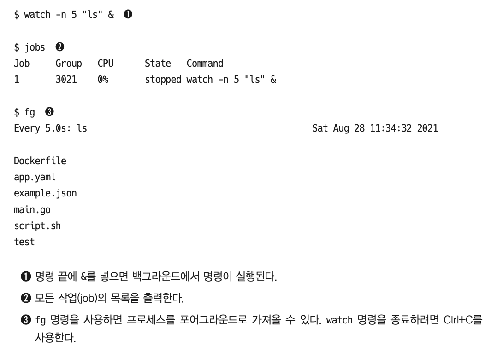

# 3장. 셸과 스크립팅

CLI 관점에서 리눅스와 상호작용하는 방법

1. 수동으로 명령 입력
2. 스크립팅으로 일련의 명령 자동화

## 기본 개요

### 터미널

> 텍스트로 된 UI를 제공하는 프로그램

= 터미널, 터미널 에뮬레이터, 소프트 터미널

- 커서, 화면 처리, 색상 등의 지원을 위해 https://en.wikipedia.org/wiki/ANSI_escape_code 지원
  | 코드 | 의미 | 대표 용도 |
  | --------------- | -------------- | --------------- |
  | `\n` | newline | 출력 |
  | `\t` | tab | 출력 정렬 |
  | `\\` | backslash | escaping |
  | `\r` | 줄 맨 앞으로 | progress |
  | `\033` / `\x1b` | ESC | ANSI 시작 |
  | `\0330m` | reset | **색상 초기화** |
  | `\033[1m` | bold | 강조 |
  | `\033[31m` | red | error |
  | `\033[32m` | green | success |
  | `\033[33m` | yellow | warning |
  | `\033[34m` | blue | info |
  | `\033[nA/B/C/D` | cursor 이동 | CLI/TUI |
  | `\033[K` | 줄 끝까지 삭제 | progress 갱신 |
  | `\033[2K` | 현재 줄 삭제 | CLI 갱신 |
  | `\033[2J` | 화면 삭제 | TUI |
  ```bash
  Shell escape
  │
  ├─ 문자 제어
  │   ├─ \n   줄바꿈
  │   ├─ \t   탭
  │   ├─ \r   줄 처음
  │   └─ \\   backslash
  │
  └─ Terminal 제어
      └─ \033[... / \x1b[...
           ├─ ...m     색/스타일
           ├─ ...A-D   커서 이동
           ├─ ...K     줄 삭제
           └─ ...J     화면 삭제
  ```
- `TERM` 환경변수는 사용 중인 터미널 에뮬레이터 값을 가지며, `infocmp`를 통해 구성 가능
- GPU 활용 터미널 - Alacritty, kitty, warp

### 셸

> 터미널 내부에서 실행되는 명령 인터프리터 역할의 프로그램

- 스트림을 통해 입출력 처리, 변수 지원, 빌트인 명령 존재
- 수동 / 스크립팅 방식 모두 지원
- `sh` 로 정의 (fyi. [POSIX sh - shell의 표준 문법을 의미)
  - 최근에는 bash 셸이 주로 쓰임

    ```bash
    Unix Shell

            POSIX(Standard)
                  │
       ┌──────────┼───────────┐
       │          │           │
     bash       dash        ksh
       │          │
     /bin/bash   /bin/sh
    ```

  - ksh(korn shell), csh(C shell)과 같은 변형도 있음
  - 어떤 sh를 사용 중인지 확인하려면?
    ```bash
    $ echo $0
    -bash
    $ echo $SHELL
    /bin/bash
    $ file -h /bin/sh
    /bin/sh: symbolic link to bash
    ```

**[기본 기능]**

- 스트림
  - 셸에 입력하는 명령은 키보드에서 입력(stdin)을 가져오고, 출력(stdout)을 화면에 전달한다. \***_default 동작_**
    - 스트림을 redirect하여 위 동작을 제어할 수 있다
    - `$FD>`, `<$FD`
      
      | FD | 이름 | 기본 연결 |
      | --- | ------ | --------- |
      | `0` | stdin | 키보드 |
      | `1` | stdout | 터미널 |
      | `2` | stderr | 터미널 |
      - `&>` : stdout, stderr 모두 redirect
      - `/dev/null` : 스트림 버리기
      - `&` : 백그라운드에서 실행 (명령 마지막에 배치)
      - `\` : 긴 명령의 가독성 개선을 위한 개행 지원
      - `|` : 한 프로세스의 stdout 값을 다음 프로세스의 stdin과 연결해 임시 저장 없이 즉시 전달
    - 문법 정리
      | 문법 | 의미 | 대상 FD | 예시 |
      | ---------------- | ------------------------ | ------- | ----------------------- |
      | `>` | stdout 덮어쓰기 | 1 | `ls > out.txt` |
      | `>>` | stdout 이어쓰기 | 1 | `echo hi >> log.txt` |
      | `<` | stdin 입력 | 0 | `sort < data.txt` |
      | `2>` | stderr 덮어쓰기 | 2 | `gcc main.c 2> err.log` |
      | `2>>` | stderr 이어쓰기 | 2 | `cmd 2>> error.log` |
      | `&>` _(Bash)_ | stdout+stderr 모두 | 1,2 | `cmd &> all.log` |
      | `2>&1` | stderr를 stdout으로 합침 | 2→1 | `cmd > log.txt 2>&1` |
      | `1>&2` | stdout을 stderr로 보냄 | 1→2 | `echo error 1>&2` |
      | `/dev/null` | 출력 버리기 | - | `cmd > /dev/null` |
      | `/dev/null 2>&1` | 모든 출력 버리기 | - | `cmd > /dev/null 2>&1` |

- 변수
  - 사용 케이스
    1. 리눅스가 노출하는 구성 항목을 처리하려는 경우 - 변수 read/write에 대한 일종의 인터페이스
       - e.g. 셸이 $PATH 변수에 저장된 실행 파일을 찾는 위치
    2. 스크립트에서 사용자에게 값을 대화 형식으로 질문하려는 경우
    3. 긴 값을 한 번 정의해 입력을 줄이려는 경우
  - 유형
    - 환경변수 - 셸 전체 설정으로, `env`로 목록 나열
    - 셸 변수 - 현재 실행 상황에 유효 - bash 관련 변수 목록 - https://www.gnu.org/software/bash/manual/html_node/Bash-Variables.html
      
      `echo $XXX` 명령으로 해당 값 조회 가능
  - `_=` : 환경변수로 내보내지 않았음을 의미
  - 실행결과

    ```bash
    $ echo $EDITOR

    $ echo $HOME
    /home/deploy
    $ echo $HOSTNAME
    techmem-cube-server01
    $ echo $IFS

    $ echo $PATH
    /home/deploy/.local/bin:/home/deploy/bin:/usr/local/bin:/usr/bin:/usr/local/sbin:/usr/sbin
    $
    ^[[A$ echo $PS1
    [\u@\h \W]\$
    $ echo $PWD
    /home/deploy
    $ echo $OLDPWD

    $ echo $RANDOM
    26431
    $ echo $SHELL
    /bin/bash
    $ echo $TERM
    xterm-256color
    $ echo $UID
    1100
    $ echo $USER
    deploy
    $ echo $_
    command_prexec
    $ echo $?
    0
    $ echo $$
    276033
    $ echo $0
    -bash
    ```

- 종료 상태
  - 정상 종료(happy path) **`0`**
  - 비정상 종료 **`1`~`255`**
  - `echo $?` : 종료 상태 확인
  - `$PIPESTATUS` 를 사용해 파이프 사용 시에 마지막 상태값만 사용하게 되는 것을 방지할 수 있다.
- 내장 명령어
  - yes, echo, cat, read
  - 프로그램 경로나 셸의 alias, 함수 확인 시 `which`보다 **`command -v`** 사용 권장
- 작업 제어
  
  - 기본 동작은 명령을 입력하면 해당 명령이 화면과 키보드를 제어하는 foreground 실행이다.
  - `&` 로 프로세스를 백그라운드로 보낼 수 있다.
    - 셸을 닫은 이후에도 프로세스를 지속하려면 `nohup` 을 앞에 추가한다.
    - 이미 실행된 이후라도 `disown`으로 무중단시킬 수 있다.
  - `kill` 로 다양한 수준의 강제성을 부여한 프로세스 제거가 가능하다.
- **작업 제어보다는 터미널 멀티플렉서 사용을 추천**

## 모던 리눅스 명령어

> 자주 사용하는 `cd`, `ls`, `find`, `cat`, `less`와 같은 명령을 효율적으로 사용하자!

1. 드롭인 교체(drop-in replacement)
2. 기능 확장

- 특징
  - 정상적인 기본값 제공
  - 일반적으로 이해하기 쉬운 풍부한 출력값
  - 동일한 작업에 대해 축소된 입력량
- `ls` → `exa` : 디렉터리 내용 나열
  - https://github.com/ogham/exa
  - clear 기능을 Ctrl+L 키로 대체
- `cat` → `bat` : 파일 내용 조회
  - https://github.com/sharkdp/bat
  - 구문 강조 표시, 인쇄 불가능 문자 표시, 깃 지원, 자체 페이저 기능 내장
- `find` + `grep` → `rg` : 파일에서 콘텐츠 검색
  - https://github.com/BurntSushi/ripgrep
    !image.png
- `awk`/`sed` → `jq` : JSON 데이터 파싱
  - https://jqlang.org/

### 일반 작업

- 자주 사용하는 명령어 단축하기
  - bash shell → **_alias_** / fish shell → **_abbreviations_**
- 행 탐색과 조작
  - Shell 탐색 및 편집 단축키
    | 동작 | 단축키 | 알파벳 의미(Mnemonic) | 비고 |
    | --------------------- | -------- | ------------------------- | ------------------------ |
    | 행의 시작으로 이동 ⭐ | `Ctrl+A` | **A = Ahead / Beginning** | Home과 동일 |
    | 행의 끝으로 이동 ⭐ | `Ctrl+E` | **E = End** | End와 동일 |
    | 문자 한 칸 앞으로 ⭐ | `Ctrl+F` | **F = Forward** | → |
    | 문자 한 칸 뒤로 ⭐ | `Ctrl+B` | **B = Backward** | ← |
    | 단어 앞으로 | `Alt+F` | **Forward Word** | 왼쪽 Alt 권장 |
    | 단어 뒤로 | `Alt+B` | **Backward Word** | |
    | 현재 문자 삭제 | `Ctrl+D` | **D = Delete** | EOF 역할도 함 |
    | 왼쪽 문자 삭제 | `Ctrl+H` | **H = Backspace** | ASCII Backspace(0x08) |
    | 왼쪽 단어 삭제 ⭐ | `Ctrl+W` | **W = Word** | 단어 삭제 |
    | 오른쪽 모두 삭제 ⭐ | `Ctrl+K` | **K = Kill** | Kill to End |
    | 왼쪽 모두 삭제 ⭐ | `Ctrl+U` | **Unix Kill Line** | Kill to Beginning |
    | 화면 지우기 ⭐ | `Ctrl+L` | **L = (c)Lear** | `clear`와 동일 |
    | 명령 취소 ⭐ | `Ctrl+C` | **C = Cancel** | SIGINT 전송 |
    | 실행 취소 | `Ctrl+\` | **Quit** | SIGQUIT (Core Dump 가능) |
    | 히스토리 검색 ⭐ | `Ctrl+R` | **R = Reverse Search** | 매우 자주 사용 |
    | 검색 종료 | `Ctrl+G` | **G = Go Back / Abort** | 일부 Shell |
- 긴 파일 보기
  - `head`, `tail`
  - `-f` : 실시간 출력

## 인간 친화적인 셸

### fish shell

https://fishshell.com/

- 명시적인 이력 관리X
- 자동완성&시각적 힌트 기능을 대다수 명령에 사용 가능


### zsh

https://zsh.sourceforge.io/Doc/

- 5개의 시작 파일 사용 (기본 $ZDOTDIR → $HOME)
- https://github.com/unixorn/awesome-zsh-plugins

### 최신 셸 목록

- **Oil Shell** → Bash를 현대적으로 개선한 스크립팅 Shell
- **Murex** → 타입이 있는 파이프라인을 지원하는 프로그래밍 지향 Shell
- **Nushell** → JSON/테이블 등 구조화된 데이터를 다루기 좋은 차세대 Shell
- **PowerShell** → Windows 및 인프라 자동화에 사실상 표준인 객체 기반 Shell

## 터미널 멀티플렉서

> 다중화(multiflexing)를 기반으로 터미널 사용 개선하기

- N개의 창을 띄워두고 동시에 상호 의존적인 작업을 수행하는 경우
- 논리적으로 하나의 단위에 속하는 작업을 그룹화한 것이 **`세션`**
- 터미널 멀티플렉서는 터미널 오버레이, 즉 터미널 I/O 다중화를 제공하여 여러 창을 띄워 작업하고, 윈도우/경로를 유지하며 세션 탐색이 가능하도록 지원한다
  - screen
  - tmux
    | 단위 | 의미 | 관계 / 특징 | 비유 |
    | ------------------ | ------------------------------------- | -------------------------------------------------------- | ------------------------------------ |
    | **세션 (Session)** | 특정 작업을 위한 **논리적 작업 환경** | 가장 큰 단위. 윈도·영역 등 모든 단위가 세션에 속함 | 프로젝트 X 작업 공간 / 브라우저 전체 |
    | **윈도 (Window)** | 세션 내부의 **작업 단위** | 선택 사항. 보통 세션당 하나의 윈도 사용 | 브라우저의 **탭** |
    | **영역 (Pane)** | **실행 가능한 단일 셸 인스턴스** | 윈도의 일부. 가로/세로 분할 가능, 확대·축소 및 닫기 가능 | 실제 **터미널 화면** |
    ```rust
    Session
    └── Window
        ├── Pane → Shell
        ├── Pane → Shell
        └── Pane → Shell
    ```
  - tmuxinator
    - tmux 세션을 관리할 수 있는 메타 도구
  - Byobu
    - screen 또는 tmux의 래퍼(wrapper)
    - Ubuntu·Debian 기반 리눅스 배포판에서 사용하기 좋은 선택
  - Zellij
    - "차세대 터미널 작업 공간"을 지향하는 터미널 멀티플렉서
    - Rust로 작성
    - 레이아웃 엔진과 강력한 플러그인 시스템 제공
    - tmux 이상의 기능을 목표로 함
  - dvtm
    - 터미널에 타일링 윈도우 관리 개념을 도입
    - 기능은 강력하지만 tmux보다 학습 난이도가 높은 편
  - 3mux
    - Go 언어로 작성된 간단한 터미널 멀티플렉서
    - 사용하기 쉽지만 tmux만큼 강력하지는 않음
  - Alacritty

## 스크립팅

- oils : 수천 행의 코드를 기록하는 shell script
- 고급 데이터 유형 - 배열 타입 지원
  ```sql
  os=('Linux','macOS','Windows')
  echo "${os[0]}" # 첫 번째 요소 접근
  numberofos="${#os[@]}" # 배열의 길이
  ```
- 흐름 제어 - 반복문 (for, while)
  !image.png
- 함수 정의 → 모듈화되고 재사용 가능한 스크립트 구성
- 고급 I/O
  - `read` : 런타임 입력 유도 시 사용하는 stdin의 사용자 입력 읽기
  - `signal`
  - `trap`
    ```sql
    $ trap -l
     1) SIGHUP	 2) SIGINT	 3) SIGQUIT	 4) SIGILL	 5) SIGTRAP
     6) SIGABRT	 7) SIGBUS	 8) SIGFPE	 9) SIGKILL	10) SIGUSR1
    11) SIGSEGV	12) SIGUSR2	13) SIGPIPE	14) SIGALRM	15) SIGTERM
    16) SIGSTKFLT	17) SIGCHLD	18) SIGCONT	19) SIGSTOP	20) SIGTSTP
    21) SIGTTIN	22) SIGTTOU	23) SIGURG	24) SIGXCPU	25) SIGXFSZ
    26) SIGVTALRM	27) SIGPROF	28) SIGWINCH	29) SIGIO	30) SIGPWR
    31) SIGSYS	34) SIGRTMIN	35) SIGRTMIN+1	36) SIGRTMIN+2	37) SIGRTMIN+3
    38) SIGRTMIN+4	39) SIGRTMIN+5	40) SIGRTMIN+6	41) SIGRTMIN+7	42) SIGRTMIN+8
    43) SIGRTMIN+9	44) SIGRTMIN+10	45) SIGRTMIN+11	46) SIGRTMIN+12	47) SIGRTMIN+13
    48) SIGRTMIN+14	49) SIGRTMIN+15	50) SIGRTMAX-14	51) SIGRTMAX-13	52) SIGRTMAX-12
    53) SIGRTMAX-11	54) SIGRTMAX-10	55) SIGRTMAX-9	56) SIGRTMAX-8	57) SIGRTMAX-7
    58) SIGRTMAX-6	59) SIGRTMAX-5	60) SIGRTMAX-4	61) SIGRTMAX-3	62) SIGRTMAX-2
    63) SIGRTMAX-1	64) SIGRTMAX
    ```

Bash scripting cheatsheet

### 이식 가능한 배시 스크립트란?

> 스크립트가 실행될 다양한 환경을 지원하는 스크립트로, 시스템 종류 및 버전에 따라 동작이 달라질 수 있어 **얼마나 다양한 환경에서 스크립트를 테스트할 수 있는지**가 중요

- 단순 텍스트 파일이 실행 가능한 스크립트가 되기까지
  1. `#!` 로 작성하는 shebang을 사용해 인터프리터 정의
  2. `chmod +x`(안전하게는 `chmod 750`) 로 실행 가능하도록 권한 부여
- 스켈레톤 템플릿

  ```sql
  #! /usr/bin/env bash # 프로그램 로더에게 배시를 사용하 이 스크립트를 해석하도록 지시
  set -o errexit # 오류 발생 시 스크립트 실행 중지
  set -o nounset # 설정되지 않은 변수는 오류로 처리하도록 정의
  set -o pipefail # 파이프 일부 고장 시 전체 고장으로 간주 (조용한 실패르 방지)

  firstargument="${1:-somedefaultvalue}"  # 기본값이 있는 명령행 매개변수 예제

  echo "$firstargument"
  ```

- good practice
  1. 빠르고 요란하게 실패한다
  2. 민감한 정보의 하드코딩은 하지 않는다
  3. 변수에 정상적인 기본값을 세팅하고, 소스로부터 받은 입력값을 깔끔하게 정리한다
  4. 특정 도구나 명령의 사용은 가정하지 않는다 (의존성)
  5. 스크립트 실패 시 사용자의 실행 지침을 제공한다
  6. 메인 블록의 스크립트를 인라인으로 문서화한다
  7. 깃과 같은 툴로 스크립트 버전을 관리한다
  8. 스크립트를 린트하고 테스트한다

### 스크립트 린트와 테스트

- ShellCheck 프로그램 : https://blog.davidjeddy.com/2018/11/27/using-shellcheck-to-lint-your-bash-sh-scripts/ (lint)
- 스크립트 포맷 정의 : sh
- 스크립트 테스트 : bats
- 모듈성 향상 : bashing, rerun, rr
