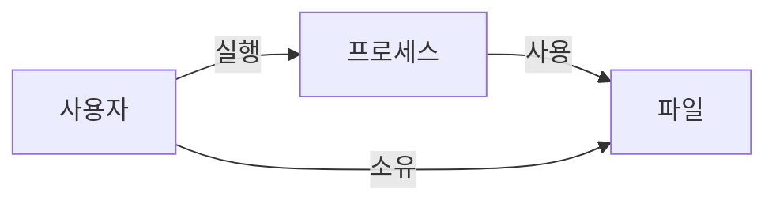

# 4장. 접근 제어

> 리눅스에서 작업을 할 때는 사용자-프로세스-파일 간의 관계를 늘 기억하자.

- “접근”의 관점에서 사용자-프로세스-파일 간 관계 살펴보기
- 샌드박스, 접근 제어 유형
- 리눅스 사용자 정의, 사용자가 할 수 있는 작업, 로컬/중앙 관리 방법
- 파일 접근 제어 방법 → 프로세스에 미치는 영향
- 접근 제어 공간 내 capability, seccomp profile, ACL 등 고급 리눅스 기능
- 리눅스와 같은 다중 사용자 운영체제에서 안전하게 작업을 수행하고 손상을 방지하기 위해 중요한 개념

## 기본 개요

### 리소스와 소유권



- 사용자
  - 프로세스를 실행하고 파일을 소유하는 주체
  - 각 사용자 계정은 사용자ID를 가짐
  - 파일을 사용하려면 프로세스를 통해야 함
- 파일
  - 사용자가 이용할 수 있는 하드웨어/소프트웨어 구성요소인 리소스
  - 시스템 콜과 같은 종류의 리소스 외에는 대부분 파일로 칭함
  - 소유자가 존재하며, 기본은 파일 생성자 = 소유자
- 프로세스
  - 의사소통과 지속성을 위해서 파일을 사용

### 샌드박스

- jail에서 컨테이너, 가상머시에 이르기까지 커널이나 사용자 영역에서 관리할 수 있는 다양한 방법
- 감시 메커니즘은 샌드박스의 프로세스와 호스트 환경 간 격리를 활용

### 접근 제어 유형

1. 임의 접근 제어(DAC, Discretionary Access Control)
   - 사용자의 신분을 기반으로 리소스 접근 제한
   - 특정 권한을 가진 사용자가 이를 다른 사용자에게 전달 가능
2. 강제 접근 제어(MAC, Mandatory Access Control)
   - 보안 수준을 나타내는 계층 모델 기반
   - 사용자 → 허용 등급 / 리소스 → 보안 레이블 할당
   - 허용 등급 이하의 리소스에만 접근 가능
   - 관리자(root)가 모든 권한을 설정 (strict / exclusive)
   - \*all-or-nothing 을 따름 (리눅스의 설계 기조) **→ 모던 리눅스에서는 이 이분법적 세계관을 깨고 더 세분화된 권한 관리를 허용함\***

> 기본값: 모든 파일에 읽기 접근을 허용하고, 모든 사용자가 이를 실행할 수 있도록 허용

- 보안 모듈
  - SELinux : 가장 잘 알려진 리눅스용 강제 접근 제어 구현 모듈 (정부 기관의 높은 보안 요구사항 충족)
  - AppArmor : Ubuntu 계열에서 널리 사용됨

## 사용자

1. 시스템 사용자/시스템 계정
   - daemon과 같은 유형의 계정으로 백그라운드 프로세스 실행
   - 운영체제 일부이거나 애플리케이션 계층에 위치
2. 일반 사용자
   - shell을 통해 리눅스를 대화식으로 사용

### UID

- 리눅스에서 관리하는 32bit 숫자값
- 리눅스는 UID를 통해 사용자를 식별하며, 사용자는 그룹 ID(이하 GID)를 통해 식별되는 하
  나 이상의 그룹에 속한다
- **UID 규칙**
  - UID `0` - root 사용자
  - UID `1`~`999` - 시스템 사용자
  - UID `65534` - nobody 사용자 (e.g. NFS로 접속가능한 원격 사용자)
  - UID `1000`~`65533` / `65536`~`4294967294` - 일반 사용자 \*배포판마다 상이함
- 자신의 UID 확인
  ```bash
  $ id -u
  ```

### 로컬에서 사용자 관리하기

> 파일 기반 인터페이스를 사용

| 목적                             | 파일         |
| -------------------------------- | ------------ |
| 사용자 데이터베이스              | /etc/passwd  |
| 그룹 데이터베이스                | /etc/group   |
| 사용자 비밀번호 (root 권한 필요) | /etc/shadow  |
| 그룹 비밀번호                    | /etc/gshadow |

- `/etc/passwd` : 사용자 이름, UID, 그룹 구성원, 그리고 일반 사용자를 위한 홈 디렉터리와 로그인 셸 같은 기타 데이터를 기록하는 일종의 작은 사용자 데이터베이스
- `adduser` : 사용자 추가
  - `-r` 옵션 : 로그인 셸 사용 기능 비활성화 & 홈 디렉터리 미생성
  - /etc/adduser.conf 에 옵션 목록 정리되어 있음

### 중앙집중식 사용자 관리

> 전문적인 설정으로 사용자를 관리해야 하는 시스템이나 서버가 둘 이상인 경우

- 디렉터리 기반 - LDAP
  - Keycloak, Azure Active Directory
- 네트워크 이용 - Kerberos)
- 구성 관리 시스템 사용
  - Ansible, Chef, Puppet, SaltStack

## 권한

### 파일 권한

```bash
$ ls -al
total 0

-rwxr-xr-x  1  mh9  devs  9  Apr 12 11:42  test
     │      │   │     │    │       │          │
     │      │   │     │    │       │          └─ ① 파일 이름
     │      │   │     │    │       └──────────── ② 마지막으로 수정한 타임스탬프
     │      │   │     │    └──────────────────── ③ 파일 크기(바이트)
     │      │   │     └───────────────────────── ④ 파일이 속한 그룹
     │      │   └─────────────────────────────── ⑤ 파일 소유자
     │      └─────────────────────────────────── ⑥ 하드링크 개수
     └────────────────────────────────────────── ⑦ 파일 모드

⑦ 파일 모드 상세

-rwxr-xr-x
│└─┬─┘└─┬─┘└─┬─┘
│  │    │    └─ ① 나머지 사용자의 권한
│  │    └────── ② 그룹의 권한
│  └─────────── ③ 파일 소유자의 권한
└────────────── ④ 파일의 형식
```

- 리소스에 접근한다는 의미를 가짐
- 읽기(r) / 쓰기(w) / 실행(x)
- s - setuid/setgid. 파일 소유자/그룹의 유효한 권한을 상속
- t - 디렉터리에만 관련된 sticky bit. 비root 사용자가 파일 삭제를 못하도록 방지

[파일 유형]

| 기호 | 의미                                     |
| ---- | ---------------------------------------- |
| `-`  | 일반 파일(예: `touch abc`를 한 경우처럼) |
| `b`  | 블록 특수 파일                           |
| `c`  | 캐릭터 특수 파일                         |
| `C`  | 고성능(연속 데이터) 파일                 |
| `d`  | 디렉터리                                 |
| `l`  | 심볼릭 링크                              |
| `p`  | 명명된 파이프(`mkfifo`로 생성)           |
| `s`  | 소켓                                     |
| `?`  | 기타(알 수 없는) 파일 형식               |

[파일 권한]

| 패턴  | 적용되는 권한    | 십진법 표기 |
| ----- | ---------------- | ----------- |
| `---` | 없음             | 0           |
| `--x` | 실행             | 1           |
| `-w-` | 쓰기             | 2           |
| `-wx` | 쓰기와 실행      | 3           |
| `r--` | 읽기             | 4           |
| `r-x` | 읽기와 실행      | 5           |
| `rw-` | 읽기와 쓰기      | 6           |
| `rwx` | 읽기, 쓰기, 실행 | 7           |

| 권한값 | 의미                                                                        |
| ------ | --------------------------------------------------------------------------- |
| `755`  | 소유자는 모든 권한을 가지며, 그룹과 나머지 사용자는 읽기와 실행 권한을 가짐 |
| `700`  | 소유자는 모든 권한을 가지며, 그룹과 나머지 사용자는 아무 권한이 없음        |
| `664`  | 소유자와 그룹은 읽기/쓰기 권한이 있으며, 나머지 사용자는 읽기만 가능함      |
| `644`  | 소유자는 읽기/쓰기가 가능하며, 그룹과 나머지 사용자는 읽기만 가능함         |
| `400`  | 소유자만 읽기 가능함                                                        |

- 664 : 내 시스템 내에서 파일을 생성할 때 할당되는 기본 권한으로, umask 0002로 확인됨
- `chmod` : 파일 권한 변경
- `chown` : 파일 소유권 변경

### 프로세스 권한

> 파일 권한이 “사용자 기준”이라면, 프로세스 권한은 “프로세스가 어떤 사용자 권한으로 실행되는가”를 말함

| 항목          | 핵심                                                                                       |
| ------------- | ------------------------------------------------------------------------------------------ |
| `RUID`        | 실제 사용자(real user) ID. 프로세스를 시작한 사용자를 나타냄                               |
| `EUID`        | 유효 사용자(effective user) ID. 프로세스가 실제로 권한 검사에 사용할 ID                    |
| 저장된 `SUID` | 권한을 잠시 바꿨다가 다시 되돌릴 수 있도록 저장해 둔 사용자 ID                             |
| `FUID`        | 파일 접근 권한 판단에 쓰이던 리눅스 전용 ID. 현재는 거의 필요 없고 호환성 때문에 남아 있음 |

- passwd에서 EUID는 자신의 UID로 세팅되고, suid 설정 활성화 시 EUID = 0 (root)
- 커널에서 프로세스 UID를 사용하는 케이스
  1. 신호를 보내기 위한 권한 설정 (`kill -9` → 어떤 일이 발생하는지 결정)
  2. 스케줄링과 우선 순위에 대한 권한 처리
  3. 리소스 제한 확인

## 고급 권한 관리

### 캐퍼빌리티

> _root 권한을 잘게 쪼갠 권한_
>
> **`목적`** 필요한 권한만 최소로 주자

- 리눅스에서는 root 사용자가 프로세스를 실행할 때 제한이 없다
- 커널의 동작
  - EUID=0(root) : 커널 권한 검사 우회
  - EUID≠0 : 권한 없는 프로세스에 대해, 커널이 권한 검사를 수행
- 커널 v2.2에 캐퍼빌리티 시스템 콜이 도입되면서 이분법적 세계관(_all-or-nothig_)이 깨지고, 스레드 개별 단위로 독립적인 권한 할당이 가능해졌다
- 일반적으로 시스템 수준의 작업에만 관련되므로, 대부분 캐퍼빌리티에 의존하지 않아도 된다

| 캐퍼빌리티       | 의미                                         | 예시                                        |
| ---------------- | -------------------------------------------- | ------------------------------------------- |
| `CAP_CHOWN`      | 파일 주인을 바꿀 수 있음                     | `chown user:group file`                     |
| `CAP_KILL`       | 남의 프로세스에도 신호를 보낼 수 있음        | 다른 사용자의 프로세스에 `kill` 보내기      |
| `CAP_SETUID`     | 실행 중에 다른 사용자로 변신 가능            | root 권한으로 잠깐 바꾸거나 특정 UID로 전환 |
| `CAP_SETPCAP`    | 프로세스의 capability를 조정 가능            | capability를 추가/제거하는 관리 작업        |
| `CAP_NET_ADMIN`  | 네트워크 설정을 바꿀 수 있음                 | IP, 라우팅, 방화벽, 인터페이스 설정         |
| `CAP_NET_RAW`    | 저수준 네트워크 패킷을 직접 다룰 수 있음     | `ping`, raw socket, packet socket           |
| `CAP_SYS_CHROOT` | 루트 디렉터리를 바꿔 격리 환경처럼 실행 가능 | `chroot /some/root`                         |
| `CAP_SYS_ADMIN`  | 시스템 관리 잡다한 강력 권한 묶음            | mount, namespace 등. 거의 작은 root         |
| `CAP_SYS_PTRACE` | 다른 프로세스를 들여다보거나 디버깅 가능     | `strace`, `gdb`, 메모리 관찰                |
| `CAP_SYS_MODULE` | 커널 모듈을 넣고 뺄 수 있음                  | 드라이버/커널 모듈 로딩                     |

- 위험도 순
  | 위험도 | 캐퍼빌리티 | 느낌 |
  | --------- | ------------------------------------------------ | ------------------------------ |
  | 중간 | `CAP_CHOWN`, `CAP_KILL`, `CAP_SYS_CHROOT` | 특정 작업 권한 |
  | 높음 | `CAP_NET_ADMIN`, `CAP_SETUID`, `CAP_SYS_PTRACE` | 시스템/프로세스에 꽤 깊게 개입 |
  | 매우 높음 | `CAP_SYS_ADMIN`, `CAP_SYS_MODULE`, `CAP_SETPCAP` | 거의 root급으로 조심해야 함 |

- `getcap` / `setcap` 으로 캐퍼빌리티를 세분화된 파일 단위로 관리할 수 있다

### seccomp 프로필

> \*보안 컴퓨팅 모드(secure computing mode) **→ 샌드박스 기술\***

- `seccomp(2)`라는 전용 시스템 콜을 사용해 프로세스가 사용 가능한 시스템 콜을 제한한다
- Docker, Kubernetes 모두 seccomp를 지원함
  - https://docs.docker.com/engine/security/seccomp/
  - https://kubernetes.io/docs/tutorials/security/seccomp/

### 접근 제어 목록 (ACL)

> _Access Control List를 통해 전통적인 권한 위에 추가로 사용 가능한 유연한 권한 메커니즘_

- ACL을 통해 사용자 그룹에 속하지 않은 사용자나 그룹에 권한을 부여하는 것이 가능
- 파일시스템에 ACL을 사용하려면 마운트 시 acl 옵션으로 활성화해야 한다

## Best Practice

1. 최소 권한 - 모든 사람과 프로세스는 주어진 작업을 수행하는 데 **필요한 권한만** 가져야 한다
   1. 권한 부여 시에는 기호 모드보다 숫자 모드로 명시적 부여하는 것이 좋음 (기호 모드가 덜 엄격)
   2. 되도록 root 사용은 지양. root 로그인보다 sudo를 사용하자
2. setuid 지양 - 공격자가 악용하기 좋은 파괴력을 지님. 캐퍼빌리티 사용 권장
3. Auditing - 모든 작업들을 변조할 수 없는 (read-only) 방식으로 결과 로그에 기록
