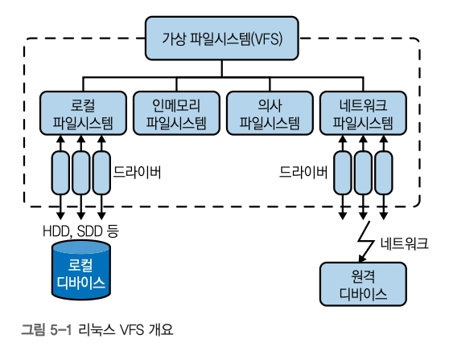
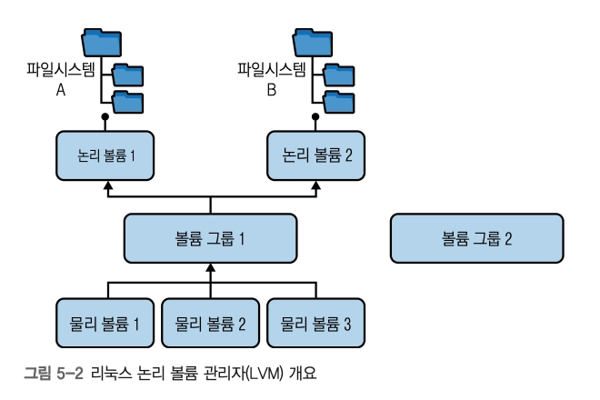
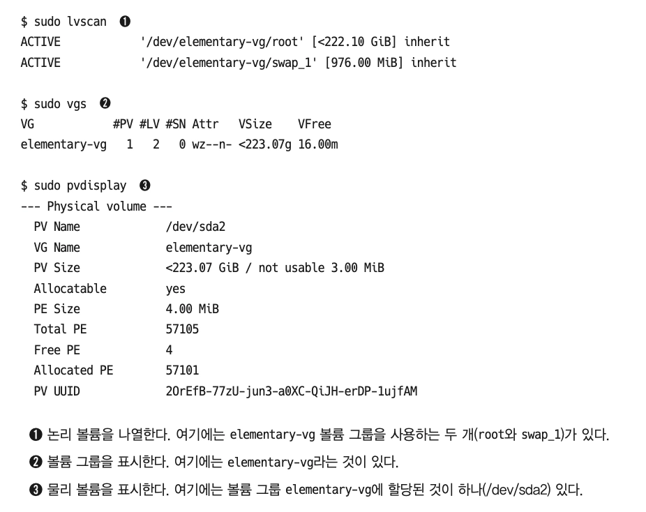
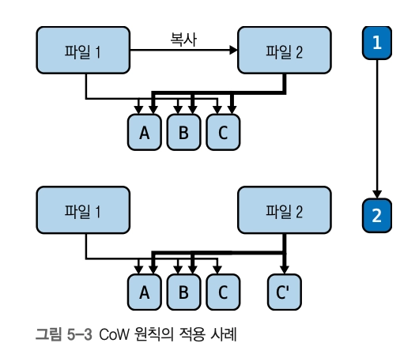

# 5장. 파일시스템

## 기본 개요

- 파일시스템은 계층 구조(tree)로 구성된다
  - root : 단일 파일시스템 tree
  - 2가지 객체로 구성
    1. 디렉터리 - 파일을 그룹화하는 조직 단위 (= Node, Leaf)
    2. 파일 (= Leaf)
- 권한이 내장되어 있다
  - 소유권은 할당된 권한을 통해 파일, 디렉터리에 대한 접근을 제어한다
- 일반적으로 파일시스템은 커널에서 구현된다

### 용어 정의

- drive : HDD/SSD 같은 블록 디바이스
- partition : 드라이브를 논리적으로 분할한 스토리지 섹터의 집합
  - e.g. HDD에 2개 파티션 생성 ⇒ /dev/sdb1, /dev/sdb2
- volume : 파티션과 유사, 특정 파일시스템용으로 포맷될 수 있음
- super block : 시스템 포맷 시, 파일시스템의 시작 부분에 생성되는 파일시스템 메타데이터를 캡쳐하는 특수 섹션
  - 이 안에는 파일시스템의 유형, 블록, 상태, 블록당 inode 수 등의 정보가 포함됨
- inode : 크기, 소유자, 위치, 날짜, 권한 등의 파일 메타데이터 저장 (실제 파일명, 데이터는 제외)
  - 디렉터리에 보관 ⇒ 디렉터리가 아이노드-파일명을 매핑해준다고 볼 수 있음

### 링크

> 다른 이름의 파일을 참조하거나 단축어를 제공하고 싶을 때 사용

1. 하드 링크 - inode를 참조하며 디렉터리는 참조 불가. 파일시스템이 다르면 동작 불가
2. 심볼릭 링크 (소프트링크, symllink) - 파일의 내용이 다른 파일의 경로를 나타내는 문자열인 특수 파일

| 명령어                   | 사용 예제                                |
| ------------------------ | ---------------------------------------- |
| `lsblk`                  | 모든 블록 디바이스 나열                  |
| `fdisk`, `parted`        | 디스크 파티션 관리                       |
| `blkid`                  | UUID와 같은 블록 디바이스 속성 표시      |
| `hwinfo`                 | 하드웨어 정보 표시                       |
| `file -s`                | 파일시스템과 파티션 정보 표시            |
| `stat`, `df -i`, `ls -i` | 아이노드와 관련된 정보 표시 및 목록 출력 |

## 가상 파일시스템



- https://elixir.bootlin.com/linux/v7.2/source/Documentation/filesystems/vfs.rst
- 리눅스는 VFS라는 추상화를 통해 다양한 리소스에 파일과 유사한 접근을 제공한다.
  - 파일 체계를 기반으로 클라이언트가 동일하게 리소스에 접근할 수 있게 해준다
- 리소스 종류
  1. 로컬 파일 시스템 (ext3, XFS, FAT, NTFS)
  2. 인메모리 파일 시스템 (장기 저장 디바이스가 지원하지 않지만 RAM에 상주하는 유형. tmpfs)
  3. 의사 파일 시스템 (procfs)
  4. 네트워크 파일 시스템 (NFS, Samba, Netware)
- VFS 데이터 구조 - **include/linux/fs.h**
  - inode : 파일시스템의 핵심 객체
    - 캡처 유형, 소유권, 권한, 링크, 파일 데이터를 포함하는 블록 포인터, 생성/접근 통계 등
  - file : 열려 있는 파일 (path)
  - dentry : 디렉터리 항목. 부모-자식 모두 저장
  - super_block : 마운트 정보를 포함한 파일시스템
  - 그 외 : vfsmount와 file_system_type 포함
    | 카테고리 | 시스템 콜 예시 |
    | ---------- | -------------------------------------------------------- |
    | inode | `chmod`, `chown`, `stat` |
    | file | `open`, `close`, `seek`, `truncate`, `read`, `write` |
    | dentry | `chdir`, `getcwd`, `link`, `unlink`, `rename`, `symlink` |
    | 파일시스템 | `mount`, `flush`, `chroot` |
    | 그 외 | `mmap`, `poll`, `sync`, `flock` |

### 논리 볼륨 관리자 (LVM)

- 파일시스템과 물리 개체(드라이브, 파티션) 간의 간접 계층을 사용
- 리소스 폴링 방식으로 저위험, 무중단 확장과 스토리지의 auto scaling을 지원
- LVM 작동 방식
  
  - 물리 볼륨 (PV) - 디스크 파티션, 전체 디스크 드라이브, 기타 디바이스 등
  - 논리 볼륨 (LV) - VG에서 생성된 블록 디바이스. 파일시스템이 LV에 먼저 생성되어야 동작 \*개념적으로 파티션과 유사
  - 볼륨 그룹 (VG) - PV-LV의 중개자. 공동으로 리소스를 제공하는 PV pool
- 관리 툴
  
  - PV 관리 도구
    - lvmdiskscan
    - pvdisplay
    - pvcreate
    - pvscan
  - VG 관리 도구
    - vgs
    - vgdisplay
    - vgcreate
    - vgextend
  - LV 관리 도구
    - lvs
    - lvscan
    - lvcreate

### 파일시스템 작업

> 파티션이나 논리 볼륨에서 파일시스템을 생성하는 방법

1. 파일시스템 생성 - 리눅스 외 다른 OS에서는 포맷이라고도 함

   ```bash
   $ mkfs -t ext4 \ #ext4 유형의 파일시스템 생성
   		/dev/some_vg/some_lv #논리볼륨 /dev/some_vg/some_lv에 파일시스템을 생성한다
   ```

2. 생성한 파일시스템을 마운트 (파일시스템 트리에 삽입)

   ```bash
   $ mount -t ext4, tmpfs #마운트 목록 출력

   ## 마운트 시 필요한 2가지 input
   # 1. 연결하려는 디바이스
   # 2. 파일시스템 트리 내의 위치
   ```

   마운트는 시스템이 실행되는 동안만 유효하므로, 영구적으로 유지하려면 /etc/fstab 파일을 사용한다

### 범용 파일시스템 레이아웃

> 파일시스템의 내용을 구조화하자! = **_Filesystem Hierarchy Standard (FHS)_**

- 구조화할 항목
  - 프로그램 저장 위치
  - 프로그램 구성 데이터
  - 시스템 데이터
  - 사용자 데이터
- 실제로는 사용 중인 리눅스 배포판에 따라 레이아웃은 크게 달라짐
- 흔히 쓰이는 디렉터리 목록
  | 디렉터리 | 의미 |
  | -------------- | --------------------------------------------------------------------------- |
  | `bin`, `sbin` | 시스템 프로그램과 명령. 일반적으로 `/usr/bin`과 `/usr/sbin`에 링크되어 있음 |
  | `boot` | 커널 이미지와 관련 구성요소 |
  | `dev` | 디바이스 파일. 터미널, 드라이브 등 |
  | `etc` | 시스템 구성 파일 |
  | `home` | 사용자 홈 디렉터리 |
  | `lib` | 공유 시스템 라이브러리 |
  | `mnt`, `media` | 이동식 미디어용 마운트 지점. 예: USB 스틱 |
  | `opt` | 배포판 지정 디렉터리. 패키지 관리자가 파일을 호스팅할 수 있음 |
  | `proc`, `sys` | 커널 인터페이스. 의사 파일시스템 |
  | `tmp` | 임시 파일용 |
  | `usr` | 사용자 프로그램. 일반적으로 읽기 전용 |
  | `var` | 변하는 데이터. 로그, 백업, 네트워크 캐시 등 |

## 의사 파일시스템

- 파일시스템인 것처럼 가장하여 일반적인 ls, cd, cat 등의 방식으로 상호작용 가능
- **커널 인터페이스를 래핑한 것**
  - 프로세스에 대한 정보
  - 키보드 등 디바이스와의 상호작용
  - 데이터 소스나 싱크로 사용 가능한 특수 디바이스 유틸리티

### procfs

- 저수준 디버깅이나 시스템 도구 개발에 매우 유용
  - https://tanelpoder.com/2013/02/21/peeking-into-linux-kernel-land-using-proc-filesystem-for-quickndirty-troubleshooting/
  - 커널 문서, 소스코드와 함께 분석할 때 효율적

| 항목      | 유형     | 정보                                |
| --------- | -------- | ----------------------------------- |
| `attr`    | 디렉터리 | 보안 속성                           |
| `cgroup`  | 파일     | 제어 그룹                           |
| `cmdline` | 파일     | 커맨드라인                          |
| `cwd`     | 링크     | 현재 작업 디렉터리                  |
| `environ` | 파일     | 환경변수                            |
| `exe`     | 링크     | 프로세스 실행 파일                  |
| `fd`      | 디렉터리 | 파일 디스크립터                     |
| `io`      | 파일     | 스토리지 I/O(바이트/문자 읽기 쓰기) |
| `limits`  | 파일     | 리소스 한계                         |
| `mem`     | 파일     | 사용된 메모리                       |
| `mounts`  | 파일     | 사용된 마운트                       |
| `net`     | 디렉터리 | 네트워크 통계                       |
| `stat`    | 파일     | 프로세스 상태                       |
| `syscall` | 파일     | 시스템 콜 사용량                    |
| `task`    | 디렉터리 | 작업별(스레드별) 정보               |
| `timers`  | 파일     | 타이머 정보                         |

### sysfs

- `/sys` : 커널이 표준화된 레이아웃을 사용해 선택한 정보를 노출하는 리눅스 고유의 구조화된 방법
- sysfs 디렉터리
  | 디렉터리 | 정보 |
  | --------- | ---------------------------------------------------------------------- |
  | block/ | 발견된 블록 디바이스의 심볼릭 링크 |
  | bus/ | 커널에서 지원하는 각 물리 버스 유형마다 한 개씩 하위 디렉터리 존재 |
  | class/ | 디바이스 클래스 포함 |
  | dev/ | 2개의 하위 디렉터리 포함 - 블록 디바이스(block/), 문자 디바이스(char/) |
  | devices/ | 디바이스를 트리 형태로 표현한 정보 제공 |
  | firmware/ | 펌웨어 관련 속성 |
  | fs/ | 파일시스템의 하위 디렉터리 |
  | module/ | 커널에 로드된 각 모듈의 하위 디렉터리 |

- https://linux-kernel-labs.github.io/refs/heads/master/labs/block_device_drivers.html

### devfs

- 물리적 디바이스에서부터 난수 생성기/쓰기 전용 데이터 싱크에 이르는 모든 디바이스의 특수 파일을 호스팅
- 관리 디바이스 목록
  - 블록 디바이스
  - 문자 디바이스
  - 특수 디바이스 - 데이터 생성 및 조작 가능 (e.g. /dev/null, /dev/random)

## 일반 파일

### 범용 파일시스템

- 리눅스 배포판에서 사용되는 기본값
- 이동식 디바이스(USB, SD카드)
- CD/DVD 같은 읽기 전용 디바이스

| 파일시스템 | 지원 시기 | 파일 크기 | 볼륨 크기      | 파일 개수              | 파일명 길이 |
| ---------- | --------- | --------- | -------------- | ---------------------- | ----------- |
| `ext2`     | 1993년    | 2TB       | 32TB           | 10¹⁸                   | 255자       |
| `ext3`     | 2001년    | 2TB       | 32TB           | 변동 가능              | 255자       |
| `ext4`     | 2008년    | 16TB      | 1EB            | 40억                   | 255자       |
| `btrfs`    | 2009년    | 16EB      | 16EB           | 2¹⁸                    | 255자       |
| `XFS`      | 2001년    | 8EB       | 8EB            | 2⁶⁴                    | 255자       |
| `ZFS`      | 2006년    | 16EB      | 2¹²⁸바이트     | 디렉터리당 10¹⁴개 파일 | 255자       |
| `NTFS`     | 1997년    | 16TB      | 256TB          | 2³²                    | 255자       |
| `vfat`     | 1995년    | 2GB       | 해당 사항 없음 | 디렉터리당 2¹⁶         | 255자       |

- ext4 : 가장 널리 사용되는 파일시스템
  - 저널링 기능을 제공해 변경사항이 로그에 기록됨 → 빠른 복구 가능
- XFS : 워크스테이션용 저널링 파일시스템
  - 대용량 파일과 고속 I/O 지원
- ZFS : 파일시스템+볼륨 관리자 기능 결합
- FAT : 리눅스용 FAT 파일시스템 제품군
  - 이동식 미디어, 윈도우 시스템 등 상호운용성을 목적으로 함

### 인메모리 파일시스템

- debugfs : 디버깅에 사용되는 특수 목적 파일 시스템
- loopfs : 디바이스가 아닌 블록에 파일시스템 매핑
- pipefs : 파이프에 마운트된 특수(의사) 파일시스템
- sockfs : 네트워크 소켓을 파일처럼 보이게 만드는 또 다른 특수(의사) 파일시스템
- swapfs : 스와핑 실현에 사용
- tmpfs : 파일 데이터를 커널 캐시에 보관하는 범용 파일시스템

### Copy-on-write (CoW) 파일시스템



- I/O 속도를 높이는 동시에 공간을 적게 사용
  1. 블록 A/B/C로 이루어진 원본 파일인 파일1 → 파일2에 복사
     1. 실제 블록 복사X
     2. 메타데이터(블록 포인터)만 복사
  2. 파일2 수정 시, C블록만 복사됨(C’)
     1. 파일2는 수정되지 않은 블록 A/B를 가리키며, C’ 블록을 사용해 새 데이터를 캡쳐
- Union mount
  - 파일시스템 통합 — 디렉터리를 하나의 위치로 결합해서, 해당 디렉터리에 모든 참여 디렉터리가 결합된 내용이 포함된 것처럼 결과 디렉터리 사용자에게 보이게 하는 개념
  - Unionfs
    - 마운트 시 우선순위를 사용해 다른 파일시스템의 파일과 디렉터리를 overwrite할 수 있다
  - OverlayFS
    - 리눅스용 유니온 마운트 파일시스템 구현
    - 파일의 모든 작업이 기본 파일시스템에서 직접 처리됨
  - AUFS
    - advanced multilayered unification filesystem
    - docker의 기본값으로 사용됨
  - btrfs
    - b-tree 파일시스템
    - Oracle사에서 설계한 CoW
    - 스냅샷, 자동 데이터 손상 자동 감지 등의 기능 제공

```

```
