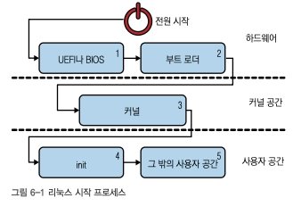
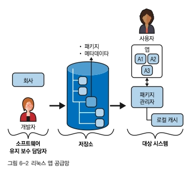
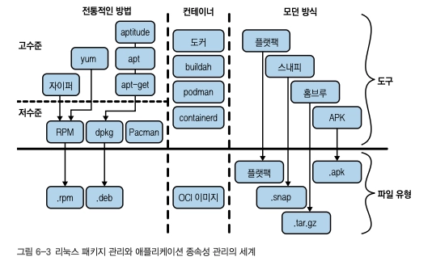
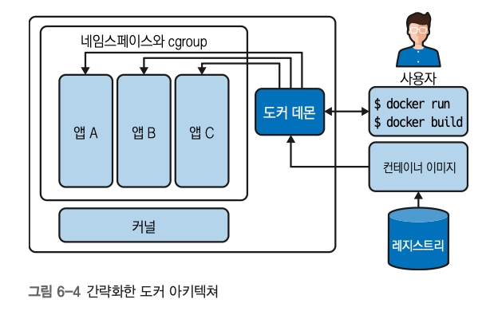
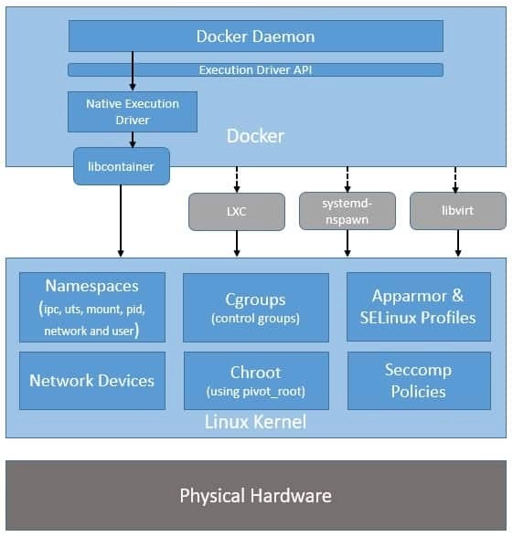

# 6장. 애플리케이션, 패키지 관리, 컨테이너
## 기본 개요

**앱을 완전히 이해하는 데 필요한 여러 전제 조건 - 리눅스 커널, 셸, 파일시스템, 보안* 

| 용어 | 정의 |
| --- | --- |
| 프로그램 | 컴퓨터가 실행할 수 있도록 작성된 명령어의 집합. 일반적으로 메모리에 로드하여 실행하는 바이너리 파일이나 셸 스크립트를 의미 |
| 프로세스 | 실행 중인 프로그램의 인스턴스. 메인 메모리에 로드되어 CPU와 I/O 등의 시스템 자원 사용 |
| 데몬 | 다른 프로세스에 특정 기능이나 서비스를 제공하기 위해 백그라운드에서 실행되는 프로세스. 일반적으로 이름이 `d`로 끝남 |
| 애플리케이션 | 사용자 인터페이스를 포함하며 특정 목적을 수행하는 실용적인 프로그램. 설치, 업그레이드, 제거 등 전체 수명 주기와 관련해 사용되는 용어 |
| 패키지 | 프로그램과 설정 등 소프트웨어 실행에 필요한 파일을 하나로 묶은 배포 단위 |
| 패키지 관리자 | 패키지의 구성 정보와 사용자 명령에 따라 패키지를 설치·업그레이드·제거하는 프로그램 |
| 공급망 | 패키지를 기반으로 소프트웨어를 생산·배포·판매하여 사용자가 애플리케이션을 이용할 수 있게 하는 생산자와 판매자의 생태계 |
| 부팅 | 하드웨어와 운영체제를 초기화해 리눅스를 사용할 수 있는 상태로 만드는 시작 과정. 커널 로딩과 서비스 또는 데몬 실행을 포함 |

## 리눅스 시작 프로세스

> https://en.wikipedia.org/wiki/Booting_process_of_Linux
> 


1. UEFI(Unified Extensible Firmware Interface) 사양은 부팅 구성(NVRAM에 저장), 부팅 로더를 정의
    1. POST(Power On Self Test)가 완료되면,
    2. 기본 I/O 시스템(BIOS)이 하드웨어를 초기화하고, (I/O port, Interrupt)
    3. 부트 로더에 제어권을 넘김
2. 부트 로더는 **커널을 부트스트랩하는 것**을 목표로 함 *부팅 매체에 따라 세부사항 상이
3. 커널을 추출해 메인 메모리에 로드 *커널은 일반적으로 압축된 형태로 `/boot` 디렉터리에 위치
    1. 하위 시스템, 파일시스템, 드라이버 초기화
    2. init 시스템에 제어권을 넘겨 부팅 프로세스 종료
4. init 프로세스(PID 1, `root`에 위치)는 시스템 전원을 끌 때까지 실행
    1. 시스템 전반에 걸쳐 데몬(시스템 프로세스)을 실행할 책임을 가짐
    2. 다른 데몬 실행 담당 외에 고아 프로세스 정리도 담당
5. 이후 다른 사용자 공간 수준의 초기화 진행
    1. 터미널, 환경, 셸 초기화
    2. 사용자 설정/구성을 고려해 GUI가 있는 데스크톱 환경용 디스플레이 관리자, 그래픽 서버 등 구동

- 사용가능한 Init 시스템 비교 - https://wiki.gentoo.org/wiki/Comparison_of_init_systems
- SysV 스타일의 Init이 리눅스의 전통적인 Init 시스템임
    - 유닉스로부터 물려받았으며, runlevel(halt, single-user, multi-user, GUI 모드 등의 시스템 상태)를 정의함
    - 데몬을 순차적으로 시작하고, 배포판 구성을 각각 다르게 처리한다는 점에서 이식성이 떨어짐

## systemd

> 리눅스의 시스템 및 서비스 관리자. 기존 `initd`를 대체했으며 로깅, 네트워크 구성, 시간 동기화 등 관리
> 
- 관리 단위 : 서비스와 시스템 자원을 **유닛(unit)** 단위로 정의하고 관리함
- 시작 방식 : 서비스 의존성 분석 → 가능한 작업은 병렬 실행
    - 순차적으로 실행하는 기존 init보다 부팅 시간 단축
- 주요 장점
    - 통합된 관리 방식
    - 간단한 서비스 구성
    - 상태 모니터링
    - cgroup 기반 자원 제어
    - watchdog 기능
- **systemd unit 종류 → 무엇을 언제 어떻게 실행할지 지시하는 방법**
    
    
    | 유닛 | 역할 |
    | --- | --- |
    | `service` | 서비스 또는 애플리케이션의 실행·종료·재시작 방법을 정의한다. |
    | `target` | 여러 유닛을 하나로 묶어 시스템의 특정 동작 상태나 시작 목표를 구성한다. |
    | `mount` | 파일 시스템의 마운트 지점을 정의한다. |
    | `timer` | 특정 시간이나 주기에 작업을 실행하도록 타이머를 정의한다. |
    | `socket` | 네트워크 또는 IPC 소켓을 정의한다. |
    | `device` | `udev`와 `sysfs`가 인식한 장치를 나타낸다. |
    | `automount` | 파일 시스템의 자동 마운트 지점을 구성한다. |
    | `swap` | 스왑 공간을 정의하고 관리한다. |
    | `path` | 특정 파일이나 경로의 변화를 감시해 관련 유닛을 실행한다. |
    | `snapshot` | 특정 시점의 systemd 유닛 상태를 저장해 이후 복원할 수 있게 한다. |
    | `slice` | cgroup과 연계하여 프로세스 그룹의 시스템 자원을 계층적으로 관리한다. |
    | `scope` | systemd 외부에서 생성된 프로세스 묶음을 systemd가 관리하도록 한다. |
- 유닛 파일 경로
    
    
    | 경로 | 용도 |
    | --- | --- |
    | `/lib/systemd/system` | 설치된 패키지가 제공하는 기본 유닛 파일을 저장 |
    | `/etc/systemd/system` | 시스템 관리자가 생성하거나 수정한 유닛 파일을 저장
    → 일반적으로 기본 설정보다 우선 |
    | `/run/systemd/system` | 현재 부팅 동안에만 유지되는 임시 런타임 유닛과 변경 사항을 저장 |

### systemctl로 관리하기

> systemd와의 상호 작용으로 서비스를 관리하는 도구
> 

| 명령 | 사용 케이스 |
| --- | --- |
| `systemctl enable XXXXX.service` | 서비스 활성화. 시작할 준비를 갖춤 |
| `systemctl daemon-reload` | 모든 유닛 파일을 다시 로드하고 전체 종속성 트리를 다시 생성함 |
| `systemctl start XXXXX.service` | 서비스 시작 |
| `systemctl stop XXXXX.service` | 서비스 정지 |
| `systemctl restart XXXXX.service` | 서비스 정지 후 새로 시작 |
| `systemctl reload XXXXX.service` | 서비스에 reload 명령을 보냄. restart로 돌아감 |
| `systemctl kill XXXXX.service` | 서비스 실행 중지 |
| `systemctl status XXXXX.service` | 일부 로그를 포함해서 서비스 상태에 대한 간단 요약 |
- bootcrl - 부트로더 상태 확인, 사용 가능한 부트로더 관리
- timedatectl - 시간과 날짜 정보 설정 및 조회
- coredumpctl - 저장된 코어 덤프 처리

### journalctl로 모니터링하기

> journal : system-journald 데몬의 관리 대상 바이너리 파일로, systemd 구성요소가 기록하는 모든 메시지/로그를 한 곳에 모은 것
> 

## 리눅스 애플리케이션 공급망

- *공급망이란?*
    - 소비자에게 제품을 공급하는 조직이나 개인들의 시스템
- In Linux Application
    
    
    
    [3가지 공급 영역]
    
    1. 소프트웨어 유지보수 담당자 = 소프트웨어 아티팩트를 생성하는 개발자/오픈소스 프로젝트/독립 소프트웨어 공급업체(ISV)
    2. 저장소 = 종속성이 담긴 패키지, 라이브러리, 일종의 export/import, 기타 서비스 프로그램 등 
    3. 도구(패키지 관리자)
    
    
    

## 패키지와 패키지 관리자

1. RedHat 계열 - RHEL, Fedora, CentOS
2. Debian 계열 - Debian, Ubuntu

- 패키지 그 자체 = 압축된 파일 하나 (메타데이터까지 포함)
- 도구 = 패키지 관리자 → 대상 시스템에서 해당 패키지 조회/설치/업데이트/삭제 등 관리, 저장소와 상호 작용, 패키지의 로컬 캐시 유지 관리

### RPM 패키지 관리자 (.rpm)

- 리눅스 표준 베이스에서 사용되며, 바이너리/소스 파일을 포함한다
- 암호로 패키지 검증
- 파일을 통해 델타 업데이트 지원
- 종류
    - yum - Amazon Linux, CentOS, Fedora, RHEL에서 사용
    - DNF - CentOS, Fedora, RHEL에서 사용
    - Zypper - openSUSE와 SUSE Linux Enterprise에서 사용

### 데비안 deb (.deb)

- 바이너리, 소스파일을 포함하며, 저수준/고수준 패키지 관리자 모두 다양하게 사용
- 종류
    - 고수준 패키지 관리자 - apt-get, apt, aptitude
    - 저수준 패키지 관리자 - dbkg

### 프로그래밍 언어별 패키지 관리자

- C/C++
    - `Conan`, `vcpkg` 등 다양한 패키지 관리자가 있음
- Go
    - 내장 패키지 관리자 사용
    - 예: `go get`, `go mod`
- Node.js
    - `npm` 등이 있음
- Java
    - `Maven`, `Nuts` 등이 있음
- Python
    - `pip`, `PyPM` 등이 있음
    - `PyPM`: Python Package Manager
- Ruby
    - `RubyGems`, `Rails`가 있음
- Rust
    - `cargo`가 있음

## 컨테이너

- 사용 사례
    1. 로컬 테스트
    2. 개발 - https://mhausenblas.medium.com/container-assisted-testing-b76ee74278b7
    3. 분산 시스템 작업 - e.g. 쿠버네티스의 컨테이너화된 마이크로서비스 작업 
- 시스템 관리자 대상의 컨테이너 도입 시도
    - Linux-VServer
    - OpenVZ
    - LXC
    - Imctfy(Let Me Contain That for You) https://github.com/google/lmctfy
- Docker에서 제공하는 방식
    1. 컨테이너 이미지를 통해 패키징 정의 = OCI(Open Container Initiative)
        
        [OCI 핵심 사양]
        
        - 런타임 사양 - 운영~수명주기 단계 포함 지원 항목 정의
        - 이미지 형식 사양 - 메타데이터/계층 기반의 이미지 구성 방식
        - 배포 사양 - 컨테이너 이미지의 전달 방식, 저장소 동작 방식 정의
    2. 인간 친화적인 사용자 인터페이스 (e.g. docker run)
- 불변성(immutability)
    - 한 번 구성되면 사용 중에 변경할 수 없다

## 리눅스 네임스페이스

> 리소스 가시성 → 운영체제 리소스의 다양한 측면을 격리하는 데 사용
> 
> - ***프로세스가 무엇을 보는가에 대한 격리***
- 네임스페이스 생성 방식
    1. clone - 실행 컨텍스트의 일부 → 부모 프로세스와 공유가능한 자식 프로세스를 만드는 데 사용 
    2. unshare - 기존 프로세스에서 공유된 실행 컨텍스트 제거 시 사용
    3. setns - 기존 프로세스 → 기존 네임스페이스에 결합
    
    [매개변수]
    
    | 플래그 | 용도 | 확인 방법 | 지원 버전 |
    | --- | --- | --- | --- |
    | `CLONE_NEWNS` | **파일시스템 마운트 지점** 격리 | `/proc/$PID/mounts` | Linux 2.4.19+ |
    | `CLONE_NEWUTS` | **호스트명과 NIS 도메인 이름** 격리 | `uname -n`, `hostname -f` | Linux 2.6.19+ |
    | `CLONE_NEWIPC` | System V IPC 객체, POSIX 메시지 큐 등 **IPC 리소스** 격리 | `/proc/sys/fs/mqueue`, `/proc/sys/kernel`, `/proc/sysvipc` | Linux 2.6.19+ |
    | `CLONE_NEWPID` | **PID 번호 공간** 격리 | `/proc/$PID/status` | Linux 2.6.24+ |
    | `CLONE_NEWNET` | 네트워크 디바이스, IP 주소, 라우팅 테이블, 포트 번호 등 **네트워크 리소스** 격리 | `ip netns list`, `/proc/net`, `/sys/class/net` | Linux 2.6.29+ |
    | `CLONE_NEWUSER` | 네임스페이스 안/밖의 **UID, GID 매핑** | `id`, `/proc/$PID/uid_map`, `/proc/$PID/gid_map` | Linux 3.8+ |
    | `CLONE_NEWCGROUP` | 네임스페이스에서 **cgroup** 관리 | `/sys/fs/cgroup`, `/proc/cgroups`, `/proc/$PID/cgroup` | Linux 4.6+ |

## 리눅스 cgroup

> 프로세스 그룹 구성 메커니즘
> 
- 시스템 리소스 사용 제어 (cgroup을 계층 구조와 함께 사용)
- 리소스 사용 추적 (e.g. RAM/CPU 사용량)
- cgroup = 선언형 유닛 / controller = 특정 리소스 제한을 적용 및 사용량을 보고하는 커널 코드

### cgroup v1

- 새로운 cgroup과 controller를 추가할 수 있는 애드혹 접근 방식
- 종류
    - CFS 대역폭 제어 - cpu cgroup
    - CPU 사용량 정산 컨트롤러 - cpuacct cgroup
    - cpusets cgroup - 작업에 CPU와 메모리 할당
    - 메모리 리소스 컨트롤러 - 작업의 메모리 동작 분리
    - 디바이스 화이트리스트 컨트롤러 - 디바이스 파일 사용 제어
    - freezer cgroup - 배치 작업 관리
    - 네트워크 분류기 - 패킷에 다른 우선순위 할당
    - 블록 IO 컨트롤러 - 블록 I/O 조절
    - perf_event 명령 - 성능 데이터 수집
    - 네트워크 우선순위 - 네트워크 트래픽의 우선순위 동적 설정
    - HugeTLB 컨트롤러 - HugeTLB 사용 제한
    - 프로세스 번호 컨트롤러 - 특정 제한 도달 후 cgroup 계층의 새 프로세스 생성 중단

### cgroup v2

- cgroup v1이 프로세스 단위로 구분된다면, v2는 단일 계층 구조만 가지고 모든 컨트롤러가 동일한 방식으로 관리되는 방식
- 종류
    - CPU 컨트롤러 - CPU 주기의 분산 제어
    - 메모리 컨트롤러 - 사용자 공간 메모리, dentry/inode 등 커널 데이터 구조, TCP 소켓 버퍼
    - I/O 컨트롤러 - 가중치 기반과 절대 대역폭, IOPS 제한으로 I/O 리소스의 분산 제어
    - PID 컨트롤러 - *v1과 유사
    - cpuset 컨트롤러  - *v1과 유사
    - device 컨트롤러 - eBPF 위에 구현된 디바이스 파일 접근
    - rdma 컨트롤러 - RDMA 리소스의 분산과 연산 제어
    - HugeTLB 컨트롤러  - *v1과 유사
    - 기타 - 다른 cgroup처럼 추상화를 못하는 대상(e.g. 스칼라 리소스)에 대해 리소스 제한/추적 메커니즘 허용
- v2 cgroup 조회
    
    ```sql
    $ systemsctl status
    $ systemd-cgtop # 대화식 리소스 사용량 뷰를 통해 cgroup 조회 가능
    ```
    

## Copy-on-Write (CoW) 파일시스템

> 애플리케이션과 모든 종속성을 배포 가능한 독립 파일 하나로 패키징
> 
- 주로 **Bind mounts**와 함께 사용되어 종속성이 서로 다른 콘텐츠를 효율적으로 계층화함

## Docker

- 빌딩 블록들 결합 시에 네임스페이스, cgroup 등의 저수준 비트관리 복잡성을 숨겨서 사용하기 쉽게 만듦
- 도커 아키텍처
    
    
    
    
    
    ref. https://www.baeldung.com/linux/docker-containers-evolution
    
- **자주 사용하는 명령어**
    
    
    | 명령어 | 설명 | 사용 예 |
    | --- | --- | --- |
    | `run` | 컨테이너 실행 | `docker run -d --rm nginx:1.21` |
    | `ps` | 컨테이너 나열 | `docker ps -a` |
    | `inspect` | 저수준 정보 출력 | `docker inspect -f '{{.NetworkSettings.IPAddress}}'` |
    | `build` | 로컬에서 컨테이너 이미지 생성 | `docker build -t some:tag .` |
    | `push` | 컨테이너 이미지를 레지스트리로 업로드 | `docker push public.ecr.aws/some:tag` |
    | `pull` | 레지스트리에서 컨테이너 이미지를 다운로드 | `docker pull public.ecr.aws/some:tag` |
    | `images` | 로컬 컨테이너 이미지 나열 | `docker images ubuntu` |
    | `image` | 컨테이너 이미지 관리 | `docker image prune -all` |
- 주요 개념
    1. **컨테이너 이미지**
        
        > 디렉터리 정보의 JSON, 계층의 메타디에터를 포함하는 압축된 아카이브 파일
        > 
        - 정의 시 구성 가능 항목
            - `FROM` : 기본 이미지
            - `LABEL` : 메타데이터
            - `ARGS` : 인자
            - `ENV` : 환경변수
            - `COPY`, `RUIN` : 빌드타임 사양 (계층별 이미지 생성 방식)
            - `CMD`, `ENTRYPOINT` : 런타임 사양 (컨테이너 실행 방법)
    2. **런타임 아티팩트로서의 컨테이너**
        
        > 클라이언트 CLI 도구로 데몬에 명령 → 컨테이너 빌드/실행/시작/종료/중지/제거 등 실행
        > 
        1. `docker run` 은 환경변수, 노출할 포트, 마운트할 볼륨 등 런타임 입력 셋과 컨테이너 이미지를 사용한다
        2. 도커는 이를 기반으로 필요한 네임스페이스, cgroup을 생성해 컨테이너 이미지에 정의된 애플리케이션을 시작한다

## 다른 컨테이너 도구

- podman
- buildah
- containerd
- skopeo
- systemd-cgtop
- nsenter
- unshare
- lsns
- cinf
    
    !image.png
    

## 최신 패키지 관리자

- Snap
- Flatpak
- AppImage
- Homebrew