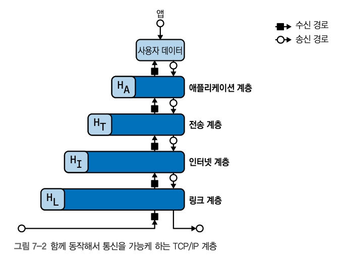
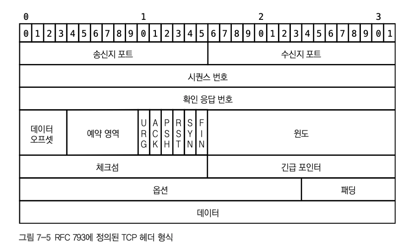
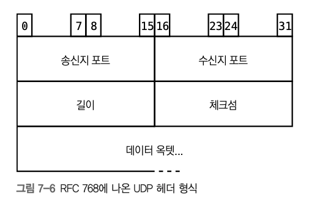
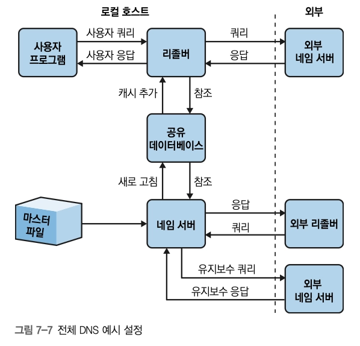
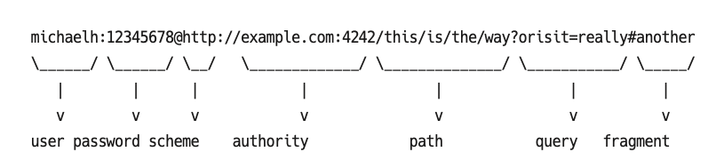
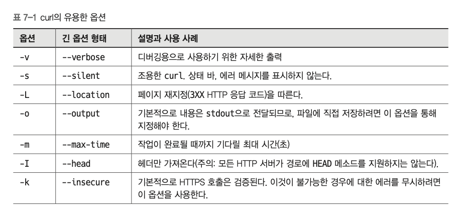
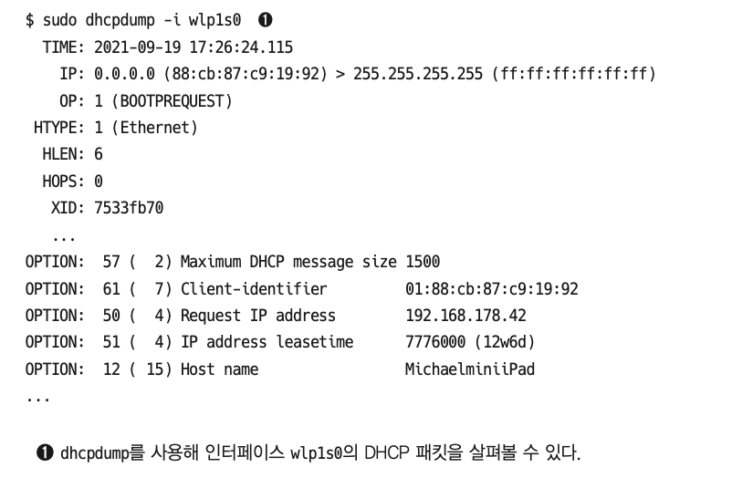
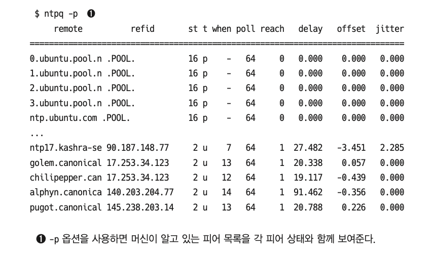

# 7장. 네트워킹

## 기본 개요

- 네트워킹은 대부분의 시스템 동작에 중심적인 역할을 수행하며, 변화하는 분야와 계층이 많아 문제 발생 시 HW~SW에 이르는 영향범위 파악이 어렵다
- 원격 리소스가 마치 로컬에 있는 것처럼 보이게 하는 추상화는 유용한 기능이지만, 결국 이 모든 것의 근간은 유/무선을 통해 이동하는 bit이다
- 리눅스의 네트워킹 공간에서 거의 모든 프로토콜과 인터페이스는 공개된 사양을 기반으로 한다

## TCP/IP 스택

- 데이터는 패킷으로 캡슐화되며, 각 계층은 해당 기능과 관련된 정보를 헤더에 포함해 데이터로 래핑하며, 각 계층의 바로 상하위 계층으로 데이터를 전달하여 처리하는 방식 (계층화)
  

### **링크 계층**

> 하드웨어(이더넷, 와이파이), 커널 드라이버 등 물리적 디바이스 간 패킷 전송을 지원하는 계층

- 이더넷
- 무선
- MAC 주소
  - **주소 결정 프로토콜 (ARP)**
    - MAC 주소 → IP 주소에 매핑 \*링크 계층을 인터넷 계층과 연결한다는 의미로 해석 가능
    - `arp` / `ip neigh` : MAC주소를 호스트 네임이나 IP주소에 매핑한 캐시 조회
- 인터페이스 - 네트워크 연결 (물리적 / 가상 - e.g. `lo (loopback)`)
  - **네트워크 인터페이스 컨트롤러 (NIC)**
    - 유선 표준(이더넷용 IEEE 802.3-2018), IEEE 802.11의 많은 무선 표준중 하나를 통해 네트워크에 물리적 연결을 제공함
    - `송신` 바이트의 디지털 표현 → 전기/전자기 신호로 변환 / `수신` 모든 물리적 신호 → 비트/바이트로 변환
    - `ifconfig` / `ip` : 시스템에서 사용 가능한 NIC 정보 쿼리

### **인터넷 계층**

> IP를 이용하며, 라우팅에 초점을 두고 네트워크를 통한 기기 간의 패킷 전송을 지원하는 계층

- 사용가능한 네트워크 인프라가 신뢰할 수 없으며, 참여자가 자주 변경된다고 가정
- 최선의 전달을 제공, 모든 패킷을 독립적으로 취급
- 성능에 대한 보장이 없음
- IPv4
  - 구성 - 송신지/수신지 주소(32bit), 프로토콜(8bit), TTL(8bit), ToS(8bit)
  - 0.0.0.0 의 의미 - 시스템에 있는 모든 IPv4 주소를 의미하며, **_“알려진 IP로 바뀔 때까지 송신지 선택을 위해 모든 사용 가능한 IP주소에서 수신 대기하라”_** 를 내포
  - 예약된 IPv4
    | IP 범위          | 용도            | 핵심                                                                                          |
    | ---------------- | --------------- | --------------------------------------------------------------------------------------------- |
    | `127.0.0.0/8`    | 로컬 주소       | 대표 주소는 `127.0.0.1`. 자기 자신, 즉 루프백을 가리킴                                        |
    | `169.254.0.0/16` | 링크 로컬 주소  | 같은 링크 안에서만 사용. 다른 네트워크로 라우팅되면 안 됨. 클라우드 메타데이터 주소 등에 사용 |
    | `224.0.0.0/4`    | 멀티캐스트 주소 | 여러 대상에게 동시에 패킷을 보내는 용도                                                       |
    | `10.0.0.0/8`     | 사설 IP         | 공용 인터넷에서 라우팅되지 않음. 내부망에서 사용                                              |
    | `172.16.0.0/12`  | 사설 IP         | 공용 인터넷에서 라우팅되지 않음. 내부망에서 사용                                              |
    | `192.168.0.0/16` | 사설 IP         | 공용 인터넷에서 라우팅되지 않음. 내부망에서 사용                                              |
  - `ip addr show`
- **IPv6**
  - TCP/IP 통신에서 엔드포인트 식별에 쓰이는 128비트 주소 체계
  - IPv4보다 훨씬 많은 주소를 표현할 수 있음
  - 보통 16비트씩 8개 그룹으로 나누고, 콜론(`:`)으로 구분함
  - 주소를 짧게 줄이기 위한 규칙
    - 앞쪽의 `0` 생략 가능
    - 연속된 `0` 구간은 `::`로 압축 가능
  - 예: IPv6 루프백 주소는 `::1`
    - IPv4의 `127.0.0.1`에 해당
  - IPv4와 IPv6는 서로 호환되지 않음 — 네트워크 장비, 라우터, 서버 소프트웨어가 IPv6를 지원해야 함
- **ICMP / ping**
  - ICMP는 네트워크 상태나 오류 정보를 전달하는 프로토콜
  - `ping`은 ICMP를 이용해 대상 서버에 도달 가능한지 확인하는 명령
  - `ping` 결과에서 볼 수 있는 정보
    - 응답 여부
    - 패킷 손실률
    - 왕복 시간: `min / avg / max / stddev`
  - 여러 대상의 ping 상태를 그래프로 보고 싶으면 `gping` 사용 가능 https://github.com/orf/gping
  - IPv6에서는 `ping6` 또는 IPv6를 지원하는 `ping`을 사용 https://linux.die.net/man/8/ping6
- **라우팅**
  - 라우팅은 패킷을 어디로 보낼지 결정하는 과정
  - 목적지는 같은 시스템의 프로세스일 수도 있고, 다른 시스템의 IP 주소일 수도 있음
  - 리눅스에서는 라우팅 테이블을 통해 전송 경로를 결정함
  - `route -n` / `ip route` / `traceroute` : 라우팅 정보 확인
    | 항목          | 의미                                                                                                                            |
    | ------------- | ------------------------------------------------------------------------------------------------------------------------------- |
    | `Destination` | 수신지 IP 주소. `0.0.0.0`은 특정 목적지가 지정되지 않은 기본 경로를 의미하며, 사실상 기본 게이트웨이로 보낼 대상으로 볼 수 있음 |
    | `Gateway`     | 목적지가 같은 네트워크에 없을 때 패킷을 전달할 게이트웨이 주소                                                                  |
    | `Genmask`     | 해당 경로에 적용되는 서브넷 마스크                                                                                              |
    | `Flags`       | 라우팅 상태/속성. 예: `U`는 경로가 동작 중, `G`는 게이트웨이를 통해 전달함을 의미                                               |
    | `Iface`       | 패킷이 나갈 네트워크 인터페이스                                                                                                 |
  - 방화벽이나 패킷 조작은 보통 `iptables`가 담당 https://jvns.ca/blog/2017/06/07/iptables-basics/
    - 내부적으로는 `netfilter`를 사용함 https://www.netfilter.org/
- BGP(Border Gateway Protocol)
  - IP 라우팅이 동작하려면 이런 자율 시스템들이 해당 라우팅 데이터와 도달 가능성 데이터를 공유하고 인터넷을 통해 패킷 전달 경로를 알려야 함을 기반으로 함
    - fyi. 네트워크 = 자율시스템(AS)

### **전송 계층**

> 세션 기반의 안정적인 통신을 위한 TCP, 비연결형 통신을 위한 UDP를 사용해 가상/물리 호스트 사이의 종단 간 통신을 제어하는 계층
>
> \*주로 패킷이 전송되는 방식을 다룸. **리눅스는 소켓을 통신의 엔드포인트로 지원**

- 포트(port) - IP주소에서 사용 가능한 서비스 식별
  | 구분           | 범위          | 용도                                                                                     |
  | -------------- | ------------- | ---------------------------------------------------------------------------------------- |
  | 잘 알려진 포트 | `0~1023`      | SSH, 웹 서버 같은 데몬용. 바인딩하려면 보통 `root` 또는 `CAP_NET_BIND_SERVICE` 권한 필요 |
  | 등록된 포트    | `1024~49151`  | IANA가 공개적으로 관리하는 서비스용 포트                                                 |
  | 한시적 포트    | `49152~65535` | 클라이언트가 임시로 할당받아 사용하는 포트. 내부 서비스에서도 사용 가능                  |
  - `/etc/services` 에서 포트 정보(포트 번호와 서비스 이름 매핑) 확인 가능
  - `nmap -A localhost` - 로컬 머신에서 열려 있는 포트 스캔
- TCP
  
  - 연결 지향 전송 계층 프로토콜
  - HTTP, SSH 등에서 사용
  - 패킷 순서 보장, 오류 발생 시 재전송 지원
  - 자체 암호화는 없음 — 암호화가 필요하면 TLS 사용
- UDP
  
  - 비연결형 전송 계층 프로토콜
  - DNS, DHCP, NTP 등에서 사용
  - 통신 설정 없이 데이터그램을 바로 전송
  - 장점
    - 구조가 단순함
    - 오버헤드가 적음
  - 단점
    - 순서 보장 없음
    - 재전송 없음
    - 연결 상태 관리 없음
- 소켓 **⭐ 리눅스에서 제공하는 고수준 통신 인터페이스**
  - 네트워크 통신의 엔드포인트
  - 보통 `IP 주소 + 포트 + 프로토콜` 조합으로 식별
  - TCP/UDP 통신에서 실제 송수신 통로 역할
  - 확인 명령
    - `ss -s`: 소켓 요약
    - `ss -ulp`: UDP 소켓 확인
    - `lsof -i`: 프로세스가 사용하는 네트워크 연결 확인
  - https://docs.docker.com/engine/security/protect-access/

### **애플리케이션 계층**

> 웹, SSH, 메일과 같은 사용자 대면 도구와 앱을 다루는 계층

## DNS

- 주요 개념
  
  - 도메인 네임 스페이스
    - DNS 이름이 구성되는 계층형 트리 구조
    - 루트는 `.`으로 표현
    - 예: `demo.mhausenblas.info.`
    - 전체 도메인 이름을 FQDN이라고 함
  - 리소스 레코드
    - 도메인에 연결된 실제 데이터
    - IP 주소, 메일 서버, 별칭, 텍스트 값 등이 들어감
  - 네임 서버
    - 도메인 정보를 가지고 있는 서버
    - 특정 zone에 대한 권한 있는 네임 서버가 될 수 있음
  - 리졸버
    - 클라이언트 요청을 받아 DNS 질의를 수행하는 구성요소
    - 보통 OS나 라이브러리가 제공
- **DNS 계층 구조**
  - 루트 서버
    - 최상위 DNS 서버
    - TLD 서버 위치를 알려줌
  - TLD
    - 최상위 도메인
    - 예: `.com`, `.org`, `.info`, `.kr`
  - gTLD
    - 일반 최상위 도메인 (generic)
    - 예: `.com`, `.org`
  - ccTLD
    - 국가 코드 최상위 도메인 (country code)
    - 예: `.kr`, `.jp`, `.us`
  - sTLD
    - 스폰서 최상위 도메인
    - 특정 기관이나 규칙에 따라 운영
    - 예: `.aero`, `.gov`
- **DNS 레코드 종류** https://en.wikipedia.org/wiki/List_of_DNS_record_types
  | 레코드  | 의미                                | 예                                  |
  | ------- | ----------------------------------- | ----------------------------------- |
  | `A`     | 도메인을 IPv4 주소에 매핑           | `example.com → 1.2.3.4`             |
  | `AAAA`  | 도메인을 IPv6 주소에 매핑           | `example.com → 2001:...`            |
  | `CNAME` | 한 이름을 다른 이름의 별칭으로 연결 | `www → example.com`                 |
  | `NS`    | 해당 도메인의 네임 서버 지정        | `example.com → ns1.example.com`     |
  | `PTR`   | IP 주소를 도메인 이름으로 역조회    | `1.2.3.4 → example.com`             |
  | `SRV`   | 서비스 위치 정보 제공               | `_xmpp-client._tcp.gmail.com`       |
  | `TXT`   | 텍스트 데이터 저장                  | SPF, DKIM 같은 보안 설정            |
  | `MX`    | 메일 서버 지정                      | `example.com → mail.example.com`    |
  | `SOA`   | zone의 기본 관리 정보               | serial, refresh, retry, expire, TTL |
  !image.png
- **DNS 조회 명령**
  - `host`
    - 간단한 DNS 조회용
    - 예:
      - `host -a localhost`
      - `host mhausenblas.info`
      - `host 185.199.110.153`
  - `dig`
    - 더 자세한 DNS 레코드 조회용
    - 예:
      - `dig mhausenblas.info`
      - `dig +short _xmpp-client._tcp.gmail.com SRV`
  - `dog`, `nslookup`
    - `dig` 대신 사용할 수 있는 DNS 조회 도구

## 애플리케이션 계층 네트워킹

### 웹

- URL - 웹에 존재하는 리소스의 ID와 위치를 정의
- HTTP - 애플리케이션 계층 프로토콜과 함께 URL을 통해 사용가능한 콘텐츠와 상호 작용
    - [구성] Method, Resource Naming, Status Code
- HTML - 페이지 요소 정의
    - WHATWF를 표준으로 함
    - [구성] user/password, scheme, authority(hostname, port), path, query/fragment
        
        
        

*`curl` 옵션 (wget으로 대체 가능)



### Secure Shell(SSH)

> 보안이 취약한 네트워크에서 네트워크 서비스를 안전하게 제공하기 위한 암호화 프로토콜
> 
- 원격시스템에 로그인하고 가상 시스템 간 데이터를 안전하게 이동하는 데 사용
- SSH 서버에 다른 사람의 접속을 허용하려면, 암호 인증을 비활성화하고 공개키를 ~/.ssh/authorized_keys에 추가하는 방식으로만 로그인하도록 강제해야 한다 (ref)
- 가상 -tty(pseudo-tty) 할당을 강제하려면 `ssh -tt`를 사용한다
- 디스플레이 문제가 있는 경우, 머신에 ssh할 때 `export TERM=xterm`을 해준다
- 클라이언트에 ssh 세션에 대한 타임아웃을 설정해야 연결을 활성 상태로 유지할 수 있다 (~/.ssh/config 파일 내 ServerAliveInterval, ServerAliveCountMax 옵션)
- `-v` / `-vvv` 옵션을 사용하면 ssh 내부에 대한 세부 정보 확인 가능

### 파일 전송

- `scp` (secure copy) - 원격 시스템 간의 복사 도구
- `rsync` - 파일 동기화 시 사용하는 도구로, scp보다 빠르고 편리함 *—dry-run 옵션 제공
- `aws s3 sync` - AWS CLI로 S3 버킷에서 파일을 동기화하는 예시

### 네트워크 파일시스템(NFS)

> 네트워크를 통해 중앙에서 파일을 공유하는 수단으로 널리 지원되고 사용되는 네트워크 파일시스템
> 
- 일반적으로 클라우드 공급자나 전문적으로 설정된 중앙 IT에서 관리됨
- → 샤용자 입장에서는 nfs-common 패키지 형태의 클라이언트만 설치하면 됨
    
    ```bash
    # NFS 서버에서 소스 디렉터리 마운트
    sudo mount nfs.example.com:/source_dir /opt/target_mount_dir
    ```
    
    - 대용량 공간 제공의 이점을 가짐
- 미디어 애플리케이션의 경우, NAS(Network Attached Storage)가 더 나을 수 있음

### 윈도우와의 공유

- SMB(Server Message Block)
- CIFS(Common Internet File System)
- Samba - 리눅스용 표준 윈도우 호환 프로그램

## 고급 네트워크

- **`whois`**
    - 도메인 등록 정보, 사용자 정보 조회 시 사용하는 디렉터리 서비스용 클라이언트
        - 도메인 소유 정보는 기본적으로 공개이며, 등록 기관에 비용 지불 시 비공개로 설정할 수 있음
        
- **동적 호스트 구성 프로토콜(DHCP)**
    - https://en.wikipedia.org/wiki/Dynamic_Host_Configuration_Protocol
    - IP주소를 호스트에 자동으로 할당할 수 있는 네트워크 프로토콜
    - 네트워크 디바이스를 수동으로 별도 구성할 필요 없는 클라이언트/서버 설정
    - **`dhcpdump`** 패킷 스캔 실행 결과
        
        
        
- **네트워크 타임 프로토콜(NTP)**
    - https://www.ntp.org/
    - 네트워크를 통해 컴퓨터의 시계를 동기화하기 위한 것
    - `ntpq` 를 이용하면 명시적인 타임 서버 쿼리를 보낼 수 있음
        
        
        
- ***wireshark** (GUI)**, tshark** (CLI)*
    - 저수준 네트워크 트래픽 분석 도구 — 스택 전체의 패킷을 정확하게 트레이스 가능
- socat
    - 2개의 양방향 바이트 스트림을 설정해 엔드포인트 간 데이터를 전송할 수 있게 함
- geoiplookup
    - IP를 지리적 영역에 매핑
- 터널
    - VPN과 기타 사이트 간 네트워킹 솔루션의 대안. inlets 같은 도구로 활성화
- 비트토렌트
    - 파일을 토렌트라는 패키지로 그룹화하는 P2P 시스템
