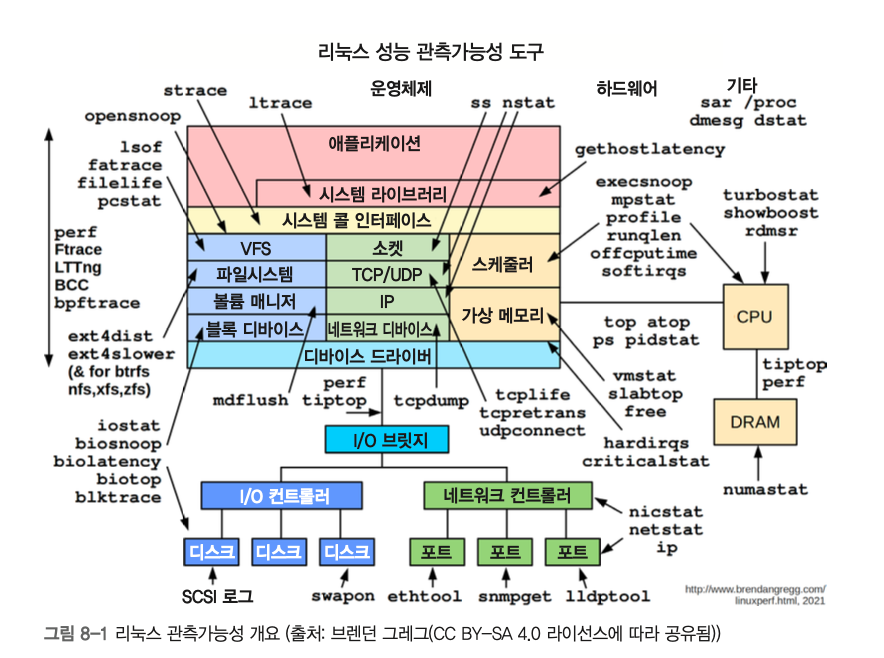
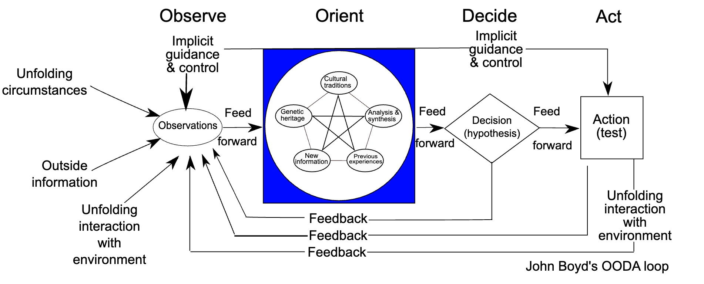
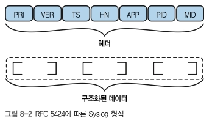

# 8장. 관측가능성


## 기본 개요


### 관측 가능성 전략

- OODA loop (*Observe-Orient-Decide-Act)*
    - https://en.wikipedia.org/wiki/OODA_loop
        
        
    - 관측된 데이터를 기반으로 가설을 테스트하고 이에 따라 조치를 취하는 구조화된 방법 (시그널로부터 실행 가능한 통찰력을 얻는 방법 제공)
    - e.g. 애플리케이션이 느려진 상황
        1. 여러 후보 원인 지목 - 메모리 부족, CPU 주기 부족, 네트워크 I/O 부족, …
        2. 각 리소스가 얼마나 소비되는지 측정
        3. 각 리소스의 할당을 개별적으로 변경하고 결과 측정 (소비량을 측정해 그 상황에서 관측된 영향과 연결짓기)
            - 앱에 더 많은 RAM 제공 → 성능 향상 (✅)

### 용어 정리

1. 관측가능성(observability, o11y)
    - 외부 정보를 측정하여 시스템의 내부 상태를 평가하는 것
    - 일반적으로 후속 조치를 취함
2. 시그널 유형
    - 기호적 수단(text)이나 숫자 값(지표), 또는 이들의 조합으로 시스템 상태 정보를 보여주고 내보내는 다양한 방식
3. 소스
    - 시그널을 생성하는 곳
    - 다양한 유형 존재 (리눅스 운영체제, 애플리케이션, ..)
4. 목적지
    - 시그널을 소비/저장/처리하는 곳
    - 사용자 인터페이스를 노출하는 목적지 = 프론트엔드
5. 텔레메트리
    - 소스에서 시그널을 추출하고 시그널을 목적지로 전송하는 프로세스
    - 주로 시그널 수집 및 전처리하는 에이전트 사용

### 시그널 유형

> *시그널이란? 추가 처리나 해석을 위해 시스템 상태를 전달하는 방법*
> 
- 텍스트 페이로드 / 숫자 페이로드로 구분
- 유형
    1. **로그(log)**
        - 사람이 사용할 수 있는 텍스트 페이로드가 있는 개별 이벤트
        - 타임스탬프가 지정되며, 유효성 검사를 수행할 수 있도록 형식 스키마로 표현되는 경우가 많음
        - 구조화된 로깅
    2. **지표(metric)**
        - 샘플링된 숫자 데이터 포인트로, 시계열을 형성함
        - 차원/식별 메타데이터의 형태로 추가 컨텍스트를 가질 수 있음
        - raw 지표를 직접 사용하기 보다 aggregation, 그래픽 표현을 사용하는 경우가 많음
        - 주로 알림 조건으로서 사용됨
        - 유형 - Counter, Gage, Histogram
    3. **추적(trace)**
        - 런타임 정보의 동적 모음
        - 디버깅, 성능 평가 시 자주 사용됨

## 로깅

| 형식 | 설명 |
| --- | --- |
| 일반 이벤트 형식 https://docs.nxlog.co/integrations/format/cef-logging.html | 아크사이트(ArcSight)에서 개발했으며, 디바이스·보안 사례를 위해 사용한다. |
| 일반 로그 형식 https://httpd.apache.org/docs/trunk/logs.html#common | 웹 서버용. 확장 로그 형식도 참조하자. |
| 그레이로그 확장 로그 형식 https://graylog.org/features/gelf/ | 그레이로그(Graylog)에서 개발했으며, Syslog를 개선한 것이다. |
| Syslog | 운영체제, 앱, 디바이스용. 237페이지 ‘Syslog’ 절 참조 |
| 임베디드 지표 형식 https://docs.aws.amazon.com/AmazonCloudWatch/latest/monitoring/CloudWatch_Embedded_Metric_Format_Specification.html | 아마존(Amazon)에서 개발했다. 로그와 지표 모두에 사용된다. |
- 기본 구성
    - 로그 항목, 메시지, 행의 모음 - 개별 이벤트 정보 캡처
    - 메타데이터, 컨텍스트 - 전역 범위 / 메시지 단위
    - 개별 로그 메시지 해석 방법을 보여주는 방식 - 로그 레벨, 공백 구분, JSON 스키마 등
- 로그로 인한 오버헤드는 피하는 편이 좋다
    - 빠른 조회
    - footprint 작게 구성
    - 디스크 공간 차지 최소화
    - 민감 정보 노출X
- 리눅스 로그 디렉터리 조회 (`/var/log`)
- 실시간 로그 확인 : `tail -f` *파일에 저장 시 `tee` 사용

### 리눅스 로깅 시스템

1. Syslog
    
    
    
    - `PRI` 메시지의 장비 유형, 심각도
    - `VER` syslog 프로토콜 번호 (1만 가능)
    - `TS` 메시지 생성 시각 (ISO 8601)
    - `HN` 메시지를 보낸 시스템 식별
    - `APP` 메시지를 보낸 애플리케이션/디바이스 식별
    - `PID` 메시지를 보낸 프로세스 식별
    - `MID` 메시지 ID **Optional*
    
    [활용 도구]
    
    - syslog-ng : TLS, 콘텐츠 기반 필터링, PostgreSQL/MongoDB 등 DB 로그인 지원
    - rsyslog : systemd와 함께 사용 가능
2. journalctl (systemd 저널)
    - 바이너리 형식으로 로그 저장 (빠른 접근, 적은 스토리지 차지)
    - 시간 범위로 로그 조회하기 - `journalctl --since "3 hours ago"`, `journalctl --since "2026-09-15 15:30:00" --until "2026-09-18 00:00:00"`
        
    - 특정 systemd (서비스) 단위 출력 ` journalctl -u <서비스명>`
    - 로그 항목의 출력 형식 지정 → cat, short, json

## 모니터링

> 시스템과 애플리케이션 지표를 **캡쳐**하는 것
> 
- 주요 목적
    - 소요 시간, 프로세스가 소모하는 리소스 추적 (성능 모니터링)
    - 비정상 시스템의 문제 해결
- 주요 액션
    - 하나 이상의 지표 추적
    - 특정 조건에 대한 알림
- 기본 시스템 지표 출력하기
    
    ```bash
    # 기본 시스템 지표 출력하기 - 로그인한 사용자 수, CPU 사용률
    $ uptime
     
    # 기본 메모리 사용률
    $ free -h
                   total        used        free      shared  buff/cache   available
    Mem: 
    Swap:             0B          0B          0B
    
    # -- -w 옵션 사용 시, 버퍼에서 사용되고 캐싱된 메모리를 제외하여 출력 

    
    # 메모리 통계 
    
    ## r: 실행중/CPU 대기 상태의 프로세스 수
    ## free: 사용 가능한 주 메모리(KB)
    ## in: 초당 인터럽트 수
    ## cs: 초당 컨텍스트 스위치 수
    ## us~st: 사용자 공간, 커널, 유휴상태 등 총 CPU 시간의 백분율
    $ vmstat 1  # 1s마다 새로운 요약 행 출력
    procs -----------memory---------- ---swap-- -----io---- -system-- ------cpu-----
     r  b   swpd   free   buff  cache   si   so    bi    bo   in   cs us sy id wa st
     
     
    # 특정 작업에 걸리는 시간 조회
    $ time (ls -R /etc 2&> /dev/null) # /etc 디렉터리를 재귀적으로 나열하는 데 걸리는 시간 측정
    
    real	0m0.003s #총 소요시간 *성능 측정에서만 유의미
    user	0m0.003s #ls 자체가 CPU(사용자 공간)에서 보낸 시간
    sys	0m0.000s #리눅스가 무언가를 하기를 ls가 기다린 시간(커널 공간)
    ```
    

### 디바이스 I/O와 네트워크 인터페이스

- `iostat` - I/O 디바이스 지표 출력
    - tps: 해당 디바이스에 대한 초당 전송(I/O 요청) 수
    - read: 데이터 볼륨
    - wrtn: 자겅된 데이터
- `ss` - 소켓 통계 dump
    - `-a` 수신/비수신 소켓 모두 선택
    - `-p` 소켓을 사용하는 프로세스
    - `-t` TCP / `-u` UDP
- `lsof` - list open files

    
- 성능 모니터링 도구
    - sar - 다양한 스크립트에 적합
    - perf - https://perfwiki.github.io/main/

### 통합 성능 모니터

- 통합 솔루션을 사용해 좀 더 편하게 모니터링할 수 있다
    - 여러 리소스 유형 (CPU, RAM, I/O) 지원
    - 대화식 정렬과 필터링 (프로세스별, 사용자별, 리소스별)
    - 실시간 업데이트 지원
    - 프로세스 그룹, cgroup, namespace 등 세부 정보 포함
- `top` - 추적가능한 프로세스 목록 제공 (uptime 출력과 유사 & 표 형식 제공)
- `htop`    
- `atop` - CPU, 메모리 외에도 I/O, 네트워크 통계 등 리소스를 자세히 다룸
- `below` - cgroup v2를 인식함
- `glances` - 디바이스까지 다룸
- `guider`  - 다양한 지표 & 그래프로 시각화
- `neoss` - 네트워크 트래픽 모니터링용 (ss의 대안)
- `mtr` - 네트워크 트래픽 모니터링용 (traceroute의 대안)

### 계측(instrumentation)

- 자동 계측
- 사용자화 계측 - 코드스니펫 수동 삽입 (특정 지점에서의 지표})

1. StatsD https://github.com/statsd/statsd 와 같은 도구 사용 (클라이언트 라이브러리로 사용 가능)
2. pull-based
3. scraping - 애플리케이션이 지표를 노출하고, 에이전트는 메트릭을 어디로 보낼지 엔드포인트를 통해 검색하는 방식

## 고급 관측가능성

- tracing : 시간 경과에 따른 프로세스 실행을 캡처하는 것
    - 리눅스 커널 - 커널의 함수에서 가져오거나 시스템 콜에 의해 트리거
        - kprobe
        - tracepoint
    - 사용자 공간 - 애플리케이션 함수 호출을 추적 소스로 활용
        - uprobe
    - 그 외 도구 - `strace`(추적 도구를 통해 디버깅), `perf`(프론트엔드 성능 분석), `eBPF`(사용자 지정 추적이 가능)
- profiling : 자주 호출되는 코드 섹션을 식별하는 것
    - 저수준 도구
        - pprof
        - valgrind
        - flame graph
        - perf 출력을 대화식으로 사용 및 시각화 - https://www.markhansen.co.nz/profiler-uis/
    - 지속적인 프로파일링
        - 시간 경과에 따라 추적을 캡처하는 프로파일링의 고급 버전
        - parce (eBPF 기반) https://www.parca.dev/
                        

### Prometheus & Grafana

- Node Exporter를 사용해 다양한 시스템 지표를 노출
- Prometheus → Node Exporter 스크래핑
    - /metrics 호출 - openmetrics 형식의 지표 반환
- Prometheus → Grafana의 데이터소스로 세팅
