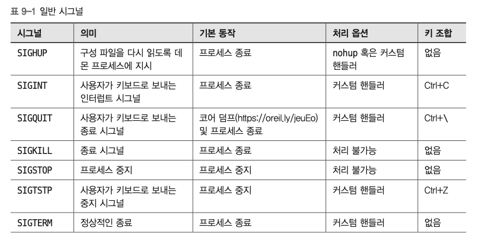
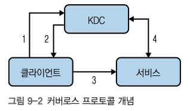

## 프로세스 간 통신(IPC)

| 방식 | 핵심 용도 |
| --- | --- |
| Signal | **이벤트 알림** |
| Pipe | 부모-자식 프로세스 등의 **byte stream 전달** |
| Named Pipe | 이름을 통한 **독립 프로세스 간 stream 전달** |
| Unix Socket | 로컬 프로세스 간 **양방향 네트워크형 통신** |

### 시그널

- 커널이 특정 이벤트를 사용자 공간 프로세스에 알리기 위한 방법
    1. 커스텀 핸들러 정의 - 정리 작업, 특정 시그널 무시 등의 상황에서 유용
    2. 의미 정의 X - 프로세스 간 통신만을 위한 용도
- 대부분의 시그널은 기본 동작이 정의되어 있으며, 필요하면 **커스텀 signal handler**를 등록할 수 있음
    
    ```rust
    SIGTERM
       │
       ▼
    Kernel ──────▶ Process
                    │
                    ├─ default action
                    │
                    └─ custom handler
                         └─ cleanup → exit
    ```
    
    - 종료 전 정리 작업
    - 설정 reload
    - graceful shutdown 등
- 같은 시그널을 다시 보내는 것은 별 의미가 없음
    - 일반 시그널은 **큐잉되는 메시지라기보다 “이 이벤트가 발생했다”는 알림**에 가까움
- `SIGKILL`은 프로세스가 가로채거나 처리할 수 없음
    - 커널이 바로 종료시키므로 cleanup handler 실행 불가
- `trap`을 사용하면 shell에서 signal handler를 정의할 수 있음



### 이름 있는 파이프 (Named Pipe / FIFO)

- 일반 파이프 `|`는 **한 프로세스의 stdout을 다른 프로세스의 stdin에 연결**
    - 보통 이름 없는 파이프(unnamed pipe)라고 부름
- Named Pipe는 파일 시스템에 이름을 가진 FIFO를 만들어 **서로 직접적인 부모-자식 관계가 없는 프로세스도 통신 가능**
    - pipefs pseudo 파일시스템을 사용하는 파이프의 wrapper로 볼 수 있음
- `mkfifo`로 생성
- 일반 파일처럼 `open/read/write`할 수 있지만 실제 데이터가 파일에 저장되는 것은 아님
- 하나의 방향과 하나의 컨슈머만 사용 ⇒ 읽기/쓰기는 기본적으로 blocking될 수 있으므로 사용 시 주의

*일반 pipe가 **프로세스 실행 관계에 묶인 일회성 연결**이라면, named pipe는 **파일 시스템의 이름을 통해 서로 독립적인 프로세스를 연결**할 수 있다는 점이 핵심

### Unix Domain Socket

- **같은 머신 내부 프로세스끼리 통신하기 위한 socket**
- TCP/IP처럼 IP 주소 + port를 사용할 필요 없이 **파일 시스템 경로 등을 주소로 사용**
- 지원 타입
    - `SOCK_STREAM` 스트림 지향
    - `SOCK_DGRAM` 데이터그램 지향
    - `SOCK_SEQPACKET` 시퀀스 패킷
- Named Pipe보다 복잡하지만 **양방향 통신과 다양한 socket 기능**이 필요할 때 유용
- e.g. Docker 데몬의 /var/run/docker.sock

## 가상머신 (VM)

- **서로 다른 테넌트에서 서로 다른 커널/워크로드를 강하게 격리해서 실행하기 위한 방법**
- 컨테이너와 가장 중요한 차이는 **커널 공유 여부**
    - 컨테이너는 host kernel을 공유하지만 VM은 일반적으로 **각 guest가 자신의 kernel을 실행**하기 때문에 격리 경계가 더 강함

### 기본 구성

```rust
┌──────── User Space ─────────┐
│ Host Process                │
│ Host Process                │
│                             │
│ VMM                         │
│ ├─ Guest Kernel             │
│ └─ Guest Process            │
└─────────────────────────────┘
            │
        Host Kernel
            │
     Virtualization CPU
```

- 가상화를 지원하는 CPU
- VMM(Virtual Machine Monitor)
    - QEMU, Firecracker 등 가상 디바이스 에뮬레이트
- Guest Kernel
    - 일반적으로 Linux kernel이지만 다른 OS도 가능
- Guest Process

### 커널 기반 가상 머신 (KVM)

- Linux kernel을 **하이퍼바이저로 동작할 수 있게 해주는 가상화 기능**
- Intel VT / AMD-V 같은 **CPU 하드웨어 가상화 기능을 활용**
- 커널 모듈
    - `kvm`
    - `kvm_intel`
    - `kvm_amd`
- I/O 가상화에는 `virtio` 같은 paravirtualized device가 널리 사용됨
- KVM은 Linux kernel이 제공하는 가상화 기반이고, QEMU/Firecracker 같은 VMM이 이를 사용해 실제 VM을 구성하고 실행한다.

### Firecracker

- AWS가 개발한 **경량 VMM(Virtual Machine Monitor)**
- KVM 위에서 **microVM**을 실행
- AWS Lambda/Fargate 같은 환경을 위해 개발
- 전통적인 VM 수준의 **격리**와 컨테이너에 가까운 **빠른 시작/낮은 오버헤드**를 동시에 노림
    - https://github.com/firecracker-microvm/firecracker/blob/main/README.md?utm_source=chatgpt.com
- 불필요한 device emulation을 최소화해서 attack surface와 overhead를 줄이는 방향으로 설계됨. 여기에 `seccomp`, `cgroup`, namespace 등의 Linux 격리 기능도 함께 사용 가능

## 모던 리눅스 배포판

> 기존 배포판은 서버 자체를 장기간 관리하는 모델이었다면, 컨테이너 환경에서는 **OS 자체를 불변(immutable)에 가깝게 관리**하는 방향이 등장
> 

전통적인 방식

```
Server
  ↓
apt update
  ↓
config 변경
  ↓
package 추가
  ↓
서버 상태가 계속 변화
```

컨테이너/Immutable 방식

```
Image v1
   ↓
변경 필요
   ↓
Image v2 생성
   ↓
기존 인스턴스 교체
```

- 실행 중인 시스템을 직접 변경하기보다 **새 이미지/아티팩트를 만들어 교체**
- 종속성을 `.deb`, `.rpm` 같은 개별 패키지를 설치해 상태를 변경하는 방식을 최소화
- 컨테이너 중심 배포 환경과 잘 맞음

### 컨테이너 중심 Linux

> ***OS는 애플리케이션을 직접 이것저것 설치하는 공간이 아니라 컨테이너를 안정적으로 실행하는 기반이다***
> 

**Flatcar Container Linux**

- 컨테이너 워크로드 실행에 특화
- Kubernetes 같은 container orchestrator 환경에 적합
- 일반적인 서버처럼 이것저것 패키지를 설치해 사용하는 목적과는 다름

**Bottlerocket**

- AWS가 개발한 container host OS
- 일반 package manager 대신 **OCI 이미지 기반 모델**
- SSH 등의 일반적인 관리 인터페이스를 최소화
- EKS/ECS 같은 container workload host에 적합

## 특별한 보안 도구

### erberos

- **신뢰할 수 없는 네트워크에서도 안전하게 사용자/서비스를 인증**하기 위한 프로토콜
- 핵심은 **KDC(Key Distribution Center)**
- 흐름
    
    
    
    1. Client → KDC : 자신의 신원 증명
    2. KDC → Client : Service 접근에 사용할 ticket 제공 (자격증명, 서비스 티켓, 임시 암호화 키 등 포함)
    3. Client → Service : ticket 제출
    4. Service가 ticket을 검증하고 Client 인증
- 중요한 특징은 **비밀번호 자체를 매 서비스에 보내지 않고 ticket 기반으로 인증**한다는 것
- 단점은 KDC가 인증의 중심에 있으므로 **중요한 중앙 구성요소**가 된다는 점

### PAM — Pluggable Authentication Modules

- Linux의 다양한 프로그램에서 **인증 방식을 공통 인터페이스로 분리하기 위한 프레임워크**
- 애플리케이션마다 인증 로직을 직접 구현하지 않아도 됨

[대표 모듈]

- `pam_localuser` → local user 확인
- `pam_keyinit` → session keyring
- `pam_krb5` → Kerberos 인증
