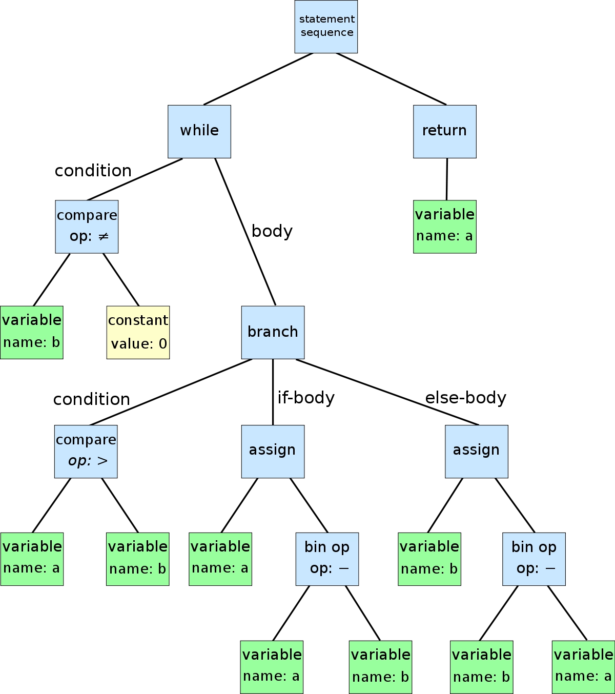
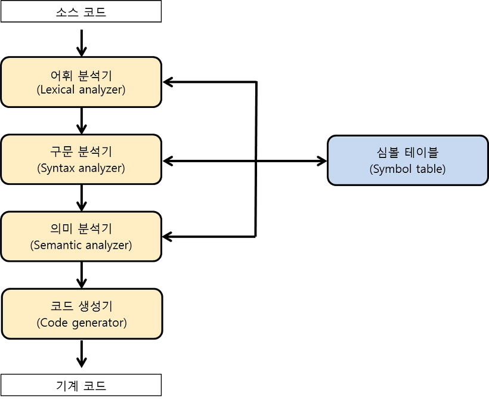
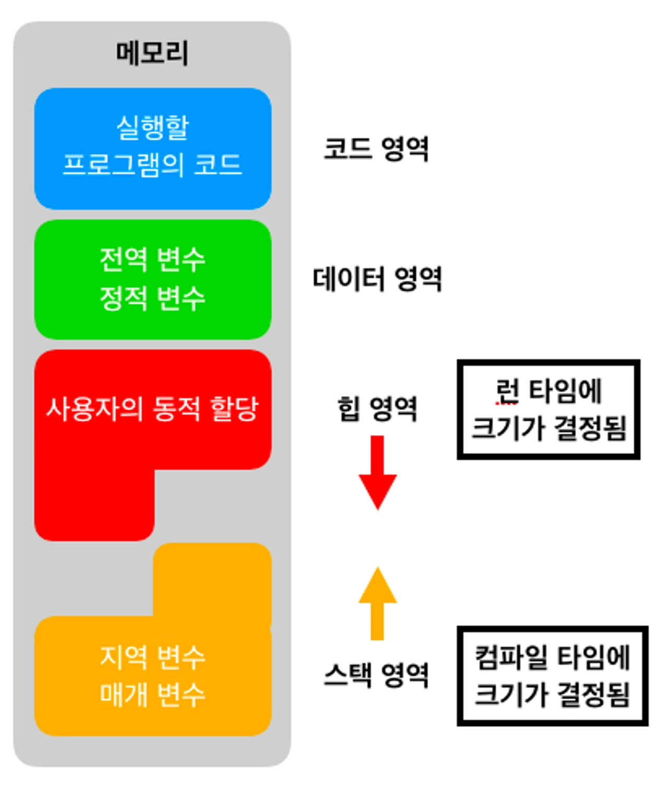

# Ch1. 프로그래밍 언어부터 프로그램 실행까지, 이렇게 진행된다

## 프로그래밍 언어를 직접 발명한다면?

우리가 코드를 작성해서 하나의 프로그램으로 실행시키기까지의 과정

[주요 키워드]

- CPU
- 프로그래밍 언어
- 컴파일러
- 링커
- 추상화

### CPU가 소통하는 법

- 매우 원시적이고 단순한 친구
- 0 / 1 으로 구성된 명령어(=기계어), 아주 적은 조합의 명령어 몇 가지만 이해할 수 있다
- 인간 VS 컴퓨터의 소통에서 컴퓨터의 승리! (인간이 컴퓨터의 언어를 이해해야 한다는 측면에서..)
    - 인간이 읽고 이해할 수 있는 형태의 명령어를 개발하기 시작
        - 즉, 이 과정은 모든 세부사항에 대해 신경쓰지 않고도 CPU를 직접 제어할 수 있는 추상화 과정
        - 세부사항의 예시 - “물을 마신다” → 1. 손을 든다 2. 컵을 향해 손을 뻗는다 3. 손으로 컵을 쥔다 4. 컵을 든다 5. 정수기로 이동한다 … 등의 일련의 과정을 모두 쪼갠 것 (이 정도로 단순한 작업만을 CPU는 이해하고 실행할 수 있다)
    - 천공카드 → 어셈블리어(low-level) → 고급 프로그래밍 언어
- 명령의 세부사항에는 **규칙과 패턴**이 존재한다
    
    > ***Statement***
    > 
    - if(조건에 따른 액션), while(순환), func(함수) + 조금씩의 차이는 parameter로 제어
- 재귀 : 단계가 또 다른 단계에 중첩되는 구문(syntax)
    - *이 문자열을 컴퓨터가 이해하게 하려면? 코드를 트리 형태(syntax tree)로 표현하자!*
        
        
    - 간단해진 리프 노드를 **기계 명령어**로 번역하고 그 결과를 부모 노드에 적용하며 차례로 올라가면, 최종적으로 전체 트리를 구체적인 기계 명령어로 번역할 수 있게 된다!
    - **`컴파일러`**는 코드 구분을 분석하여 구문 트리로 만들고, 이를 기계 명령어로 번역하여 CPU로 직접 넘기거나 Java 처럼 바이트 코드로 변환하여 가상 머신으로 넘겨 실행한다
    - 다양한 유형의 CPU가 이 기계 명령어를 실행하기 위해 **`인터프리터`**라는 가상 머신이 사이에 위치하며 표준화된 형태의 고급 프로그래밍 언어(C/C++, Java, Python 등)가 탄생하게 된 것
- 고급 프로그래밍 언어는 low-level의 제어 능력은 떨어질 수밖에 없음. 따라서, 일부 운영체제는 일부분을 어셈블리어로 작성하기도 함

## 컴파일러의 작동 원리

프로그래머가 작성하는 코드는 단순 텍스트 파일에 불과하고, 이는 우리가 source file(source code)이라는 이름을 붙여주어 컴파일러가 실행 파일로 만들어주면 비로소 CPU가 직접 실행할 수 있는 기계 명령어가 된다. 

1. 어휘 분석(Lexical Analysis)
    
    소스 코드를 각 항목+추가 정보로 이루어진 **`토큰`** 단위로 쪼개는 과정
    
2. 구문 분석(Syntax Analysis)
    
    `(` → `)`, while → bool expression 과 같은 규칙에 어긋나는 것이 없는지 parsing 및 syntax error 여부를 검사
    
    *이를 반복하며 parsing한 결과는 구문 트리로 표현 가능하다
    
3. 의미 분석(Semantic Analysis)
    
    타입 체크 등 프로그램에 이상이 없는지 검사 (이때 compile error 체크가 이루어짐) → 프로그램 실행이 가능한 상태!
    
4. 중간코드 생성(IR Code Generate)
    
    구문 트리 탐색 결과를 바탕으로 다듬어진 형태의 IR 코드 생성 및 최적화 진행 (e.g. 순환 구문 내 먼저 계산 가능한 코드)
    

## 링커는 왜 필요할까?

각 소스 파일은 컴파일러가 생성한 **각 대상 파일에 하나씩 대응**되며, 이 대상 파일들을 링커가 **하나의 실행 파일**로 합쳐준다

우리가 애플리케이션을 개발할 때, 이미 구현된 코드를 라이브러리 형태로 가져와서 사용하는 경우가 많은데, 이때 외부 코드가 제공되는 형태는 크게 두 가지로 나뉜다. 

- 정적 라이브러리(static library)
- 동적 라이브러리(dynamic library)

마치 챕터별로 여러 저자가 집필하여, 한 권으로 출판하는 것을 링커의 역할에 비유할 수 있다.

### 링커의 작업 과정

> 컴파일러는 번역, 링커는 참조에 따라 하나의 파일로 모으는 역할로 명확하게 분리되어 있다
> 
1. **Symbol Resolution** 
    - 모듈 사이에 존재하는 인터페이스, 변수 등의 종속성이 올바르게 설정되어 있는지 확인
    - 외부 symbol에 대한 실제 구현은 단 하나만 존재해야 함
    - ***#수요와 공급***
        1. 내가 정의 (다른 모듈에서 사용 가능한 Symbol)
        2. 내가 사용 (외부 Symbol)
        
        → 컴파일러가 Symbol Table에 저장한 정보를 바탕으로, 공급이 수요를 충족하는지 확인한다
        
        → 각 대상 파일에서 사용할 외부 Symbol이 Symbol Table에서 유일한 정의를 발견 가능한지 확인한다
        
    
    <aside>
    
    ### 대상 파일의 구성
    
    - 컴파일러가 대상 파일을 생성하는 과정에서 만난 외부 참조는 “호출한다는 사실”만을 기록하고 이후 링커에게 넘긴다 → **Symbol Table**
    </aside>
    
2. **Relocation** 
    - 전역변수에 실제 값이 결정되는 시점에, 모두 해당 값으로 치환 (N=100이라면, 모든 N을 100으로 수정해줘야 함)
        - 링커는 지역변수에는 관심을 두지 않는다
    - **호출한다는 사실**이 대상 파일에 임의의 메모리 주소(**`0x00`**)로 기록되어 있을 때, 이를 실제 물리 메모리 주소로 수정
        - 컴파일하는 시점에는 함수가 어느 메모리 주소에 위치할지 정확히 알 수 없기 때문
        - 링커가 실행 파일을 생성하는 시점에 함수가 적재될 메모리 주소를 확정하고, 실제 메모리 주소로 바꿔준다
        - .relo.text, .relo.data - 컴파일러가 메모리 주소를 확정할 수 없는 변수를 발견할 때마다 해당 영역에 명령어와 데이터를 각각 저장한다
3. **실행 파일 생성**
    
    참조하는 외부 코드를 개별적으로 관리하면, 참조가 많아질수록 매우 복잡한 형태가 된다. 이를 개선하기 위해 코드를 별도로 컴파일하여 패키징하고, 모든 함수의 선언을 header file에 넣어 제공하는 라이브러리 형태가 등장했다. 
    
    - 정적 라이브러리 (Window - `.lib` / Linux - `.a`)
        - 미리 컴파일이 완료되어, 링크 과정에서는 **모든 정보**를 그대로 실행 파일에 복제하여 사용
        - Static linking - 여러 대상 파일을 링크할 때는 데이터, 코드 section 별로 결합하기만 하면 됨!
        - 👍🏻 컴파일 속도가 빠름
        - 👎🏻 디스크와 메모리 낭비가 심함, 라이브러리 코드 변경 시 매번 recomplie
    - 동적 라이브러리 (=공유 라이브러리, 동적 링크 라이브러리 / Window - DLL, Linux - `.so`)
        - 데이터, 코드 section을 모두 묶어서 실행 파일에 복사하는 형태
        - **필수 정보**(e.g. 동적 라이브러리명, symbol table, relocatio)만 실행 파일에 포함
        - 대부분의 Application 및 플러그인이 이 방식으로 구현되어 있음
        - 👍🏻 메모리 적재와 디스크 저장에 필요한 리소스 대폭 절약, 라이브러리 코드 변경 시 버전 변경만으로 대응 가능, 여러 언어를 혼합하여 고성능에 적합한 언어로 작성된 함수를 선택적으로 호출 가능
        - 👎🏻 정적 링크보다 성능이 다소 떨어짐, 메모리 절대 주소로 참조 불가, 버전 미호환 시 프로그램 실행 불가
        
        - Dynamic linking  ****필수 정보**가 사용되는 시점*
            
            
            **[2가지 링크 방식]**
            
            1. loader라는 전용 프로세스를 통해 실행 파일을 디스크 → 메모리의 특정 영역으로 적재(loading)
                - 동적 라이브러리 의존 여부를 확인하여, dynamic linker라는 별도의 프로세스가 동적 라이브러리 존재 여부와 위치, symbol의 메모리 위치 등을 확인함
                - 적재 과정에서 링크가 이루어지려면 컴파일러에 명시적으로 **어떤 라이브러리를 참조하는지** 알려줘야 함
                - 링크 과정이 완료되면 프로그램 정상 시작, 실패 시 실행 종료
            2. 런타임 동안 코드가 직접 동적 링크 실행 (*runtime dynamic linking*)
                - 실행 파일 내부에 동적 라이브러리 정보가 저장되지 않으므로, 프로그래머가 코드에 특정 API를 사용하여 필요할 때마다 동적 라이브러리를 직접 동적으로 적재할 수 있음
                - e.g. Linux의 `dlopen`, `dlsym`, `dlclose`

**→ 저장방식, 사용 시점으로 정리해보기**

## 가상 메모리와 프로그램 메모리 구조

*링커는 변수의 런타임 메모리 주소를 미리 알 수 있다.* 

- 모든 프로세스는 자신만의 가상 메모리가 존재한다
    - 코드 영역이 시작되는 위치는 모든 프로그램이 동일하게 메모리 주소 `0x400000` 에서 시작된다
    - 가상 메모리와 물리 메모리는 page table에 mapping 관계가 기록되며, CPU가 가상 메모리 주소로 접근하면 page table을 참조하여 실제 메모리 주소에 접근할 수 있게 한다
- 링커는 프로세스의 메모리 구조를 알고 있기 때문에, 프로세스 실행 여부에 관계없이 실행 파일 생성 시점에 symbol의 메모리 주소를 결정할 수 있는 것!

## 추상화로 감춰져 있는 Low-Level을 더욱 잘 이해해야 한다!

| Abstract Layer | Concept |
| --- | --- |
| 프로그래밍 언어 | CPU에 직접 명령을 통해 제거 |
| 파일(File) | CPU의 Input/Output → 파일의 track, sector 등 정보까지 몰라도 됨 |
| 프로세스 | 실행 중인 프로그램 → 자신의 프로그램이 CPU를 독점한다고 가정하고 개발 |
| Virtual Memory | 물리 메모리 및 물리 파일 |
| Socket | Network Programming → 패킷의 각 계층에서의 동작을 몰라도 됨 |
| Container | 프로세스 ↔ 프로세스 실행환경 → 일관된 환경에서 Application 구동 가능 |
| Virtual Machine | CPU, OS, Application의 패키징된 형태 |
