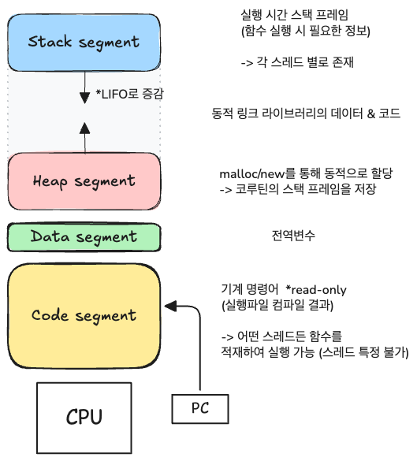

# Ch2. 프로그램이 실행되었지만, 뭐가 뭔지 하나도 모르겠다

## 프로그램의 런타임에는 무슨 일이 일어날까?

정적 코드 → 기계어로 번역 → 이를 읽고 수행하는 CPU는 2가지만 알고 있음을 전제로 한다.

1. 메모리에서 명령어를 가져온다 (**`dispatch`**)
    
    PC(Program Counter)라는 레지스터에 다음 실행할 명령어 주소를 저장하고 가져오는 방식
    
    **PC 레지스터란? 용량은 매우 작지만 속도가 매우 빠른 일종의 메모리 (주소는 코드의 순차적인 실행순서에 따라 1씩 자동으로 증가하고, 순차를 깨뜨리는 명령이 있다면 동적으로 대상 주소를 변경)*
    
2. 이 명령어를 실행한다 (**`execute`**)
    
    

→ 위 과정을 반복하며 전체 코드를 읽고 수행한다 

## 운영체제의 역할

*우리가 직접 CPU를 통해 프로그램을 실행하게 하려면?*

> 실행 파일을 수동으로 메모리에 복사한 후, main 함수(진입점)에 해당하는 첫 번째 기계 명령어를 메모리에서 찾아 그 주소를 PC 레지스터에 적재하면 된다
> 

+) 추가 작업

- 한 번에 하나의 프로그램만 실행 가능 (멀티태스킹 불가)
- 프로그램에 사용할 하드웨어를 직접 특정 드라이버와 연결해야 함
- 기본적인 동작도 직접 구현해야 함 (e.g. print 함수)

→ 이 작업은 매우 복잡하고 번거로움. 이를 운영체제가 추가 작업과 더불어 한번에 처리해주는 것!

<aside>

정리하자면, **운영체제가 추상화하는 영역**은 다음과 같다. 

1. 메모리 적재 도구 (Loader)  “물리 메모리 용량에 무관하게, 자기자신이 CPU와 표준적인 메모리 크기를 독점한다고 간주”
2. 멀티태스킹  “시스템에서 자기자신 외 실행 중인 타 프로세스를 몰라도 됨”
3. 유틸리티 라이브러리
4. 상호작용 인터페이스
</aside>

### CPU는 한 번에 한 가지 일만 할 수 있다

하지만 여러 프로그램 사이를 빠르게 전환하며, 여러 가지 일을 “동시에” 실행되는 것처럼 보이게 할 수는 있다. 

*전환에 필요한 것은?*

프로그램의 실행 상태 = 상황 정보(context)

- Runtime stack frame

→ context를 저장하는 구조체를 **프로세스(process)**라고 부른다

### Multi-process Programming을 통해 실행 속도를 높이자!

func A, func B 의 관계가 서로 의존적이지 않다면 순차적으로 실행하는 것보다 동시에 실행하여 결과를 내는 것이 더 효율적일 것이다. 하지만, 이 두 개를 병렬로 수행하기 위해 프로세스를 무작정 나눠 버리면 실행 속도 측면에서는 효율이 높아질 지라도 그 외 문제점들이 여럿 따른다. 

- 프로세스 생성에 드는 오버헤드가 크다
- 프로세스 간 통신(IPC, inter-process communication) 시, 프로세스마다 가지는 자체적인 주소 공간에 의해 복잡도가 높다

→ CPU가 다음에 실행할 메모리 주소를 저장하는 **PC 레지스터**에 main 함수 (default) 외에도 다른 진입 함수를 지정한다면, 새로운 실행 흐름을 형성할 수 있다! 즉, 하나의 프로세스 안에 여러 실행 흐름이 존재할 수 있는 형태가 되고 이를 **스레드(thread)**라고 부른다

****프로세스 생성 시점에는 main 함수를 엔트리로 지정해야 하지만, 프로세스가 실행되는 중에는 여러 실행 흐름을 가질 수 있다***

**스레드 = 경량 프로세스 라고도 한다*

## 스레드 개념 이해하기


- Multi-Thread 의 장단점 (vs Multi-Process)
    - 프로세스와 달리 스레드는 하나의 프로세스 주소 공간을 공유하므로, 복잡한 IPC를 고려하지 않아도 된다
    - 하지만 여러 스레드가 공유 리소스에 접근할 때는 프로그래머가 직접 상호배제(mutual exclusion), 동기화(synchronization)를 이용해 명시적으로 문제를 해결해야 한다
- 스레드 처리 작업 유형
    
    **[Lifecycle 관점]** 
    
    - long task - Word, 디스크 기록
    - short task - 네트워크 요청, DB 쿼리
    
    **[작업 시 필요한 리소스 관점]**
    
    - CPU intensive task - 과학 연산, 행렬 연산 (외부 I/O에 의존X)
    - I/O intensive task - 연산 ↓ 디스크, 네트워크 등의 I/O ↑
- **요청당 스레드** : 요청이 들어올 때마다 매번 스레드가 생성되는 방식
    1. 작업 처리에 필요한 시간이 짧다
    2. 작업 수가 매우 많다
    
    → long task에는 유리하나, short task에서는 스레드의 생명주기를 매번 반복적으로 실행하며 전환해야 하는 오버헤드를 초래한다
    
- **스레드 풀(thread pool)**은 여러 개의 스레드를 미리 생성해두고, 필요에 따라 사용하고 반납하는 형식으로 리소스 효율적으로 재사용하는 방식이며, 위 문제를 해결해준다
    - 스레드 풀은 producer-consumer 패턴을 활용한 구현 전략 중 하나
    - pool = queue를 통해 관리되는 형태
    - pool 내 적절한 스레드 수는?
        - CPU intensive 할 때는 스레드 수 = CPU 코어 수일 때 충분히 CPU의 리소스를 활용할 수 있음
        - I/O intensive 할 때는 N x (1+WT÷CT) 의 공식이 존재  **하지만 실제로 정밀하게 측정하기는 어려운 값들이니, 실제 상황을 기반으로 결정할 것*
            - N = 코어 수
            - WT (Wait Time) = I/O 대기시간
            - CT (Computing Time) = CPU 연산에 필요한 시간
- thread context
    - 스레드마다 고유한 스택 프레임 영역을 가지며, 프로세스 주소 공간 내에는 스레드 수만큼 여러 스택 영역이 존재할 수 있다
    - 스레드 전용 리소스 외에는 전부 스레드 간 공유되는 리소스이다
        - 코드 영역 - read-only 이므로 thread-safe 이슈 없음
        - 데이터 영역 - 전역변수 단일 인스턴스에 접근하여 값을 변경하면 서로 영향을 줌
        - 힙 영역 - 포인터 정보만 알고 있다면 서로의 리소스에 접근 가능함
        - **스택 영역 - 스레드 전용 리소스로 스택 프레임이 할당되긴 하나, 엄밀히 따지면 격리된 전용 공간은 아니다**
            - 서로의 스레드에서 스택 프레임 포인터를 알 수 있다면, 접근 자체는 열려 있음!
            - 각 스레드에서의 동작이 서로에 영향을 주지 않는 격리 상태
            
            ```c
            __thread int a = 1;  // 스레드 전용 저장소
            ```
            

### Thread-Safe를 달성하려면?

> Multi-Thread 프로그래밍에서의 Thread-Safe는 필연적이다.
> 

***Thread-Safe란?***

어떤 코드가 주어졌을 때, 그 코드가 호출되는 스레드의 개수나 호출 순서에 무관하게 항상 올바른 결과임을 보장하는 것

[핵심] 코드가 **언제** 전용 리소스를 사용하고, **언제** 공유 리소스를 사용하는지만 잘 **구분**하면 된다!

- 전용 리소스만을 사용한다면 thread-safe를 달성할 수 있다 (`stateless function`)
- 공유 리소스를 사용한다면, 그에 맞는 안전장치(lock, semaphore, atomic 등)를 사용하여 리소스 순서를 유지할 때 thread-safe를 달성할 수 있다

****스레드 간 어떤 리소스라도 최대한 공유하지 않는 것이 원칙 (공유를 할 수밖에 없다면 명확하게 구분)*** 

[구분을 했다면 그 이후에는? - 각 증상에 맞는 약 처방!]

1. 스레드 전용 저장소(thread local storage) - 모든 스레드에서 사용할 수 있지만 각 스레드에서 자체 복사본을 가지는 형태로 선언 가능한지 확인
2. 읽기 전용(read-only) - 해당 전역 리소스를 읽기 전용으로 사용해도 되는지 확인
3. 원자성 연산(atomic operation) - 실행 중에 중단되지 않으므로 lock과 같은 별도 장치 불필요
4. 동기화 시 상호 배제(mutual exclusion in synchronization) - **개발자가 직접 공유 리소스의 순서를 제어해야 하는 상황 ⭐**
    1. mutex
    2. spin lock
    3. semaphore 

## 동기 방식으로 비동기 프로그래밍을 가능하게 하는 코루틴

- (kernel) 스레드의 이점인 상태 저장 → 일시 중지 및 재개를 지원
- 코루틴은 **사용자 상태 스레드**로, OS가 life cycle에 관여하는 것이 아닌 개발자가 직접 스케줄링 제어권을 가짐
    - e.g. Python의 `yield` 키워드 - “멈춰라”의 의미로 CPU 제어권 반환 가능
- 코루틴의 상태 정보 (함수의 스택 프레임에 저장 - 스레드와 달리 **힙 영역**에 저장)
    1. CPU 레지스터 정보
    2. 함수 실행 시 상태 정보 
    
    → 스레드 한 개당 코루틴은 N개 생길 수 있는 구조 (메모리 여유가 된다면 코루틴 개수는 무제한)
    

**fyi. 코루틴은 스레드보다 과거에 생긴 개념임*

### 콜백 함수

```c
void make_donut(func f)  // f가 콜백 함수에 해당
{
		...
		f();
		...
}
```

- 각자 정의한 localization function를 전달만 하면 되는 구조
    - f = 호출자(Caller)
    - make_donut = 피호출자(Callee)
- 정의한 쪽에서 함수의 정보들을 알고, 실제 호출은 다른 모듈이나 스레드에 맡기게 됨
    - 즉, 피호출자가 호출자를 호출하는 것이 **`콜백`**을 의미
    - 호출자는 **무엇**을 해야 하는지 알지만, **언제** 하는지 정확히 모름
    - 피호출자는 **언제** 하는지 알지만, **무엇**을 해야 하는지는 콜백 함수에 담긴 정보에 의존적으로 파악해야 함
- `비동기 콜백`  (asynchronous callback) **지연 콜백으로도 부름*
    - 이를 호출자와 피호출자가 각자의 스레드에서 병렬로 실행되게 한다면, 호출 스레드가 콜백 함수 실행에 의존하지 않는 형태가 됨
    - 호출할 downstream이 수십~수백 개에 이른다면 비동기 콜백 구조는 오히려 중첩이 과도해지면서 콜백 지옥에 빠질 수 있음
- Third party library의 구현, Event-driven programming에서의 ***handler***로서 적합
- fyi. `클로저(closure)` - 자신이 선언될 당시의 외부 스코프 변수를 함께 캡쳐한 함수 객체로, 이 특성을 이용하면 콜백 함수가 외부 상태를 기억한 채 전달되고 실행될 수 있다

|  | 동기 콜백 | 비동기 콜백 |
| --- | --- | --- |
| 블로킹 콜백 | O  *항상 | X |
| 논블로킹 콜백 | O | O |

### 동기 VS 비동기를 더 잘 이해해보자

[Keyword]

동기 - ***#종속적 #연관된 #기다림 #의존관계***

비동기 - ***#비종속적 #무관한 #기다릴 필요 없는 #동시 발생***

- 동기 호출
    - 동일한 스레드 내에서 실행되며, 순차적으로 실행이 완료될 때까지 기다려야 함
    - Blocking I/O
        1. 파일을 읽을 때 기본적으로 최하단 계층의 system call로 OS에 요청을 보냄
        2. 이때, 호출 스레드를 일시 중지시킴 (blocked)
        3. 커널이 디스크 내용을 읽어오면 다시 스레드 재개
        
        **CPU의 clock rate는 GHz 수준이므로, 디스크가 하나의 작업을 수행할 수 있는 ms 단위 시간이 CPU에 주어지면 대량의 기계 명령어 실행 작업을 수행할 수 있음 (⇒ 비동기가 훨씬 유리!)*
        
- 비동기 호출
    - 시간이 오래 걸리는 I/O 작업을 백그라운드 형태로 실행함
    - 흔히 2개의 스레드가 사용됨 (호출자, 피호출자)
    - 호출자는 즉시 반환되며, 결과에 대한 처리를 다음과 같이 나뉘어짐
        1. 호출자가 실행 결과를 전혀 신경 쓰지 않는 경우 - 콜백 함수 호출 방식
        2. 호출자가 실행 결과를 반드시 알아야 하는 경우 - 알림 작동 방식 (완료 시 signal 전송)

### Event-Driven Programming (Event-based Concurrency)

[구성 요소]

1. 이벤트 (event) - 대부분 입출력에 관계된 것
2. 이벤트 처리 함수 (event handler) - 이벤트를 처리하는 worker

- 이벤트를 반복적으로 수신하고 처리하는 Event Loop는 이벤트가 도착할 때까지 기다렸다가 대응하는 이벤트 핸들러를 호출하는 방식으로 진행된다
    - 하나의 함수로 여러 이벤트 가져오기 → **이벤트 소스와 입출력 다중화**
    - 핸들러(worker) 스레드와 Event Loop 스레드 구성 → 핸들러 특성에 따라 single or multi 스레드 택
        1. single - I/O가 전혀 없고 소요 시간이 매우 짧은 경우
        2. multi - CPU 시간을 많이 소모하는 작업일수록 multi thread가 유리
- 핸들러의 요청 처리 시 I/O가 포함된다면?
    1. I/O에 대응하는 논블로킹 인터페이스가 있는 경우 - Event Loop에서 직접 호출 가능
    2. I/O에 블로킹 인터페이스만 있는 경우 - 블로킹 I/O 호출이 포함된 작업은 worker 스레드로 전달해야 함
        
        *⚠️ 주의 - Event Loop 내에서는 절대 어떤 블로킹 인터페이스도 호출해서는 안 된다*
