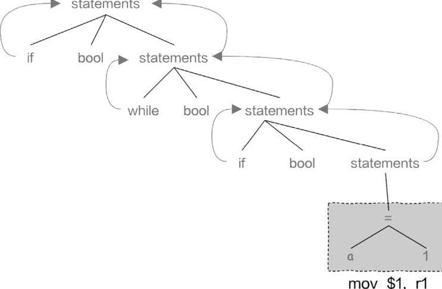
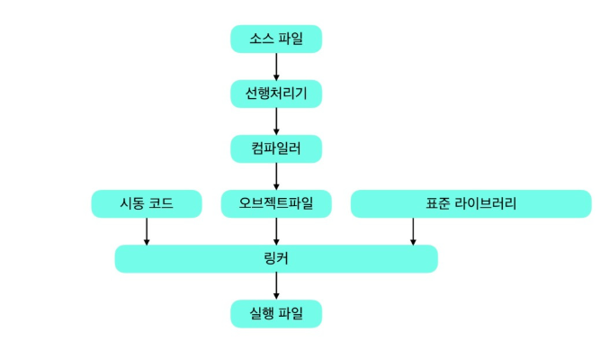
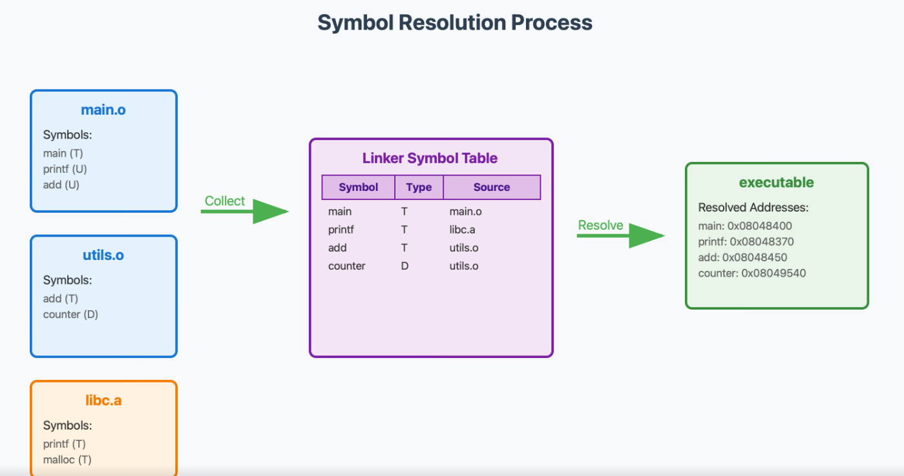
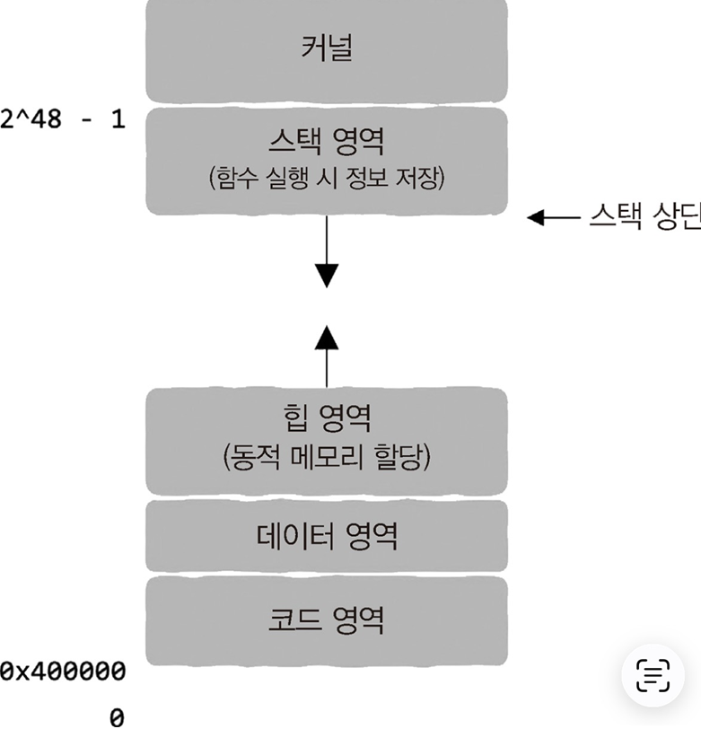

# Ch1. 프로그래밍 언어부터 프로그램 실행까지, 이렇게 진행된다

> "여러분이 선택한 그 길이 올바른 길임을 의심치 말고 앞으로 달려가다 보면 언젠가는 정상에서 내려다보는 날이 있을 것"

## 1.1 프로그래밍 언어를 직접 발명한다면

### 프로그래밍 언어의 발전

- CPU
  - 데이터를 한 곳 > 다른 곳 > 연산 > 옮기기 작업만 가능
  - 엄청나게 빠르다!
  - (과거) 천공 카드로 컴퓨터 작업 제어
- 어셈블리어 (저수준 계층)
  - CPU의 가산 명령어, 점프 명령어 등의 기본 명령어를 기반으로
  - 기계어 <-> 특정 작업을 대응시켜 인간이 읽고 이해할 수 있는 단어와 대응
  - 기계어 명령어를 0과 1로 구성된 바이너리로 변환
    -> 반대로 인간의 추상적인 표현을 CPU가 이해할 수 있는 구체적으로 변환할 수 있는 방법이 있어야 한다

- 고급 프로그램밍 언어(고수준 계층)
  - statement (문 / 문장)
    - 구체적으로 특정 행동을 하는 것 (if, while..)
    - 특정 상황에 따라 어떤 명령어를 실행할지 결정하는 것
  - parameter (매개변수)
    - 개별적인 세부 사항을 분리
  - function (함수)
    - 매개변수를 제외한 나머지 명령어를 하나로 묶어 코드로 지정
      -> 인간이 인식할 수 있는 문자열 -> CPU가 인식할 수 있는 기계 명령어 변환 필요!

- 구문 트리 (syntax tree)
  - 재귀 구문에 따라서 작성된 코드는 트리 구조로 표현 가능!
  - 리프 노드를 기계 명령어로 번역하기만 하면? -> 리프 노드의 부모 노드에도 적용 가능 (재귀)
    
    -> 결국 전체 트리를 기계 명령어로 번역 가능! => 컴파일러 (compiler)

- 컴파일러
  - 프로그래머 : 인간이 인식할 수 있는 언어를 사용하여 코드 작성
  - 컴파일러 : CPU가 인식할 수 있는 기계 명령어로 번역 (고수준 언어 -> 저수준 언어)

- 인터프리터
  - CPU마다 상응하는 프로그램을 준비하면 -> 서로 다른 플랫폼에서 실행 가능
  - 한 번의 코드 작성으로 어디서나 코드를 실행
    -> CPU 시뮬레이션 프로그램 -> 가상 머신 (virtual machine) == 인터프리터(interpreter)
    C/C++, 자바, 파이썬 등 도입

## 1.2 컴파일러는 어떻게 작동하는 것일까?

- 간단한 컴파일러의 동작 방식
  - 언어 구문에 따라 코드 구문 분석 -> 구문 트리 생성 -> 기계 명령어로 번역 -> CPU로 넘기기 or byte code 변환 후 가상 머신 전달 -> 실행

### 컴파일러의 작동 방식

- C 언어
  
- java
  

1. 어휘 분석(lexical analysis)

- 소스 코드에서 토큰을 추출 하는 과정
- [컴파일러 - 어휘 분석](https://untitledtblog.tistory.com/10)

2. 해석(parsing) -> 구문 분석(syntax analysis)
   - 문법 오류 (syntax error) 검증 등
   - 해석을 통해 구문 트리 생성

3. 의미 분석(semantic analysis)
   - 구문 트리에 이상이 없는지
   - ex) 정수 값에 문자열을 더하면 안되는 등
   - 컴파일 오류가 없다는 것을 증명

4. 중간 코드 생성(intermediate code generation)
5. 어셈블리어 코드로 변환
6. 코드 기계 명령어로 변환

### 링커(linker)

- 소스 파일 : 코드 기반 텍스트 파일
- 대상 파일 : 컴파일 과정을 거쳐 생성된 기계 명령어 데이터
- 모든 소스파일에는 각각의 대상 파일이 있음
  -> 이 대상 파일을 병합해야함 -> 링크(link) -> 링커(linker)

## 1.3 링커의 말할 수 없는 비밀

- 링커
  - 컴파일러가 생성한 대상 파일 여러개를 하나로 묶어 최종 실행 파일 생성
  - func.c -> 컴파일 -> func.o (대상 파일, objective file) -> 링커 -> EXE or ELF 형식 실행 파일

- 심볼
  - 전역변수, 함수의 이름을 포함하는 모든 변수(지역 변수는 어차피 모듈 내에서만 사용 -> 링커 X)

- 대상 파일 = code section + data section
  - 명령어 부분 (코드 영역)
    - 변환된 기계 명령어가 저장되는 부분
  - 데이터 부분
    - 소스 파일의 전역 변수가 저장되는 부분
    - 로컬 변수의 경우 스택 영역에서 생성 -> 사용 -> 제거 => 대상 파일 별도 저장 X

### 심볼 해석(symbol resolution)

- 목적 파일(.o)에서 참조하는 외부 심볼(함수, 전역 변수)의 정의가 어느 모듈에 있는지 탐색
- 하나의 심볼에 대해 정의는 반드시 하나만 존재해야 함
- 종속성이 올바르게 설정되어 있는지 -> 인터페이스 구현이 종속된 모듈에서 사용 가능한지 확인

- 컴파일러와 링커의 상호 작용
  
  - 컴파일러
    - 전역 변수, 함수 발견 -> 이후 링커 작업
    - 소스 파일마다 외부에서 참조 가능한 심벌 정보 기록 / 어떤 외부 심벌 참조한는지 기록 -> 심볼 테이블
  - 링커
    - 심볼 테이블을 읽어 전체 심볼 목록 취합
    - 외부 참조 심볼과 정의된 심볼을 매칭하여 심볼 해석
    - 최종 실행 파일에 통합된 심볼 테이블 생성

### 재배치(relocation)

- 컴파일 시점에는 외부 심볼의 메모리 주소를 알 수 없음
- 컴파일러가 재배치 엔트리로 마킹 -> 링커가 최종 메모리 레이아웃 결정 후 실제 주소로 패치

### 실행 파일 생성

### 정적 라이브러리(static library) vs 동적 라이브러리(dynamic library)

- 정적 라이브러리 (Static Library)
  - 컴파일된 목적 파일(.o)들을 묶은 아카이브 (Windows: `.lib` / Linux: `.a`)
  - 링크 시점에 필요한 코드 전체가 실행 파일에 복사됨

  - 장점
    - 실행 파일이 독립적 → 별도 라이브러리 없이 배포 가능
    - 링크 이후 외부 의존성 없음

  - 단점
    - 동일 라이브러리를 사용하는 프로그램마다 코드 중복 → 디스크/메모리 낭비
    - 라이브러리 수정 시 실행 파일 재컴파일 필요

- 동적 라이브러리 (Dynamic Library)
  - 공유 라이브러리라고도 함 (Windows: `.dll` / Linux: `.so`)
  - 실행 파일에는 라이브러리명, 심볼 테이블, 재배치 정보 등 최소한의 메타데이터만 포함
  - 실제 코드는 런타임에 메모리로 로드되어 여러 프로세스가 공유

  - 장점
    - 디스크 공간과 메모리 사용량 절약
    - 라이브러리 업데이트 시 실행 파일 재컴파일 없이 교체 가능
    - 플러그인 구조 구현에 적합

  - 단점
    - 런타임에 심볼 해석 → 정적 링크 대비 약간의 오버헤드
    - 실행 시 라이브러리가 시스템에 존재해야 함
    - 라이브러리 버전 불일치 시 실행 실패 가능

### 동적 링킹 방식

- 로드 타임 링킹 (Load-time Linking)
  - 프로그램 시작 시 loader가 실행 파일을 메모리에 적재
  - dynamic linker가 의존하는 동적 라이브러리를 찾아 심볼 주소 해석
  - 컴파일 시점에 참조할 라이브러리를 명시해야 함
  - 라이브러리 로드 실패 시 프로그램 실행 자체가 안 됨

- 런타임 링킹 (Runtime Linking)
  - 프로그램 실행 중 필요한 시점에 라이브러리를 직접 로드
  - 실행 파일에 라이브러리 의존 정보가 포함되지 않음
  - API를 통해 명시적으로 로드/언로드
    - Linux: `dlopen()`, `dlsym()`, `dlclose()`
    - Windows: `LoadLibrary()`, `GetProcAddress()`, `FreeLibrary()`
  - 플러그인, 선택적 기능 구현에 주로 활용

## 가상 메모리와 추상화

