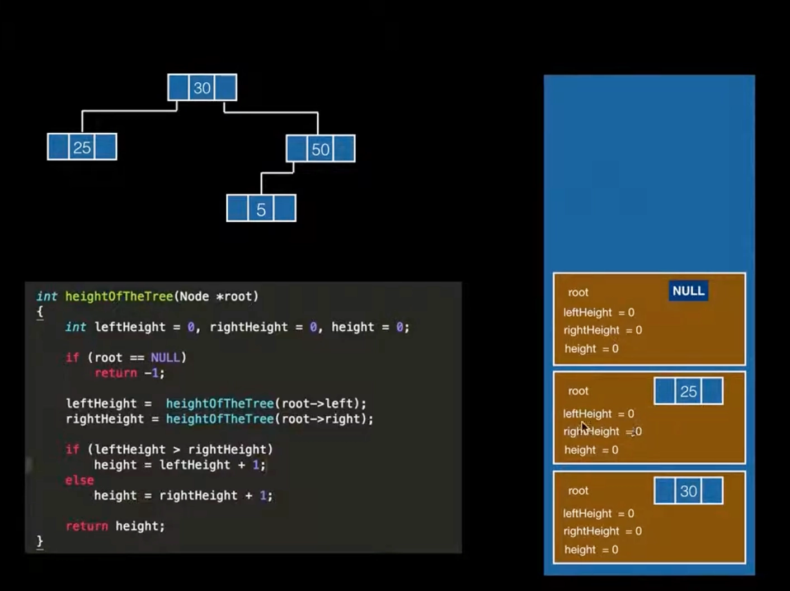
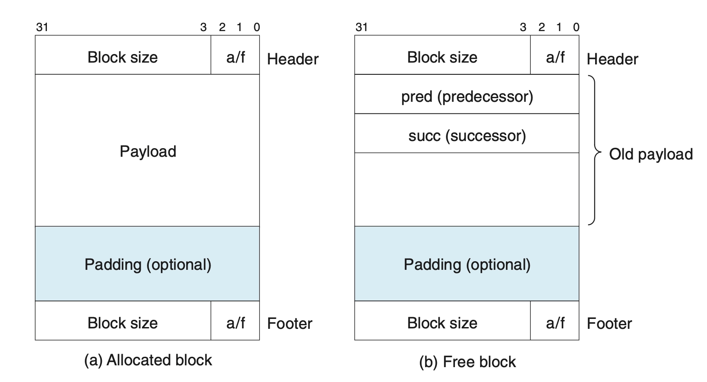
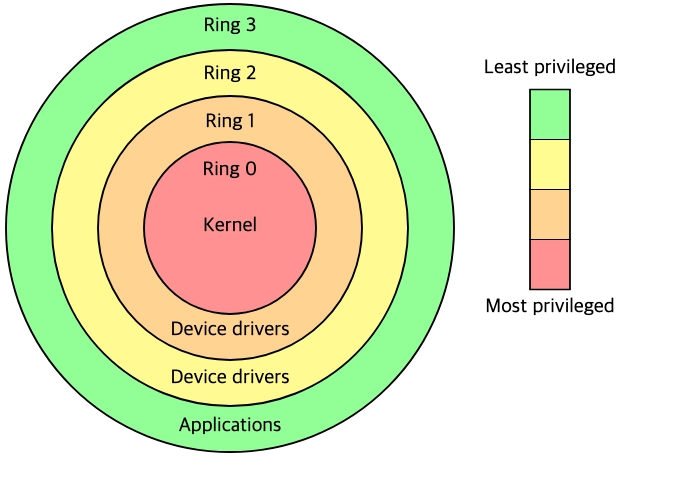
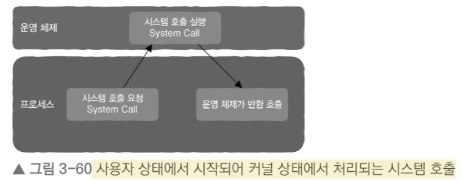
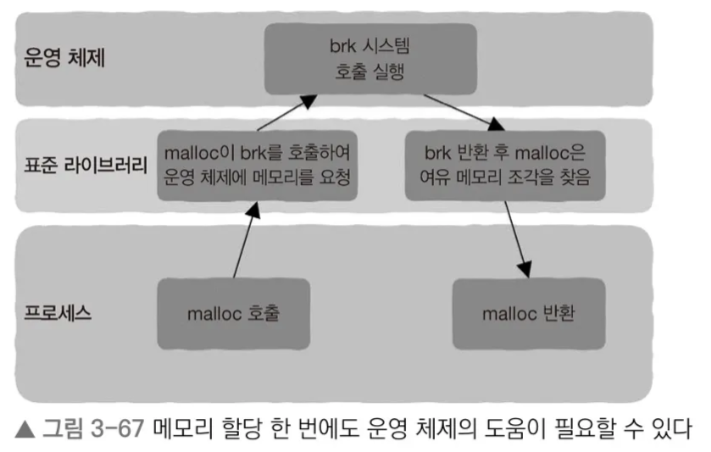
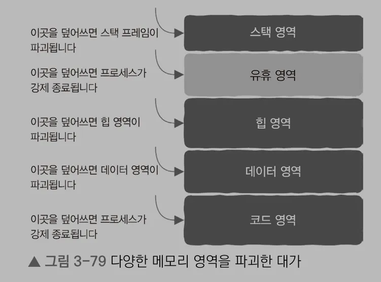

# Ch3. 저수준 계층? 메모리라는 사물함에서부터 시작해보자

## 메모리의 본질에 대한 이해

- memory cell이라는 사물함 형태로 구성되며, 각 사물함에는 1 or 0의 bit만 보관 가능하다
    - 이 사물함(cell)은 8개씩 묶여서 byte라 불리며, 각 byte 단위로 메모리 주소를 가진다
    - 1 byte = 8 bits (0~255의 숫자까지 표현 가능)
    - 우리가 조작 가능한 데이터 단위 역시 byte 이다
- 메모리는 내부에 어떤 것이 저장되는지 (int, structure, object 등..) 전혀 관심이 없으며, 메모리 관점에서는 1 or 0만 저장되지만 이들은 하나의 정보로 대응될 수 있다

### 메모리를 접근하려면?

고급 프로그래밍 없이 컴퓨터 메모리의 읽고 쓰는 과정 자체의 본질을 파악하려면, “메모리가 사물함이라는 사실”을 인지하고 있어야 한다

> CPU는 ①메모리에서 값을 읽고 → ②그 값을 레지스터에 저장 → ③레지스터를 읽어 연산 수행하는 과정을 통해 명령어를 처리한다
> 

[읽기] 

1. `load a $b` : 값 b를 레지스터 a에 읽어온다
2. `load a b` : 메모리 주소 b에 저장된 값을 레지스터 a에 읽어온다
3. `load a @b` : 메모리 주소 b에 저장된 값을 메모리 주소로 해석한 후, 해당 주소가 가리키는 값을 레지스터 a에 읽어온다  ****간접 주소 지정***

①메모리에서 값을 읽고

[쓰기]  

1. `store $a b` : 값 a를 메모리 주소 b에 저장한다
2. `store a b` : 메모리 주소 a에 저장된 값을 메모리 주소 b에 저장한다

②그 값을 레지스터에 저장

*`$` 기호가 붙으면 **값** / 없으면 **메모리 주소**로 간주

이때 이 ‘메모리 주소 a’, ‘메모리 주소 b’의 표현처럼, 변수는 특정 메모리 영역을 나타내는 식별자이며 컴파일 타임에 주소로 변환된다

- 메모리 주소만 알고 있으면, 변수가 메모리를 얼마나 차지하고 있는지에 관계 없이 데이터를 찾을 수 있고
- 이 주소에 대한 정보를 저장한 것이 포인터이다
    - 포인터는 메모리 주소를 더 높은 수준으로 추상화한 것!
    - **추상화의 목적 - 간접 주소 지정을 감추기 위함**
    - 어셈블리어 수준에서는 포인터를 주소 자체로 볼 수 있지만, 고급 언어에서는 단순히 하나의 변수에 불과
    - C언어에서는 포인터라는 개념을 통해 프로그래머가 직접 메모리 주소를 알 수 있으며, 이는 모든 추상화를 우회하는 방법이므로 프로그램 실행 상태를 직접 파괴할 수 있다는 위험도 따른다
- 참조(reference)는 포인터를 한 번 더 추상화한 개념으로, 직접 메모리 주소를 얻을 수 없고 포인터와 유사한 구조의 산술 연산을 할 수 없다는 차이가 있다

## 프로세스의 가상 메모리

프로세스는 각각의 가상 메모리 공간을 가지며, 이 가상 메모리 공간은 논리적인 주소 공간 (스택, 힙, 데이터, 코드 영역)으로 구성된다

- 프로세스는 실제로 동일한 크기의 조각(chunk)으로 나뉘어 물리 메모리에 저장된다 (실제로는 무작위로 흩어져 있음)
    - 이 조각은 **페이지(page)**라고 부르며, 가상 메모리 - 물리 메모리 간의 mapping 관계가 저장되는 page table이 있어야만 해당 메모리에 접근할 수 있다
    - mapping 정보가 없다면 ***Page Fault Interrupt*** 발생! → 이는 OS가 내부적으로 mapping 관계를 재설정하며 프로그래머 입장에서는 이 과정을 알 수 없다
- malloc으로 힙 영역의 메모리를 할당하면, 여러 프로세스에서 동일한 시작 주소를 반환할 가능성이 높은 이유도 이 때문이다
    - 실제로 page table 상에 매핑된 물리 메모리 주소값은 서로 다르므로, 문제가 되지 않는 것!

### 스택 영역 - 함수 호출 시 어떤 일이 일어날까?

> 함수 실행 시간 스택(runtime stack), 함수 호출 스택(call stack)
> 
- 함수 호출 시 필요한 정보는 각각의 stack frame 또는 call stack이라는 상자에 저장한다
    - **①함수명 ②매개변수 ③반환값**
    - 새로운 함수가 호출되면, 새로운 stack frame이 추가되며 스택 영역이 차지하는 메모리도 증가하는 구조
    - 함수 호출 과정이 완료되면, stack frame에 저장되어 있던 내용은 무효화(invalidation)된다
- **함수 호출 추적에 대한 스택 영역 적재 구조**
    
    
    
    https://youtu.be/tk3XV3MXgGw?si=5sg6t7ZukvmlOcsq
    
    - 스택 영역은 낮은 주소 방향으로 커지며, 함수 호출 깊이에 따라 증가하고 함수 호출이 완료될수록 감소한다
    - 이는 LIFO 순서로 진행되며, 호출에 대한 제어권은 **이진 트리의 탐색**과 같은 궤적을 나타낸다

**①함수명/반환주소** *(*컴파일 타임에 함수명 → 메모리 주소로 치환됨)*

제어권이 이전될 때는 다음 두 가지 정보가 필요하다 (e.g. 함수 A가 함수 B를 호출하는 경우)

- `return` : 어디에서 왔는지 (함수 A의 기계 명령어가 어디까지 실행되었는지)
- `jump` : 어디로 가는지 (함수 B의 첫 번째 기계 명령어가 위치한 주소)

**②매개변수 ③반환값**

CPU 내부의 레지스터를 통해 매개변수 전달과 반환값을 가져오는 작업을 처리할 수 있고, 레지스터의 수가 매개변수를 담기에 부족하다면 스택 프레임을 활용할 수 있다

- 앞의 몇 개 매개변수 → 레지스터
- 초과하는 것만 → 스택 프레임에 저장

**+) 지역변수**

지역 변수의 lifecycle은 함수 호출과 동일하다. 

- 프로그래머는 지역변수가 할당되고 해제되는 메모리에 대해 신경 쓸 필요가 없다
- 함수 반환 시, 더 이상의 사용 및 접근이 불가능하다 (해서는 안 된다)

지역변수도 매개변수와 같이 레지스터에 기록되며, 여러 함수에서 같은 레지스터 공간을 활용하여 지역변수를 저장할 수 있음을 유의해야 한다

[지역변수가 스택 프레임에 저장되는 케이스]

1. 레지스터에 저장된 기존 값이 존재하는 경우
    
    *레지스터에 지역변수를 저장하기 전에 반드시 먼저 레지스터에 원래 저장되었던 초깃값을 꺼냈다가 레지스터를 사용하고 나면 다시 그 초깃값을 저장해야 한다
    
2. 레지스터의 수가 지역 변수 수보다 부족한 경우

<aside>
🚨

**함수 호출 시 주의사항**

스택 영역은 크기에 제한이 있으므로, 이를 초과하면 Stack Overflow 오류가 발생할 수 있다

1. 너무 큰 지역변수를 만들지 않는다
2. 함수 호출 단계가 너무 많아서는 안 된다 (e.g. 과도한 반복문 내 호출 구조 지양)
3. 이미 무효화된 스택 프레임 내용에 대해 재사용 및 어떤 가정도 해서는 안 된다
</aside>

### 힙 영역 - 메모리의 동적 할당(Allocation)과 해제(Free)

지역변수와 달리 프로그래머가 직접 데이터의 lifecycle 및 접근 제어를 세부적으로 관리하기 위해서 ‘동적 메모리 할당과 해제’를 활용할 수 있다. 

- 메모리 영역을 언제 요청할 것인가
- 데이터를 저장하는 데 얼마나 많은 메모리 영역을 요청할 것인가

[메모리 할당자를 직접 구현해보자]

메모리 할당자의 입장> 적절한 크기의 메모리 영역을 제공만 하면 된다!

***무엇을 구현?***

1. 힙 영역에서 가능한 메모리 영역을 찾아 요청자에게 반환
2. 메모리 영역의 사용이 완료되었을 때 힙 영역에 이 메모리 영역을 반환

---

할당

STEP1. 요청에 따른 여유 메모리 조각을 찾는다 (CPU의 할당전략에 따라서)

STEP2. 메모리 조각을 할당된 것(flag=`a`)으로 표시하고, 헤더 뒤에 따라오는 메모리 조각의 주소(헤더의 4byte 제외)를 요청자에게 반환한다

해제

STEP3. STEP2에서 얻은 주소를 해제 함수에 전달한다

STEP4. 넘겨받은 주소에서 4byte를 뺀 헤더 정보를 얻어, 할당 설정값을 여유 메모리로 변경한다(flag=`f`) 

***성능 측정 기준?***

1. 요청된 크기에 만족하는 여유 메모리를 최대한 빨리 찾는다 → **[여유 메모리 조각 관리하기]**
    - linked list 자료구조로 할당 또는 해제된 전체 메모리 조각에 대한 사용 정보를 저장한다
        
        
        
        https://cs4157.github.io/www/2024-1/lect/02-memory-1.html
        
        [Header] 
        
        - 해당 메모리 조각이 비어 있는지 알려주는 flag 값 (`f`-free/`a`-allocated)
        - 해당 메모리 조각의 크기 → 이 정보를 통해 그 다음 노드의 시작 주소를 유추할 수 있음
        
        [Payload]
        
        - 할당 가능한 메모리 조각
    - 이를 통해 다음 할당할 노드 위치를 유추할 수 있다
2. 정해진 메모리 한도 내에서 가능한 한 많은 메모리 할당 요청을 만족시킨다 → **[할당 전략]**
    1. 최적적합 (BF, Best Fit) : 요청된 크기와 가장 근접한 크기의 메모리 반환
    2. 최초적합 (FF, First Fit) : 매번 처음부터 탐색 후 가장 먼저 발견된 메모리 반환
    3. 순환적합 (NF, Next Fit) : 마지막으로 발견된 위치부터 탐색 후 가장 먼저 발견된 메모리 반환
    
    *또한, 메모리 할당 시에는 균등 분할이 아닌 비균등 분할 형태로 남은 공간을 더 작은 여유 메모리 공간으로 활용함으로써 메모리 낭비를 최소화하는 것이 일반적이다
    
    → **[병합 전략]**
    
    1. 메모리 해제 시점에 즉시 병합
    2. 다음 할당 시점에 여유 블록을 찾지 못한 시점까지 연기하여 병합 ✅
        
        Header, Footer로 앞뒤의 메모리 조각 정보를 가져와 인접한 여유 조각을 빠르게 병합하는 방식 (Doubly Linked List 활용)
        
    

## 커널 상태 vs 사용자 상태



- 일반적으로 시스템은 CPU의 privilege 중 0, 3 단계만 사용한다
- `Ring 0` : CPU가 모든 기계 명령어를 실행할 수 있고, 모든 주소 공간에 접근할 수 있으며, 제한 없이 하드웨어에 접근할 수 있는 상태
- `Ring 3` : 프로그래머가 작성한 코드를 CPU가 실행하는 경우에 특정 주소 공간에 절대 접근할 수 없으며, 특권 명령어를 실행할 수 없는 제한적인 상태

- 프로세스는 system call을 통해 OS에 파일 Read/Write, 네트워크 데이터 통신과 같은 작업을 처리하도록 요청한다
    
    
    
    - [사용자 상태] 프로그래머는 표준 라이브러리(e.g. `malloc`, `tcmalloc`, `jemalloc`)를 통해 → [커널 상태] 실행 중인 OS에 따라 대응되는 system call을 실행하게끔 할 수 있다
- `malloc`이 동적 메모리를 힙 영역에 할당하는 과정을 살펴보자
    
    
    
    - 할당할 메모리가 부족해지면, [커널 상태]의 OS에 메모리를 요청하는 과정이 필요하다
    - `brk` 라는 힙 최상단을 가리키는 변수 값을 위로 이동시켜 힙 영역을 확장시키는 system call이 존재하며, `brk`는 OS의 일부분으로 커널 상태에 놓여 있다고 볼 수 있다
- 프로세스는 가상 메모리라는 시스탬 내에서 돌아가므로 위 동적 할당은 사실상 모두 논리적 과정이다
    - 물리 메모리가 실제로 할당되는 시점은 ‘해당 메모리가 사용되는 순간’이다
    - 만약 페이지 테이블 내 mapping 정보가 없다면 CPU는 [커널 상태]로 전환되어 실제 물리 메모리를 할당하기 시작한다

## 메모리 풀 (Memory Pool)

`malloc` 은 동적 메모리 할당을 위한 표준 라이브러리이므로, 특정 상황에 맞게 최적화된 용도는 아니다

특정한 상황에서 자체적으로 메모리 할당 전략을 구현할 수 있게끔 해준 것이 바로 **메모리 풀 기술**이다 

### 원리

> 한 번에 큰 메모리 조각을 요청하고 그 위에서 자체적으로 메모리 할당과 해제를 관리하는 방식으로 표준 라이브러리와 운영 체제를 우회한다
> 
- 메모리 동적 할당, 해제에 대한 오버헤드를 줄이기 위한 대안
- 특정 상황에서 사용되는 메모리의 사용 패턴을 미리 파악하고, 이에 적합하게 최적화가 가능하다
    - e.g. 사용자 요청을 처리할 때마다 여러 종류의 객체를 자체 메모리 풀 내에 미리 생성해두고, 실제 사용 시 메모리 풀에서 요청 및 반환이 이루어지도록 설계
- 메모리의 해제는 메모리 풀 내의 할당해둔 처리가 완료되는 시점에서 한꺼번에 해제

### 스레드 안전 문제

- 스레드 전용 저장소를 활용해, 각 스레드마다 메모리 풀을 유지하여 경쟁 문제를 해결할 수 있다
- 하지만 이러한 상황에서 스레드의 lifecycle은 종료되었으나, 해당 스레드의 메모리 풀 내에서 할당받았던 메모리 조각이 아직 사용되고 있다면 문제가 된다
    - 그렇다면 다른 스레드에서 해당 메모리를 해제해줘야 한다
- 메모리 풀은 고성능 서버에서 흔히 사용되는 최적화 기법으로, 사용 규칙이 다소 복잡하여 확실한 이해를 바탕으로 사용해야 한다
    
    

## 대표적인 메모리 관련 버그

1. 지역 변수의 포인터 반환
    - 함수가 호출된 이후에 실행이 완료되어, 스택 프레임이 invalidation 된 상황
    - 해당 함수에서 지역변수의 포인터를 반환한다면, 이미 없는 변수를 가리키게 되므로 다른 함수의 스택 프레임이 덮어쓰거나 포인터의 값을 수정했을 때 스택 프레임이 파괴되는 버그가 발생할 수 있음
    
    ```c
    int* func() 
    {
    		int a = 2;
    		
    		return &a;
    }
    ```
    
2. 포인터 연산 시 주의할 점
    - 포인터가 가리키는 데이터 형식의 크기를 `sizeof(int)` 와 같이 명시적으로 접근하는 것은 위험하다
    - 항상 가리키는 데이터 형식의 크기가 포인터의 단위라고 간주하면 된다
3. 문제 있는 포인터 역참조하기
    
    ```c
    int a;
    scanf("%d", a);  // 이때 a는 주소값으로 취급된다
    ```
    
    
    
    1. 코드 영역 / 기타 읽기 전용 영역을 가리키는 포인터 값으로 해석된 경우
        
        OS는 프로세스를 즉시 kill 하므로, 빠르게 감지할 수 있다
        
    2. 스택 영역을 가리키는 포인터 값으로 해석된 경우
        
        다른 함수의 스택 프레임이 파괴되었으므로, 예기치 못한 버그를 야기한다
        
    3. 힙 영역 / 데이터 영역을 가리키는 포인터로 해석된 경우
        
        프로그램이 동적으로 할당한 메모리가 파괴되었으므로, 예기치 못한 버그를 야기한다
        
4. 초기화되지 않은 메모리 읽기
    
    힙 영역에서 동적으로 할당된 메모리는 항상 0으로 초기화된다고 가정할 수 없다. malloc 호출 시에는 다음 두 가지 가능성을 염두에 두어야 한다
    
    1. 메모리가 충분하고, 이미 사용된 경우 - 해당 메모리는 이전에 사용한 정보가 남아 있을 수 있으므로 0이 아닐 수 있다
    2. 메모리가 충분하지 않은 경우 - `brk` 와 같은 system call로 메모리를 요청하면 OS가 실제 물리 메모리를 할당하므로 이때는 0으로 초기화될 수 있다
5. 이미 해제된 메모리 참조하기
    1. 해제 이후 malloc으로 다시 할당하지 않은 경우 - 기존에 가리키던 값 유지
    2. 해제 이후 malloc으로 다시 할당한 경우 - 이미 덮어쓰기가 되었을 수 있으며, 다른 스레드가 해당 메모리를 수정하고 있을 수 있으므로 결과 예측이 불가능해짐
6. 배열 첨자는 0부터 시작한다
    
    `for (int i = 0; i ≤ n; i++)` 와 같이 배열의 인덱스가 0부터 시작하는 사실을 잊은 구현은 배열의 i번째 메모리를 다른 값으로 덮어쓰게 되는데, 이때 덮어쓴 메모리가 malloc이 사용하는 메모리 할당 상태 정보를 저장한 공간이라면, malloc의 동작을 파괴하는 문제까지 이를 수 있다.
    
7. Stack Overflow
    
    초과하는 순간 스택 프레임 내에서 인접해 있던 데이터를 파괴하게 된다. 특히 스택 프레임에는 함수 반환 주소와 같이 중요한 정보가 들어 있으므로 힙의 overflow 보다 문제를 일으킬 가능성이 더 높다
    
    - kill process
    - 장시간 실행되다가 갑자기 오류가 발생 (runtime exception)
    - 정상 동작하는 듯 보이지만 어디선가 잘못된 결과를 계속해서 제공
    
    → 이를 악용한 해킹 사례도 존재함 (악성코드를 심은 주소로 반환하도록 overwrite)
    
8. Memory Leak
    
    ```c
    void memory_leak()
    { 
    		int *p = (int*)malloc(sizeof(int));
    		
    		return;
    }
    ```
    
    위와 같은 코드는 메모리는 프로세스 종료 전까지 다시 해제할 방법이 없어 힙 영역이 점점 차며 memory leak 이 발생하게 된다.
    
    Automatic GC를 지원하지 않는 언어에서 특히 흔하게 발생하는 문제이며, 힙이 부족해지면 결국 OS가 kill process 하는 상황까지 이르게 된다  ****OOM Killer***
    
    [Memory Leak 분석 도구 구현 방식]
    
    1. malloc과 free의 사용 상황 추적하기
    2. 가상-물리 메모리 간의 page fault 오류가 발생하는 system event를 추적하기 (Memory Leak이 page fault 를 유발하기도 함. e.g. Linux의 https://perfwiki.github.io/main/ 활용 가능)


> 전공수업 정리 내용 : [https://drive.google.com/file/d/1nI4pwLYQ_Jw51KWH-WVZ7fJRMfCqMI0C/view?usp=sharing](https://drive.google.com/file/d/1nI4pwLYQ_Jw51KWH-WVZ7fJRMfCqMI0C/view?usp=sharing)