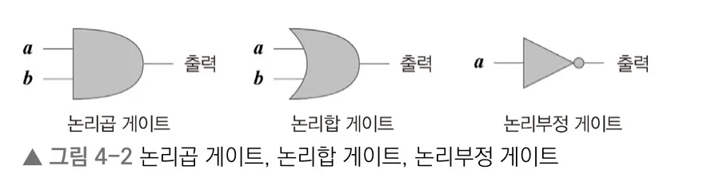
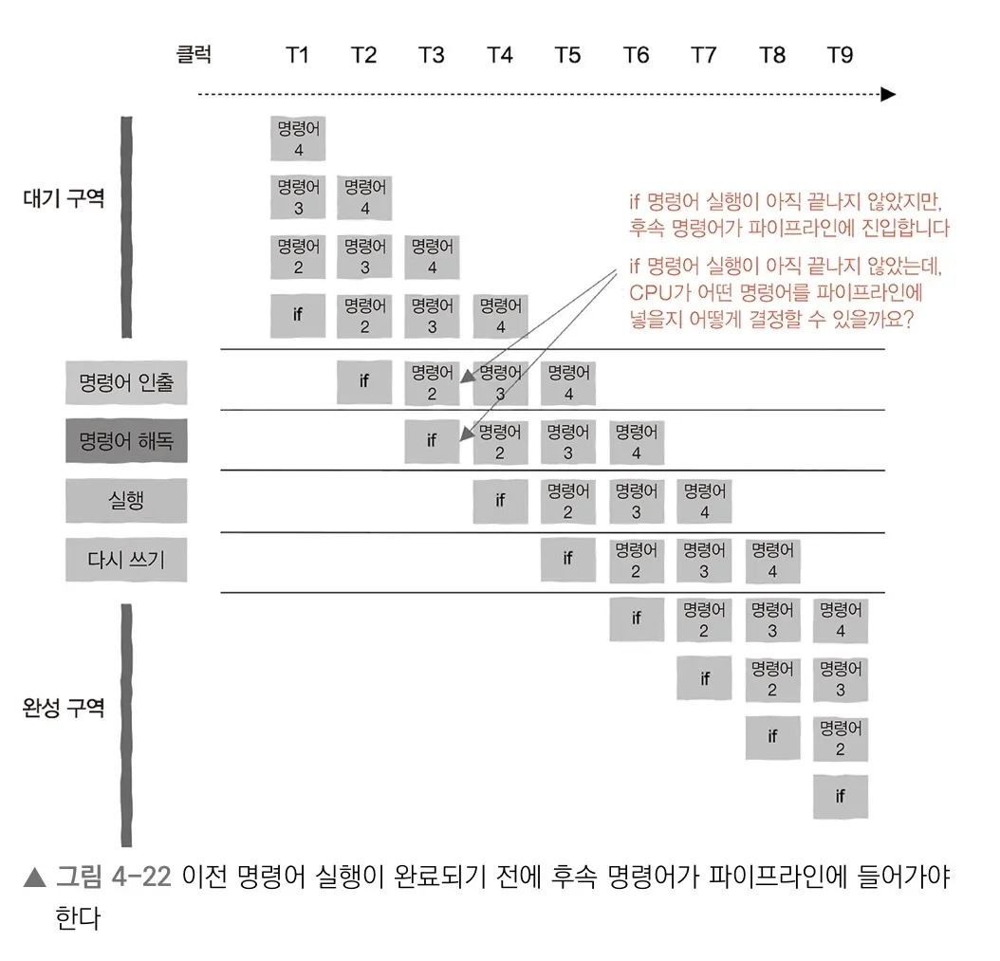
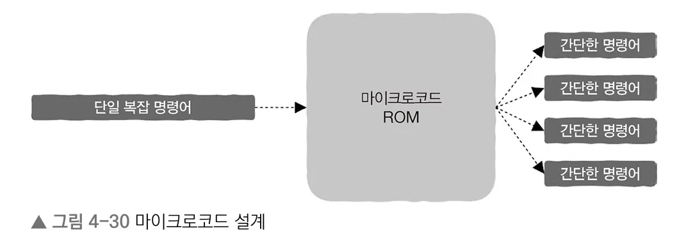

# Ch4. 트랜지스터에서 CPU로, 이보다 더 중요한 것은 없다


## CPU의 동작 원리

### 트랜지스터

- 1(ON)/0(OFF) 의 간단한 개폐 작업으로 동작 (스위치와 같은 개념)
    - CPU는 0과 1의 2진법만 알고 있다는 점과 대응
- 회로 3개로 어떠한 논리함수도 구현할 수 있다
    
        
    - 논리곱 (logical conjunction gate)
    - 논리합 (logical disjunction gate)
    - 논리부정 (logical negation gate)

> 모든 연산 논리를 반드시 회로와 같은 하드웨어로 구현할 필요는 없다
> 

<aside>
🧑🏻‍🍳

***요리사에 비유해보자***

- 요리사는 레시피를 읽고, 기본적으로 갖춘 기술 (칼질, 볶기, ..)과 재료, 가열, 조미료 등 다양하게 변화시키며 하나의 요리를 만든다

- 요리사 = 하드웨어 / CPU **→ 변하지 않는 것**
- 레시피 = 소프트웨어 / 기계 명령어 **→ 변하는 것**
- 요리를 만든다 = 프로세스와 스레드를 실행한다
</aside>

즉, 변하지 않는 하드웨어에 서로 다른 소프트웨어를 제공하면 하드웨어가 완전히 새로운 기능을 구현할 수 있다

- CPU는 다양한 연산을 수행할 수 있는 하드웨어 능력을 지니고 있고,
- 기계 명령어는 CPU가 그 능력을 어떻게 사용할지 알려주는 역할이며, 이는 명령어 집합(instruction set)으로 표현된다
    - 명령어 집합(ISA) = 실행 가능한 명령어(opcode) + 각 명령어에 필요한 피연산자(operand)
    - 이는 시스템 계층 관점에서 **SW와 HW가 만나는 지점**이자, **SW가 HW를 사용하는 방식을 정의하는 인터페이스**로 볼 수 있다

### CPU의 능력

**① 연산 능력**

- 위 3개의 기본 게이트들을 조합한 회로로 CPU의 연산 능력을 만드는 것!
    - **`ALU(Arithmetic Logic Unit)`** - 전문적으로 계산을 담당하는 CPU의 산술 논리 장치

**② 기억 능력**

- 회로는 정보를 어떻게 기억할까?
    - 논리 게이트를 피드백 루프로 연결하면 이전 상태를 유지할 수 있다. 이 구조를 ***latch*** 또는 ***flip-flop***이라 하며, 레지스터와 메모리의 기본 구성 요소가 된다.
    - *부정 논리곱 게이트 (논리곱 + 논리부정의 조합)를 이용해, 회로의 입출력을 reverse 하는 방식으로 정보를 기억한다*
    
    > (INPUT) D 단자가 0 → (OUTPUT) 전체 회로는 0을 저장
    > 
    > 
    > (INPUT) D 단자가 1 → (OUTPUT) 전체 회로는 1을 저장
    > 
    
    * ***flip-flop*** 은 1비트 상태를 저장할 수 있는 기본 순차 회로로, 이런 저장 요소들이 모여 레지스터와 메모리의 기초를 이룬다.
    
- **`Register`** 를 이용해 연산에 필요한 값을 저장할 수 있다
    - CPU 내부에는 레지스터라는 매우 빠른 저장 공간이 존재하며, 연산에 필요한 데이터는 가능한 한 레지스터에서 처리된다.
- **`Clock Signal`** - 전압이 변경될 때마다 전체 회로 상태를 갱신하여 전체 회로가 “함께” 동작하게 한다
    - (일반적인 케이스) Clock Rate가 높을수록 CPU가 1초 동안 더 많은 작업을 할 수 있는 것
    
    ** 실제 성능은 IPC, 캐시, 파이프라인, 메모리 지연 등에도 크게 좌우된다*
    

## CPU는 유휴상태(IDLE)일 때 무엇을 할까?

- 일반적인 데스크톱 환경에서는 많은 프로세스가 실행 중이더라도, 특정 시점의 CPU 사용률은 낮은 경우(7~8%)가 많다
- 수많은 프로세스가 떠 있음에도 CPU가 사용되지 않는다는 것은, 대부분의 프로세스가 기본적으로 **아무 작업도 하지 않**으며 특정 이벤트로 자신을 깨울 떄까지 대기 상태에 머무른다는 것을 의미한다
- 운영체제는 **대기열(Queue)**을 이용하여 프로세스 스케줄링을 관리한다
    - Ready Queue가 비어 있다면 스케줄링해야 하는 프로세스 없음을 의미 = 즉, CPU가 유휴 상태에 있음
    - Queue가 비어 있지 않은 것처럼 보이기 위해서 (예외를 만들지 않기 위해서) 스케줄러가 Queue로부터 항상 실행할 수 있는 프로세스를 찾게 하면 된다
    - 이 프로세스가 바로 ‘유휴 프로세스’ (e.g. Window - System Idle Process)
- `halt` (커널 특권 명령어)를 통해 CPU 내부의 일부 모듈을 **절전 상태로 전환**하고, 전력 소비를 크게 줄일 수 있다
    - 유휴 프로세스는 `halt`를 순환 구조에서 지속적으로 실행하는 역할을 한다 (while(1) 과 같은 무한 순환 구조)
    - CPU가 `halt` 명령어를 실행한다는 것은 시스템 내 더 이상 실행할 준비가 완료된 프로세스가 없음을 의미 (즉, 유휴 상태 진입 가능)
    - 이에 대한 상세 구현은 CPU마다 상이 - deep sleep (C3), deeper sleep (C4) → 유휴 시간을 에측하여 어떤 수면 상태로 진입할지 결정

### 인터럽트(Interrupt)

- 운영체제는 타이머 인터럽트를 일정 시간마다 생성하고, CPU는 이 인터럽트 신호를 감지하여 운영체제가 프로세스 스케줄링을 할 수 있게끔 한다
- CPU는 완전히 아무것도 하지 않는 것이 아니라 인터럽트를 기다리는 상태로 진입한다.
    
    ```bash
    Ready Queue empty
          ↓
    Idle Process 실행
          ↓
    HALT instruction
          ↓
    Interrupt 발생
          ↓
    CPU wake up
    ```
    

## CPU의 숫자 체계

> 기본 : 0과 1의 2진법
> 
- 비트 k개를 사용하면 정수 2^k개를 나타낼 수 있다 (8bit 예시)
- Unsigned Integer : 0 ~ 2^k-1 (0 ~ 255)
- Signed Integer : -2^(k-1) ~ 2^(k-1)-1 (-128 ~ 127)
    - 음수 표현은 2의 보수 방식으로 나타낸다

## CPU는 어떤 상황에서 성능 효율이 높아질까?

### 파이프라인 기술

> 개별 명령어의 지연 시간을 줄이기보다, 단위 시간당 처리량(throughput)을 높이는 기술
> 

**[정렬된 배열 VS 무작위 배열을 처리할 때의 차이]**

- 리눅스 perf 도구 분석 결과 중 **`branch-misses` (분기 예측 실패율)** 항목에서 큰 차이를 보인다는 통계를 확인할 수 있다
- *배열의 정렬과 분기 예측에는 어떤 상관관계가 있을까?*
    
    <aside>
    🚗
    
    ***자동차 제조 과정에 비유해보자***
    
    - 자동차 1대 조립에 20분씩 걸리는 4개 단계가 필요하다고 할 때,
    - 하나의 팀에서 전부 담당하면 → 80분 소요
    - 각 단계를 전담하는 팀을 나누어 같이 작업하면 → 20분 소요
    
    → 즉, 전체 자동차 조립 시간을 줄이는 것이 아닌 공장의 처리 능력을 높일 수 있다
    
    - 공장 = CPU
    - 자동차 생산 = 기계 명령어 실행
    </aside>
    
    - 하나의 기계 명령어를 처리하는 데는 4개 단계로 나누어 볼 수 있다
        1. 명령어 인출 (`IF`, instruction fetch)
        2. 명령어 해독 (`ID`, instruction decode)
        3. 실행 (`EX`, execute)
        4. 다시 쓰기 (`WB`, writeback)
- **if문(분기) 이 파이프라인에 주는 영향**
    
    
    - 기계 명령어가 순차적으로 실행될 경우, 파이프라인에는 현재 → 그 다음 명령어들로 꽉 채워지며 CPU의 리소스를 쉴 틈 없이 사용하게 된다
    - 분기 점프 명령어가 존재할 경우, 해당 **분기가 실행을 완료하기 전까지 다음 명령어를 알 수 없기 때문에** 파이프라인에는 빈 공간이 생기고 CPU의 리소스를 완전하게 사용할 수 없게 된다
    - 따라서 CPU는 어떤 분기의 명령어를 파이프라인에 넣을지 **미리 예측**하는 과정을 수반한다
- 다시 배열에 적용해보면..
    
    ```bash
    if branch
    
    CPU prediction
         ↓
    correct → pipeline 유지
    wrong   → pipeline flush
    ```
    
    - 정렬된 배열 - if 조건의 결과가 매우 규칙적 - 예측이 거의 적중
    - 무작위 배열 - if 조건의 결과가 불규칙 - 예측이 어려워짐 **⚡프로그램 성능 저하**
        - 분기 예측이 실패하면 파이프라인에 들어간 명령어가 무효화되며 pipeline flush가 발생함
        - 이로 인해 **CPU가 다시 명령어를 채워야 하므로** 성능이 저하되는 것
    
    → **컴파일러 최적화를 적용한다면?**  `likely` / `unlikely` 매크로로 코드를 가장 잘 아는 프로그래머가 분기 예측 적중률을 높일 수 있도록 힌트를 줄 수 있음 
    
    *하지만, 현대 CPU의 동적 분기 예측을 직접 제어하는 데 사용하지는 않음
    

## CPU 코어 수 - 스레드 수의 관계

- 단일 코어 CPU는 한 순간에 하나의 **스레드**만 실행할 수 있다
    - 운영체제의 다중 스레드 스케줄링을 통해 빠르게 전환(Context Switching)하면서 동시에 여러 **작업**이 실행되는 것처럼 보이게 한다.
    - 이때 각 스레드가 특정 **작업**을 기다리지 않고 진행할 수 있기 때문!
    - 우리는 스레드의 추상화 덕분에 시스템이 단일 코어인지 다중 코어인지 신경 쓸 필요가 없다
- 다중 코어 시스템에서 리소스를 최대한 활용하는 방법은 코어 수에 적절한 스레드 수 만큼 다중 스레드를 활용하는 것이다
- 적절한 스레드 수에 대한 결정은 각 프로그램의 상황에 따라 다르므로 지속적으로 테스트하여 적절한 결정을 내려야 한다
    - 스레드 전환 비용과 운영체제가 할당할 수 있는 적정선을 잡는다면 시스템 성능을 향상시킬 수 있다

## CPU 진화론

<aside>

### History

1. 복잡 명령어 집합 컴퓨터 (CISC, Complex Instruction Set Computer)
    - x86 프로세서 (Intel, AMD)
2. 마이크로코드 (Microcode)
3. 축소 명령어 집합 (RISC, Reduced Instruction Set Computer)
4. 하이퍼스레딩 (Hyper-threading)
</aside>

### 복잡 명령어 집합

- 명령어 집합은 **CPU를 설명하는 데만** 사용된다
- CPU마다 서로 다른 유형의 명령어 집합을 가지며, 이는 프로그래머의 코드 작성과 CPU의 하드웨어 설계에 모두 영향을 미친다
- 어셈블리어로 개발하던 시절에는 이 명령어 집합만 있어도 코드를 작성할 수 있었음 (기계 명령어와 각각 대응 가능)
    - 즉, 그만큼 명령어 집합이 매우 다양하고 복잡도가 높았음을 의미
    - 고급 프로그래밍 언어는 이보다 훨씬 단순화되었으며, 기계 명령어와 직접 대응하기에 덜 직관적 (함수 호출, 순환 제어, 복잡한 주소 지정 패턴, 데이터 구조, 배열 접근 등)

### 마이크로코드

- 코드가 차지하는 저장 공간도 줄여야 한다!
    - 작은 메모리에 더 많은 프로그램을 적재하려면 기계 명령어를 반드시 세밀하게 설계하여 프로그램이 차지하는 저장 공간 자체를 줄일 필요가 있다
- 요구사항 - ①하나의 기게 명령어로 더 많은 작업 완료 ②가변 길이 ③인코딩
- 아이디어 - ***하드웨어의 변경은 번거롭지만, 소프트웨어의 변경은 비교적 쉽다!***
    
    

    - 명령어에 포함된 연산 → 더 간단한 명령어로 구성된 작은 프로그램으로 정의하고 CPU에 저장
    - 각 명령어 집합에 대응되는 하드웨어 회로를 설계할 필요X
- 한계점
    - 버그 수정이 일반 프로그램보다 어려움
    - 마이크로코드 설계 자체가 트랜지스터를 매우 많이 소모함

### 축소 명령어 집합

- 흐름의 변화
    1. 메모리 용량 대비 가격이 급격하게 떨어짐
    2. 컴파일 기술의 발전 (고급 언어를 간단한 기계 명령어의 조합으로 변환하는 최적화) → 마이크로코드 (복잡한 기계 명령어를 간단한 기계 명령어로 변환) 와 충돌!
- 설계 철학
    1. 명령어 자체의 복잡성 - CPU 내부 마이크로코드 설계 없이, 복잡한 명령어를 명령어당 간단한 연산을 수행하도록 대체 
    2. 컴파일러 - 기계 명령어의 세부사항을 컴파일러에 제공 *“Relegate Interesting Stuff to Compiler”*
    3. LOAD/STORE 구조 - 복잡 명령어 집합의 IF-ID-EX-MEM-WB 과정을 간소화 → 레지스터 내 데이터만 처리 가능. 메모리에 직접 접근 X (전용 명령어 사용)

### 하이퍼스레딩 (= 하드웨어 스레드)

> 하나의 물리 코어가 두 개의 논리 코어처럼 동작하도록 하는 기술
> 
> 
> → 물리 코어 수를 늘리는 것이 아닌, 한 코어의 유휴 자원을 더 잘 활용하는 것을 기조로 함
> 
- [기본 원칙] 시스템에 N개의 CPU 코어가 있을 때, 운영체제는 N개의 준비 완료 상태인 스레드를 N개의 CPU 코어에 할당하여 동시에 실행한다
- 하나의 물리 코어가 두 개 이상의 하드웨어 스레드 상태를 유지해, 한 사이클에 서로 다른 스레드의 명령어를 더 효율적으로 실행할 수 있게 한다
- 파이프라인 기술에서의 “빈 공간”을 **추가 명령어 흐름**을 도입하여 채워서 CPU의 리소스를 최대한 활용하는 아이디어
