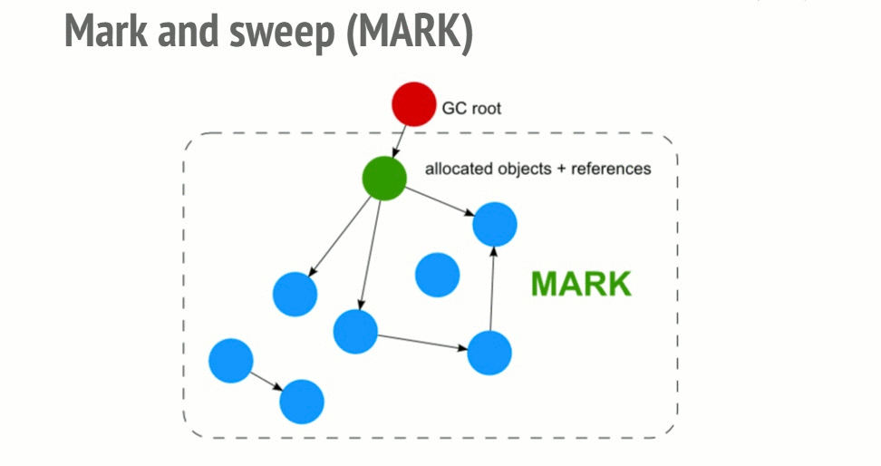

# Green Tea GC

- Golang의 GC는 Concurrent Tri-Color Mark and Sweep 방식
	- 모든 객체를 순회하면서 마킹
	- 순회 후 수집해도 되는 객체들을 수집
- Go GC는 Compaction을 하지 않음
	- 메모리 파편화가 발생할 수 있음
	- 그러나, 32kb 이하 (large가 아닌) 친구들은 Memory Allocator가 적절히 쪼개서 나눠주므로 파편화를 줄여줌
- Generational GC가 아님. 모든 객체 동등하게 GC

- 그렇다면 Golang의 기존 GC는 뭐가 문제였는가?
	- 루트로부터 모든 객체를 탐색하는 구조
	- 객체가 서로 다른 메모리 영역에 존재하다면, 이 탐색 과정에서 여러 메모리 영역을 왔다갔다 하게 됨
	- 메모리 영역 이동하고, 캐시 날라가고 등 이 과정에서 비효율이 발생
	- GC는 여러 코어를 써서 돌고, 이 과정에서 여러 CPU가 메모리를 왔다갔다 하면서 대역폭을 점유한다거나
	- 캐시가 비효율적으로 사용하는 문제가 있을 수 있음
	- CPU 20% 이상을 GC에 쓰는 경우도 종종 있음

- GC를 프로파일링 해보자
	- GC 비용의 90%는 마킹, 10%는 스위핑
	- 스위핑은 마킹보다 최적화가 쉽고, Go는 수년 동안 매우 효율적인 스위퍼를 갖추고 있다
- 또한 마킹에 소비되는 시간 중 상당 부분(최소 35%)는 힙 메모리에 접근하는 동안 정지된 상태

- 현대 CPU 하드웨어 추세
	- 메모리는 CPU 코어의 일부 하위 집합이랑 엮인다
		- 다르게 생각하면, 다른 CPU 코어가 그 메모리에 접근하면 더 느리다
		- 따라서 메모리에 어떤 CPU 코어가 접근하냐에 따라 비용이 크게 달라짐
	- CPU 당 메모리 대역폭이 시간이 지남에 따라 감소함
		- 캐시 미스가 나면 이전보다 더 오래 대기함
	- CPU 코어가 더 많아짐
		- 지금까지의 알고리즘은 어느 정도까지는 잘 확장되지만, 코어가 늘어날수록 스캔 객체의 공유 큐가 병목이다
	- 현대 CPU에는 SIMD와 같은 벡터 명령어가 있는데 기존 GC는 불규칙하고 작은 단위의 작업을 매우 많이 수행해 당장 적용하기가 어렵다

- 이를 해결하기 위해 MemorySpan을 도입
	- 객체 스캔 대신 전체 페이지를 스캔하자
	- 공유 작업 목록에서 객체를 추적하는 대신, 전체 페이지를 추적
	- 전체 마킹된 객체를 추적하는 게 아니라, 각 페이지 단위로 마킹된 객체를 추적
- 그래서?
	- 큰 메모리 영역(8KB)을 할당 받아서 작은 객체를 할당
		- 최대 512Bytes 크기의 객체 할당 가능
	- 세부 동작은 기존 GC와 거의 동일
- Green Tea GC는 메모리 스팬을 큐에 쌓고, 순차적으로 검사
- 즉, 탐색 단위가 메모리 스팬 단위가 됨
- 따라서 객체를 탐색할 때 객체가 메모리 스팬 안에 모여있어서 메모리 탐색 비용이 감소함
- 메모리 스팬 단위로 GC를 수행하니 멀티 코어를 활용하기도 좋음

- 더 높은 확률로 서로 더 가까이 있는 객체들을 스캔하므로
- 캐시 활용 잘하고, 메인 메모리 접근을 피하고
- 객체 대신 작업 페이지를 관리하니 작업 목록도 더 작아지고, 경합도 줄어든다

- 또한 벡터 연산을 활용하는 게 가능해진다
- 최신 벡터 하드웨어는 Green Tea에 유용한 두 가지 기능을 제공한다
	- 매우 넓은 레지스터, 정교한 비트 단위 연산
- 예를 들어 x86 CPU는 512 폭의 벡터 레지스터 AVX-512를 지원한다

- CPU 상의 단 두 개 레지스터에 한 페이지 전체의 모든 메타데이터를 담기에 충분히 넓어서, 몇 개의 명령만으로 한 페이지 전체를 처리하는 게 가능하다
- 새로운 비트 벡터 Swiss army knife 명령도 이와 결합해 GC 스캔을 효율화할 수 있다
- 그렇다면 예전에는 이게 왜 어려웠나?
	- 매번 메모리 점프하느라 이게 어려웠고, 규칙성이나 예측 가능성이 전무했다

- 따라서 이는 메모리가 잘 변경되지 않거나, 짧은 시간 동안 작은 데이터가 할당되는 구조에서 유리함
	- 힙이 매우 규칙적인 구조 (비슷한 깊이에 같은 크기의 객체들이 있는 경우)에 유용
	- 그러나 어떤 워크로드에서는 한 번에 페이지당 단 하나의 객체만 스캔해야 하는 경우가 자주 발생
	- 이는 기존보다 잠재적으로 더 나쁠 수 있는데, 페이지에서 객체를 누적하려고 시도하다가 더 작업이 많아질 수 있음
	- 그래도 한 번에 페이지의 고작 2%만 스캔해도, 기존 대비 개선을 얻을 수 있다

- Google 왈
	- 대부분의 경우 GC 소요 시간이 10% 줄고
	- 일부 워크로드에서는 최대 40% 감소

- 물론 모두가 그런 건 아님
	- [We tried Go's experimental Green Tea garbage collector and it didn't help performance \| DoltHub Blog](https://www.dolthub.com/blog/2025-09-26-greentea-gc-with-dolt/)

