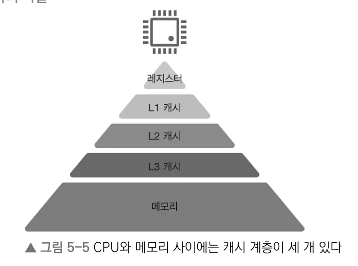
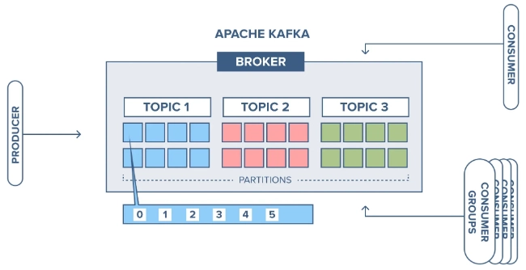
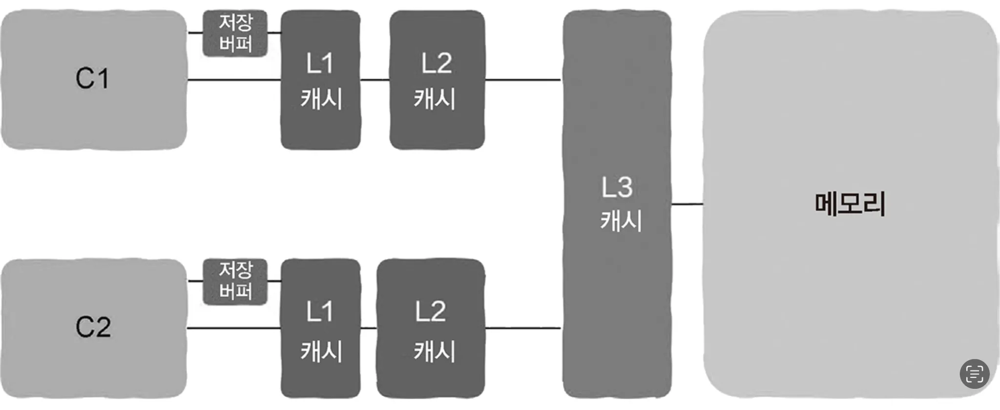
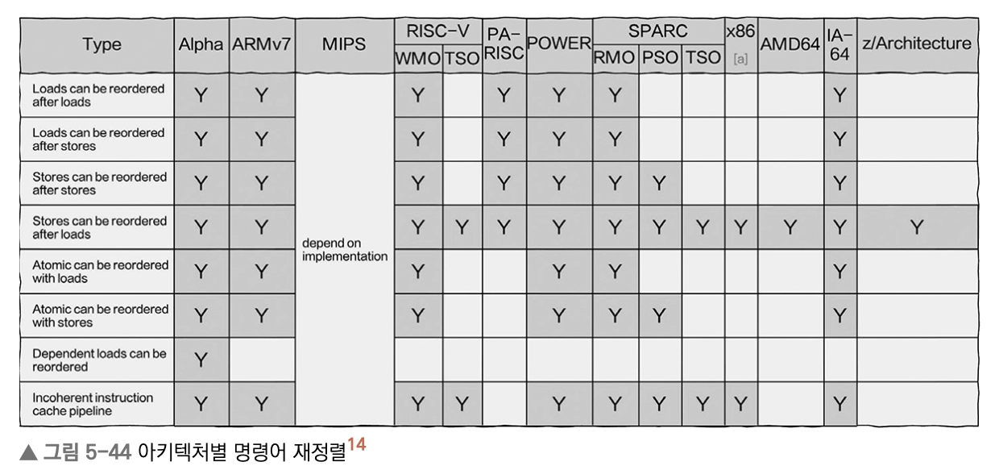

# Ch5. 작은 것으로 큰 성과 이루기, 캐시
## 캐시의 필요성

- CPU가 명령어, 데이터를 가져오기 위해서는 반드시 메모리에 접근해야 함
    - 하지만 CPU의 속도는 메모리보다 훨씬 빠르기 때문에, CPU가 메모리를 직접 계속 접근하면 성능 병목이 발생
    - 메모리 → 레지스터에 올려서 실행하지만, 레지스터 용량은 극히 제한되어 있으므로 메모리로의 접근은 필연적
    - CPU [매우 빠름] ~ 메모리 [매우 느림] → 이 차이가 작을수록 시스템 성능은 좋아짐
        - 이 간극을 메우기 위한 계층이 바로 **캐시**!
        - 캐시를 통해 CPU가 직접 메모리와 상호작용하지 않게 하여 속도를 높일 수 있다
- 캐시는 CPU 속도에 거의 필적하며, CPU는 캐시에서 **가장 먼저** 데이터를 찾는다
    
    
    
    **컴퓨터 시스템의 저장 계층 구조 - *CPU 코어, L1 캐시, L2 캐시, L3 캐시, CPU 코어는 레지스터 칩 내에 묶여 패키징되어 있다***
    
    - L1 캐시 - 레지스터 접근 속도와 거의 유사 (약 4 clock cycle)
    - L2 캐시 - 약 10 clock cycle
    - L3 캐시 - 약 50 clock cycle
    
    ***L1 → L2 → L3 → 메모리 순으로 접근***
    

<aside>
⚡

**컴퓨터 저장체계의 각 계층은 다음 계층에 대한 캐시 역할을 수행한다!**

</aside>

### 메모리와 디스크 관계 (Page Cache)

*⚠️ *완전히 단순화된 표현임!*

> 
> 
> 1. 운영체제는 **메모리의 일부를 페이지 캐시(Page Cache)** 로 사용하여 디스크 I/O를 줄인다
> 2. 프로세스 가상 메모리 할당, 해제 시 디스크를 활용하여 물리 메모리를 초과하지 않을 수 있다
- <레지스터 - 메모리 - 디스크>의 관점에서, 운영체제는 메모리를 디스크의 캐시로 사용한다
    - 메모리 사용률은 항상 일부 여유 공간이 남아있는데 (대부분 100% 도달 X), 이 여유 공간을 활용해 디스크에서 데이터를 읽어오는 일을 최소화한다
    - 파일을 읽을 때 최초 실행은 매우 느리지만, 그 이후부터는 빨라지는 것의 원리!
    - → **리눅스 운영체제 페이지 캐시의 기본 원리**
- 최근에는 **RAM**의 등장으로, 서버에서 메모리가 **디스크 자체를 대체**하는 것이 대세
    - 메모리 비용이 점차 저렴해진 것이 주 원인
    - 데이터베이스를 전부 메모리에 설치하여 디스크 I/O가 필요하지 않는 경우도 있음 (e.g. Presto, Flink, Spark)
    - But, 메모리는 영구 저장이 불가하므로 디스크를 완전하게 대체하는 것은 불가능함
- 가상 메모리와 디스크
    - 메모리 자신을 읽고 쓸 때도 디스크를 메모리의 ‘창고’처럼 활용한다
    - 각 프로세스마다 가지는 프로세스 주소 공간은 가상 메모리의 개념으로, 실제 물리 메모리를 초과할 수 있음 (e.g. 프로세스 N개가 메모리를 모두 사용 → N+1번쨰 프로세스가 메모리 요청)
    - 일부 프로세스에서 **자주 사용하지 않은 메모리 데이터를 디스크에 기록**하고 해당 물리 메모리 공간을 해제 → 프로세스의 데이터가 디스크에 임시로 보관된 개념
    - 즉, 프로그램이 디스크 I/O를 명시적으로 포함하지 않더라도 내부적으로는 디스크에 접근하는 경우가 생길 수 있다! (메모리 사용률이 높을 때)

### 분산 파일 시스템 : 대용량 데이터의 저장

- 분산 파일 시스템은 여러 장치로 대용량 데이터를 저장하는 상황에서 주로 사용됨
    - 분산 파일 시스템을 직접 mount하고, **시스템에서 전송한 파일이 로컬 디스크에 저장**되는 구조 (network 통신 X)
    - **로컬 디스크 = 원격 분산 파일 시스템의 캐시**
- 데이터를 stream 형태로 로컬 컴퓨터 시스템의 메모리로 직접 끌어오면, 속도를 향상시킬 수 있음
    - **메모리  = 원격 분산 파일 시스템의 캐시** 처럼 활용됨
    - Kafka에서도 이러한 패턴을 사용 - 원격 분산 파일 시스템에 저장되는 대용량 메시지는 실시간으로 데이터의 소비자에게 전달됨
        
        
        
        - Broker는 메시지를 로컬 디스크의 로그 세그먼트 파일에 저장 → 분산 로그 저장소를 통해 대용량 데이터 처리 가능
        - Consumer는 로그 파티션을 stream 방식으로 sequential read 한다
        - Producer 가 메시지를 보내면? (저장 과정)
            
            ***Producer*** → Network → Broker → OS Page Cache(Memory) `append` → Disk Log `flush`
            
        - Consumer 가 메시지를 소비하면? (읽기 과정)
            
            Disk Log(Broker) → OS Page Cache(Memory) → `sendfile` (zero-copy) → Network → ***Consumer***
            

## 캐시의 Trade-off : 불일치 문제

> CPU가 캐시에 데이터를 갱신할 때 메모리에는 stale 데이터가 남아있게 되어 캐시-메모리 간 불일치가 발생할 수 있다
> 

*캐시가 추가되면 반드시 캐시 갱신 문제가 발생!

[해결방안]

1. Write-Through : 캐시 갱신 시점에 메모리도 함께 갱신  `동기`
2. Write-Back : 캐시에서 자주 사용되지 않아 제거된 데이터 or 갱신된 데이터가 있다면 메모리에 갱신  `비동기`

> 다중 스레드 환경에서는 각 코어에서 바라보는 캐시의 불일치, 동기화 문제까지 고려해야 하므로 훨씬 복잡해진다
> 
- CPU는 자기 자신 코어의 캐시와 메모리에 대한 갱신 뿐만 아니라 다른 CPU 코어의 캐시에도 데이터가 있는지 확인하고 갱신하는 과정을 수반해야 한다 ( like 인메모리 캐시 )
- https://en.wikipedia.org/wiki/MESI_protocol (Modified-Exclusive-Shared-Invalid) : 다중 코어 캐시의 일관성을 유지하는 규칙

## 캐시 친화적인 프로그램

### 지역성(locality)의 원칙

> 
> 
> 1. 시간적 지역성(Temporal Locality) : 한 번 접근한 메모리 조각을 여러 번 참조하는 경우
> 2. 공간적 지역성(Spatial Locality) : 요청한 메모리 조각에 인접한 메모리를 참조하는 경우

[지역성을 이용해 어느 부분을 최적화할 수 있을까?]

1. 메모리 풀
    - 메모리 풀은 malloc보다 공간적 지역성이 우수하다
        - malloc은 메모리 조각을 힙 영역을 무작위로 배치하여 할당하므로, 공간적 지역성이 떨어진다
        - 반면, 메모리 풀은 커다란 메모리 조각을 미리 할당받으므로, 캐시 친화적이다
2. 배치 순서
    - 구조체(struct) 정의 시 배치 순서를 **빈번하게 접근하는 항목끼리 인접**하게 구성하면, 공간적 지역성 원리에 의해 캐시 친화적인 구조로 최적화할 수 있다
3. 캐시 용량
    - 캐시 용량의 한계를 고려하여 구조체 내 배열 대신 **배열이 가리키는 포인터를 저장**하는 방식으로 용량을 최적화할 수 있다

→ 접근 빈도에 따라 Cole / Hot 데이터 분리하면 적절한 전략을 세우기에 용이하다

### 캐시 친화적 데이터 구조

> 배열 > 연결 리스트
> 
- 배열은 연속된 메모리 공간에 할당되므로, 공간적 지역성이 더 우수함
- 하지만, 노드가 빈번하게 추가/삭제 되는 상황에서는 연결 리스트가 더 우수 (*O(1)에 수행*)

<aside>
🚨

*그럼 항상 이러한 최적화를 하는 게 좋을까? **NO!***

캐시 최적화를 진행할 때는 반드시 **성능 분석 도구**를 통해 캐시 적중률(Cache Hit)이 시스템 성능의 병목이 되는지 판단해야 하며, 병목이 되지 않는다면 굳이 최적화를 할 필요가 없다 

</aside>

## 다중 스레드의 성능을 방해하는 요소

공간적 지역성 원리에 따라 접근할 데이터가 있는 곳의 묶음(cache line) 단위로 캐시에 저장한다

### 1. 캐시 튕김 문제 (cache line bouncing, cache ping-pong)

```c
atomic<int> a;

void threadf()
{
    for (int i = 0; i < 500000000; i++)
    {
        ++a;
    }
}

void run()
{
    thread t1 = thread(threadf);
    thread t2 = thread(threadf);

    t1.join();
    t2.join();
}
```

위 코드와 같이 멀티 스레드 환경에서 공유 리소스를 갱신할 때, 1회 갱신할 때마다 상대 캐시의 invalidation이 발생해 서로 끊임없이 튕겨내는 현상

→ 이는 invalidation 직후에 메모리에 직접 접근해야 하는 상황 역시 빈번하게 발생하여 실행 속도에도 직접적으로 영향을 미친다 (실제 단일 스레드 환경보다 clock cycle이 낮게 측정됨)

***여러 스레드 간에 공유 리소스를 피한다면, 해결되지 않을까?***

### 2. 거짓 공유 문제 (false sharing)

공유 리소스가 아님에도 메모리 상에 인접하게 위치해 있다면, 동일한 cache line으로 잡혀 [1]과 같이 서로 다른 스레드에서 접근함에도 프로그램 성능이 저하되는 문제가 반복된다 

→ 이를 해결하기 위해 64 bytes(1 cache line) 만큼의 `int[16]` 배열을 채워서 서로 다른 cache line에 위치하게끔 임의 조정할 수 있다

즉, 단순히 공유 리소스를 피하는 것 뿐만 아니라 갱신 대상 자체가 인접하지 않도록 배치되는 것이 프로그램의 실행 속도를 높이는 핵심임을 알 수 있다

> 다중 스레드 프로그램에서 성능 병목 현상이 발생했을 때, 성능 테스트 + 여러가지 가능성을 검토한 후에 캐시 튕김 문제를 고민해볼 필요가 있다
> 

## 메모리 장벽과 lockfree

> CPU는 성능을 위해 기계 명령어를 비순차적으로 실행한다 (Out of Order Execution, OoOE) ***멀티 스레드 환경에만 해당**
> 

STEP1. 기계 명령어 생성 - 컴파일러가 컴파일 중에 명령어를 재정렬함
STEP2. CPU가 명령어 실행 - **CPU가** 실행 중에 명령어를 **비순차적으로** 실행함

*왜 비순차적으로 실행될까?*

- CPU는 레지스터에 명령어(opcode)와 명령어에 필요한 데이터(operand)를 저장하여 실행할 수 있는데, 이 operand가 준비되지 않은 상태라면 CPU는 반드시 대기해야 하므로 비효율적이다
- 이를 해결하기 위해 대기열에 opcode를 넣고 operand가 준비될 때까지 대기하는 동안, CPU는 다른 준비 완료된 명령어를 실행하고, operand 준비가 완료되면 해당 명령어를 실행한다
- 실행이 완료되면 재배치 버퍼로 들어가 기존 순서에 따라 수행되는 유효한 결과를 얻을 수 있게 한다 → 프로그래머는 내부적으로 이러한 동작을 모르고 예측하는 순서대로 동작한다고 간주할 수 있음!

명령어가 의존하는 operand를 기다리는 동안 파이프라인 내부에 ‘빈 공간’인 slot 을 메꾸게 됨으로써 CPU가 파이프라인을 최대 효율로 동작하게끔 한다

**단, CPU마다 비순차적 명령어 처리의 지원 여부가 다름*

****단일 스레드 환경에서는 내부적으로 비순차적 실행이 일어나지 않는다***



L3 캐시와 메모리는 모든 코어가 공유한다. 

- 캐시 갱신 과정은 비교적 시간을 많이 소모하는 작업으로, `저장 버퍼` 라는 대기열에 직접 기록을 하면 이후 비동기로 캐시가 갱신되도록 하는 방식으로 이루어진다

> ***lock-free programming*** : lock을 통한 보호를 사용하지 않고 다중 스레드의 공유 리소스를 처리하는 것
> 

[원리] CAS (compare-and-swap)와 같은 원자성 작업 사용 

그렇다면 명령어의 비순차적 실행 문제는 메모리 장벽 기계 명령어를 통해 해결할 수 있다 
(메모리 장벽 = 비순차적 실행 금지)

- lock programming
    - lock을 쓰기 시작하면 다른 스레드는 앞으로 나아갈 수 없다 (lock을 해제할 때까지 대기)
    - 코드가 임계 영역 외부에서 실행되지 않도록 보장하여, 모든 메모리 작업이 반드시 임계영역 내에서 실행되기를 기다려야 한다
    
    → 명령어 재정렬 문제를 자동으로 처리할 수 있음
    
    - lock이 비교적 구현이 간단하지만, **보호하는 임계 영역이 너무 커지**거나 **race condition**이 발생하지 않도록 주의해야 한다
- lock-free programming
    - 운영체제의 프로세스 스케줄링에 무관하게, 스레드가 무조건 앞으로 나아갈 수 있는 스레드를 확보할 수 있다(대기 상태 진입X)는 특징을 가진다
    - 공유 리소스가 사용되는 것이 감지되면 다른 필요한 작업으로 넘어갈 수 있음
        - ***fyi. spinlock 은 lock을 요청한 이후에 해제되었는지 여부를 반복적으로 확인하며, lock을 요청한 스레드가 대기 상태로 진입하지는 않게끔 하지만 제자리에서 여전히 순환 대기하는 구조임에 차이가 있음***
    - lock-free 역시 만능은 아니고 복잡한 **리소스 경쟁 문제**와 **ABA 문제** 등이 따르므로 트레이드 오프를 잘 고려할 필요가 있다

> 메모리 장벽의 목적은 ‘다른 코어에서 보이는 명령어 실행 순서가 코드 순서와 *일치하도록 하는 것* ’
> 
1. LoadLoad 
    - 다음에 오는 Load 명령어가 부정 출발 형태로 먼저 실행되는 것을 방지
    - if문 전에 LoadLoad 메모리 장벽을 추가하면, 재정렬을 막을 수 있음 ⇒ 예전 값을 읽지 않도록 보장 가능
2. StoreStore
    - 다음에 오는 Store 명령어가 부정 출발 형태로 먼저 실행되는 것을 방지
    - 변수 값이 실제로 언제 메모리에 갱신되는지 알 수 없으나, 다른 코어에서 항상 변수의 갱신 순서가 코드 순서와 일치함을 보장 가능
3. LoadStore
    - 캐시 미스 상황에서는 Load보다 Store가 먼저 실행될 수 있음
    - 따라서 Store의 동작이 Load가 끝날 때까지 기다려야만 실행할 수 있도록 보장
4. StoreLoad
    - ⚠️ 4가지 중 가장 무거운 기계 명령어
    - Load가 부정 출발 형태로 먼저 실행되는 것을 방지 ⇒ 즉시 최신값을 보도록 보장 가능
    - Store를 수행하는 동안 무조건 대기 **`동기식`**
    - x86 플랫폼의 `mfence` 명령어가 이에 해당 (나머지는 제공X) → 이처럼 자체적인 획득-해제 의미론을 구현할 수 있는 플랫폼은 **강한 메모리 모델**이라 부름

|  |  |  |
| --- | --- | --- |
|  |  |  |
|  |  |  |
|  |  |  |
|  |  |  |

### 획득-해제 의미론 (acquire-release semantics)

> 다중 스레드 프로그래멩에서 ‘스레드 간 동기화 문제’를 해결하기 위한 방안
> 
> - 획득 - 메모리 읽기 작업 (LoadLoad + LoadStore의 조합)
> - 해제 - 메모리 쓰기 작업과 연관 (StoreStore + LoadStore의 조합)

**StoreLoad와 같은 무거운 장벽은 필요하지 않다!*

- 메모리 장벽 기계 명령어는 특정 CPU에 종속적이므로, 범용적으로 적용 가능한 lock-free 프로그래밍을 위해서는 언어 수준에서 제공하는 획득-해제 의미론을 사용해야 한다
- 변수의 원자성을 확보하면 명령어 재정렬 금지 등의 추가적인 제한 없이도 CPU의 실행 순서를 보장할 수 있다

***아키텍처별 명령어 재정렬**


