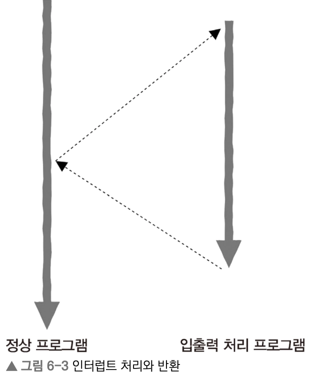
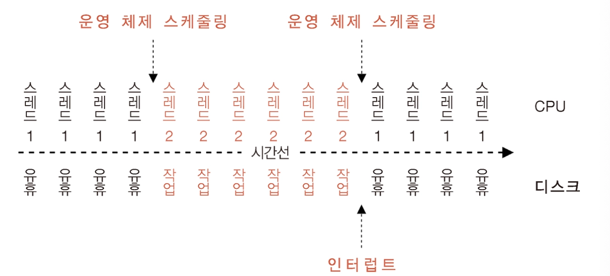
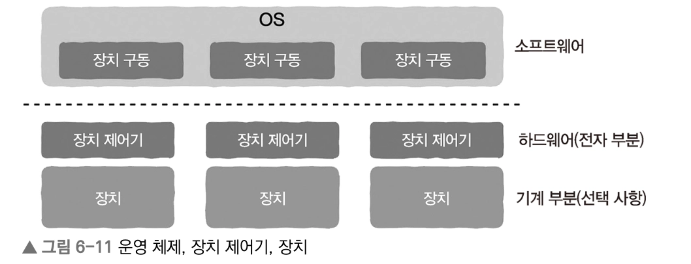
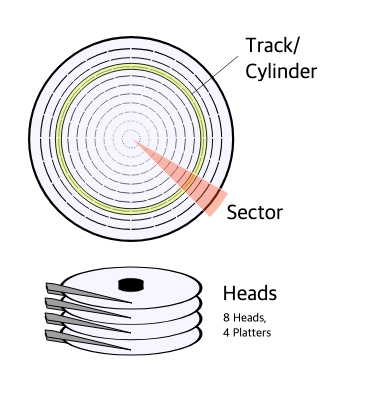
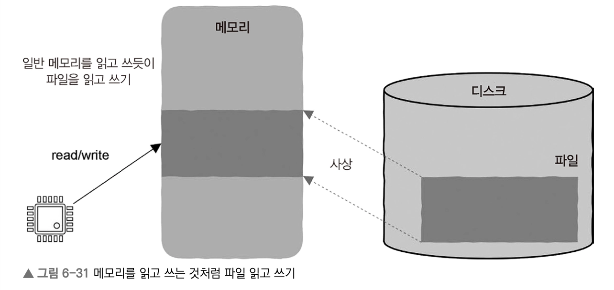

# Ch6. 입출력이 없는 컴퓨터가 있을까?

## CPU의 입출력 처리

***Low-level에서 입출력은 어떻게 구현될까?***

사용자는 키보드, 마우스와 같은 외부 장치를 통해 컴퓨터와 상호작용한다. 이때 상호작용은 이 장치를 통해 컴퓨터와 입력, 출력이 이루어지는 일련의 과정을 말한다

장치도 CPU와 마찬가지로 레지스터가 존재한다

1. **데이터**를 저장하는 레지스터 |  데이터 = ‘사용자가 키보드의 키를 눌렀다는 이벤트 정보’
2. **제어 정보와 상태 정보**를 저장하는 레지스터 | 레지스터를 읽고 쓰는 작업을 이용해 장치를 제어하고 상태를 볼 수 있게 함

### 입출력 구현 방법

1. 특정 입출력 기계 명령어 사용
    
    장치 레지스터를 읽고 쓰는 특정한 기계 명령어가 존재한다 (e.g. x86의 `IN`, `OUT`)
    
    - 입출력 명령어에 장치의 고유 주소를 지정하면 어떤 장치 레지스터를 읽고 써야 하는지 판단할 수 있다
    - 마치 CPU가 메모리를 읽고 쓸 때 사용하는 `LOAD`, `STORE`와 같은 개념으로 비유해볼 수 있다
2. **메모리 사상 입출력** - 메모리 읽기/쓰기 명령어를 사용하지만, 주소 공간의 일부는 장치에 할당
    
    [*그럼 장치의 고유 주소는 실제로 어디를 가리킬까?*]
    
    CPU는 데이터의 특정 주소로 접근만 하면 되고, 데이터가 실제로 어디서 오는지는 알 필요가 없다. 즉, 주소 공간의 일부분을 장치에 할당해서 CPU가 접근 가능한 형태이면 되는 것이다
    
    주소 공간 8 bit 중 **메모리/장치에 나누어 할당**하는 방식으로 **메모리 주소공간**을 활용한다
    
    - 00000000 ~ 11101111 : 메모리에 할당
    - 11110000 ~ 11111111 : 장치에 할당
    
    → **메모리**를 읽고 쓰는 것처럼 장치를 제어할 수 있다!
    

### 장치 상태 레지스터의 역할

사용자가 장치를 언제 어떻게 조작하는지는 예측할 수 없다. 특정 조작에 따라 입출력이 이루어지고 CPU가 특정한 실행이 필요함을 감지하려면 해당 정보가 저장된 상태 레지스터를 읽어야만 한다

[상태 레지스터를 읽는 방식] = **입출력 장치-메모리 사이의 데이터 전송 방식**

1. Polling : CPU는 지속적으로 상태 레지스터를 읽어 상태 변경을 감지한다 **`동기식`**
2. Interrupt Driven I/O : 새로운 이벤트가 발생했을 때 장치에서 인터럽트 신호를 보내 CPU가 작업을 수행하게 한다  **`비동기식`**
    - 기존의 작업 실행을 일시 중지하고 인터럽트 처리 후에 다시 돌아오는 방식
    - 즉, 프로그램은 끊임없이 실행되는 게 아니라 언제든지 장치에 의해 실행이 중단될 수 있는 것
        
        
        
    
    1. ***CPU가 인터럽트 신호를 어떻게 감지할까?***
        
        CPU가 기계 명령어를 실행하는 과정(`IF`-`ID`-`EX`-`WB`)에 ‘하드웨어의 인터럽트 신호 감지’ 단계가 추가되어야 한다
        
    2. ***중단된 프로그램의 실행 상태를 저장하고 복원하는 방법***
        
        함수의 스택 프레임과 같이 점프, 반환 등 복원 시 필요한 정보가 저장되는데, 이는 여러 실행 흐름을 포함하므로 함수의 상태 정보보다 훨씬 더 많다
        
        - 인터럽트 처리 프로그램도 인터럽트 될 수 있다
        - 함수와 마찬가지로 해당 상태 복원은 스택을 이용해 구현된다
3. DMA(Direct Memory Access) [DMA(Direct Memory Access)](https://www.notion.so/DMA-Direct-Memory-Access-3222896bff97807d8ec6e90d563a7845?pvs=21) 

## 디스크 I/O에서 CPU가 하는 일

> *디스크가 입출력 요청을 처리할 때는 CPU 개입이 필요하지 않다*
> 


**스레드2 = 디스크의 입출력 요청 스레드*
**운영체제, 장치, DMA, 인터럽트 등 소프트웨어와 하드웨어의 정밀한 조합 덕분에 컴퓨터 리소스를 최대한 활용할 수 있다**

### 장치 제어기 (device controller)

디스크는 크게 기계 부분과 전자 부분으로 나누어 볼 수 있다




- 기계 부분
    - 디스크에서는 head가 데이터가 위치한 track으로 이동하는 **탐색(seek)** 과정을 통해 데이터를 읽는다
    - 이 탐색 과정은 시간을 매우 많이 소모하는 작업
- 전자 부분 ← **장치 제어기**로 구성
    - CPU가 없어도 자신만의 버퍼나 레지스터를 갖추고 있어, 장치에서 읽고 쓸 데이터를 저장할 수 있다
    - 장치 제어기는 장치 드라이버와 외부 장치를 연결하는 역할로, CPU와 독립적으로 동작하게 하는 핵심이다

### DMA(Direct Memory Access)

> *CPU가 디스크 → 메모리로 데이터를 직접 복사하지 않도록 하기 위한 기술*
> 
> 
> `목적` **CPU의 개입 없이 장치와 메모리 사이에 직접 데이터를 전송하는 것**
> 
- CPU는 반드시 데이터 복사에 필요한 정보들을 명령어를 통해 DMA에 전달해야 한다
    - 어디서 어디로 (from~to) : 메모리 → 장치 / 장치 → 메모리
    - 얼마나 (how many)
    - 어느 메모리 위치 (where)
- 장치 제어기의 버퍼에서 데이터를 읽으면, DMA가 지정된 메모리 주소에 데이터를 쓰는 방식으로 데이터 복사가 완료된다

[*가상 메모리, 캐시 시스템에서는?*]

- DMA에 가상 메모리 주소-물리 메모리 주소 사이의 mapping 정보를 제공하여 **가상 주소를 기반으로** 직접 데이터 전송이 가능해진다
- 캐시를 사용하는 시스템에서는 캐시-메모리 간에 불일치가 발생할 수 있다. 이 순간에 DMA가 메모리의 stale 데이터를 읽어서 장치에 저장한다면 또 다른 일관성 문제가 발생한다
    - 이는 캐시 갱신 시 즉시 메모리에 갱신하는 방식으로 회피할 수 있다
- CPU는 데이터 전송이 완료된 사실을 인터럽트 작동 방식으로 감지할 수 있다

## 프로그램에서 파일을 읽는 내부 과정

### 메모리 관점에서의 I/O

> 메모리 관점에서 I/O 작업은 단순히 외부 장치와 메모리 사이에서 데이터를 주고받기 위한 **복사(copy) 과정**에 불과하다
> 
- 외부 장치 → 메모리 : Input
- 메모리 → 외부 장치 : Output

```c
char buffer[LEN];
**int fd = open(file_name, O_RDONLY); // 파일 서술자 얻기**

read(**fd**, buffer, LEN);
```

1. `read()` 함수는 시스템 호출을 이용해 운영체제에 파일 읽기 요청을 보내며, 이는 커널에서 디스크가 이해할 수 있는 명령어로 변환되어 디스크로 입출력 요청이 전송된다 (blocking I/O)
2. 디스크는 DMA 작동 방식을 통해 데이터를 특정 메모리 영역(buffer)으로 복사하기 시작한다
    
    *그동안에 운영체제는 프로세스 스케줄링을 통해 CPU와 디스크가 모두 놀지 않게 한다
    
3. 데이터를 프로세스의 메모리에 복사하는 과정이 완료되면, 디스크는 CPU에 인터럽트 신호를 보낸다
    1. 파일 데이터 → 프로세스 주소 공간에 직접 복사
    2. 파일 데이터 **→ 운영체제** → 프로세스 주소 공간에 복사
    
    → 두 가지의 형태로 복사될 수 있으며, a와 같이 운영체제를 우회하는 복사 기법을 **무복사(zero-copy)** 라고 한다
    
4. CPU는 인터럽트 신호를 받고, 처리가 중단되었던 함수로 점프해 이어서 실행할 수 있도록 준비 완료 큐로 프로세스를 이동시킨다

→ 프로세스 입장에서는 마치 중단된 적이 없는 것처럼 버퍼에 데이터가 채워진 상태로 동작을 하게 된다

## 입출력 다중화 (I/O Multiplexing)

> 모든 입출력 장치는 파일이라는 개념으로 추상화되며, 모든 입출력 작업은 파일 읽기와 쓰기로 구현할 수 있다
> 
- read()와 같은 함수로 파일을 읽을 때, 커널은 파일을 번호(→ **파일 서술자**)만으로 식별하고 작업할 수 있다. 이 번호는 open()의 반환값으로 우리가 유일하게 알아야 하는 내용이다
- 파일 서술자가 있기에 프로세스는 파일에 대해 아무것도 몰라도 되며, 파일 서술자만으로 프로그래밍이 가능하다
- 웹 서버에서 네트워크 통신을 할 때도 3 way handshake의 결과로 파일 서술자를 얻을 수 있고, 이는 특정 사용자와 통신할 수 있게 한다
    
    
    [*동시에 사용자 요청 수천~수만 개를 처리해야 하는 상황이라면?*] 
    
    파일 서술자 하나에 대응하는 입출력 장치가 읽을 수 있는지, 쓸 수 있는지의 상태 정보를 미리 알 수 있다면 스레드 블로킹 없이 높은 동시성을 구현할 수 있다 
    
    → 커널이 파일 서술자를 감시하다가 읽고 쓸 수 있는 파일 서술자가 있을 때 프로그램에 통지하도록 하기 (인터럽트 신호 방식과 유사)
    
- 다중화기는 하나의 채널에 여러 신호를 전송할 수 있도록 이 신호를 합칠 수 있다

## mmap : 메모리 읽기/쓰기와 같이 파일 처리하기



메모리를 읽고 쓰는 것처럼 파일을 읽고 쓰는 것을 코드상에서는 아주 간단하게 처리할 수 있다

```c
**# 메모리 읽기/쓰기**
int a[100];

a[10] = 2;

**# 파일 읽기/쓰기**
char buf[1024];

int fd = open("/filepath/abc.txt");

read(fd, buf, 1024);
// buf 등을 이용한 작업’
```

- 메모리는 byte 단위로 직접 주소 지정이 가능하다
- 디스크는 block 밀도에 따라 주소가 지정되며, 이 block 크기는 수B~수KB까지 달라진다
    - CPU~디스크 속도 차이에 의해, 디스크 파일은 반드시 먼저 메모리에 저장한 후에 byte 단위로 파일 내용을 처리한다
    - 운영체제에 의해 파일 내용 역시 프로세스의 가상 주소 공간에 매핑되는데, 이 덕분에 우리는 파일을 연속된 바이트열처럼 다룰 수 있다
- `read()`, `write()`에서 커널 상태와 사용자 상태 간 데이터를 복사하는 작업과 달리, mmap로 디스크의 파일을 읽고 쓸 때는 시스템 호출과 데이터 복사가 주는 부담이 없다
- mmap를 사용하면 큰 파일 처리와 임의 위치에서 읽고 쓰는 경우에 단순화하여 처리할 수 있다
    
    <aside>
    
    **mmap의 매개변수**
    
    - `MAP_SHARED` : 매핑된 메모리의 변경 내용이 공유되며, 파일에 반영될 수 있다. 다만 즉시 디스크에 기록된다고 보장되지는 않으며, 필요 시 msync() 등을 사용해 동기화
        - 메모리 수정 → 파일 수정 (공유)
    - `MAP_PRIVATE` : 매핑된 내용을 수정하면 Copy-on-Write가 발생하며, 변경은 프로세스의 사본에만 반영되고 원본 파일에는 반영되지 않는다
        - 메모리 수정 → Copy-on-Write (파일 유지)
    
    ***→ 변경 내용이 어디에 반영되는지의 차이***
    
    </aside>
    
- 동적 링크 라이브러리는 보통 mmap() 기반으로 각 프로세스의 가상 주소 공간에 매핑되며, 읽기 전용 코드 영역은 여러 프로세스가 물리 메모리 페이지를 공유할 수 있어 메모리 효율이 높다
