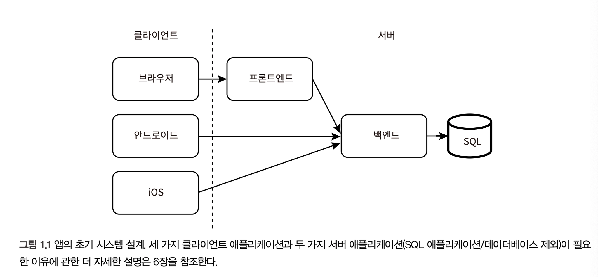
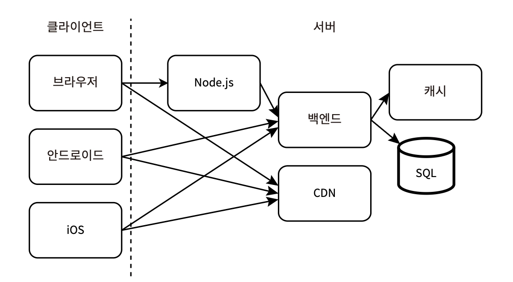
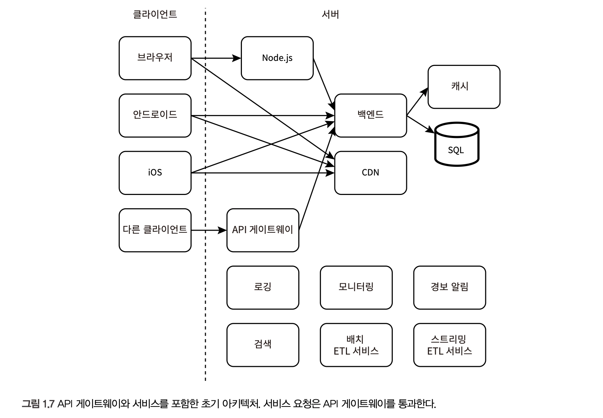
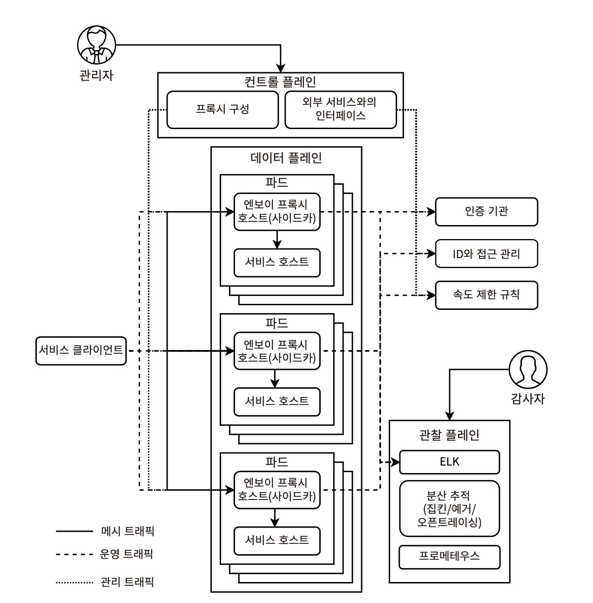

# 1장. 시스템 설계 개념 둘러보기

시스템 설계 면접에서는 완벽함을 추구하기보다, 주어진 리소스와 시간 안에서 현재와 미래의 요구사항을 가장 잘 만족시키는 시스템을 설계하기 위해 트레이드오프와 타협이 필요하다

- 책에서 다루는 모든 논의는 추정과 가정을 포함한다
- 소프트웨어 설계 패턴과 아키텍처 패턴의 상세 설명은 추가적인 검색이 필요할 수 있다

### 필수 능력

- 순발력
- 좋은 질문을 할 수 있는 능력
- 가장 중요하고 관련 있는 주제로 토론을 이끄는 능력
- 자신의 생각을 간결하게 전달하는 능력

→ 시스템 설계 전문성을 효과적이고 간결하게 표현하면서, 면접관에게 적절한 질문을 함으로써 면접을 원하는 방향으로 이끄는 것이 핵심!

- 꼭 모든 분야의 지식을 갖출 것을 기대하기 보다
- 특정 접근 방식이 일정 트레이드오프를 가지면서도 요구사항을 더 충족시킬 수 있다는 점을 추론할 수 있어야 한다
  e.g. **`gzip 압축`**
  ❌ 파일 크기가 얼마나 줄어들지, CPU와 메모리 리소스가 얼마나 핗요한지 게산할 필요는 없음
  ⭕ 파일을 보내기 전 압축하면 네트워크 트래픽은 줄어들지만, 송신자-수신자 모두의 메모리 리소스는 더 많이 소비함
  **\*`Brocoli`** 는 구글이 개발한 고효율 압축 알고리즘으로, 웹 콘텐츠의 번들 사이즈를 줄이고, 빠른 전송과 로딩으로 높은 압축률을 제공한다

## 초기 시스템 설계

- 처음에는 동일 데이터 센터 내, 각각 단일 클라우드 호스트에 배치하는 것으로 시작
- DNS 구성 - 브라우저 앱의 모든 요청은 웹 서버 호스트 → 웹 브라우저/모바일 앱 요청 → 백엔드 호스트
- TPS가 수천 건 대로 증가하면서 시스템 확장의 필요성이 생김
  - 어떻게 확장? 백엔드 호스트를 여러 대로 증설하고, 지리적으로 분산된 세계 각지의 데이터 센터에 프로비저닝
  - 클라이언트는 GeoDNS를 사용해 가장 가까운 데이터센터로 라우팅한다 (위치 정보는 클라이언트의 IP 주소에서 유추)
  - 도메인에 여러 위치와 여러 A 레코드 기본 IP 주소를 할당해두면, GeoDNS에서 사용자에게 가장 가까운 특정 IP 주소를 반환
    - 이 IP 주소는 사용자의 ISP/OS/브라우저 등 다양한 수준에서 캐시될 수 있다
- Redis 캐시 서버, CDN 정적 콘텐츠 호스팅으로 latency를 최소화할 수 있다
  
  - CDN - 여러 데이터 센터에 정적 파일의 복사본을 저장하고, 사용자는 가장 가깝고 가용한 데이터 센터에서 이 파일을 다운로드하는 방식
  - 클라이언트는 백엔드에서 CDN 주소를 얻거나 특정 CDN 주소를 클라이언트나 Node.js 서비스에 하드코딩할 수 있다
  - e.g. CloudFlare, Rackspace, AWS CloudFront가 대표적

## 수평적 확장성, CI/CD

- CI/CD - Jenkins
- 컨테이너화 - Docker
- 확장, 부하 분산 및 호스트 클러스터 관리 - Kubernetes, Docker Swarm
- 서비스 구성 관리 - Ansible, Terraform (→ IaC)
- 점진적 롤아웃/롤백 - 특정 비율의 호스트에 앱을 배포하고 모니터링한 후 연결 트래픽 비율을 높이는 방식
  - 다음과 같은 문제 감지 시, 수동 or 자동으로 배포를 롤백할 수 있다
    1. 테스트에서 누락된 버그
    2. 충돌
    3. 지연 시간 증가나 시간 초과
    4. 메모리 누수
    5. CPU, 메모리, 스토리지 사용률 등 리소스 소비 증가
    6. 사용자 이탈 증가
- 실험
  - 다변량 테스트 - A/B 테스트, Multi-armed Bandit https://www.optimizely.com/optimization-glossary/multi-armed-bandit/
  - 개인화된 사용자 경험 제공 목적
  - 점진적 롤아웃/롤백과의 차이점 - 다양한 빌드 버전의 호스트 비율 조정 방식
    - 실험 - 해당 목적으로 설계된 실험과 기능 토글 도구로 조정
    - 점진적 롤아웃/롤백 - 문제 감지 시, CD 도구를 사용해 수동 or 자동으로 이전 버전 롤백

## 기능적 분할과 중앙집중화

### 공유 서비스

- 검색 - Elasticsearch
- 로깅 - Elastic Stack(Elasticsearch, Logstash, Kibana, Beats)이 흔히 쓰이며, Zipkin/Jaeger와 같은 분산 추적 시스템/분산 로깅으로 각 요청마다 spanId를 붙여 trace를 조립하고 분석할 수 있다
- +) 모니터링, 경보 알림

### 공통/교차 관심사의 중앙집중화

- API 게이트웨이 : 클라이언트 요청을 적절한 백엔드 서비스로 라우팅하는 **_Reverse Proxy_**
  
  - 여러 서비스에 공통 기능을 제공하며, 개별 서비스에서 중복되지 않음
  - e.g.
    - 인가/인증, 접근 제어, 보안 정책
    - 요청 수준의 로깅, 모니터링, 경보
    - 속도 제한
    - 요금 청구
    - 분석
  - API 게이트웨이는 지연 시간을 추가하고 대규모 호스트 클러스터를 필요로 하므로,서비스의 호스트와 동일한 데이터 센터에 위치해있지 않다면 오히려 어색하고 복잡해진다
  - → 이는 **Sidecar 패턴이라고 불리는 서비스 메시**를 사용해 해결할 수 있다
- 서비스 메시
  
  **서비스 메시 다이어그램 (fyi.** https://livebook.manning.com/book/cloud-native-patterns/chapter-10)
  1. **모든 서비스의 요청과 응답이 Sidecar를 통해 라우팅되는 sidecar 패턴 방식**
     - 각 서비스의 모든 호스트는 주 서비스와 함께 sidecar를 실행할 수 있고 쿠버네티스 POD를 사용한다 (POD = Service + Sidecar를 모두 포함할 수 있음. 즉, service와 sidecar는 localhost를 공유하므로 서로 주소를 지정할 수 있고 네트워크 지연이 없음)
     - 공용 정책을 관리하는 인터페이스를 제공하며, 이를 모든 사이드카에 배포하는 형식
     - e.g. Istio
  2. **Sidecar 없는 내부 서비스 간 통신 (sidecar proxy 로직을 서비스 호스트에 요청을 보내는 클라이언트 호스트에 배치)**
     - Ingress 통신 : 외부 → 클러스터 내부로의 트래픽 관리
     - East-West 통신 : 클러스터 내부 서비스 간의 트래픽 관리
     - 클라이언트 호스트는 Control Plane에서 구성을 받으며, 별도 API 지원을 위해 네트워크 통신 라이브러리를 포함해야 함
     - e.g. GCP Traffic Director https://cloud.google.com/blog/products/networking/traffic-director-global-traffic-management-for-open-service-mesh?hl=en
- CQRS(Command Query Responsibility Segregation)
  - 명령/쓰기 작업 - 쿼리/읽기 작업을 기능적으로 분리해 별도의 서비스로 나누는 마이크로서비스 패턴
  - 복잡성을 증가시키지만 지연 시간, 확장성, 유지보수 측면에서 유리
  - e.g. 메시지 브로커, ETL
- Decorator 패턴
- 관점 지향 프로그래밍 (AOP)

## 배치, 스트리밍 ETL(Extract, Transform, Load)

- 데이터 요청이 비동기일 때가 더 합리적인 경우
  1. 대규모 쿼리를 포함하는 요청 (e.g. GB 단위의 데이터 처리)
  2. 주기적으로 미리 처리해야 하는 데이터
  3. 며칠, 몇 시간 지난 데이터를 보여주는 것이 허용되는 경우 (e.g. 통계 데이터)
  4. 즉시 실행할 필요가 없는 쓰기 작업 (e.g. 로깅 서비스 쓰기)
- 이벤트 스트리밍 시스템(e.g. Kafka/AWS Kinesis)과 배치 ETL 도구(e.g. Airflow)의 조합으로 **배치 작업**을 효율적으로 처리할 수 있다
- 데이터를 지속적으로 처리하는 **스트리밍 작업**에는 Flink 등의 도구를 사용할 수 있다
- 로깅 시스템은 일반적으로 스트리밍으로 처리되며, 요청 빈도가 낮을 경우에는 배치 파이프라인으로 충분하다

## 클라우드 서비스 VS 베어 메탈

클라우드 제공업체는 CI/CD, 로깅, 모니터링, 경보, 캐시, SQL, NoSQL을 포함한 다양한 데이터베이스 유형의 간소화된 설정 및 관리 등 우리가 필요로 하는 많은 서비스를 제공하므로, 리소스 대비 클라우드 사용이 더 이득인 경우가 많다

👎🏻 장점

- 설정의 단순성
- 비용 이점
- 더 나은 지원과 품질 제공
- 지속적인 업그레이드 리소스 아웃소싱

👎🏻 단점

- 벤더 종속성
- 데이터, 서비스의 프라이버시, 보안에 대한 소유권 부재

## 서버리스 (FaaS, Function as a Service)

- 특정 엔드포인트나 함수를 자주 사용하디 않거나 엄격한 지연시간 요구사항이 없는 경우에 적합
- e.g. AWS Lambda, Azure Function
- 오픈소스 FaaS 솔루션(e.g. OpenFaas, Knative)을 통해 자체 클러스터에서 FaaS를 지원하거나 AWS 람다 위에계층으로 사용해 클라우드 플랫폼 간 함수의 이식성을 개선할 수 있다
- coldstart의 한계 → https://www.graalvm.org/ 과 같은 빠른 시작 & 낮은 메모리 사용량의 JDK가 등장하기 시작
  - 오버헤드가 따르는 이유는? 모든 함수를 단일 패키지로 묶었을 때 따르는 한계 = 모놀리스 방식의 단점
  - 특정 시간 동안 특정 호스트에 배포해두는 형태가 아닌 이유는? 자동 확장 마이크로서비스와 유사하며, 시작하는 데 오래 걸리는 프레임워크를 사용한다면 고려해볼 만하다
- 2가지 계층으로 구성
  1. 함수의 주요 로직을 포함하는 내부 계층/함수
  2. FaaS 제공 벤더별 구성을 포함하는 외부 계층/함수
