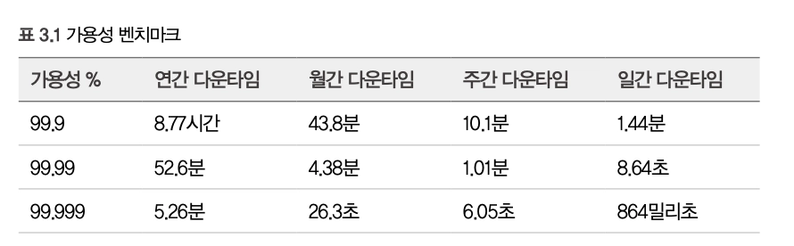
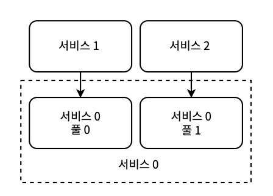
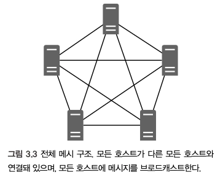
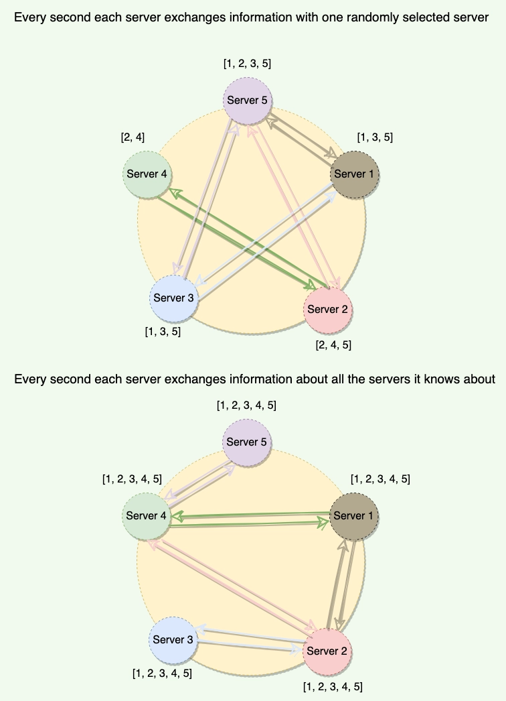

# 3장. 비기능적 요구사항

고객이 진술한 요구사항은 거의 항상 불완전하고 부정확하며 때로는 과도할 수 있으므로, **기능적/비기능적 요구사항을 명확화**하는 것이 중요하다.

비기능적 요구사항은 가정해서는 안 되며, 비기능적 특성은 요구사항을 최적화할수록 서로 트레이드오프될 수 있다.

## 확장성

> 시스템이 부하를 비용 효율적으로 지원할 때 하드웨어 리소스 사용을 쉽고 번거롭지 않게 조정할 수 있는 능력

- 스케일링 - CPU 처리 능력, RAM, 저장 용량, 네트워크 대역폭 증가가 필요함
  - 수직 스케일링 - 더 많은 비용을 지불하는 것으로 쉽게 달성
    - 주요 단점
      1. 금전적 비용이 업그레이드된 하드웨어의 성능보다 더 빠르게 증가하는 지점에 도달함
      2. 기술적 한계 존재 (최대 처리 능력, RAM, 저장 용량의 제한)
      3. 다운타임이 필요할 수 있음 (→ 서비스의 상태를 서로 다른 호스트에 저장하는 것으로 해결 가능)
  - 수평 스케일링 - 처리와 저장 요구사항을 여러 호스트에 분산하는 것
    - 진정한 확장성은 수평 스케일링으로만 달성할 수 있다 (자주 논의되는 주제 🌟)
- 고객의 확장성 요구사항을 결정하는 질문 예시
  - 시스템으로 들어오고 검색되는 데이터 양은?
  - 초당 읽기 쿼리 수(QPS)
  - 요청당 데이터 양
  - 초당 비디오 조회 수
  - 갑작스러운 트래픽 스파이크 크기

### 로드 밸런서

- 모든 수평 확장 서비스는 다음 중 하나의 로드 밸런서를 사용한다
  1. 하드웨어 로드 밸런서 : 트래픽을 여러 호스트에 분산하는 특수한 물리적 장치 (비용↑)
  2. 공유 로드 밸런서 서비스 (= LBaaS, 서비스형 로드 밸런싱)
  3. 로드 밸런싱 소프트웨어가 설치된 서버 - e.g. HAProxy, Nginx
- L4(NLB) vs L7(ALB) 구분하기
- Sticky Session : 로드 밸런서가 특정 클라이언트의 요청을 **로드 밸런서나 애플리케이션이 설정한 기간 동안** **특정 호스트로** 보내는 것 (stateful)
  - 기간 기반, 애플리케이션 제어 쿠키를 통해 구현 가능
  - 애플리케이션에서 발행한 쿠키 위에 로드밸런서 자체 쿠키 발행 → 수명은 애플리케이션 쿠키를 기준으로 따름
- Session Replication - 여러 호스트 간 백업 링을 형성할 수 있다
- Reverse Proxy : 서버 클러스터 앞에 위치해 요청 URI나 다른 기준에 따라 적절한 서버로 들어오는 요청을 가로채고 전달함으로써 클라이언트-서버 사이의 게이트웨이 역할을 수행
  - https://www.f5.com/glossary/reverse-proxy
- https://www.cloudflare.com/ko-kr/learning/performance/types-of-load-balancing-algorithms/

## 가용성

> 시스템이 요청을 수락하고 원하는 응답을 반환할 수 있는 시간의 백분율

- 다중 지역 동시 활성화 방식 배포 (Active-Active)
  https://netflixtechblog.com/active-active-for-multi-regional-resiliency-c47719f6685b
- 다른 대륙의 데이터 센터 내부, 데이터 센터 간 복제
- 비기능적 요구사항 논의 시, 가장 먼저 높은 가용성이 필요한지 확정해야 한다
  - CAP 정리 : 분산 시스템에서 Consistency, Availability, Partition tolerance 3가지를 동시에 완벽하게 보장할 수 없다는 원리
  - PACELC : 분산 시스템에서 파티션(P) 발생 시 가용성(A)과 일관성(C) 사이의 트레이드 오프. 정상 상태에서는 지연시간(L)과 일관성(C) 사이의 트레이드오프를 설명하는 이론 — CAP 정리의 확장
- 항상 즉시 반환해야 하는 즉각적인 응답을 가정해서는 안 된다
  - 몇 분~시간의 버퍼를 허용한다면, 큐 → 스트리밍/배치 → 알림 과 같은 구현을 고려할 수 있다

## 내결함성

> 일부 구성 요소가 실패해도 시스템이 계속 작동할 수 있는 능력, 다운타임이 발생했을 때 영구적인 데이터 손실 등을 방지하는 능력

- 시스템의 일부 실패 시 일부 기능을 유지하는 점진적 저하를 허용
- 자동 복구 시스템 구현 - 대체 구성 요소 자동 프로비저닝
- 원활한 오류 처리를 위한 실패 설계 - 통제할 수 없는 외부의 오류, 무감지/미탐지 오류

### 복제와 중복

- 구성 요소의 중복 인스턴스/복사본을 3개 이상 가지는 것 (리더-팔로워 구조)
  - 복제본 배치 방식은 어느 데이터 센터에 분산 or 묶어두느냐에 따라 다양하다
  - **→ 성능 저하를 트레이드오프로 내결함성을 최대화 하는 것**

### 전방 오류 수정(FEC), 오류 수정 코드(ECC)

- 중복적인 방식으로 메시지를 인코딩해 노이즈나 불안정한 통신 채널을 통한 데이터 전송에서 오류를 방지하는 기법
- 프로토콜 수준의 개념

### Circuit Breaker

- 클라이언트가 실패할 가능성이 높은 작업을 반복적으로 시도하는 것을 막는 메커니즘
- 최근 간격 내 실패한 요청 수 계산 → 오류 임곗값 초과 시 강제로 다운스트림 호출 중단
- 시스템 테스트를 어렵게 만드는 요소 중 하나 - 부하테스트에 대한 정확한 추정, 적절한 오류 임곗값과 타이머를 세팅하기가 어려워짐
- https://github.com/resilience4j/resilience4j
- 적응형 동시성 제한 : 애플리케이션의 실시간 성능에 반응하는 적응적 구현
  - https://netflixtechblog.medium.com/performance-under-load-3e6fa9a60581

### Exponential Backoff & Retry

- 오류 응답 → 요청 재시도 사이의 대기 시간을 지수적으로 증가시키는 방식
- jitter를 사용해 대기 시간을 무작위 음수/양수 값으로 조정 → 재시도 폭증을 방지하기 위함

### 다른 서비스의 응답 캐싱

- 데이터가 외부 서비스에 의존할 때, stale data를 허용한다면 응답을 캐싱해두고 장애 시 활용할 수 있다

### Checkpointing

- 서버에서 데이터 집계 작업을 처리하는 상황
  - 다수의 데이터 포인트를 일련의 스트리밍 파이프라인으로 처리하고 반복할 때, 데이터 집계 도중 서버가 실패하면 대체 서버가 어느 지점부터 재개해야 하는지 알아야 함
  - 이를 각 데이터 포인트 하위 집합에 대한 결과를 기록하여 체크포인트를 작성함으로써 수행 가능
- Kafka와 같이 메시지 브로커를 사용하는 ETL 파이프라인에 주로 사용됨
  - Kafka offset storage https://kafka.apache.org/22/javadoc/org/apache/kafka/clients/consumer/KafkaConsumer.html, Flink의 분산 체크포인팅 메커니즘

### DLQ(Dead Letter Queue)

- 복잡성, 신뢰성과의 트레이드오프
  1. 요청 실패 시 그냥 버리기 (가장 단순)
  2. try-catch로 로컬 상에 DLQ 구현 (호스트 실패 시 요청 손실)
  3. Kafka와 같은 이벤트 스트리밍 플랫폼 사용

### 로깅, 주기적 Audit

- 쓰기 요청을 로깅하고 주기적으로 감사하여 무감지 오류를 처리할 수 있다

### Bulkhead 패턴

- 시스템을 격리된 풀로 나눠 한 풀의 결함이 전체 시스템에 영향을 미치지 않게 하는 것
   \*서비스 0이 2개의 풀로 나뉘며, 각각 요청자에 할당된다. 한 풀을 사용할 수 없게 되어도 다른 풀에는 영향을 미치지 않는다.
- 호스트 간 충돌하여 전체 중단을 일으키는 것을 방지할 수 있음
- 특정 요청자에게 특정 호스트를 할당해 요청자가 서비스의 모든 용량을 소비하는 것을 방지함
- 각 풀마다 요청자를 할당하면 리소스 규모에 따라 우선순위를 부여할 수 있음
- 트레이드오프 : 트래픽 스파이크 상황에서 풀은 서로를 지원할 수 없다

### fallback 패턴

- 문제를 탐지한 다음 대체 코드 경로를 실행하는 것으로 구성
- fallback 자체의 신뢰성과 실패 가능성을 염두에 두고 설계해야 함
- Amazon이 fallback 패턴을 피하는 대안 - https://aws.amazon.com/ko/builders-library/avoiding-fallback-in-distributed-systems/

## 성능/지연 시간, 처리량

> 사용자의 요청이 시스템에 도달해 응답을 반환하는 데 걸리는 시간

- 네트워크 지연 시간(클라↔서버) + 애플리케이션 요청 처리 시간
- 지연 시간 = 패킷이 출발지에서 목적지로 이동하는 시간
  - 사용자 클러스터와의 지리적/물리적 거리를 최소화하는 가까운 데이터 센터에 위치할수록 낮은 지연 시간을 달성할 수 있다
- 지연 시간에 영향을 미치는 요인
  1. **트래픽**
  2. **네트워크 대역폭**
  3. **백엔드 시스템 처리 - 실제 비즈니스 로직, 영속성 계층**
  4. CDN 사용
  5. 캐싱
  6. REST → RPC로 데이터 크기 줄이기
  7. Netty와 같은 프레임워크로 자체 프로토콜 설계 → HTTP 대신 TCP, UDP 사용
  8. 배치, 스트리밍 기법 사용
     → 데이터 특성, 시스템으로의 이동 방식에 따라 전략을 제안한다

## 일관성

> ACID 일관성 : 외래 키와 고유성 같은 데이터 관계에 중점
>
> CAP 일관성 : 특정 시점에 동일한 데이터를 포함하는 모든 노드가 선형이어야 하며, 데이터의 변경은 노드가 동시에 변경사항을 제공하기 시작해야 하는 것으로 정의 (→ 선형화 가능성)

- 가용성 vs 선형화 가능성을 선호하는 DB
  | **선형성 선호** | **가용성 선호** |
  | --------------- | --------------- |
  | HBase | 카산드라 |
  | MongoDB | CouchDB |
  | 레디스 | 다이나모 |
  | | 하둡 |
  | | Riak |
  - 일반적으로 RDB를 포함한 ACID DB는 네트워크 분할 중에 쓰기가 발생하면 일관성을 포기한다
- 선형화 가능성, 최종 일관성을 위한 다양한 기법
  1. 전체 Mesh
  2. 정족수(Quorum)
  - **단일 위치에 쓰기를 수행하고 이 쓰기를 다른 관련 위치로 전파하는 최종 일관성 기법**
    - 이벤트 소싱 - 트래픽 스파이크를 처리하는 기법
    - 조정 서비스
    - 분산 캐시
  - **일관성, 정확성을 낮은 비용과 맞바꾸는 최종 일관성 기법**
    - Gossip 프로토콜 - 노드가 주기적으로 무작위 이웃과 정보를 교환해 전체 네트워크에 데이터를 점진적으로 전파하는 분산 시스템 통신 방식
    - 무작위 리더 선택
- 선형화 가능성의 단점
  - 대부분의 노드나 모든 노드는 요청을 처리하기 전에 합의를 확신해야 하므로 가용성이 낮다 (노드 수에 비례)
  - 복잡도가 높고 비용이 많이 든다

### 전체 메시(Mesh)

- 클러스터의 모든 호스트가 다른 모든 호스트의 주소를 가지고 있는 구조
  1. 구성 파일에 주소 목록 유지
  2. 모든 호스트로부터 heartbeat를 수신하는 서드파티 서비스 사용
- 구현은 쉽게 가능하나, 확장성이 없음

### 정족수(Quorum)

- `BitTorrent` - 분산 P2P 파일 공유를 위해 전체 메시를 사용하는 프로토콜
- 과반수의 호스트만 같은 데이터가 있다면, 데이터 동기화가 이루어졌다고 간주 (mesh보다 확장성↑)

### 조정 서비스

- 리더 노드/리더 노드 집합을 선택하는 서드파티 구성 요소
  - 각 노드는 자신의 리더/리더 집합과 통신, 각 리더는 일정 수의 노드들 관리하는 구조
- 예시 알고리즘
  - Paxos - 비동기 네트워크에서 다수의 프로세스 간 합의를 이루기 위한 복잡하지만 강력한 알고리즘
  - Raft - Paxos를 단순화한 알고리즘으로, 리더 선출과 로그 복제를 통해 분산 시스템의 일관성 유지
  - Zab(Zookeeper Atomic Broadcast) - 주키퍼에서 사용되는 알고리즘으로, 주키퍼의 원자적 브로드캐스트 프로토콜을 구현해 일관성 보장
- 주키퍼의 특징
  - 장점 - 접근 제어, 높은 성능을 위한 메모리 내 데이터 저장, 수평 확장이 쉬움(주키퍼 앙상블에 호스트 추가), 지정된 시간 내 최종 일관성 보장 및 강한 일관성 적용 (CAP 중 CP를 택)
  - 단점 - 높은 복잡성 (오직 하나의 리더만 선출되어야 하는 정교한 구성 요소, split brain 등의 상황 고려)

### 분산 캐시

- 대표적 - Redis, Memcached
  - Redis는 본질적으로 분산 캐시가 아닌 인메모리 데이터 저장소임. 여러 서버에서 Redis를 함께 보도록 구성하면 결과적으로 분산 캐시처럼 동작하는 것
  - https://stackoverflow.com/questions/18376665/redis-distributed-or-not
- 새 데이터를 가져올 때 주기적으로 원본에 요청 → 분산 캐시에 요청을 보내 데이터 업데이트
  - 메시지 브로드캐스트 방식 - 주기적으로 요청 vs 인메모리 스토리지에 직접 요청
  - 주로 직접 요청을 보낼 때는 송수신 호스트 양쪽에서 필요한 필드를 포함하는지 확인하여 오류 가능성을 줄이는 방식이 사용됨
  - 반면, 레디스는 스키마 유효성 검증을 즉시 진행하지 않아, 데이터를 다른 노드에서 가져가는 시점까지 문제가 감지되지 않을 수 있음.
    - +) 암호화 지원 X → 프라이버시 문제 발생 가능
    - 저장 시 암호화를 구현하면 복잡성과 비용이 증가하고 성능이 저하된다 https://docs.aws.amazon.com/AmazonElastiCache/latest/dg/at-rest-encryption.html
- 장점 - 단순함, 낮은 지연 시간, 서비스와 독립적으로 확장 가능

### 가십 프로토콜

- 전염병이 퍼지는 방식을 모델로 함
  - 각 노드는 주기적 or 무작위 간격으로 다른 노드를 무작위로 선택 → 데이터 공유
    
    출처 - https://www.designgurus.io/course-play/grokking-the-advanced-system-design-interview/doc/gossip-protocol
- 트레이드오프 - 낮은 비용과 복잡성 > 일관성
- e.g.
  - Cassandra - 분산 데이터 파티션 전체의 일관성을 유지하기 위해 가십 프로토콜 사용
  - DynamoDB - 여러 데이터 센터 간 일관성을 유지하기 위해 ‘벡터 시계’라 불리는 가십 프로토콜 사용

### 무작위 리더 선택

- 랜덤으로 리더를 선정하는 간단한 알고리즘
  - 오직 하나의 리더만을 보장X. 여러 리더가 존재할 수도 있음
- 특징
  - 장점 - 각 리더가 모든 호스트와 데이터를 공유하는 구조이므로, 모든 호스트가 동일 데이터를 가질 수 있음
  - 단점 - 중복 요청, 불필요한 네트워크 트래픽 발생 가능
- e.g.
  - Kafka - 내결함성을 제공하기 위해 무작위 리더 선택 + 리더-팔로워 복제 모델 사용
  - Yarn - 호스트 클러스터 전체의 리소스 할당 관리에 무작위 리더 선택 방식 사용

## 정확성

- 복잡한 데이터 처리나 높은 쓰기 빈도의 시스템에서 중요
- 추정 알고리즘은 더 낮은 복잡성을 위해 정확성을 트레이드오프한다
  - Presto 분산 SQL 쿼리 엔진의 카디널리티 추정을 위한 HyperLogLog(HLL)
    - 대규모 데이터셋에서 고유 요소의 개수(카디널리티)를 추정하는 확률적 알고리즘 → 적은 메모리로 높은 정확도 제공
  - 데이터 스트림에서 이벤트 빈도를 추정하기 위한 Count-Min Sketch
    - 대용량 스트림 데이터에서 항목의 빈도를 추정하는 확률적 데이터 구조 → 적은 메모리로 근사 카운트를 제공함
- **최종적으로 일관된 시스템은 가용성, 복잡성, 비용 개선을 위해 정확성을 트레이드오프한다**
  - write 후에 이루어지는 read는 복제본이 업데이트되기 전까지 부정확하고, 이는 정확성이 아닌 일관성 논의에 가깝다

## 복잡성, 유지보수성

- 복잡성을 최소화하는 첫 단계는 **기능적 / 비기능적 요구사항을 모두 명확히** 하여 불필요한 요구사항을 설계하지 않는 것이다
- 설계 다이어그램에서 어떤 구성 요소를 독립적인 시스템으로 분리할 수 있는지 판단하고, **공통 서비스**를 적극적으로 활용할 수 있다
  - 로드 밸런서, 속도 제한 방식, 인증과 인가, 로깅/모니터링/알림, TLS 종료, 캐싱, DevOps, CI/CD
- 시스템이 불가피하게 복잡하다면, 가용성과 내결함성을 낮추고 복잡성을 줄이는 것을 고려해야 한다
- 네트워크 통신에서 메시지 크기를 최소화하기 위한 RPC 직렬화 프레임워크, 메타데이터 서비스는 더 나은 지연 시간과 성능을 위해 복잡성을 트레이드오프한다
  - RPC 직렬화 프레임워크 - e.g. Avro, Thrift, protobuf
  - → 모든 면접에서 이러한 직렬화 프레임워크의 도입을 제안할 수 있다
- 중단이 발생 가능한 경로, 사용자와 비즈니스에 미치는 영향을 평가 / 예방 / 완화하는 방법을 논의해야 한다
  - 복제, 장애 조치, 런북 작성
- 유지보수성 개선
  1. 지속적 배포 (CD) - 빠른 배포와 롤백, 피드백 주기를 통해 유지보수성을 개선한다
     - Blue/Green 배포 (무중단 배포)
  2. SonarQube 등의 정적 코드 분석 도구

## 비용

> 복잡성 최소화, 중단 비용, 유지보수 비용, 다른 기술로의 전환 비용, 폐기 비용이 포함된다

- 비용에 관한 트레이드오프 상황
  1. 수평 확장 → 수직 확장으로 복잡성을 낮추기 위한 높은 비용
  2. 시스템의 중복성 (e.g. 호스트 수, 데이터베이스 복제 계수)을 줄이는 것 — 비용 절감/가용성↓
  3. 사용자로부터 더 멀리 위치하지만 저렴한 데이터 센터 사용 — 비용 절감/지연시간↑
- 필요 이상으로 모니터링과 알림을 구현하지 말아야 한다
  - 문제 발생 후 몇 시간 뒤에 알림을 보내느냐 VS 문제 발생 즉시 알림을 보내느냐 — 후자의 비용이 더 높기 때문
- 향후 업데이트가 필요한 구성 요소 식별하기
  - 라이브러리/서드파티 종속성을 쉽게 교체할 수 있도록 설계해야 한다 (보안, 신뢰성 등의 요구사항으로 언제든 폐기될 수 있음을 염두에 두자)
- 완전한 비용 논의에는 필요할 때 시스템을 폐기하는 비용도 포함된다
  - 기존 사용자에 대한 데이터 추출(txt, csv) 등 고려

## 보안

- 보안 취약점, 보안 침해를 어떻게 예방하고 해소할 것인가 (외부 당사자, 조직 내부로의 접근을 모두 포함)
- 주요 논의 주제
  1. TLS 종료와 데이터 센터의 서비스나 호스트 간 전송 중 데이터 암호화 유지
  2. 암호화 필요 여부에 따라 대상 데이터를 구분 (= 저장 시 암호화)
  3. DDoS 공격을 방지하기 위한 속도 제한 방식

## 프라이버시

- DB와 파일에 저장된 PII(개인 식별 정보)에 **접근 제어 메커니즘**을 적용해야 한다
  1. 경량 디렉터리 접근 프로토콜(LDAP) - 전송 중(SSL 사용)과 저장 시 모두 데이터 암호화
  2. 해싱 알고리즘(e.g. SHA-2, SHA-3)으로 PII 마스킹
  3. 집계 통계 계산 시, 개별 고객의 프라이버시 유지
- 일반적으로 PII가 HDFS와 같은 추가 전용 스토리지에 저장된다면, 각 고객에게 암호화 키를 할당한다
  - 해당 키는 SQL 등의 가변 저장 시스템에 저장
- 데이터 보존 정책, 감사와 같은 **데이터 침해의 예방과 해소** 전략 (각 조직의 경향성을 따름)
- 외부 서비스 설계 시, 보안과 프라이버시 메커니즘 설계는 필수다. 내부 서비스도 해당 메커니즘을 구현하는 문화를 채택해야 한다
  - 또한, 외부/내부 관계없이 민감한 데이터베이스 접근을 로깅해야 한다
- 사용자 정보를 저장하는 DB는 잘 문서화되고 엄격한 보안 및 접근 제어 정책을 가진 서비스 뒤에 있어야 한다

## 클라우드 네이티브

- 확장성, 내결함성, 유지보수성을 포함한 비기능적 요구사항을 해결하기 위한 접근 방식
- https://github.com/cncf/toc/blob/main/DEFINITION.md
  > _클라우드 네이티브 기술은 조직이 퍼블릭, 프라이빗, 그리고 하이브리드 클라우드와 같은 현대적이고 동적인 환경에서 확장 가능한 애플리케이션을 개발하고 실행할 수 있게 해준다. **컨테이너, 서비스 메쉬, 마이크로서비스, 불변(Immutable) 인프라, 그리고 선언형(Declarative) API**가 이러한 접근 방식의 예시들이다._
  >
  > _이 기술은 **회복성, 관리 편의성, 가시성을 갖춘 느슨하게 결합된 시스템**을 가능하게 한다. **견고한 자동화 기능**을 함께 사용하면, 엔지니어는 **영향이 큰 변경을 최소한의 노력으로 자주, 예측 가능하게** 수행할 수 있다._
  >
  > _Cloud Native Computing Foundation은 벤더 중립적인 오픈 소스 프로젝트 생태계를 육성하고 유지함으로써 해당 패러다임 채택을 촉진한다. 우리 재단은 최신 기술 수준의 패턴을 대중화하여 이런 혁신을 누구나 접근 가능하도록 한다._
