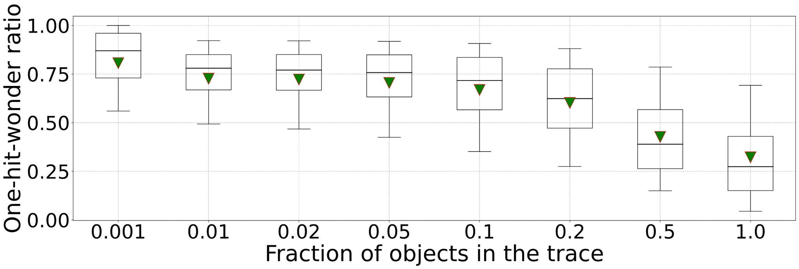
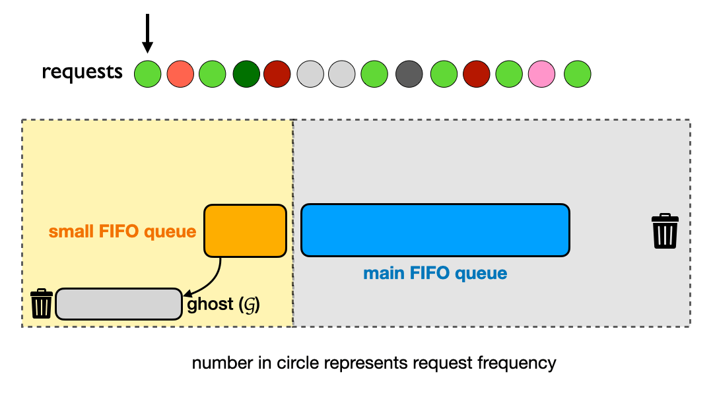

# One-hit Wonder를 배제하는 캐시 전략 (S3-FIFO)

## 요약

- 무엇을 저장할지 < 무엇을 저장하지 않을지에 중점을 두는 철학
- **좋은 캐시는 불필요한 데이터를 과감히 거부한다.** 캐시 미스의 상당수는 다시 접근되지 않는 one-hit wonder이며, 이를 main cache에 들이는 것 자체가 캐시 오염(pollution)의 출발점이다.
- S3-FIFO의 통찰: ‘캐시 내부 eviction 최적화’ < ‘garbage 자체를 처음부터 덜 넣자’로 접근

## 문제 정의

> Admission Policy의 부재

- 데이터를 캐시에 넣을 가치가 있을지에 의문을 두는 것
  - 기존의 LRU/LFU류는 이러한 질문을 거의 하지 않는다
  - LRU는 일단 다 넣고 밀려나는 것 순서로 빠지는 알고리즘 (hot key가 cold/one-hit key에 의해 밀려날 수 있음)
- 캐시 miss의 상당수는 다시 접근되지 않는 데이터이기 때문 → 캐시를 활용하는 것이 리소스 낭비와 시스템 복잡성으로 이어질 수 있음
  **[핵심 문제] Cache Pollution**
  | **요청 패턴** | **의미** | 캐시 입장 |
  | ----------------- | ------------------ | ---------------------------------- |
  | **1번만 요청** ⚠️ | **one-hit wonder** | 들이는 순간 손해 |
  | burst 후 사라짐 | temporal noise | 짧게만 의미 있고 길게 보면 garbage |
  | scan workload | cache pollution | hot key를 몰아냄 |
  | random key | useless admission | 메타데이터 비용만 발생 |

  \*참고 - [부록$1] 캐시 운영 시 발생가능한 문제

- 신규 트래픽이 hot data를 죽이는 이유?
  - 신규 유저의 트래픽이 집중되면 그동안 캐싱되어 있던 hot key들이 대거로 eviction될 수 있음
  - → hit ratio 저하 → Redis/DB amplification → tail latency 증가까지 초래
- Admission Policy는 캐시에 들어오기 전에 “들어올 자격이 있는지”를 판단하는 것

  ```java
  // AS-IS (LRU 기본)
  miss
  ↓
  **cache insert**

  // TO-BE (admission 정책)
  miss
  ↓
  **candidate evaluation**
  ↓
  worthy?
    YES → insert
    NO  → discard
  ```

## 핵심 인사이트

### 1. Lazy Promotion

LRU는 모든 cache hit마다 객체를 head로 승격하는데, 이는 다음의 비용을 만들어낸다

- lock contention - head 이동은 자료구조 갱신을 동반함
- 이른 판단 - 한 번 쓰였다고 hot으로 단정

S3-FIFO와 같은 FIFO 기반 알고리즘은 **eviction 직전에야 promote 여부를 결정**한다. 즉 "긴 시간 살아남을 만큼 자주 쓰였는가?"를 객체가 큐 끝에 도달했을 때 판단한다 → 더 정확하고 싸다

### 2. Quick Demotion

- 6594개 production trace 분석 결과, 짧은 시간 window에서 one-hit-wonder 비율이 크게 나타남
  - trace < window 에 더 크게 의존 — 캐시 입장에서 중요한 건 "전체 시간 동안 단 한 번"이 아니라 "내가 갖고 있는 동안 다시 안 온다는 사실"이기 때문이다.
    캐시 사이즈 = 내가 객체를 보유할 수 있는 시간 윈도우 ≈ working set window
    
  - 전체 trace의 one-hit-wonder ratio: **median 26%**
  - 캐시가 trace footprint의 10%만 보면: **median 72%**
  - 1%만 보면: **median 78%**
    → **캐시 사이즈가 작을수록 one-hit-wonder 비율은 폭발한다.** 그리고 production 캐시는 거의 항상 footprint보다 훨씬 작다. 즉 "내가 들이는 데이터의 70~80%는 다시 안 쓰일 것"이라는 게 평균이다
- 따라서, 이런 객체를 main cache에 들이지 말고, 들였다가도 빨리 강등시키자는 것이 quick demotion

위 두 원리만으로 ARC, LIRS, TinyLFU 같은 복잡한 알고리즘과 동등하거나 더 나은 성능이 나온다는 것이 S3-FIFO의 주장

## S3-FIFO

> S3-FIFO = **S**imple, **S**calable cache with **3** **S**tatic FIFO queues
>
> https://blog.jasony.me/system/cache/2023/08/01/s3fifo



### 구조 - 3개의 큐로 구성

| **Queue**     | **역할**          | **크기**                    | 저장 내용                   |
| ------------- | ----------------- | --------------------------- | --------------------------- |
| **S (small)** | 신규 객체 시험    | cache size의 **10%**        | 데이터 + 2-bit freq counter |
| **M (main)**  | 검증된 객체       | cache size의 **90%**        | 데이터 + 2-bit freq counter |
| **G (ghost)** | 메타데이터만 유지 | M과 같은 객체 수 (또는 50%) | **데이터 없음**, key hash만 |

```java
new item
↓
small FIFO
↓
다시 접근됨?
  YES → main queue
  **NO  → eviction** // One-hit Wonder를 제거한다


-------------

새 요청 →  [Small Queue] → (두 번 접근됨) → [Main Queue]
               ↓                                    ↓
           (한 번만)                          (오래 안 쓰임)
               ↓                                    ↓
          [Ghost Queue] ← ← ← ← ← ← ← ← ← ← ←←←←←
               ↓
           (다시 요청)
               ↓
          [Main Queue] (Ghost에 기록 있으므로 바로 승격!)
```

**Ghost queue에 hit하는 것은 cache miss다.** 데이터가 없으므로 새로 다운스트림에서 fetch해야 한다. ghost는 단지 "이 키가 최근에 cache에 있었다"는 기록

\*참고 - [부록$2] ARC (Adaptive Replacement Cache) 의 원리를 따름

### 핵심 원리

1. **Small queue가 admission filter**
   - 새 객체는 거의 다 S에 먼저 들어간다
   - S는 cache 전체의 10%만 쓴다 → **금방 한 바퀴 돈다**
   - S에서 한 바퀴 도는 동안 한 번이라도 더 접근되면 (`freq > 1`) M으로 promote, 안 쓰이면 ghost로 강등

   → **One-hit wonder의 90%는 main에 닿지도 못한다.** 이게 quick demotion의 실체

2. **Ghost queue가 second chance**

   _ghost에서 다시 요청되면 → 바로 Main Queue로 (빠른 재입장)_
   - Ghost는 데이터를 **갖고 있지 않다.** Ghost hit = 다운스트림 fetch가 필요한 진짜 miss
   - 다만 fetch한 객체를 어디에 넣을지의 결정만 다르다
     - 일반 miss → S에 insert (보통 admission)
     - **Ghost hit miss → M에 직접 insert** (이미 한 번 캐시될 자격이 있었던 객체였음을 인정)
       → 즉 **한 번 캐시되었다가 빠진 객체는 다시 들어올 때 main 직행이 즉시 가능한 구조**. 이게 ARC의 ghost list 발상을 가져온 것
   - 이는 **adversarial case를 막는다**
     - 객체가 S에 들어왔다가 한 번 쓰이지 못하고 G로 빠진다 → 이후 곧 다시 요청됨
     - 이 경우 G hit으로 즉시 M에 들어감 → 다음에 또 요청되면 hit
     - 만약 ghost가 없었으면? 또 S에 들어갔다가 또 G로 빠질 수 있음 → "S에서만 살다 죽는" 무한 루프

3. **Main의 FIFO-Reinsertion**
   - main queue는 단순 FIFO가 아닌, **CLOCK 알고리즘**과 비슷한 reinsertion을 한다
   - main의 tail에 도달한 객체 (lazy promotion에 따라 분기)
     - `freq > 0`이면 → tail에서 빼서 **head로 다시 넣는다** (freq -= 1)
     - `freq == 0`이면 → 그냥 evict
   - **Hit path에서 큐 자료구조를 건드리지 않는다.** counter만 atomic increment
     - 그래서 lock 없이 가능함 (scalable 확보)
     - Cache line miss도 거의 없음 (포인터 chasing 없음)

- S3-FIFO가 기존 알고리즘보다 잘 동작한다는 근거 \*_논문의 저자는 demotion speed와 demotion precision 두 축으로 비교함_
  - **Speed**: S에서 평균 얼마나 오래 머무는가 (짧을수록 빠름)
  - **Precision**: S에서 evict된 객체 중 실제로 다시 안 쓰인 비율 (높을수록 정확)
    → S3-FIFO는 두 축에서 monotonic하고 predictable하다. S 크기를 줄이면 speed↑ precision↓, 늘리면 그 반대 — 직관대로 움직인다. 반면 ARC, TinyLFU는 워크로드에 따라 비예측적인 cliff가 생긴다.
    타 알고리즘도 Quick demotion 메커니즘이 존재하지만, 방법과 정확도 측면에서 차이가 있다는 주장
    | 알고리즘 | Quick demotion 메커니즘 | 단점 |
    | ----------- | ----------------------------------- | --------------------------------------------------------------------- |
    | **ARC** | T1이 작을 때 새 객체 빨리 evict | 적응이 부정확, T1 크기가 너무 작거나 너무 큼 |
    | **LIRS** | 1% probationary queue | 고정 크기 — 일부 워크로드에 너무 작음 |
    | **TinyLFU** | 1% window LRU + admission | window 너무 작음, sparse burst 약함, frequency cliff |
    | **2Q** | 25% FIFO probation queue | probation에서 evict된 객체가 LRU에 못 들어감 (S3-FIFO와 가장 큰 차이) |
    | **SLRU** | 4단계 LRU | ghost queue 없음 → scan에 약함 |
    | **S3-FIFO** | 10% small FIFO + 2-bit freq + ghost | adversarial: "정확히 2번만 쓰이고 두 번째가 S 밖에서 일어나는" 패턴 |

### 한계점

> 취약한 패턴 : **객체 대부분이 정확히 2번 쓰이고, 두 번째 접근이 S queue를 벗어나는 상황**

- 첫 접근 → S에 insert
- S queue 한 바퀴 도는 동안 두 번째 접근 안 옴 → G로 강등됨
- 그 직후에 두 번째 접근 옴 → G hit 처리되어 M으로 가지만, 이 두 번째 요청 자체는 cache miss

### 구현 방법

1. 단일 큐로 구현 가능

   S와 M은 사실상 하나의 ring buffer + pointer로 구현 가능함
   - Ring buffer 안에서 `head .. 10% mark`까지가 S, `10% mark .. tail`까지가 M
   - 다만 S에서 evict될 때 M으로 옮기려면 큐 중간에서 빼는 동작 → lock이 필요해질 수 있음
   - 그래서 별도 큐 두 개로 두는 게 scalability에 유리

2. ghost queue 구현은 별도 자료구조 없이도 가능
   - 일반적으로 **indexing hash table에 같이 넣는다.**
   - 각 ghost entry = (4바이트 fingerprint + insertion time)
   - 큐인지 확인은 "current_time - insertion_time < ghost_capacity"로 결정 (O(1))
   - ghost entry는 hash collision 발생 시에야 lazy하게 정리

   → 메모리 오버헤드 거의 X (객체당 4~8byte)

## 부록

### $1. 기존 캐시 알고리즘 정리

- Admission (넣을까?) VS Eviction (뭘 뺼까?) 의 분리
  - 전통적 LRU/LFU는 **eviction**만 다룬다 (들이는 건 무조건)
  - TinyLFU는 admission policy로 도입. eviction policy(LRU나 SLRU 등)와 직교(orthogonal)하게 결합 가능
  - S3-FIFO는 small queue 자체가 admission filter 역할을 함
- Frequency VS Recency의 트레이드오프
  | 정책 | 신호 | 강점 | 약점 |
  | -------- | ------------------------ | ------------------------------- | ---------------------------------------------------------------------- |
  | **LRU** | recency (최근 접근 시점) | 단순, temporal locality 잘 잡음 | scan 한 방에 무력화, frequency 신호 무시 |
  | **LFU** | frequency (누적 빈도) | 진짜 hot data 보존 | 옛날에 인기 있던 게 영원히 남음 (aging 필요), 신규 popular는 늦게 인지 |
  | **FIFO** | 삽입 순서만 | 가장 cheap, lock-free 친화 | 신호를 거의 안 씀 → 단독으론 hit ratio 낮음 |
  → 현실 워크로드는 두 신호 다 필요하고, **워크로드마다 어느 게 더 중요한지가 다르다.** ARC, W-TinyLFU 같은 알고리즘들은 두 신호를 조합/적응시키려는 시도들
- LRU는 왜 잘 작동했는가
  - **Temporal locality**: 한 번 접근된 데이터는 가까운 시점에 다시 접근될 가능성이 높다는 경험칙
  - 전통적 OS 페이지 캐시, DB 버퍼 풀, 웹 브라우저 캐시 등이 다 이 가정을 깔고 있음.
  - LRU는 이 가정에서 가장 단순한 형태로 정답에 가깝다
- LRU는 왜 꺠질 수 있는가
  1. 현대의 워크로드는 주로 scan, burst, streaming, recommendation에 의해 깨지므로 충돌하여 성능을 제대로 발휘하지 못하는 경우가 생김
     - **Scan workload**: 큰 테이블 full scan, 분석 쿼리 — 한 번 쓰고 다신 안 씀
     - **Burst**: 단발성 인기 콘텐츠가 잠시 폭발하고 사라짐
     - **Streaming/Recommendation**: 추천 결과는 사용자/세션마다 unique → 재사용 거의 없음
     - **One-hit wonder**가 절대다수가 되는 환경

     LRU는 이런 패턴에 무력화된다. **N+1개 unique key로 한 번씩 접근**만 해도 캐시 전체가 비워진다.

  2. Metadata Cost — LRU는 생각보다 운영 비용이 크다
     - **Doubly linked list** — 객체당 prev/next 포인터 2개 = 메모리 오버헤드 (객체가 작으면 비율로 큼)
     - **Lock contention** — 모든 hit마다 head로 promotion, 멀티스레드에선 contention 폭발
     - **Pointer chasing** — list 순회 시 cache line miss 빈발 → CPU 효율 나쁨
     - **Flash/SSD 적대적** — promotion이 random write를 만들어 wearout 가속

     → **현대 멀티코어 환경에서 LRU의 진짜 비용은 hit ratio가 아니라 throughput에서 드러난다.** S3-FIFO 논문의 측정에 따르면 16-thread에서 optimized LRU 대비 6배 throughput

- LFU — 빈도 기반의 한계
  - 객체당 counter를 유지, miss 시 가장 적게 쓰인 걸 evict
  - **Aging 문제**: 한 번 popular했던 객체가 영원히 살아남음 → 워크로드가 변해도 cache가 고정됨
  - **메타데이터 비용**: 정확한 counter 유지 → 메모리 부담 (TinyLFU의 Count-Min Sketch가 이걸 해결)
  - **Scan 약함**도 여전 (counter가 일제히 1인 객체들 사이에서 구분 불가)
- ARC (Adaptive Replacement Cache)
  > "Recency와 Frequency를 자기조정으로 균형 잡자."
  - 기본 구조
    - T1 (recent) — 최근 한 번 접근된 객체들 (LRU)
    - T2 (frequent) — 두 번 이상 접근된 객체들 (LRU)
    - B1, B2 (ghost lists) — T1, T2에서 evict된 객체의 메타데이터만 보관
    - 파라미터 `p` — T1과 T2의 크기 비율
  - Ghost list를 통한 self-tuning
    - B1에 hit (T1에서 evict됐던 게 다시 들어옴) → recency 영역이 작았다고 판단 → p 증가 (T1 영역 확대)
    - B2에 hit → frequency 영역이 작았다고 판단 → p 감소 (T2 영역 확대)
  - 한계점
    - LRU 두 개 + ghost LRU 두 개 → 메타데이터/연산 비용 큼, lock contention 심함
    - 적응(adaptation)이 항상 옳은 방향으로 가지 않음 — 워크로드에 따라 너무 작거나 너무 큰 T1을 만들 수 있음
- TinyLFU 알고리즘은 최근성보다 재사용 가능성을 우선으로 하는 철학을 가짐
  - Count-Min Sketch 사용
    - 모든 key frequency를 정확히 저장하면 메모리 부하가 커지므로, **근사 빈도를 추정**하는 방식을 택한다
  - W-TinyLFU : 여기서 window 개념을 도입해, 막 떠오른 인기 객체가 frequency를 쌓을 시간이 없어 admission에서 계속 reject되는 현상을 방지. 짧은 유예를 주고 그동안 frequency 신호가 쌓이면 main 진입 가능
    - ‣의 default 알고리즘
    - 현재 가장 광범위하게 프로덕션에서 돌아가는 admission-based 알고리즘임
- History
  ```java
                      Belady OPT (이론 상한, 미래를 안다)
                             │
           ┌─────────────────┼─────────────────┐
           │                 │                 │
          LRU              LFU              FIFO
           │                 │                 │
     ┌─────┼─────┐           │              ┌──┴──┐
    ARC   2Q   LIRS         (*)            CLOCK  S3-FIFO
     │                       │
     │                  TinyLFU (admission)
     │                       │
     │                  W-TinyLFU (window + SLRU + sketch)
     │
    Recency/Frequency 적응
  ```
  (\*) LFU 단독은 production에 거의 안 쓰임

### $2. 캐시 운영 시 발생가능한 문제

1. Cache Pollution
   - 원래 hot이었던 데이터가 **cold/one-hit wonder의 유입**으로 인해 캐시에서 밀려나는 현상
   - 시나리오
     - 평소 캐시 hit ratio = 90%
     - 어느 순간 batch job이 1만 개의 unique key를 한 번씩 조회
     - LRU 캐시 사이즈가 5천이면 → 5천 hot key 전체가 evict됨
     - 이후 평소 트래픽이 다시 들어와도 **모두 miss** → 다운스트림 폭발
   - **hit ratio 급락** → **DB amplification** (캐시에서 못 받은 요청이 DB로 가면서 QPS 증가) → **Tail latency 증가 (**DB가 못 버티면서 latency 폭증) → **다시 warm up** (수 천 개의 hot key가 다시 캐시에 채워지려면 한참 걸림 \*특히 admission 없는 LRU는 한 번 더 cold key 폭주에 취약)
   - 알고리즘별 대응
     | 알고리즘 | 대응 방식 |
     | ----------- | ------------------------------------------------------ |
     | LRU | 거의 못 함 |
     | ARC | T1/T2 분리 + ghost list가 부분 흡수 |
     | LIRS | Inter-Reference Recency로 scan 결제 (scan-resistant) |
     | TinyLFU | admission이 새 객체를 reject — 가장 직접적 |
     | **S3-FIFO** | small queue가 필터링, ghost queue가 second-chance 부여 |
2. Scan Resistance
   - scan workload(한 번씩 차례로 N개 객체를 읽고 끝)에 대해 캐시가 **무력화되지 않는 성질**
   - LRU는 "최근 접근 = 곧 다시 접근"이라는 가정을 하지만, **scan은 정반대 패턴이다**. 모든 객체가 최근에 한 번 접근되더라도 다시는 안 쓸 수 있기 때문 → cache hit ratio 저하
3. One-hit Wonder
   - 전체 trace에서 **단 한 번만** 접근되는 객체
4. Tail Latency Amplification
   - cache hit ratio의 하락은 tail latency를 비선형적으로 폭발시킨다
   - **cache miss storm :** 캐시 miss가 늘어나면 **다운스트림 부하 증가 → 다운스트림 latency 증가 → 우리 latency 증가 → 더 많은 요청이 적체 → 위 사이클 가속**

## Reference

https://blog.jasony.me/system/cache/2023/08/01/s3fifo

https://s3fifo.com/

https://github.com/ben-manes/caffeine/wiki/Efficiency

[Megiddo & Modha, “ARC: A Self-Tuning, Low Overhead Replacement Cache” (FAST 2003)](https://www.cs.cmu.edu/~natassa/courses/15-721/papers/arcfast.pdf)
