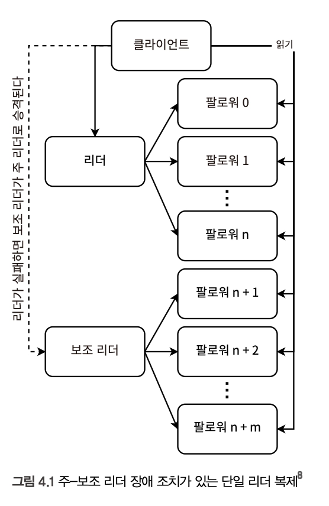
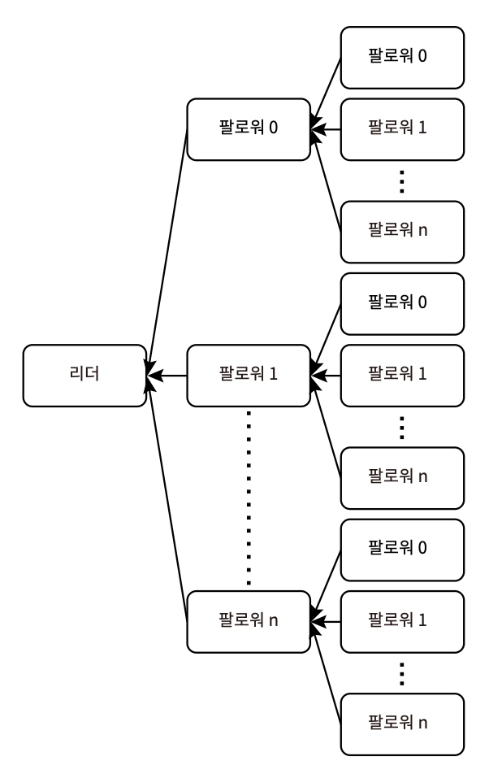
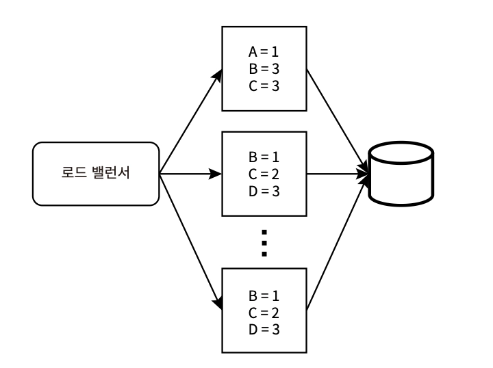
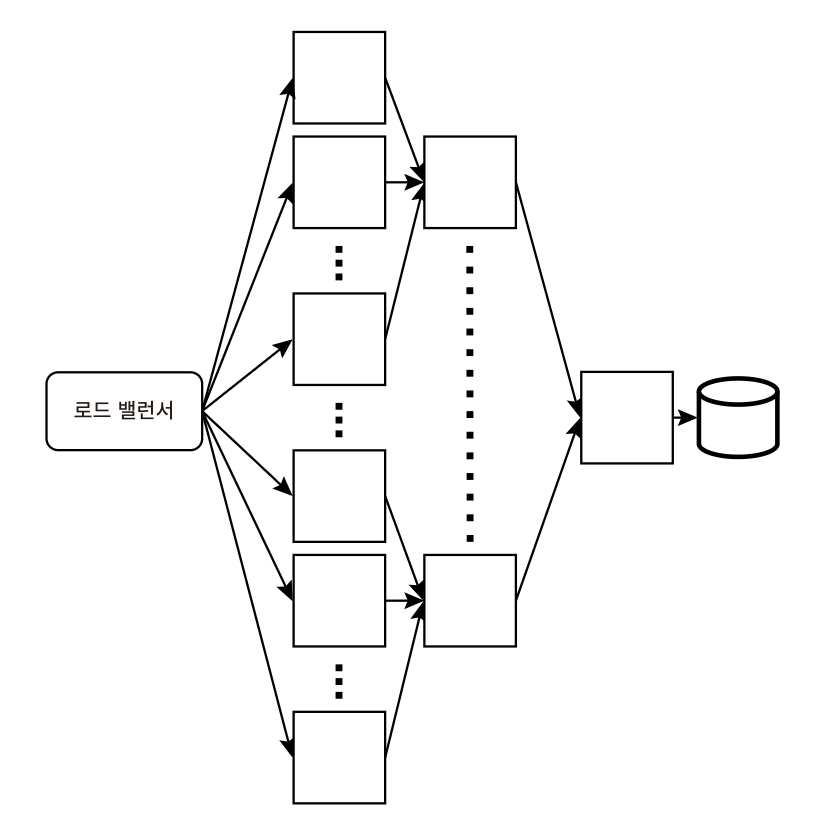
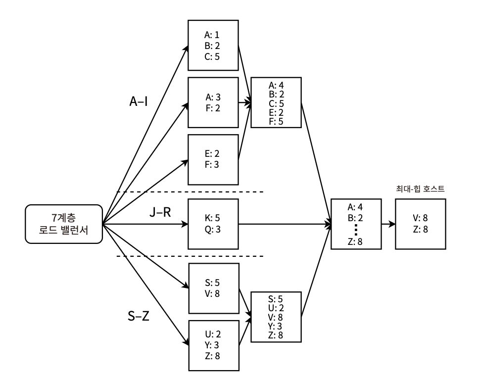

# 4장. 데이터베이스 확장

> 데이터베이스의 확장 = 여러 노드/호스트에 분산 데이터베이스를 구현하는 것

[주요 기술]

- 복제 : 데이터의 사본(복제본)을 만들어 다른 노드에 저장하는 것
- 분할 : 데이터 집합을 부분 집합으로 나누는 것
- 샤딩 : 데이터 집합을 부분 집합으로 나누어, 여러 노드에 분산하는 것

[단일 호스트의 한계]

- 내결함성 - SPOF가 존재. 데이터 백업 이슈, 특정 노드의 장애 발생 시 조치 프로세스와 연관
- 더 높은 스토리지 용량 - 수직 확장만으로는 비용과 노드의 처리량에서 문제가 될 수 있음
- 더 높은 처리량 - 동시 요청 처리 시 수직 확장은 가장 빠른 네트워크 카드, 더 나은 CPU, 더 많은 메모리를 사용함에도 한계가 존재함
- 더 낮은 지연 시간 - 데이터 센터 배치의 한계

## 저장 서비스

- 상태 저장 서비스 (_Stateful_)
  - 일관성을 보장하는 메커니즘
    - Paxos : 분산 시스템에서 합의를 이루기 위한 프로토콜 (네트워크 지연, 장애 상황에도 일관성 보장)
    - 최종 일관성 메커니즘
  - 데이터 손실을 피하려면 복제가 필요함
  - 강한 일관성을 위해서는 여러 트레이드오프가 따르고 복잡도가 높음
    - 가능한 한 모든 서비스를 stateless로 유지하고 **statuful 서비스 하나에만 상태를 유지**하는 이유
    - 동일한 사용자를 동일한 호스트로 일관되게 라우팅하는 sticky session의 구현 가능
    - 호스트 실패 상황에 대비해 새 호스트를 라우팅하는 방식 처리에 활용
      → 이를 통해 **“모든 상태는 stateful 서비스에서 관리됨”**이 보장되고, 나머지 stateless 서비스에서의 기술 선택 유연성 확보 및 상태 관리를 위한 설계/구현.실수를 피할 수 있게 된다
- 스토리지 유형
  1. Database
     - SQL
     - NoSQL
     - Column-oriented (e.g. Cassandra, HBase)
     - Key-Value (e.g. Memcached, Redis)
       - 각 key는 해싱 알고리즘을 통해 디스크 위치에 대응되며, 원시 타입으로 구성. 객체의 포인터가 될 수 없다
       - value는 별도 제한 X
       - 주로 캐싱에 사용됨
  2. Document
     - 값에 크기 제한이 없거나 KV 데이터베이스보다 훨씬 큰 제한이 있는 데이터베이스
     - 다양한 형식을 수용 — TEXT, JSON, YAML
     - e.g. MongoDB
  3. Graph
     - 엔티티 간의 관계를 효율적으로 저장하도록 설계됨
     - e.g. Neo4j, RedisGrpah, Amazon Neptune
  4. File Storage
     - 데이터가 파일에 저장된 형태로, 디렉터리/폴더로 구성
     - **_path_** = key가 되는 KV 유형
  5. Block Storage
     - 데이터를 고유 식별자가 있는 균일한 크기의 chunk로 저장
     - 주로 다른 데이터베이스 등 저장 시스템의 low-level 구성 요소 설계 시 사용
  6. Object Storage
     - File Storage보다 flatten한 계층 구조
     - 객체는 일반적으로 HTTP API로 접근됨
     - 정적 데이터에 적합 (쓰기가 느리고 객체 자체의 수정이 불가하므로)
     - e.g. Amazon S3

## 데이터베이스 사용 결정

- https://www.microsoft.com/en-us/research/publication/to-blob-or-not-to-blob-large-object-storage-in-a-database-or-a-filesystem/
  > _256K보다 작은 객체는 데이터베이스에 저장하는 것이 가장 좋고 1M보다 큰 객체는 파일 시스템에 저장하는 것이 가장 좋다. 256K~1M 사이에서는 read:write 비율과 객체의 overwrite or replacement 비율이 중요한 요인이다_
- 보통 재량과 경험적 방법에 기반하며, 선호 정도는 드러낼 수 있지만 모든 관련 요인을 설명하고 다른 사람의 의견을 고려할 수 있어야 함

## 복제

- 읽기(`SELECT`)의 확장은 데이터 복제본 수를 늘리는 것으로 해결 가능하지만, 쓰기의 확장은 더 어렵다

### 복제본 분산

> 같은 랙의 호스트에 하나의 백업을 두고, 다른 랙이나 데이터 센터 둘 다에 있는 호스트에 또 다른 백업을 두는 것

- 샤딩의 주요 트레이드오프 - **샤드 위치를 추적**해야 하는 복잡성 증가
- 샤딩의 이점
  - 스토리지 확장 - DB/테이블이 단일 노드보다 큰 경우 → 노드 간 샤딩으로 DB/테이블을 단일 논리적 단위로 유지한다
  - 메모리 확장 - DB가 메모리에 저장되는 경우 → 단일 노드의 메모리 수직 확장 비용이 상승하므로 샤딩으로 해결 가능
  - 처리 확장 - 병렬 처리의 이점
  - 지역성 - 특정 클러스터 노드가 필요로 하는 데이터를 로컬(자신의 노드)에 저장될 가능성이 높게 구성 가능
- HDFS - tombstone (삭제된 데이터에 대한 marker)을 추가하는 방식으로 특정 파티션된 DB의 삭제를 soft delete로 처리하고, 이를 통해 실행 중인 읽기 작업의 중단과 불일치를 방지한다

### 단일 리더 복제

> 모든 쓰기 작업은 리더라고 불리는 단일 노드에서 발생한다

- 읽기 확장
  - 높은 트래픽의 서비스를 제공하기 위해 SQL 데이터베이스를 수평 확장하는 경우. 단, ACID 일관성을 잃는다
- 구현이 가장 간단함
- ⚠️ 주요 제한 사항
  - **전체 DB가 단일 호스트에** 맞아야 한다
  - 팔로워 쓰기 복제에 시간이 걸리므로 **최종 일관성**이 있어야 한다
- e.g. MySQL binlog 기반 복제
  ■ https://dev.to/tutelaris/introduction-to-mysql-replication-97c
  ■ https://dev.mysql.com/doc/refman/8.0/en/binlog-replication-configuration-overview.html
  ■ https://www.digitalocean.com/community/tutorials/how-to-set-up-replication-in-mysql
  ■ https://docs.microsoft.com/en-us/azure/mysql/single-server/how-to-data-in-replication
  ■ https://www.percona.com/blog/2013/01/09/how-does-mysql-replication-really-work/
  ■ https://hevodata.com/learn/mysql-binlog-based-replication/

1. 주-보조 리더 구성의 단일 리더 복제

   
   - 모든 쓰기는 주 리더 노드에서 → 보조 리더 및 팔로워에게 복제

2. 다중 수준 복제

   
   - 팔로워를 피라미드 형태로 여러 level로 구성
   - 각 하위 level로 복제 : 각 노드는 자신의 팔로워에게 복제 - 그 팔로워는 다시 자신의 팔로워에게 복제
   - 읽기가 더 확장되지만, 일관성이 더 지연됨

- **애플리케이션 계층의 쿼리 로직**을 통해 단일 리더 복제를 확장할 수 있다
  > 애플리케이션에 메타데이터 관리가 있는 다중 리더 복제
  - 오래 운영하면서 저장된 데이터의 크가 단일 노드를 넘어설 때, 가능한 방법은 데이터를 여러 SQL 데이터베이스로 나누는 것이다
  - 서비스가 2개 이상의 SQL 데이터베이스로 연결되게끔 구성하여 애플리케이션에서 쿼리 수행 및 결합을 처리하도록 책임을 위임할 수 있다 (DB 캡슐화가 깨짐)
  - 👎🏻 테이블에 빠른 속도로 데이터가 쌓인다면, 날짜별로 테이블을 분할하고 매일 새로운 테이블을 생성 및 쿼리하게 하는 구성도 그 예시 중 하나이다 (= **테이블 명명 규칙**)
    - 이는 거의 사용되지 않는 설계이며, 이런 케이스는 다중 리더나 리더 없는 복제의 DB를 사용하는 것이 적절하다

### 다중 리더 복제

> 여러 노드가 리더로 지정되며, 모든 리더에서 쓰기를 수행한다. 각 리더는 자신의 쓰기 내용을 다른 모든 노드에 복제해야 한다.

- 쓰기 작업, 데이터베이스 저장 용량 확장
- 작업 순서를 어떻게 일관되게 보장할 수 있을까?
  1. Timestamp 기반 ordering
     - 분산 시스템에서는 global 시간 개념이 없음
     - Clock skew에 의해 여러 노드 간의 시계를 완벽하게 동기화할 수 없음
  2. 충돌을 줄이기 위한 데이터 모델 / 비즈니스 규칙 설계
     - 동일 데이터에 대한 동시 수정 최소화
     - DELETE 우선 등의 merge 정책 정의
  3. 강한 일관성이 필요한 데이터의 양 최소화
     - eventual consistency 허용 범위 분리

<aside>

데이터베이스에서의 **일관성** 정의

- 데이터베이스 트랜잭션이 데이터베이스의 한 유효한 상태에서 다른 유효한 상태로 전환하면서 불변성을 유지하도록 보장하는 것
- 모든 사용자에게 데이터가 동일해야 한다 (강한 일관성 수준) - 여러 복제본에 대한 동일한 쿼리는 항상 동일한 결과를 반환 - 동일한 row에 영향을 미치는 DML(INSERT, UPDATE, DELETE) 쿼리는 전송된 순서대로 실행 - 이는 경쟁조건을 야기할 수 있음 - 다른 서버에서 같은 밀리초에 전송된 DML 쿼리 상황 1. LWW (Last Write Wins) 2. Vector Clock 3. Application-level Merge - DELETE에 우선순위를 두고, 다른 INSERT/UPDATE 쿼리는 무작위로 동점을 매기는 것으로 접근 가능
</aside>

+) CouchDB, MySQL 그룹 복제, Postgres에서의 다중 리더 복제 합의 알고리즘과 구현

### 리더 없는 복제

> 읽기와 쓰기가 어느 노드에서나 일어날 수 있는 동등한 관계

- 정족수 : 여러 노드 간 합의를 위해 동의해야 하는 최소 노드 수
  - 일반적으로 과반수(`N/2 + 1`) 정족수를 사용하면 읽기와 쓰기 집합이 서로 overlap 되어 stale read 가능성을 줄이며 일관성을 보장할 수 있다
  - 주로 목적에 따라 `W`(쓰기 성공에 필요한 복제본 수)/`R`(읽기 성공에 필요한 복제본 수)을 조정한다
    | **목적** | **쓰기 정족수 W** | **읽기 정족수 R** | **의미** |
    | ---------------- | ----------------- | ----------------- | --------------------------------------------------------------------------------------- |
    | 빠른 쓰기 | 낮게 설정 | 높게 설정 | 쓰기는 적은 노드 응답만 기다려 빠르게 처리하고, 읽기 시 더 많은 노드에서 최신 값을 확인 |
    | 빠른 읽기 | 높게 설정 | 낮게 설정 | 쓰기 시 많은 노드에 반영해두고, 읽기 시 적은 노드만 조회 |
    | 둘 다 낮음 | 낮게 설정 | 낮게 설정 | 최신 값을 못 읽을 수 있어 최종 일관성에 가까워짐 (쓰기의 일관성은 깨짐) |
    | 강한 일관성 지향 | `R + W > N` | `R + W > N` | 읽기/쓰기 대상 노드 집합이 최소 1개 이상 겹치도록 보장 |
- e.g. Cassandra, Dynamo, Riak, Voldemort

### HDFS 복제

> 읽기와 복제가 랙 지역성을 기반으로 하며, 모든 복제본이 동등하다

- HDFS
  - **`클러스터 구성`** 활성 네임노드 / 수동(백업) 네임노드 / 여러 데이터노드
  - 테이블 = 디렉터리 하나 이상의 파일로 저장 → 블록으로 나뉘어 데이터노드에 분산됨
  - 네임노드는 파일 시스템 네임스페이스 작업과 블록의 생성, 삭제, 복제 수행 지시를 내린다
  - 데이터노드는 파일 시스템 클라이언트의 읽기, 쓰기 요청을 처리한다
  - INSERT를 전용으로 수행하며, UPDATE/DELETE 작업은 지원하지 않는다
- 하둡
  - 맵리듀스 프로그래밍 모델을 사용해 분산 데이터를 저장하고 처리하는 프레임워크
- 하이브
  - 하둡 위에 구축된 데이터 웨어하우스 솔루션
  - 효율적인 필터 쿼리를 위해 하나 이상의 열로 테이블을 분할한다 → 관련 파일만 처리함으로써 전체 테이블 스캔의 낭비를 피할 수 있음
    - https://stackoverflow.com/questions/44782173/hive-does-hive-support-partitioning-and-bucketing-while-usiing-external-tables

## 샤딩된 데이터베이스로 저장 용량 확장하기

- 데이터베이스 크기가 단일 호스트 용량을 초과하고 오래된 행을 보존해야 하는 경우, 샤딩된 스토리지에 저장하는 방식을 택할 수 있다
- 샤딩된 RDBMS
  1. Amazon RDS와 같은 샤딩된 RDBMS 솔루션 사용 https://aws.amazon.com/ko/blogs/database/sharding-with-amazon-relational-database-service/
  2. 자체 샤딩된 SQL 구현

## 이벤트 집계하기

1. 데이터베이스 쓰기 빈도 줄이기
   1. 샘플링 : 특정 데이터 포인트(n번째 / 무작위)만 고려하고 다른 것은 무시하는 것
   2. 집계 : 여러 이벤트를 단일 이벤트로 집계/결합하는 것 → 1회의 쓰기로 해결
2. 캐싱
3. 근사화
   1. Count-min sketch : 연속 데이터 스트림에서 이벤트의 근사 빈도 테이블을 만드는 알고리즘

- 집계는 스트리밍 파이프라인을 통해 구현할 수 있으며, 높은 빈도의 이벤트를 수신할 수 있을 만큼의 대규모 클러스터 구축이 따른다 (+ 복제, 체크포인팅, 분산 트랜잭션)
- 집계에 대한 이벤트 유실을 방지하려면 체크포인팅, DLQ를 사용할 수 있다
  - 각 노드를 공유 인메모리 DB에 요청을 보내는 여러 stateless 노드 클러스터 구성된 독립적인 서비스로 전환하면, 특정 호스트 장애에 의한 지연을 최소화할 수 있다

### 단일 계층 집계

- 값의 개수를 세는 과정 예시
  
  전제 : 이벤트는 A, B, C 3개의 값을 가질 수 있다.
  - 로드 밸런서가 단일 계층/티어의 호스트에 이벤트를 분산 → 각 호스트는 개별 해시 테이블에서 개수를 집계 → 주기적 or 메모리가 부족해진 시점에 집계된 개수를 데이터베이스에 기록

### 다중 계층 집계

- 각 계층의 호스트는 이전 계층의 상위 호스트로부터 이벤트를 집계
   \*다중 계층 복제의 reverse와 유사

### 분할

- 7계층 로드 밸런서가 필요하며, 로드 밸런서는 들어오는 이벤트를 처리하고 이벤트 내용에 따라 특정 호스트로 전달한다
  
  - 최종 해시 테이블 호스트로 집계되면, 이는 최대 힙 호스트로 전송되어 최종 최대 힙을 구성한다
  - 이는 파티션 간 트래픽이 불균등하고, 특정 파티션이 처리 능력 이상의 높은 트래픽을 받는 것을 대비한 구성이다
- 실제 운영 환경의 키 공간은 A-Z (26개)보다 훨씬 더 크게 구성되는데, 메모리 오버플로가 발생하지 않도록 초기 집계 계층을 메모리 수용 양보다 적게 제한해야 한다

## 배치, 스트리밍 ETL

- 배치와 스트리밍의 관계는 폴링과 인터럽트의 관계와 유사하다
  - 배치가 처리할 새 이벤트가 있는지에 관계없이 항상 정의된 주기로 실행된다면 (폴링과 유사)
  - 스트리밍은 트리거 조건(주로 새 이벤트 발행)이 충족될 때 실행된다 (인터럽트와 유사)
- Kappa Architecture - 조직 내에서 생성되는 데이터로 주기적으로 파일을 생성 & 사용 가능해지는 즉시 처리하는 스트리밍 작업을 구현할 수 있다
  - 데이터 처리 비용 분산
  - 한 번에 처리하는 데이터 조각이 작아져 디버깅에 용이
- 배치 도구 - Airflow, https://github.com/spotify/luigi (DAG 시각화, 수직적 확장 제공)
- 스트리밍 도구 - Kafka, Flink, [Flume](https://flume.apache.org/releases/content/1.9.0/FlumeUserGuide.html), Scribe (로깅 특화)
- ETL 파이프라인 (Extract-Transform-Load)
  - DAG로 구성. 노드=작업, 선행자=의존성
  - 개별 태스크는 멱등성을 가져야 함

### 메시징

[용어 정리]

| **용어**        | 정의                                                            |
| --------------- | --------------------------------------------------------------- |
| 메시징 시스템   | 애플리케이션 간 데이터 전달과 공유를 담당하는 전체 시스템 개념  |
| 메시지 큐       | 작업 메시지를 큐에 넣고 소비자가 하나씩 처리하는 구조           |
| Pub/Sub         | 이벤트를 발행하는 서비스와 구독하는 서비스를 분리한 비동기 구조 |
| 메시지 브로커   | 메시지를 전달·중개·라우팅하는 시스템 (번역 계층)                |
| 이벤트 스트리밍 | 상태 변화 이벤트를 실시간 흐름으로 지속 처리하는 개념           |
| Pull            | 소비자가 직접 메시지를 가져오는 방식                            |
| Push            | 브로커가 소비자에게 메시지를 밀어넣는 방식                      |

- 펼쳐보기
  | **용어** | **정의** | **핵심 특징** | **대표 예시 / 포인트** |
  | --------------------------------- | --------------------------------------------------------------- | --------------------------------------------------- | ---------------------------------------------------- |
  | 메시징 시스템 (Messaging System) | 애플리케이션 간 데이터 전달과 공유를 담당하는 전체 시스템 개념 | 서비스 간 결합도를 낮추고 비동기 처리 지원 | Kafka, RabbitMQ, SQS 등을 포함하는 상위 개념 |
  | 메시지 큐 (Message Queue) | 작업 메시지를 큐에 저장하고 소비자가 하나씩 처리하는 구조 | 메시지는 일반적으로 단일 소비자에 의해 한 번 처리됨 | 작업 처리, 비동기 백그라운드 Job |
  | 발행자/구독자 (Pub/Sub) | 이벤트를 발행하는 서비스와 구독하는 서비스를 분리한 비동기 구조 | 여러 소비자가 동일 이벤트를 각각 처리 가능 | 주문 생성 이벤트 → 결제/알림/통계 서비스가 각각 소비 |
  | 메시지 브로커 (Message Broker) | 메시지를 전달·중개·라우팅하는 시스템 | 프로토콜 변환 및 메시지 전달 역할 수행 | Apache Kafka, RabbitMQ |
  | 이벤트 스트리밍 (Event Streaming) | 상태 변화 이벤트를 실시간 흐름으로 지속 처리하는 개념 | 이벤트 로그를 연속적으로 저장·전달 | 사용자 행동 로그, 클릭 스트림, CDC |
  | Pull 방식 | 소비자가 직접 메시지를 가져오는 방식 | 소비 속도를 소비자가 제어 가능 | Kafka Consumer Poll |
  | Push 방식 | 브로커가 소비자에게 메시지를 밀어넣는 방식 | 빠른 전달 가능하지만 소비자 과부하 위험 존재 | Webhook, 일부 MQ Push Consumer |
- 예시
  - 메시지 브로커: Apache Kafka, RabbitMQ
  - 메시징 프로토콜: AMQP
- 일반적으로 Pull이 Push보다 낫다 — 구독자가 메시지 소비 속도를 제어하기 때문
  - 지속적으로 높은 부하가 걸리면, 구독자가 계속해서 폴링하므로 큐가 상당 기간 비어 있을 가능성이 낮다
  - 예측 불가능한 트래픽 급증에 대비해 대규모 스트리밍 클러스터를 유지한다면, 이는 우선순위가 낮은 메시지에도 사용될 수 있다 (e.g. 조직 공통의 Flink, Kafka, Spark)
- Push가 더 적합한 경우
  - 많은 소스에서 데이터를 수집하는 크롤링 서비스
  - 오디오/비디오 실시간 스트리밍과 같은 손실 허용 애플리케이션 — 주로 UDP를 사용해 푸시
- Kafka VS RabbitMQ의 세부사항과 차이점은 기본적으로 숙지
  | **항목** | **카프카** | **RabbitMQ** |
  | ---------------- | ---------------------------------------------------- | --------------------------------- |
  | 설계 목적 | 확장성·가용성·내구성 중심 | 간단한 메시지 큐 중심 |
  | 확장성 | 클러스터 기반 수평 확장 지원 | 기본적으로 확장성 제한적 |
  | 내구성 | 복제(replication) 지원, 장애 허용성 높음 | 다운 시 메시지 유실 가능 |
  | 메시지 처리 방식 | 소비 후에도 일정 기간 보존 | 소비(디큐) 시 즉시 제거 |
  | 데이터 구조 | 로그(Log) / 리스트 기반 | 전통적인 Queue 기반 |
  | 재처리 | 같은 이벤트 재소비 가능 | 기본적으로 재소비 어려움 |
  | 보존 기간 | Retention 설정 가능 (DB처럼 활용 가능) | 큐에서 제거되면 사라짐 |
  | 우선순위 | 기본적으로 없음 | 메시지 우선순위 지원 |
  | 운영 난이도 | 설정·운영 복잡 | 설정 간단 |
  | 적합한 용도 | 이벤트 스트리밍, 로그 수집, 대규모 데이터 파이프라인 | 작업 큐, 비동기 처리, 빠른 메시징 |

### 람다 아키텍처

- 배치와 스트리밍 파이프라인을 병렬로 실행해 **빅데이터**를 처리하는 데이터 처리 아키텍처
- 같은 목적지를 업데이트하는 **병렬 고속과 저속 파이프라인**을 가짐을 의미
  1. 고속 파이프라인 - 낮은 지연시간 확보. 데이터를 복제하지 않아 손실 및 낮은 정확도가 따를 수 있음
     - 근사 알고리즘
     - 인메모리 DB - e.g. Redis
  2. 저속 파이프라인 - **일관성, 정확성** 확보
     - Spark, MapReduce DB
- 대안) Kappa 아키텍처 - 단일 기술 스택으로 배치, 스트리밍 처리를 모두 수행

## 비정규화

- 더 빠른 읽기 연산을 위한 접근은 JOIN 쿼리를 피하기 위해 **스키마를 비정규화해 저장공간을 속도와 맞바꾸는** 것이다
  - JOIN 쿼리 <<< 개별 테이블 쿼리

## 캐싱

- 캐시의 이점 : 성능(더 빠르고 비쌈), 가용성(DB fallback), 확장성(서비스 부하 절감) — 주로 낮은 지연시간&고가용성을 위한 설계
  - 데이터베이스는 고가용성이어야 하며, 서비스의 가용성을 위해 캐시에 의존해서는 안 된다
- 클라이언트, API Gateway, 각 서비스를 포함한 여러 수준에서 수행될 수 있다
  - https://learn.microsoft.com/en-us/dotnet/architecture/cloud-native/azure-caching
  - https://csswizardry.com/2018/11/css-and-network-performance/
  - **캐시는 요청이 가능한 적은 수의 서비스를 통과하게 함으로써, 지연 시간과 비용을 낮출 수 있다**
- 읽기 전략
  1. Cache Aside (Lazy Load)
     - 읽기 위주의 부하 처리 방식에 적합
     - 요청된 데이터만 캐시에 쓰이므로, 용량/비용 등 예측 가능
     - 구현이 단순함
     - DB와의 일관성을 맞춰주기 위한 추가 작업 수반
     - 캐시 미스 시 DB 직접 요청보다 성능이 저하됨 (캐시에 대한 추가 read/write)
  2. Read-Through
     - “캐시가” 데이터베이스에 요청하여 데이터 저장
     - 읽기 위주의 부하에 적합 — 애플리케이션 <> DB 간의 접촉이 없으므로
     - 여러 DB 요청을 단일 캐시 값으로 그룹화할 수 없다는 한계가 있음
- 쓰기 전략
  1. Write-Through
     - 모든 쓰기가 캐시를 거쳐 DB로 전달
     - 캐시가 항상 최신 데이터를 가지는 것이 보장
     - 쓰기 속도가 느려짐
     - 새로운 캐시 노드에는 cold start 문제가 있음
  2. Write-Back (Write-behind)
     - 애플리케이션 → 캐시에만 쓰고, 캐시는 DB에 주기적으로 flush (즉시 반영X)
     - 쓰기 속도가 빠르며, DB 쓰기가 차단되지 않음
     - 캐시의 가용성이 높아야 하므로, 복잡도가 높음
  3. Write-Around
     - 애플리케이션 → DB에만 기록, 읽기 전략에 의해 캐시가 채워지는 방식 택
     - 캐시 미스 발생 시 갱신됨

     

     (좌) Cache Aside와 결합 / (우) Read Through와 경합

- 캐시 무효화 (Invalidation)
  1. 브라우저 캐시 무효화
     - 각 파일에 `max-age` 로 캐시 만료 설정
     - 만료 전에 변경 시, 핑거프린팅 기법을 이용해 파일명에 hash versioning을 적용할 수 있다
     - 원본 서버에 대한 불필요한 요청 방지
     - _REST 모범 사례 - 요청은 기본적으로 캐시 가능해야 하지만, 이에 따라 캐시하지 않거나 짧은 만료 시간을 설정해야 한다_

     https://jakearchibald.com/2016/caching-best-practices/

     https://developer.mozilla.org/en-US/docs/Web/HTTP/Reference/Headers/Cache-Control

  2. 캐싱 서비스의 캐시 무효화
     - 캐싱 서비스의 항목을 직접 생성/교체/제거하는 방식으로 해결
     - 캐시 교체 정책과 연관 - 무작위 교체, LRU, FIFO, LIFO

- 캐시 워밍
  - 해당 항목에 대한 첫 요청 전에 캐시를 미리 채우는 것 → 첫 요청에 대한 캐시 미스 방지
  - 브라우저 캐시에는 적용X
  - 추가적인 복잡성과 비용이 따름 ⇒ 가장 자주 요청될 항목만 부분적으로 채우기
    - https://netflixtechblog.com/cache-warming-agility-for-a-stateful-service-2d3b1da82642
  - 캐시 워밍으로 발생하는 추가적인 트래픽이 서비스에 과도한 부하로 작용할 수 있음을 주의하자
  - TTL이 짧을 경우, 워밍 자체가 시간 낭비가 될 수 있음

### 독립 서비스로의 캐싱

> **_서비스 호스트의 메모리에 캐시하지 않는 이유는?_**

- 서비스는 stateless하기 때문에, 특정 요청이 특정 호스트로 할당된다는 보장 X
- 캐싱은 특히 핫 샤드를 유발하는 불균형한 요청 패턴이 있을 때 유용함 (요청-응답이 고유하다면 무의미)
- 배포 시점마다 캐시가 초기화됨
- 캐싱 서비스의 비기능적 요구사항에 최적화된 하드웨어나 VM을 사용할 수 있음
- 요청 병합을 통해 서비스의 중복 요청을 제거하고, 트래픽을 줄이는 데 활용 가능

### 캐시 대상과 방법

- 캐시할 수 있는 다양한 종류
  1. HTTP 응답
  2. 데이터베이스 쿼리
- 개인 vs 공용
  - 개인용 캐시 - 클라이언트에 있으며, 개인화된 콘텐츠에 유용
  - 공용 캐시 - CDN 같은 프록시, 서비스에 위치
- 캐시 대상으로 적합하지 않은 데이터
  - 개인정보, 실시간 공개 정보, 유료 저작권 콘텐츠, 변경될 수 있는 공개 정보 (→ 최신화 로직 필요)
