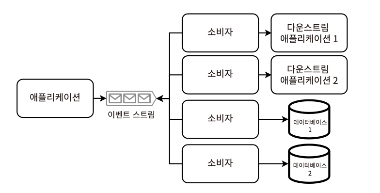
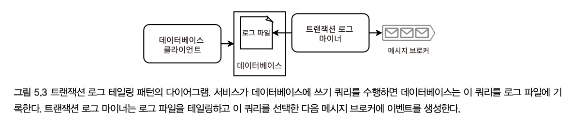
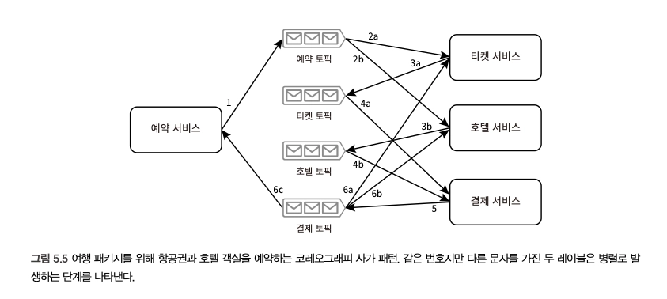
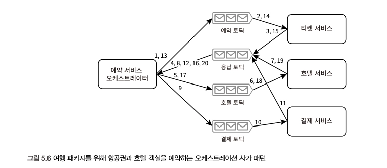

# 5장. 분산 트랜잭션

> _트랜잭션이란?_
>
> 서비스 간 데이터 일관성을 유지하기 위해 여러 읽기와 쓰기를 논리적 단위로 그룹화하는 방법

- Atomic한 단일 작업으로 실행
  - all(성공) or nothing(실패)
- 분산 트랜잭션
  - 별개의 쓰기 요청을 하나의 분산된(atomic) 트랜잭션으로 결합
- **합의(consensus) : 모든 서비스가 쓰기 이벤트가 발생했거나 발생하지 않았다는 것에 동의하는 것**
  - 서비스 간의 일관성을 위해 쓰기 이벤트 중 문제가 발생하더라도 합의가 이뤄져야 한다

[분산 트랜잭션에서 일관성을 유지하기 위한 알고리즘]

- 이벤트 소싱, CDC, 이벤트 기반 아키텍처(EDA)
- 체크포인팅, DLQ
- 사가(Saga) 패턴
- 2단계 커밋

## 이벤트 기반 아키텍처(EDA)

> 다른 구성 요소 간의 대부분의 상호작용이 작업 수행을 요청하는 대신 **이미 발생한 이벤트를 알림으로써 실현**되는 아키텍처 스타일

_#비동기 #Non-blocking_

- 느슨한 결합, 확장성, 응답성(낮은 지연 시간)
- 보통 이벤트를 발행하기만 하면 스레드를 소비하지 않아도 되는 구조이지만, 선택적으로 요청 유효성 검사까지는 담당하도록 논블로킹 개념을 완전히 따르지 않는 방법도 있다 (빠른 실패를 통해 장기적인 리소스와 시간 절약)
- EDA 예시 - 이벤트 소싱, CDC

### 이벤트 소싱

> 추가 전용 로그에 이벤트로 데이터나 데이터 변경을 저장하는 패턴

- 이벤트 로그가 신뢰할 수 있는 단일 데이터 출처
- 다른 모든 데이터베이스는 이벤트 로그에서 파생된 데이터 표현이다
- 모든 쓰기는 이벤트 로그에 이뤄지고 → 이후 하나 이상의 이벤트 핸들러가 새로운 이벤트를 소비 → DB에 쓰기 반영
  - 이벤트 핸들러(구독자)는 특정 데이터 소스에 묶이지 않으며, 사용자 상호작용, 외부/내부 시스템 등 다양한 소스에서 이벤트를 캡쳐한다
  - 로그 이벤트는 순차적으로 처리되며, 엔티티의 현재 상태를 결정한다
- 구현 방식 (Publisher 입장)
  1. 이벤트 스토리지 (Kafka Topic)
  2. 추가 전용 로그
  3. 관계형 DB (SQL)
  4. 문서 DB (MongoDB, Couchbase)
  5. In-memory DB (Redis, [Apache Ignite](https://apacheignite.readme.io/docs/ignite-facts))
- 👍🏻 장점
  - 모든 이벤트에 대한 완전한 감사 추적 제공
  - 디버깅/분석/과거 상태 파악에 용이
  - 새로운 이벤트 유형과 핸들러를 도입해 비즈니스 로직 변경 가능
- 👎🏻 단점
  - 이벤트 스토리지, 복원, 버전 관리, 스키마 변화 등 관리 복잡성이 높음
  - 로그가 커질수록 이벤트 복원 비용 및 시간 증가

### 변경 데이터 캡처 (CDC)

> _Change Data Capture_
>
> 데이터 변경 이벤트를 변경 로그 이벤트 스트림에 기록하고 이 이벤트 스트림을 API를 통해 제공하는 방식

- 변경 로그 이벤트 스트림에 단일 변경/변경 그룹을 **단일 이벤트**로 발행 → 데이터 변경 동기화 시 사용
- 소비자 외에도 서버리스 함수를 통해 변경 사항을 다운스트림 서비스/애플리케이션/데이터베이스에 전파할 수 있다
- 요청을 거의 실시간으로 처리하며, 이벤트 소싱보다 일관성이 높고 지연 시간이 낮다
- 트랜잭션 로그 테일링 패턴
  
  - 프로세스가 DB에 쓰거나 Kafka에 생성해야 할 때 발생가능한 불일치를 방지하기 위한 것
  - `트랜잭션 로그 마이너` 프로세스가 DB의 트랜잭션 로그를 테일링 → 각 업데이트를 이벤트로 생성
- CDC 플랫폼 (→ 트랜잭션 로그 마이너로 사용 가능)
  1. Debezium
  2. Databus
  3. DynamoDB Streams
  4. Eventuate CDC Service
- 중복 이벤트 처리하려면?
  1. 메시지 브로커의 ‘exactly once’ 메커니즘 적용
  2. 이벤트를 멱등하게 정의하고 처리

**[비교]**

| **구분**    | **이벤트 소싱**                                    | **변경 데이터 캡처(CDC)**                                                     |
| ----------- | -------------------------------------------------- | ----------------------------------------------------------------------------- |
| 목적        | 이벤트를 기준 데이터로 기록한다.                   | 소스 서비스에서 다운스트림 서비스로 이벤트를 전파해 데이터 변경을 동기화한다. |
| 기준 데이터 | 로그나 로그에 발생된 이벤트가 기준 데이터다.       | 발행자 서비스의 데이터베이스. 발생된 이벤트는 기준 데이터가 아니다.           |
| 세분성      | 특정 작업이나 상태 변경을 나타내는 세분화된 이벤트 | 새로 생성, 업데이트, 삭제된 행이나 문서 같은 개별 데이터베이스 수준의 변경    |

→ 함께 사용하는 것도 가능하다!

e.g. 서비스 내에서 이벤트 소싱으로 데이터 변경을 이벤트로 기록 → CDC로 다른 서비스에 이벤트 전파

## 트랜잭션 감독자

> 트랜잭션이 성공적으로 완료되거나 취소되게 보장하는 프로세스

- 주기적인 배치나 서버리스 함수로 구현
- 불일치 수동 검토, 보상 트랜잭션의 수동 실행을 위한 인터페이스를 구현 후 자동화를 위한 충분한 검증과 테스트 필요
- 다른 분산 트랜잭션 메커니즘의 간섭은 없는지 확인
- 보상 트랜잭션은 항상 기록되어야 한다 (자동/수동 무관)

## 사가 패턴

> **트랜잭션으로 작성할 수 있는 장기 실행 트랜잭션** — 분산 시스템에서 장기 실행 트랜잭션을 관리하는 데 로컬 트랜잭션을 사용하며, 각 단계가 실패할 때 보상 트랜잭션을 통해 일관성을 유지하는 방법
>
> https://microservices.io/patterns/data/saga.html

- 모든 트랜잭션이 성공적으로 완료되거나 실패 시 롤백을 위한 보상 트랜잭션 실행 —**실패 관리에 도움이 되는 패턴**
  - 특정 서비스가 특정 요구사항을 충족할 때만 분산 트랜잭션이 수행되도록 하는 것이 중요
  - e.g. 항공권/호텔/결제 서비스가 엮여있는 비즈니스 로직에서 결제 서비스 트랜잭션 실패 시, 다른 두 서비스의 보상 트랜잭션을 사용해 역순으로 전체 사가 롤백
- Stateless를 기본 전제로 함
- 일반적인 구현 방식 - Kafka, RabbitMQ 등의 메시지 브로커 도입
- 조정을 구성하는 방법
  1. 코레오그래피(병렬)
  2. 오케스트레이션(선행)

### 코레오그래피 방식

1. 사가 패턴을 시작하는 서비스는 2개의 카프카 토픽과 통신
2. 분산 트랜잭션을 위해 하나의 카프카 토픽에서 `생성` & 최종 로직 수행을 위해 다른 카프카 토픽에서 `소비`

→ 서비스 간에는 카프카 토픽을 통해 직접 통신한다

- 여러 서비스는 여러 특정 토픽에서 이벤트를 소비하고, 다른 토픽에 이벤트를 생성한다
- 보안을 위해, 자사 서비스는 절대 카프카 서비스에 직접적인 타사 서비스 접근을 허용하지 않는다

\***_CDC 예시_**

예약 서비스는 티켓 서비스나 호텔 서비스의 응답을 기다릴 필요가 없다.

- 1~4단계 : 보상 트랜잭션으로 롤백할 수 있는 보상 가능한 트랜잭션
- 5단계 : 피벗 트랜잭션 (이후부터 성공할 때까지 재시도 가능)
- 6단계 : 재시도 가능한 트랜잭션

[주요 사항]

- 양방향 선이 없다 ⇒ 서비스가 동일한 토픽에 생성/구독하지 않는다
- 2개의 서비스가 동일한 토픽에 생성하지 않는다
- 서비스는 여러 토픽을 구독할 수 있다
- 모든 이벤트 수신은 DB에 기록하고, 필요한 모든 이벤트가 수신되었는지 확인하는 데 쓰인다
- 토픽-서비스의 관계는 1:N / N:1일 수 있지만, M:N은 아니다
- 순환이 존재할 수 있다 (e.g. 호텔 토픽 → 결제 서비스 → 결제 토픽 → 호텔 서비스 → 호텔 토픽)

### 오케스트레이션 방식

- **`오케스트레이터`** = 사가 패턴을 시작하는 서비스, 이벤트에 반응하고 명령을 발행하는 유한 상태 기계
  - 카프카 토픽을 통해 각 서비스와 통신
  - 각 단계에서 오케스트레이터가 단계 시작을 위해 토픽에 이벤트를 생성하면, 그 단계의 결과를 받기 위해 다른 토픽에서 소비하는 구조
  - 단계의 순서만 포함하며, 보상 메커니즘 외 다른 비즈니스 로직은 포함해서는 안 됨

\***_여행 패키지를 예약하기 위한 오케스트레이션 사가 패턴_**

18단계는 실패하지 않을 것므로 불필요해 보이지만, 성공할 때까지 계속 재시도 할 수 있으며
18/20단계는 병렬로 수행할 수 있다

단 여기서는 접근 방식으로 일관되게 유지하기 위해 선형적으로 수행함

[비교]

| **구분**               | **코레오그래피 (Choreography)**                                           | **오케스트레이션 (Orchestration)**                  |
| ---------------------- | ------------------------------------------------------------------------- | --------------------------------------------------- |
| **흐름 제어 방식**     | 각 서비스가 이벤트를 구독하고 다음 이벤트를 발행하며 자율적으로 흐름 진행 | 중앙 오케스트레이터가 전체 사가 흐름을 직접 제어    |
| **요청 흐름**          | 병렬적·이벤트 중심 흐름                                                   | 순차적·선형 흐름                                    |
| **설계 관점**          | Observer/Event-Driven 패턴 중심                                           | Controller/Workflow 패턴 중심                       |
| **서비스 간 통신**     | 서비스들이 Kafka Topic 기반으로 직접 이벤트 교환                          | 오케스트레이터가 각 서비스와 Topic 기반 통신        |
| **단계 관리**          | 전체 흐름이 여러 서비스에 분산되어 추적 어려움                            | 단계별 흐름이 오케스트레이터에 집중되어 가시성 높음 |
| **이벤트 관리 복잡도** | 이벤트 체인이 계속 생성될 수 있어 이벤트 관리 복잡                        | 단계별 요청/응답 구조라 상대적으로 단순             |
| **DB 기록 필요성**     | 이벤트 상태 추적·복구를 위한 저장 필요성이 큼                             | 중앙 제어로 인해 상태 관리 단순화 가능              |
| **네트워크 트래픽**    | 서비스 간 직접 통신 → 상대적으로 적음                                     | 모든 요청이 오케스트레이터 경유 → 증가              |
| **지연 시간(Latency)** | 병렬 처리 가능 → 낮은 편                                                  | 단계별 호출 → 상대적으로 높음                       |
| **서비스 독립성**      | 이벤트 계약에 강하게 의존                                                 | 서비스 자체는 비교적 독립적                         |
| **변경 영향도**        | 하나의 이벤트 변경이 여러 서비스에 영향 가능                              | 변경 영향 범위가 비교적 명확                        |
| **장애 지점(SPOF)**    | 중앙 제어자가 없어 SPOF 없음                                              | 오케스트레이터 장애 시 전체 흐름 중단 가능          |
| **가용성 요구사항**    | Kafka 중심의 HA 구성 정도로 충분한 경우 많음                              | Kafka + 오케스트레이터 모두 HA 필요                 |
| **보상 트랜잭션 처리** | 각 서비스가 자체적으로 보상 이벤트 발행 가능                              | 오케스트레이터가 보상 흐름 직접 관리                |
| **장점**               | 낮은 지연 시간, 높은 분산성, SPOF 없음                                    | 흐름 추적 용이, 운영/디버깅 편리                    |
| **단점**               | 흐름 추적 어려움, 이벤트 복잡성 증가                                      | 중앙 의존성 증가, 지연 시간 증가                    |

- 추가로 실무 관점에서 보면 보통 이렇게 선택하는 경우가 많습니다
  | **상황** | **추천 방식** |
  | -------------------------------------------- | -------------- |
  | 서비스 수가 적고 흐름이 단순함 | 오케스트레이션 |
  | 복잡한 장기 트랜잭션 + 운영 가시성이 중요 | 오케스트레이션 |
  | 높은 확장성·느슨한 결합·이벤트 중심 아키텍처 | 코레오그래피 |
  | 팀이 많고 각 서비스 자율성이 중요 | 코레오그래피 |
  | 장애 추적/운영 난이도를 낮추고 싶음 | 오케스트레이션 |
  | 초고트래픽·낮은 지연 시간이 중요 | 코레오그래피 |

## 합의 알고리즘

분산 데이터베이스에서 많은 수의 노드 합의를 달성하는 데 유용

1. 정족수 쓰기
2. 팍소스와 EPaxos(Egalitarian Paxos) - 리더 없이 모든 복제본이 동등하게 명령을 제안하고 실행
3. Raft
4. Zab(주키퍼 원자저 브로드캐스트 프로토콜) - 아파치 주키퍼에서 사용
