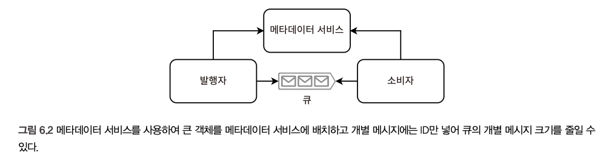

# 6장. 기능적 분할을 위한 공통 서비스

> **특정 기능을 백엔드에서 분할해 전용 클러스터에서 실행하는 확장성 기법**

## API 게이트웨이의 공통 기능

- API 게이트웨이 클라우드 서비스
  - https://aws.amazon.com/ko/api-gateway/
  - https://konghq.com/products/kong-gateway

1. 보안

   > 서비스 데이터의 무단 접근 방지
   1. 인증/인가
   2. SSL 종료 (실제 프로토콜은 TLS)
   3. 서버 사이드 데이터 암호화 - API 게이트웨이는 저장 전에 데이터 암호화 & 요청자에 보내기 전에 복호화

2. 오류 검사

   > 잘못되거나 중복된 요청이 서비스 호스트에 도달하는 것을 방지해 유효한 요청만 처리
   1. Request Validation
   2. Request Deduplication - 서비스가 멱등성을 가지거나, stateless 이거나, ‘최소 한 번’ 전달을 사용할 때 중복 요청을 오류 없이 처리/재시도 가능 (’정확히 한 번’, ‘최대 한 번’ X)

3. 성능과 가용성
   1. 캐싱
   2. Rate Limiting - 시스템 리소스 사용이나 네트워크 트래픽을 의도적으로 제한해 서비스의 과부하 방지
   3. Request dispatching - 작업, 리소스, 데이터를 적절한 처리 유닛이나 목적지로 효율적으로 할당/분배하는 과정 (Bulkhead, Circuit Breaker)
4. 로깅과 분석
   - 요청 로깅, 사용 데이터 수집
   - 분석, 감사, 청구, 디버깅 등 다양한 목적으로 실시간 정보 수집

## 서비스 메시/사이드카 패턴

- 한계 - 서비스가 작동 중이더라도 사이드카를 사용할 수 없으면 서비스의 호스트를 사용할 수 없다는 것
  - ⇒ 단일 호스트에서 여러 서비스/컨테이너를 실행하지 않는 이유
- **3가지 유형의 플레인**을 포함한다 — [Istio] Control Plane + Data Plane, [Nginx] 관찰 가능성 플레인
  - https://istio.io/latest/docs/ops/deployment/architecture/
- 메시 트래픽 : 서비스 간이나 서비스 내 요청이 Envoy 프록시 호스트 간에 발생
  - HTTP, gRPC 등 다양한 프로토콜 사용 가능
  - https://learn.microsoft.com/en-us/dotnet/architecture/cloud-native/service-mesh-communication-infrastructure
- 관찰 가능성 플레인은 로깅, 모니터링, 경보, 감사를 제공
- 클라우드에서 제공하는 서비스 메시 - https://aws.amazon.com/ko/app-mesh/

## 메타데이터 서비스

> 시스템 내 여러 구성 요소가 사용하는 정보를 저장

- SQL 정규화와 같이 정보의 중복을 줄이고, 일관성을 향상시킴
- e.g. ETL 파이프라인 내 HTML 처리 (file_id만으로 발행자-소비자 간 공통 HTML 파일을 가볍게 처리 가능)
  
- 트레이드오프 - 복잡성, 전반적인 지연 시간의 증가
  - 발행자, 소비자 모두 메타데이터 서비스를 통하도록 추가되기 때문
  - 트래픽 급증에 대비해 메타데이터 서비스도 높은 읽기 볼륨 지원 필요

## 서비스 디스커버리

> 클라이언트가 사용 가능한 서비스 호스트를 식별하는 내부 관리 방법 (in MSA)

- 서비스 레지스트리 - 서비스의 사용 가능한 호스트를 추적하는 데이터베이스
  - https://docs.aws.amazon.com/whitepapers/latest/microservices-on-aws/microservices-on-aws.html
- [클라이언트 사이드 디스커버리](https://microservices.io/patterns/client-side-discovery.html), [서버 사이드 디스커버리](https://microservices.io/patterns/server-side-discovery.html)로 구분할 수 있음

## 기능적 분할을 위한 프레임워크

- 웹
  - 브라우저는 HTML, CSS, Javascript만 이해할 수 있으며, 프레임워크는 다른 언어로 브라우저 앱 코드를 작성하여 HTML, CSS, Javascript로 변환되도록 지원하여 유연성을 가져갈 수 있다
    → React, Vue.js, Angular, Meteor, jQuery, Ember.js, Backbone.js
    - 같은 파일 내에 마크업, 로직 내재 가능 (e.g. React의 JSX, Vue.js 태그)
  - 자바스크립트로 변환된 웹 개발 언어 (브라우저/클라이언트 사이드)
    → Typescript, Elm, PureScript, Reason, ReScript, Clojure, CoffeeScript
  - 서버 사이드 프론트엔드 프레임워크 - DB 요청, 백엔드 개발에 사용 가능
    → Express, Deno, Goji, Rocket, Vapor, [Vert.x](https://vertx.io/), PHP
- 모바일 (Android, iOS)
  - 자체의 앱 개발 플랫폼을 제공 = **네이티브 플랫폼**
  - 네이티브 Android - Kotlin, Java / 네이티브 iOS - Swift, Object-C
- 크로스 플랫폼 개발
  - Android-iOS
    → React Native, Flutter, Ionic, Xamarin, [Electron](https://www.electronjs.org/), Cordova
  - PWA(Progressive web app) : 일반적인 데스크톱 브라우저 경험을 제공할 수 있는 브라우저 앱/웹 애플리케이션
    - service workers, app manifests 등의 브라우저 기능을 사용해 모바일 기기와 유사한 UX 제공 (e.g. 푸시 알림)
  - 반응형 웹 디자인
    - https://developer.mozilla.org/en-US/docs/Web/CSS/Guides/Media_queries/Using
    - https://developer.mozilla.org/en-US/docs/Web/API/ResizeObserver
- 백엔드
  - RPC
    - https://grpc.io/
    - https://thrift.apache.org/, Protocol Buffers - 데이터 객체를 직렬화해 네트워크 트래픽을 줄이기 위해 압축하는 데 사용
  - REST
    - https://www.dropwizard.io/en/stable/, Spring Boot, Flask, Django
  - GraphQL
    +) Full-Stack 프레임워크 - Dart, Rails, Yesod, [통합 Haskell 플랫폼](https://ihp.digitallyinduced.com/), Phoenix, JavaFX, Beego, Gin
- PC

## 라이브러리와 서비스

- 라이브러리는 독립적인 코드 묶음일 수도 있고, 클라인트-서버 간의 요청/응답을 전달하는 최소한의 중간층일 수 있고, 두 가지 요소를 모두 포함할 수도 있다
- 라이브러리 VS 서비스 의 비교
  - 라이브러리는 사용자의 기기와 정확한 환경에 접근해야 디버깅이 가능하지만, 서비스는 VM/도커와 같은 도구로 균일한 환경에서 돌아가므로 비교적 디버깅이 더 쉽다
  - 어댑터 패턴은 서비스보다 라이브러리 사용 시에 더 자주 사용되는 경향이 있다

## 일반적인 API 패러다임

- REST(Representational State Transfer)
- RPC(Remote Procedure Call)
- GraphQL
- Websocket

### 개방형 시스템 상호 연결(OSI) 모델

7-layer OSI model

> 설계 원칙 : 각 수준의 프로토콜은 하위 수준의 프로토콜을 사용해 구현된다

| **계층 번호** | **이름**    | **설명**                                                                                 | **예시**                                                                           |
| ------------- | ----------- | ---------------------------------------------------------------------------------------- | ---------------------------------------------------------------------------------- |
| 7             | 응용        | 사용자 인터페이스                                                                        | FTP, HTTP, 텔넷 **→ Actor, GraphQL, REST, Websocket은 HTTP 위에 구현**             |
| 6             | 표현        | 데이터를 표현한다. 암호화가 이뤄진다.                                                    | UTF, ASCII, JPEG, MPEG, TIFF                                                       |
| 5             | 세션        | 개별 응용 프로그램의 데이터를 구분한다. 연결을 유지한다. 포트와 세션을 제어한다.         | RPC, SQL, NFX, X 윈도우 **→ RPC는 상위 계층 의존 없이 연결/포트/세션을 직접 처리** |
| 4             | 전송        | 종단 간 연결. 신뢰할 수 있는 전송과 신뢰할 수 없는 전송, 흐름 제어를 정의한다.           | TCP, UDP                                                                           |
| 3             | 네트워크    | 논리 주소 지정. 데이터가 사용하는 물리적 경로를 정의한다. 라우터가 이 계층에서 작동한다. | IP, ICMP                                                                           |
| 2             | 데이터 링크 | 네트워크 형식. 물리 계층의 오류를 정정할 수 있다.                                        | 이더넷, 와이파이                                                                   |
| 1             | 물리        | 물리적 매체를 통한 원시 비트                                                             | 광섬유, 동축 케이블, 리피터, 모뎀, 네트워크 어댑터, USB                            |
