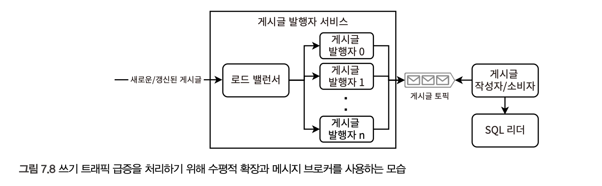

# 7장. 크레이그리스트 설계

> Craigslist : 지역별 온라인 광고와 커뮤니티 게시판 웹사이트 — 구인구직, 주택, 중고물품 거래 등 다양한 생활 정보를 공유하는 플랫폼

**모놀리스 아키텍처를 고려한 시스템 설계 (책에서 유일)**

## 사용자 스토리와 요구사항

[사용자 규모]

- 10억 명 이상의 사용자
- \*지리적으로 분할됨

[사용자 유형]

1. **조회자**
2. **게시자**

- 게시자는 7일마다 게시물을 갱신할 수 있다
- 프로그래밍 방식으로 생성된 경우, 게시물이 많을 수 있으므로 유저에 검색 기능을 제공해야 한다
- Clickbait : 사용자의 호기심을 자극해 클릭을 유도하는, 과장되거나 오해의 소지가 있는 제목이나 썸네일을 사용하는 온라인 마케팅 전략
  - → 해당 게시물을 신고하는 기능 필요
- 필요한 스토리지의 대부분은 크레이그리스트 게시물용이므로, 필요한 저장 공간의 양 자체는 적다
  - 즉, 스토리지 요구사항이 낮다는 것
  - 이는 모든 데이터를 단일 호스트에 저장할 수 있음을 의미
- 사용자에 해당하는 지역의 게시물만 노출해도 된다
  - → 개별 사용자를 서비스하는 데이터 센터가 전체 게시물 중 일부만 저장해도 되며, 다른 데이터 센터의 게시물은 백업 가능하도록 한다

## 아키텍처

> https://sfbay.craigslist.org/

1. 사용자 인증 서비스와 게시물 객체 스토리지를 사용하는 모놀리스
2. 클라이언트 프론트엔드 서비스, 백엔드 서비스, SQL 서비스, 객체 스토리지, 사용자 인증 서비스

- 게시물 웹페이지 전체(사진 포함)를 객체 스토리지에 저장하는 방식
  **[트레이드오프]**
  1. HTML 태그, CSS, JS가 모든 게시물에서 중복됨
     - 중복된 페이지 구성 요소를 저장하기 위한 추가 저장 공간 필요
     - 새로운 기능이나 필드를 오래된 게시물에 적용할 수 없음 → 일주일 후 삭제 정책에 따라 일부 허용될 수 있음. 이는 추가 논의를 통해 결정 가능
  2. 네이티브 모바일 앱 개발 시, 브라우저 앱-백엔드 간 공유 불가
     - 프로그레시브 웹 앱으로 해결 가능
     - 반응형 디자인 접근 방식으로 작성 + 모바일 앱을 웹뷰를 사용한 브라우저 앱으로 감싸는 형태로 구현
     - [구현] React Native/Native Android/Native iOS용 WebView 라이브러리 활용, CSS Media Query(디바이스의 화면 크기나 해상도 등의 조건에 따라 다른 스타일을 적용할 수 있게 하는 기능)
  3. 게시물 분석 시 HTML을 파싱해야 함
- 백엔드, 객체 스토리지 서비스의 인증
  1. 타사 사용자 인증 서비스 사용
  2. 자체 구현
- SQL 데이터베이스, 객체 스토리지
  - 객체 스토리지 → 이미지 파일용
    [WHY?]
    1. **다운로드 실패 가능성이 비교적 높음**

       클라이언트가 백엔드 호스트를 통해 이미지 파일을 다운로드하게 되면, 백엔드 호스트에 추가적인 부담을 주고 이미지 다운로드에 의한 지연 시간 증가, 네트워크 이슈 등
       - 단순한 구현을 위해서는 초기 구현 시 이미지 기능 자체를 제외하는 것도 고려 가능
       - 이미지 테이블 - post_id (text), image (blob) 으로 단순하게 설계 가능

    2. **SQL에 저장 시 마이그레이션이 번거로움**

       [데이터 마이그레이션 프로세스](https://www.notion.so/3652896bff9780d8b55cc96a3817ee5a?pvs=21)

  - SQL 데이터베이스 → 게시물 데이터의 나머지 부분

## 데이터 마이그레이션 프로세스

> 한 데이터 스토리지에서 다른 스토리지의 마이그레이션

1. 두 데이터 스토리지를 단일 엔티티로 취급한다
   - 복제는 추상화되어 있으며, 다양한 데이터 센터에 데이터가 어떻게 분산되는지 고려할 필요 X
   - **지연 시간, 가용성 등 비기능적 요구사항 최적화에 집중**
2. 다운타임을 허용한다
   - 마이그레이션 중에 애플리케이션 쓰기 비활성화 하는 경우
3. 사용자에게 다운타임을 사전 통지한다 (다운타임 동안의 요청 실패 고려)

### 마이그레이션은 어떻게?

1. 파이썬 스크립트 작성 → 로컬 서버에서 실행 (가장 간단)

   > Craigslist : 지역별 온라인 광고와 커뮤니티 게시판 웹사이트 — 구인구직, 주택, 중고물품 거래 등 다양한 생활 정보를 공유하는 플랫폼

**모놀리스 아키텍처를 고려한 시스템 설계 (책에서 유일)**

## 사용자 스토리와 요구사항

[사용자 규모]

- 10억 명 이상의 사용자
- \*지리적으로 분할됨

[사용자 유형]

1. **조회자**
2. **게시자**

- 게시자는 7일마다 게시물을 갱신할 수 있다
- 프로그래밍 방식으로 생성된 경우, 게시물이 많을 수 있으므로 유저에 검색 기능을 제공해야 한다
- Clickbait : 사용자의 호기심을 자극해 클릭을 유도하는, 과장되거나 오해의 소지가 있는 제목이나 썸네일을 사용하는 온라인 마케팅 전략
  - → 해당 게시물을 신고하는 기능 필요
- 필요한 스토리지의 대부분은 크레이그리스트 게시물용이므로, 필요한 저장 공간의 양 자체는 적다
  - 즉, 스토리지 요구사항이 낮다는 것
  - 이는 모든 데이터를 단일 호스트에 저장할 수 있음을 의미
- 사용자에 해당하는 지역의 게시물만 노출해도 된다
  - → 개별 사용자를 서비스하는 데이터 센터가 전체 게시물 중 일부만 저장해도 되며, 다른 데이터 센터의 게시물은 백업 가능하도록 한다

## 아키텍처

> https://sfbay.craigslist.org/

1. 사용자 인증 서비스와 게시물 객체 스토리지를 사용하는 모놀리스
2. 클라이언트 프론트엔드 서비스, 백엔드 서비스, SQL 서비스, 객체 스토리지, 사용자 인증 서비스

- 게시물 웹페이지 전체(사진 포함)를 객체 스토리지에 저장하는 방식
  **[트레이드오프]**
  1. HTML 태그, CSS, JS가 모든 게시물에서 중복됨
     - 중복된 페이지 구성 요소를 저장하기 위한 추가 저장 공간 필요
     - 새로운 기능이나 필드를 오래된 게시물에 적용할 수 없음 → 일주일 후 삭제 정책에 따라 일부 허용될 수 있음. 이는 추가 논의를 통해 결정 가능
  2. 네이티브 모바일 앱 개발 시, 브라우저 앱-백엔드 간 공유 불가
     - 프로그레시브 웹 앱으로 해결 가능
     - 반응형 디자인 접근 방식으로 작성 + 모바일 앱을 웹뷰를 사용한 브라우저 앱으로 감싸는 형태로 구현
     - [구현] React Native/Native Android/Native iOS용 WebView 라이브러리 활용, CSS Media Query(디바이스의 화면 크기나 해상도 등의 조건에 따라 다른 스타일을 적용할 수 있게 하는 기능)
  3. 게시물 분석 시 HTML을 파싱해야 함
- 백엔드, 객체 스토리지 서비스의 인증
  1. 타사 사용자 인증 서비스 사용
  2. 자체 구현
- SQL 데이터베이스, 객체 스토리지
  - 객체 스토리지 → 이미지 파일용
    [WHY?]
    1. **다운로드 실패 가능성이 비교적 높음**

       클라이언트가 백엔드 호스트를 통해 이미지 파일을 다운로드하게 되면, 백엔드 호스트에 추가적인 부담을 주고 이미지 다운로드에 의한 지연 시간 증가, 네트워크 이슈 등
       - 단순한 구현을 위해서는 초기 구현 시 이미지 기능 자체를 제외하는 것도 고려 가능
       - 이미지 테이블 - post_id (text), image (blob) 으로 단순하게 설계 가능

    2. **SQL에 저장 시 마이그레이션이 번거로움**

       [데이터 마이그레이션 프로세스](https://www.notion.so/3652896bff9780d8b55cc96a3817ee5a?pvs=21)

  - SQL 데이터베이스 → 게시물 데이터의 나머지 부분

## 데이터 마이그레이션 프로세스

> 한 데이터 스토리지에서 다른 스토리지의 마이그레이션

1. 두 데이터 스토리지를 단일 엔티티로 취급한다
   - 복제는 추상화되어 있으며, 다양한 데이터 센터에 데이터가 어떻게 분산되는지 고려할 필요 X
   - **지연 시간, 가용성 등 비기능적 요구사항 최적화에 집중**
2. 다운타임을 허용한다
   - 마이그레이션 중에 애플리케이션 쓰기 비활성화 하는 경우
3. 사용자에게 다운타임을 사전 통지한다 (다운타임 동안의 요청 실패 고려)

### 마이그레이션은 어떻게?

1. 파이썬 스크립트 작성 → 로컬 서버에서 실행 (가장 간단)
   - 데이터 전송이 몇 시간 내에 완료될 수 있고 한 번만 수행하면 되는 경우 적합 (기존 스토리지 GET 요청 → 대상 스토리지 POST 요청)
   - 스크립트 실행은 버그, 네트워크 등의 이슈로 중단될 수 있으므로, 쓰기 엔드포인트는 재시작에 대한 멱등성을 가져야 함
   - 간단한 체크포인팅 메커니즘으로 이미 전송된 레코드는 다시 읽고 쓰지 않을 수 있음
     - 스크립트가 실행될 때마다 같은 순서로 레코드를 읽는 것이 보장되어야 함
       1. 레코드 ID의 전체 및 정렬된 목록을 미리 디스크에 저장 후 메모리에 로드. 완료된 ID는 배치로 쓰거나 체크포인트하여 속도 개선 가능
       2. 데이터 객체 내 타임스탬프/위치를 나타내는 같은 순서의 필드가 존재하는 경우, 해당 필드 활용 (e.g. 체크포인트 후 날짜를 증가시키는 방식)

2. 데이터 센터 내에서 스크립트 실행 — 데이터 전송 크기가 매우 큰 경우
   - 데이터가 여러 호스트에 분산된 경우, 각 호스트마다 별도로 하나씩 실행하여 다운타임 없이 마이그레이션을 수행할 수 있다
   - **이전 데이터 스토리지 폐기 절차**
     1. 호스트 Connection Draining : 새로운 요청을 받지 않으면서 기존 요청이 완료되게 허용하는 것

        https://docs.cloud.google.com/load-balancing/docs/enabling-connection-draining?hl=ko

        https://aws.amazon.com/ko/blogs/aws/elb-connection-draining-remove-instances-from-service-with-care/

        https://docs.aws.amazon.com/elasticloadbalancing/latest/classic/config-conn-drain.html

     2. 호스트가 Drain된 후, 해당 호스트에서 데이터 전송 스크립트 실행
     3. 스크립트 실행 완료 시, 호스트 deprecated

- 데이터 마이그레이션은 복잡하고 비용이 많이 드는 작업이므로, 가능하면 피하는 것이 좋다.
- 실험적 모델로 처음부터 적절한 데이터 스토리지를 구축하는 것이 중요하다.

## 게시물 작성과 읽기

1. **클라이언트 측에서 업로드** : 클라이언트는 이미지 파일을 한 번에 하나씩 객체 스토리지에 업로드 하거나 스레드를 분기해 병렬 업로드 요청을 할 수 있다
   - 적은 리소스 - 이미지 업로드 오버헤드가 클라이언트로 넘어감
   - 전반적인 지연 시간 감소 - 단 CDN 사용에는 신중해야 함
2. **백엔드 측에서 업로드** : 백엔드는 파일 업로드가 성공했는지 알지 못한 채 200을 반환하는데, 이를 확인하려면 백엔드 자체에서 업로드하도록 구현해야 한다
   - 객체 스토리지의 인증, 권한 부여 메커니즘을 구현하는 리소스가 줄어듦
   - 조회자가 게시물의 모든 이미지를 볼 수 있음이 보장

→ 결합 : 클라이언트가 이미지 파일을 백엔드에 쓰고, CDN에서 이미지 파일을 읽는 방식

이미지 조회 요청은 병렬로 이루어질 수 있으며, 파일은 다른 스토리지 호스트에 저장되고 복제되어 별도의 스토리지 호스트에서 병렬로 다운로드할 수 있다

## 기능적 분할

- 지리상 위치 라우팅
  - 사용자의 DSN 쿼리의 위치 기반으로 트래픽 서비스 → 가장 가까운 데이터 센터로 라우팅
  - 각 데이터 센터의 SQL 클러스터는 서비스하는 해당 도시의 데이터만 포함하며, 이는 MySQL binlog 복제와 같은 방식으로 여러 데이터 센터 간에 복제가 이루어진다
- 크레이그리스트는 각 도시에 **서브도메인**을 할당해 이러한 지리적 분할을 수행
  > https://docs.aws.amazon.com/Route53/latest/DeveloperGuide/routing-policy-geo.html
  1. ISP가 사전에 DNS 조회 수행 → IP 주소 반환
     - **브라우저와 OS의 DNS 캐시를 사용하면 ISP에 DNS 조회 요청을 보내는 것보다 빠르게 처리가 가능하다**
  2. 브라우저는 IP 주소로 요청을 보낸다 → 이 IP 주소를 기반으로 사용자의 위치 파악 후 해당 위치의 서브도메인이 포함된 3xx 응답 반환
     - 이 반환된 주소는 브라우저와 사용자의 OS, ISP 같은 중간 경로의 다른 매개체에 캐시될 수 있다
  3. 브라우저는 서브도메인의 IP 주소를 얻기 위한 추가 DNS 조회 요청
  4. 서버에서 해당 서브도메인의 웹페이지와 데이터 반환

## 캐싱

- 매우 인기 있고 높은 조회 수를 기록하는 게시물은 캐시 대상으로 분류한다
  - 지연시간 SLA(e.g. P99=1s)를 준수하고 504 Gateway Timeout 오류를 방지하기 위함
- Key = 게시물 ID, Value = 게시물의 전체 HTML 페이지
- 객체 식별자를 이미지에 매핑하여 자체 캐시를 구현할 수 있다

## CDN

- 크레이그리스트는 모든 사용자에게 표시되는 정적 미디어(이미지, 동영상)가 매우 적다
- 정적 콘텐츠(CSS, Javascript 파일)는 브라우저 캐싱으로도 해결할 수 있다

## 쓰기 처리량 확장

- 특정 SQL 구현으로 빠른 INSERT를 수행할 수 있다
  - https://stackoverflow.com/questions/2861944/how-to-do-very-fast-inserts-to-sql-server-2008

  - e.g. SQL Server의 ExecuteNonQuery, 개별 INSERT문 대신 배치 커밋

- Kafka와 같은 메시지 브로커를 SQL 서비스 앞에 배치해 쓰기 트래픽 급증을 처리할 수 있다
  
  - 주요 트레이드오프 - 복잡성, 최종 일관성
  - 쓰기가 SQL 팔로워에 도달하는 데 시간이 오래 걸리므로 최종 일관성 지속 시간은 늘어난다
- 더 높은 쓰기 처리량이 필요하다면? Cassandra, HDFS

## 오래된 게시물 제거

- cron job이나 Airflow로 DELETE /old_posts 엔드포인트를 매일 호출하는 방식
  - 특정 타임스탬프 값보다 오래된 게시물을 삭제하는 로직
  - Redis 캐시에서 키를 삭제하는 로직이 포함될 수 있음
- 게시물을 예정된 시간보다 늦게 삭제하는 것은 괜찮지만, 일찍 삭제하지 않도록 충분한 테스트가 이루어져야 함
- 비용 이슈 및 오래된 데이터 접근이 빈번하지 않은 경우, 데이터 삭제 대신 다음 대안을 고려해볼 수 있음
  1. 저비용 아카이브 하드웨어 - 압축 후 테이프
  2. 온라인 데이터 아카이브 서비스에 저장 - AWS Glacier, Azure Archive Storage
  3. 디스크 드라이브에 데이터 처리 전 미리 저장

[오래된 데이터를 삭제하는 것의 이점]

- 스토리지 프로비저닝과 유지보수 비용 절감
- 읽기와 인덱싱 같은 DB 작업 속도 향상
- 모든 데이터를 새 위치로 복사해야 하는 유지보수 작업의 속도가 빨라지고 복잡성이 낮아지며 비용이 줄어둚 (e.g. 다른 데이터베이스 솔루션 추가, 마이그레이션)
- 조직의 프라이버시 보호 우려가 줄어들고 데이터 유출의 영향이 제한됨

[단점]

- 데이터 보관을 통해 얻을 수 있는 분석과 유용한 인사이트 손실
- 정부 규정에 의해 특정 기간 동안 데이터를 보관해야 할 수 있음
- 삭제된 게시물의 URL이 새로운 게시물에 활용된 경우, 조회자가 옛 게시물을 보고 있다고 착각할 수 있음 (민감한 개인 데이터 노출 시 치명적인 케이스)

## 모니터링과 알림

- 오래된 게시물이 제거되지 않은 경우 `LOW`
- 이상 감지 사례 `HIGH`
  - 추가되거나 제거된 게시물 수
  - 특정 용어의 높은 검색 횟수
  - 부적절한 것으로 신고된 게시물 수

## 기타 논의 가능한 주제

- 게시물 신고
- 점진적 성능 저하 (각 구성 요소의 장애 처리 방안, 예외 상황 고려)
- 복잡성
  1. 종속성 최소화 - 유지보수 필요한 라이브러리, 서비스 등 시스템의 기능 세트를 최소화하면 디버깅, 문제 해결, 유지보수가 간단해진다

     → 각 지역/고객층별로 광범위한 맞춤화가 필요하지 않은 최소한의 유용한 기능 세트를 제공해야 함 (e.g. 크레이그리스트에서 각 도시마다 상이한 결제의 비즈니스 로직을 제공하지 않는다)

  2. 클라우드 서비스 사용

  3. 전체 웹페이지를 HTML 문서로 작성
     - 크레이그리스트의 경우, 게시물의 HTML 페이지 템플릿에 제목, 설명, 가격, 사진 등의 필드가 포함될 수 있으며, 각 필드의 값은 Javascript로 채워질 수 있다
     - CDN에 단일 HTML 문서로 저장하며, 게시물의 ID를 key로 가지는 간단한 KV구조를 만들 수 있고, SQL 데이터베이스 마이그레이션 없이 필드를 변경할 수 있다 (Post 테이블 자체가 단순화됨)
  4. 관찰 가능성

     → 로깅, 모니터링, 알림, 자동화된 테스트에 투자해야 하며, 좋은 모니터링 대시보드, 런북, 디버깅 자동화를 포함한 우수한 SRE 사례를 채택해야 한다

## 분석과 추천

일일 배치 ETL 작업으로 DB 쿼리 및 대시보드를 구성할 수 있다

- 추가 개인화 기능 논의 가능
- 대시보드에 포함되는 주요 항목
  - 태그별 품목 수, 가장 많은 클릭을 받은 태그, 조회자가 게시자에게 가장 많이 연락한 태그, 가장 빠른 판매를 기록한 태그(게시 후 얼마나 빠르게 삭제했는가), 신고/의심되는 사기성 게시물 수와 지리적/시간적 분포

## 구독과 저장된 검색

- 사용자는 저장된 검색과 일치하는 새 게시물에 대해 알림을 받도록 기능을 제공할 수 있다
- 저장된 검색에 대해 **새로운 결과**를 보내기 위해 일일 배치 ETL 작업 구현
  1. 검색 서비스에 중복 요청 허용
  2. 중복 요청 자체를 피하기
     1. 검색어 중복을 제거해 각 용어에 한 번만 검색 실행하기

        ```sql
        SELECT DISTINCT LOWER(search_term)
        FROM saved_search
        WHERE timestamp >= UNIX_TIMESTAMP(DATEADD(CURDATE(), INTERVAL -1 DAY))
        	AND timestamp < UNIX_TIMESTAMP(CURDATE())
        ```

     2. 검색어별 작업 순서
        1. 검색 서비스에 요청을 보내고 결과를 받는다
        2. 해당 검색어와 연관된 사용자 ID를 `saved_search` 테이블에서 쿼리한다
        3. 각 사용자ID, 검색어, 결과 튜플 알림 서비스에 요청을 보낸다

- Elastic Search는 빈번한 검색 요청을 캐싱한다
  https://www.elastic.co/blog/elasticsearch-caching-deep-dive-boosting-query-speed-one-cache-at-a-time

## 대량의 게시물

> _단일 호스트에서 검색 쿼리를 계속해서 제공하려면?_

\*여러 호스트에서 쿼리를 처리하고 개별적으로 단일 호스트마다 결과를 집계하는 설계는 비효율적

- 게시물 만료(보존 기간)를 1주일로 정하고, 만료된 게시물을 삭제하는 일일 배치 작업 구현
  - 짧은 보존 기간은 검색/캐시할 데이터가 적음을 의미
- 게시물에 저장되는 데이터의 양 자체를 줄이기
- 게시물 카테고리에 기능적 분할 수행 (e.g. 매핑은 Redis 캐시에 저장하고, 애플리케이션이 어떤 테이블을 쿼리할지 결정 시 캐시에 쿼리)
- 압축 고려 X (압축된 데이터를 검색하는 비용이 크기 때문)

## 지역 규정

- 사용자 위치에 따라 클라이언트 측에서 특정 제품, 서비스 구역을 선택적으로 표시하기
- 사용자가 금지된 제품과 서비스를 보거나 게시하는 것까지 방지하기
- 규정이 많거나 자주 변경될 경우, 크레이그리스트 관리자용 규정 서비스 구축도 고려해야 함
- 금지된 콘텐츠가 게시되지 않도록 금지된 단어/문구를 감지하는 시스템, 머신러닝 접근법까지 고려해볼 수 있음
- 크레이그리스트는 국가별로 목록을 맞춤화하려고 시도하지 않는다
