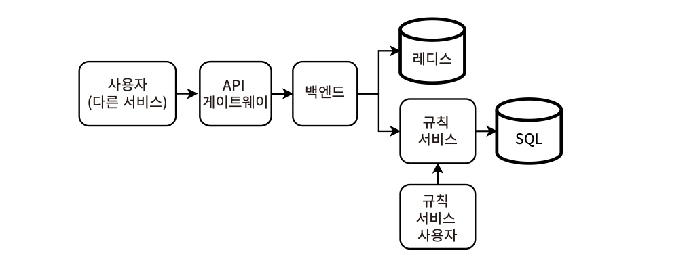
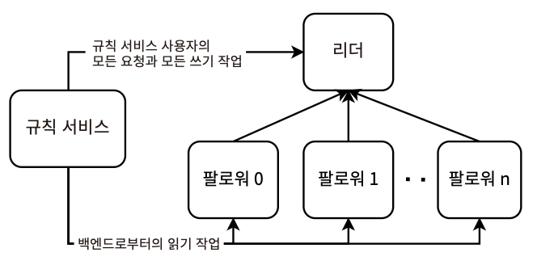

# 8장. 속도 제한 서비스 설계

> **_속도 제한(Rate Limiting) : 소비자가 API 엔드포인트에 요청할 수 있는 속도를 정의_**

- 의도하지 않거나 악의적인 과도한 사용을 방지한다
  - 봇과 같은 형태의 클라이언트
  - 클라이언트가 트래픽 급증을 경험한 또 다른 웹 서비스인 경우
  - 운영 환경에서 부하 테스트를 실행한 경우
- 이는 ‘시끄러운 이웃’ 문제를 일으킴
  - 하나의 테넌트나 사용자가 과도하게 자원을 독점해 다른 사용자들의 성능을 저하시키는 현상
  - 다른 클라이언트는 더 높은 지연 시간이나 더 높은 요청 실패율을 경험하게 됨
- 속도 제한이 맞지 못하는 봇 공격
  https://www.cloudflare.com/learning/bots/what-is-bot-management/
  1. DoS, DDoS 공격 - 대상에 요청을 폭증시켜 정상 트래픽을 처리할 수 없게 하는 방식
  2. 무차별 대입 공격(Brute force attack) - 비밀번호, 암호화 키, API 키, SSH 로그인 자격 증명과 같은 민감한 데이터를 찾기 위해 반복적으로 시도하는 공격
  3. Web Scraping - 봇을 사용해 웹 애플리케이션의 많은 웹 페이지에 GET 요청을 보내 대량의 데이터를 얻는 방법
- 구현
  1. 라이브러리 활용
  2. API Gateway, Service Mesh가 호출하는 별도 서비스로 구현 (기능적 분할) ✅

## 속도 제한 서비스의 대안

1. **수평적 확장**으로 부하 증가 시 새 호스트를 추가하는 것이 대안이 된다
   - 하지만 이는 호스트 하드웨어 프로비저닝, 필요한 도커 컨테이너 다운로드, 새 호스트에서 서비스 시작, 새 호스트로 트래픽을 보내게 로드 밸런서 구성 업데이트 등의 과정으로 매우 느리다
   - 이 과정을 거치는 동안 이미 서비스가 중단되었을 수 있다
   - 자동 확장 솔루션도 마찬가지
2. **로드밸런서**에서 각 호스트로 보내는 요청 수를 제한할 수 있다
   - 로드밸런서가 호스트의 과부하 방지를 보장하고, 클러스터에 여유 용량이 없을 때 요청을 삭제하게 할 수 있다
   - 악의적인 요청을 분류하기 위해 IP주소를 감지하고 버리기

> 속도 제한기는 보통 429 Too Many Requests를 반환하지만, 악의적인 요청임을 확신한다면 다음과 같이 처리할 수 있다

1. 요청을 버리고 응답 반환 X — 공격자가 서비스에 장애가 발생한 것으로 인식하게 하기
2. 사용자를 Shadow ban하여 200을 반환하되, 빈 응답이나 오해의 소지가 있는 응답 보내기

   \*_사용자가 인지하지 못하게 콘텐츠나 활동을 제한하거나 숨기는 온라인 플랫폼의 제재 방식_

> 비용이 많이 드는 특정 요청 (e.g. 필터링, 집계, 더 큰 데이터셋의 연산 포함 등)

- 특정 클라이언트의 비용이 많이 드는 요청을 처리하느라 느려질 수 있는데, 이를 같은 호스트로 라우팅하는 sticky session을 위해서는 7계층 로드밸런서(ALB)가 필요하다
- 하지만 오직 이 목적으로만 ALB를 도입하는 것은 비효율적임 (→ 전용 공유 속도 제한 서비스가 더 나은 해결책)

## 속도 제한이 적절하지 않은 케이스

1. 사용자가 일정 기간 내에 너무 많은 요청을 보냈음을 알려야 하는 상황 → 429/500으로 반환하는 것보다 좋은 사용자 경험을 제공할 수 있음
2. 특정 요청 시간 간격의 할당량을 측정하고, 초과 시 다음 시간 간격까지의 추가 요청 처리를 막아야 하는 상황

_즉, 속도 제한 서비스는 위와 같이 각 클라이언트에 따라 다른 속도 제한을 주는 복잡한 사용 사례보다 단순한 사용 사례를 지원하는 데 국한되어야 한다_

## 기능적 요구사항

- 속도 제한 서비스는 주로 회사 외부 사용자를 대상으로 하는 **사용자 서비스**
- 사용자의 최대 요청 속도를 설정한다 — 초과 시 동일 요청자의 추가 요청은 지연 처리 or 429로 거부 (e.g. 10초 동안 최대 10개의 요청을 수용한다)
- 각 사용자 서비스에서 사용자의 속도를 독립적으로 설정할 수 있다
- 사용자는 하나의 엔드포인트당 여러 개의 속도 제한을 설정할 수 있다
  - 속도 제한기가 이해하고 사용하기 쉬운 저렴하고 확장 가능한 서비스가 되어야 함
- 어떤 사용자가 속도 제한이 되었고, 언제 해당 이벤트가 시작되고 끝났는지 모니터링 가능한 엔드포인트를 제공해야 한다
- 모든 요청은 로깅해야 할 수 있다 (\*논의 필요)
  - **저장 공간 절약 기법**을 통해 많은 양의 로그 데이터의 저장 공간 확보 및 비용 전략을 논의해볼 수 있다
  - 특히, 속도가 제한된 요청자를 로깅하여 수동 후속 조치와 분석 시 활용해야 한다 (미리 의심되는 공격에 대비)

## 비기능적 요구사항

> 속도 제한 서비스는 대부분의 서비스에 필요한 기본 기능이므로
> **확장 가능하고, 높은 성능을 가지며, 가능한 단순하고, 안전하며, 프라이버시를 보장**해야 한다

\*고가용성, 내결함성, 정확성, 일관성을 트레이드오프할 수 있다

🔴 **중요도 높음**

### 확장성

- 특정 요청자의 속도를 제한해야 하는지 쿼리하는 일일 수십억 건의 요청으로 확장 가능해야 한다
- 최대 (사용자 10억 명 X 100개 타임스탬프) 큐 X 속도 제한이 필요한 최대 100개의 서비스를 연결해야 함
- 사용자 데이터를 전부 저장해야 하는가? 보존 기간은?
- 10초 간격 ⇒ 10초 동안만 속도 제한 결정을 위한 데이터를 저장
  - but, 10초마다 즉시 데이터를 삭제하는 것은 비현실적이므로 실제 필요한 저장공간은 서비스가 오래된 데이터를 얼마나 빨리 삭제할 수 있는지에 따라 다름

### 성능

- 속도 제한기 요청의 응답 시간은 사용자 요청의 응답 시간에 추가되므로, 매우 낮은 지연 시간을 요구한다
  - P99 ≈ 100ms
- 사용자 요청 속도를 제한할 것인가의 결정이 빠르게 이루어져야 한다

### 복잡성

- 많은 서비스의 공유 서비스 형태 — **다른 서비스에서 속도 제한 솔루션을 가능한 한 간단하고 원활하게 통합**할 수 있어야 함
- 버그와 중단의 위험을 최소화
- 문제 해결을 도울 수 있어야 함
- ‘속도 제한’ 단일 기능에 집중
- 비용 최소화를 위해 단순해야 함

### 보안과 프라이버시

1. 사용자 서비스의 보안과 프라이버시 구현이 외부 공격자의 접근에 취약
2. 내부 사용자 서비스에서 요청 위조하여 의도적으로 속도 제한
3. 사용자 서비스가 다른 사용자 서비스의 속도 제한기 요청자 데이터를 요청해 프라이버시 위반

→ 이와 같이 다양한 형태로 위험에 노출되어 있으므로, 보안과 프라이버시를 구현해야 한다

**🟢 중요도 낮음**

### 가용성과 내결함성

- 가용성이 높아질수록 비용이 증가
- 속도 제한 서비스가 다운되더라도, 그 시간동안 사용자 서비스가 모든 요청에 속도 제한을 적용하지 않을 수 있음
- 간단한 고가용성 캐시를 활용하면 속도 제한 서비스의 장애 전에 과도한 클라이언트를 식별해 속도 제한을 지속할 수 있음
- 방화벽 등으로 사용자 서비스의 중단을 방지하는 방법도 있음

### 정확성

- 과도한 클라이언트를 잘못 식별해 속도를 제한해서는 안 된다
- 하지만, 속도 제한 값 자체가 정확할 필요는 없다 (e.g. 10초 동안 10개 제한 → 10초 동안 8~12개 제한도 허용)

### 일관성

- 어떤 사용 사례에서도 강한 일관성이 필요하지 않다 (대부분 최종 일관성 허용) ⇒ 단순하고 저렴한 설계 가능
- 사용자 서비스가 속도 제한을 업데이트할 때, 이 설정이 새로운 요청에 즉시 적용될 필요는 없다

## 서비스 구성 요소

- **카운트에 빠른 read/write가 가능한 데이터베이스**
  - 필수값 - 사용자 ID, 사용자 서비스 ID **(단순한 스키마로 구성)**
  - 속도 제한기는 이 데이터를 60초 동안 저장하여 사용자의 요청 속도가 속도 제한보다 높은지 판단한다
  - 지연시간 최소화를 위해 인메모리 저장소에 저장하거나 캐싱해야 한다
- 로그 → HDFS와 같은 최종 일관성 저장소에 저장
- **규칙 서비스**
  - 규칙을 정의하고 검색할 수 있는 서비스로, 속도 제한 설정 = 규칙으로 간주한다
- 규칙 서비스와 Redis 데이터베이스에 요청을 보내는 **백엔드 서비스**
  - 규칙 서비스와 백엔드 서비스를 분리하는 이유는 규칙 서비스의 요청이 요청 속도 제한 여부를 결정하는 속도 제한기 요청에 영향을 주어서는 안 되기 때문
- 사용자 서비스에서는 자신의 엔드포인트 속도 제한을 생성 및 업데이트하는 요청을 보낼 수 있다
  - `구성` (사용자 서비스 ID, 엔드포인트 ID, 원하는 속도 제한 설정)

## 고수준 아키텍처

 \*자체 Redis Database를 프로비저닝하지 않고 공유 Redis 서비스로 구현

1. 규칙 서비스에서 서비스의 속도 제한을 가져온다 — 이때 캐싱을 통해 규칙 서비스 요청 볼륨을 줄일 수 있다
2. 이 요청을 포함한 서비스의 현재 요청 속도를 결정한다
3. 요청 속도 제한 여부를 나타내는 응답을 반환한다

\*_각 단계의 스레드를 분기하거나 공통 스레드 풀의 스레드를 사용해 전체 지연 시간을 최소화할 수 있음_

> 쓰기는 **`규칙 서비스 사용자`만** 수행. 읽기는 `규칙 서비스 사용자`/`백엔드`에서 수행

리더 호스트는 규칙 서비스 사용자의 모든 요청과 모든 쓰기 작업을 처리해야 한다.
백엔드의 읽기는 팔로워 호스트에 분산될 수 있다.

- 백엔드의 빈번한 요청은 Redis 캐시로 분산될 수 있다
- 캐싱 항목
  1. 규칙
  2. 과도한 사용자의 ID
  3. 속도 제한 초과 시, 속도 제한이 더 이상 적용되지 않는 만료 시간과 해당 사용자의 ID ⇒ 이후 요청부터는 캐싱된 값으로 요청을 거부할 수 있음

- \*리더-리더 복제가 있는 SQL 데이터베이스는 고가용성과 내결함성을 가지며, 이는 위에서 정의한 요구사항을 넘어선다

> **속도 제한기를 확장하기 위한 2가지 접근 방식**

1. **_Stateless_** - 호스트가 상태를 유지하지 않고 공유 데이터베이스에서 데이터를 가져와 모든 사용자를 서비스할 수 있다.
2. **_Stateful_** - 호스트가 고정된 사용자 집합을 서비스하고 해당 사용자의 데이터를 저장한다

## 상태 저장 접근 방식/샤딩

- 각 호스트는 자신의 클라이언트 수를 메모리에 저장한다
  - Redis와 같은 분산 캐시 사용X
- 호스트는 사용자의 속도 제한 초과 여부를 판단해 참/거짓을 반환한다
- 호스트 다운 시, 서비스는 항상 500을 반환하며 이때는 속도 제한이 적용된 것이 아니다
- 로드밸런서는 모든 요청을 처리해 어떤 호스트로 보낼지 결정할며, 핫 샤드를 방지하기 위한 재조정이 추가로 필요하다
- stateless와 비교하면, 일관성/정확성이 높지만 비용/가용성/내결함성은 더 낮다

### 로드밸런서의 역할

- 7계층 로드밸런서는 각 호스트가 비용이 많이 드는 요청을 거부하고 자체 속도 제한을 수행할 수 있도록 분산 속도 제한 솔루션으로서 사용된다 (고정 세션 목적만을 위한 것이 아님)
- 내결함성은 어떻게 보장? — 호스트 다운 시 데이터 손실
  > 복제, 장애 조치, 핫 샤드, 재조정
  - **_#복제_** → 고정 세션 사용
  - **_#호스트 중단 감지, 대체 호스트 할당, 프로비저닝, 트래픽 재조정_** → 다른 호스트 할당 후 사용자의 요청 속도 카운트를 0부터 다시 시작
    - 새 호스트를 프로비저닝하는 자동화된 응답을 트리거하여, AWS S3, 주키퍼 등의 분산 저장소 솔루션에 호스트 구성 설정을 저장해두고 가져오는 방식
    - 호스트 설정 프로세스는 N분 내로 진행되어야 하며, 이에 대한 모니터링/알림 구축이 필요하다
- **로드밸런서에서는 주기적으로 ETL을 돌려 핫 샤드에 대한 트래픽을 재조정할 수 있다**
  - ETL 작업 구성
    1. 요쳥 로그 read
    2. 많은 요청을 받는 호스트를 식별한다
    3. 적절한 로드 밸런싱 구성을 결정하여 구성 서비스에 write
    4. 새로운 구성을 로드 밸런서 서비스로 푸시
  - 구성 서비스는 로드밸런서 호스트가 다운될 때를 대비하여 존재한다
  - 재조정을 통해 **많은 수의 부하가 높은 사용자가 특정 호스트에 할당되어 해당 호스트가 다운**되는 것을 방지한다
- 트레이드오프 - DoS/DDoS 공격을 받은 호스트는 요청을 거부하면서 해당 호스트에 할당된 모든 사용자의 속도를 제한할 수 없게 된다
  - 이는 로드밸런서에서 해당 IP주소를 식별하고 요청을 드롭해야 한다

## 모든 호스트에 모든 카운트 저장

- stateless 설계에서는 요청 타임스탬프를 저장하기 위해 공유 Redis 데이터베이스를 사용한다
- _모든 사용자 요청 타임스탬프가 단일 호스트의 메모리에 맞게 **저장 요구사항을 줄일 수 있다면**?_
  모든 사용자 요청 타임스탬프가 **단일 백엔드 호스트**에 맞을 수 있는 설계
  - 속도 제한 서비스를 사용하는 각 서비스에 대해 새로운 인스턴스를 만들고 **프론트엔드를 통해** 각 서비스로 요청을 라우팅하는 방식
  - 호스트는 요청을 받으면 다음을 병렬로 수행한다
    1. 다른 서비스나 호스트에 요청 없이, 사용자 요청을 속도 제한 결정으로 응답
    2. 별도의 프로세스에서 비동기적으로 다른 호스트와 타임스탬프 동기화
  - **요청은 4계층 로드밸런서에 의해 호스트 간에 무작위로 균형 있게 로드밸런싱된다** (stateless 서비스 구조와 동일)
  - **낮은 지연 시간, 높은 성능**을 택하고 일관성과 정확성을 트레이드오프로 가져간다
- 호스트 간 동기화 방식
  - 속도 제한이 정확하게 계산되려면, 호스트 간 속도 제한의 동기화가 필요하다
  - 설정된 요청 속도보다 훨씬 높은 요청 속도에서 사용자의 속도가 제한되므로, 배치 업데이트보다 **스트리밍**이 적합
- 최종 일관성 — 호스트가 속도 제한 결정을 내리기 전에 모든 타임스탬프가 메모리에 있지 않을 수 있으므로, 실제 값보다 낮은 요청 속도를 계산할 수 있다

### 카운트 동기화

- 속도 제한기에는 all-to-all 방식 제외하고 모든 알고리즘 적용 가능
- 호스트 간 동기화 전까지 속도 제한이 적용되지 않는 불일치 이슈를 최소화하기 위해서, 호스트가 **TCP 대신 UDP를 사용해 비동기적으로 타임스탬프를 공유**하게 할 수 있다

<aside>

**호스트가 처리하는 요청 트래픽 유형**

a. 속도 제한 결정을 내리는 요청
b. 호스트의 메모리 내 타임스탬프를 업데이트하는 요청 \*동기화 메커니즘과 연관

</aside>

1. All-to-all

   > 그룹 내의 모든 노드가 다른 모든 노드에 메시지를 전송하는 것

   \*_broadcasting보다 더 일반적인 개념_
   - 노드 수에 따라 제곱으로 확장 (⇒ 확장성이 떨어짐)
   - e.g. 128개의 호스트 → 128*128*64MB ≥ 1TB 이상을 필요로 함

2. Gossip protocol

   > 노드가 주기적으로 무작위로 다른 노드를 선택해 메시지를 전송
   - https://yahooeng.tumblr.com/post/111288877956/cloud-bouncer-distributed-rate-limiting-at-yahoo
   - 일관성과 정확성을 낮추고 더 높은 성능과 더 낮은 리소스 소비를 얻는 방식
   - \*야후의 토큰 버킷을 기반으로 하는 분산 속도 제한 라이브러리

3. 외부 저장소와 조정 서비스

   > 호스트 간의 통신을 위해 외부 컴포넌트를 사용하는 방식
   - 리더 호스트를 통해 서로 통신하며, 대상 호스트는 주키퍼와 같은 구성 서비스에 의해 선택된다
   - 각 호스트는 리더 호스트의 IP 주소만 알면 되고, 리더 호스트는 주기적으로 호스트 목록을 업데이트한다

4. 무작위 리더 선출
   - 리더 선출 알고리즘으로 복잡성을 낮추는 대신 더 높은 리소스 소비를 택한다

\*_All-to-all, Gossip은 노드 간 직접 전송하는 방식이므로, 서로의 IP 주소를 알아야 한다. 그 외는 특정 호스트나 서비스를 통해 요청을 보내는 방식이다._

## 속도 제한 알고리즘

> **_요청 속도는 어떻게 계산할 수 있을까?_**
>
> — 분산 속도 제한 서비스가 요청자의 현재 요청 속도를 결정하는 방식

- 각 서비스마다 규칙 서비스를 통해 요구사항에 가장 적합한 하나 이상의 알고리즘으로 선택하게끔 구성할 수 있다
- \*다음 예제에서는 속도 제한이 10초 동안 10개의 요청이라고 가정한다

### 토큰 버킷

[구성]

- 최대 토큰 수
- 현재 사용 가능한 토큰 수
- 버킷에 토큰이 추가되는 보충 속도

매초(일정한 속도)마다 큐에 토큰을 추가하며, 각 요청 당 토큰 하나를 할당한다

[구현] HashMap | Key(사용자ID)-Value(토큰 카운트)

- 요청마다 count를 1씩 감소시키며 True 반환 (요청 처리)
- count=0일 때, 사용자의 속도를 제한해야 함을 의미
- 매초마다 count<10이면, 1씩 증가

👍🏻 이해 및 구현이 쉽고, 메모리 효율적 (단일 정수 변수만 필요)

👎🏻 각 호스트가 해시 맵의 모든 키를 증가시켜야 함 (e.g. Redis의 https://redis.io/docs/latest/commands/mset// \*한번에 업데이트하기에 요청이 너무 크고, 비공식적으로 업데이트 가능한 key 수에 제한이 있다고 알려져 있음), 키 삭제 메커니즘이 없음 (→ 시스템에 별도로 사용자의 마지막 요청 타임스탬프를 기록하는 저장 메커니즘, 오래된 키 삭제 프로세스를 구축해야 함)

### 누수 버킷

- 고정 크기의 FIFO 큐를 사용 → 최대 토큰 수 존재
- 고정 속도로 Dequeue \*비어 있을 때는 dequeue가 멈춤
- 요청이 도착하면 큐에 여유 용량이 있을 때 토큰 Enqueue

\*_토큰 대신 타임스탬프를 큐에 저장하는 설계도 가능하다_

[타임스탬프 사용 시의 공통된 트레이드오프]

단, 타임스탬프를 사용하는 방식은 호스트 간 시간 동기화 문제로 시간의 미세한 차이가 발생할 수 있고, 호스트 간 key-value가 overwrite되는 경쟁 조건이 발생할 수 있다는 일관성 문제가 따른다. 대부분 이 정도의 부정확성은 허용 가능하다

👎🏻 문제점

- 토큰 버킷보다 메모리 효율성이 낮음
- 매초마다 모든 키의 모든 큐를 dequeue
- 별도의 오래된 키 삭제 메커니즘을 필요로 함
- 여러 호스트 간 동기화 전에 큐가 차있을 수 있음

### 고정 윈도우 카운트

[구현] Key(클라이언트ID+타임스탬프)-Value(요청 횟수) store — 리더 호스트나 Redis에 저장

- 카운트가 설정된 속도 제한 내에 있으면 수락 / 초과 시 거부
- 고정된 시간 간격(윈도우) 동안 이벤트를 추적해 기록하고, 윈도우가 지나면 모든 키 만료 처리
- 하나 이상의 키가 발견되면 경쟁 조건에 의해 반환된 모든 키의 값을 합산 → 이 합계를 1 증가시킴 (= 10초 동안 발생한 요청 수로 간주)
- 키 삭제 프로세스는 https://redis.io/docs/latest/commands/expire//와 같은 만료 설정으로 가능 (시스템 내 구현 필요X)

👎🏻 설정된 속도 제한의 **최대 2배**까지 요청 속도를 허용할 수 있음

### 슬라이딩 윈도우 로그

[구현] 각 클라이언트가 Key(클라이언트ID)-Value(**정렬된** 타임스탬프 목록) 쌍으로 구성

- 새로운 요청이 들어오면 타임스탬프를 추가
- binary search을 통해 가장 최근에 만료된 타임스탬프를 찾고, 모든 만료된 타임스탬프를 제거
  - binary search을 지원하는 리스트 사용 (큐 X)
- 속도 제한 초과 이후에도 요청을 계속 집계하므로, 속도 측정이 가능함

👎🏻 모든 요청에 타임스탬프 값을 저장하므로, 토큰 버킷보다 메모리를 더 많이 소비함

### 슬라이딩 윈도우 카운터

- 여러 개의 고정 윈도우 간격을 사용 (각 간격은 속도 제한 시간 윈도우의 1/60)
- e.g. 속도 제한 간격이 1시간일 때, 1시간짜리 윈도우 1개 대신 1분짜리 윈도우 60개 사용 → 현재 속도는 마지막 60개 윈도우를 합산한 값

## 사이드카 패턴 적용

Control Plane에서 사용자 서비스의 속도 제한 정책을 포함하도록 구성하면, 속도 제한 정책 조회 요청에 드는 네트워크 오버헤드를 줄일 수 있다.

## 클라이언트 라이브러리로 기능 제공

- 사용자 서비스에서 모든 요청에 대해 속도 제한 서비스를 질의하는 대신, 사용자 요청을 집계하다가 특정 상황에만 활용하는 경우도 있다
  1. 배치할 사용자 요청이 쌓였을 때
  2. 요청 속도가 갑자기 증가한 것을 감지했을 때
     → 이 배치 사이즈는 실험을 통해 정확성과 네트워크 트래픽 간의 최적의 균형을 결정할 수 있다 (특정 사용자 기준 X)
- 완전히 라이브러리로 구현한다면, Stateful 방식으로 호스트가 모든 사용자 요청을 메모리에 담고 서로 동기화하는 구조여야 한다
- 클라이언트에서 일부 처리를 수행하는 접근도 있으나, 이렇게 클라이언트가 데이터를 처리하는 서버와의 긴말하게 연결된 구조는 안티패턴으로 여겨진다
  [필요한 최소 조건]
  1. 처리가 단순하며 서버에서 클라이언트 라이브러리의 버전 관리를 꾸준히 지원할 수 있는 경우
  2. 처리가 리소스 집약적이라 유지보수 부담이 서비스 운영 비용과 맞바꿀만한 가치가 있는 경우
  3. 클라이언트가 더 이상 지원되지 않을 시기를 사용자에 명확히 알리는 명시된 지원 수명 주기가 존재하는 경우
