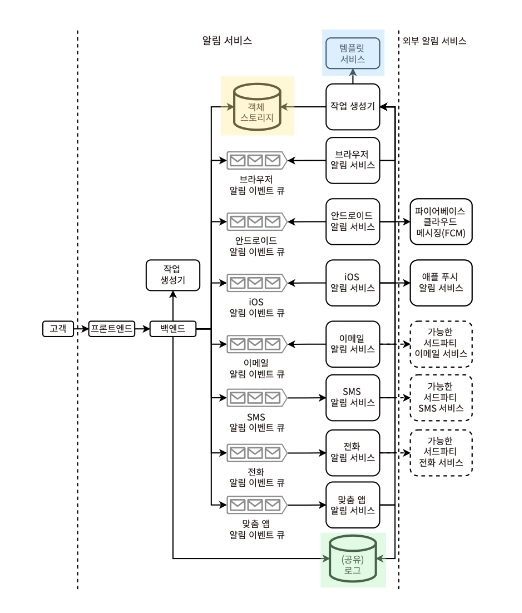
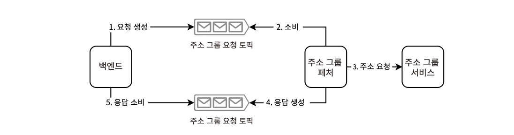
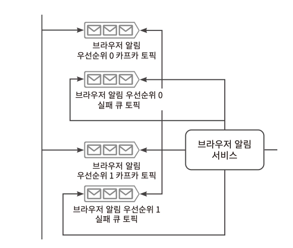

# 9장. 알림/경보 서비스 설계

## 기능 요구사항

- 알림 서비스는 모든 서비스에서 공통으로 사용되는 범용 서비스이므로, 가능한 한 단순하게 유지
- 다양한 채널의 메시징 서비스(SMS, Email, …)를 지원하며, 이는 공유 서비스를 사용
- 이 서비스를 가동 시간 모니터링(다른 서비스의 중단 경보 트리거)에 사용해서는 안 됨
  - 모니터링 서비스와는 독립된 인프라에서 실행되어야 장애와 별개로 트리거가 가능하기 때문
  - 주로 외부 가용성 모니터링 서비스가 많이 사용됨 — e.g. PagerDuty

### 사용자 유형

1. 발신자 : 알림 CRUD를 실행하는 사람/서비스
   1. 수동 방식
   2. 프로그래밍 방식 - (웹 UI에서) API 요청을 통해 작업, 일정에 따라 API 요청 트리거

   +) 알림 전송, 알림 구성, 전송된 알림과 대기 중인 알림 보기 등의 기능 제공

2. 수신자 : 알림을 받는 사용자/기기/앱 자체

   [지원 채널]
   - 브라우저
   - 이메일
   - SMS (MMS 고려X)
   - 자동 전화 통화
   - Android, iOS, 브라우저의 푸시 알림
   - 앱 내 맞춤형 알림 (\*주로 엄격한 프라이버시, 보안 요구사항이 있는 도메인)

   [수신자 그룹]

   1명 이상의 수신자에 알림을 보내고자 할 때, 이 수신자 목록을 수신자 그룹으로 관리하여 알림을 한번에 보낼 수 있다 → 수신자 그룹 CRUD 지원 필요. 그룹 RBAC 고려 가능

   \*_수신자 그룹도 PII가 포함되므로 GDPR, CCPA과 같은 개인정보보호법이 적용됨_

3. 관리자 : 다른 사용자에게 알림 전송, 알림 템플릿 생성 등의 관리자 접근 권한

### 데이터

- 알림 크기 ≤ 1MB
  - 수천 잔의 문자, 썸네일 이미지를 담기에 충분함
  - 비디오, 오디오는 지원 X → 파일 링크로 대체
- 별도 기능을 통해 콘텐츠 다운로드 지원
  - 해커의 악용을 방지하기 위해 알림 내 디지털 서명이 포함되어야 함

### 템플릿

특정 메시징 시스템마다 템플릿(필수 필드 집합)이 존재하는 것처럼 알림 시스템에도 모두 동일한 메시지 or 개인화된 매개변수를 포함한 맞춤형 메시지를 템플릿화하여 관리한다.

→ 알림 서비스에서는 이 템플릿을 CRUD할 수 있는 API를 제공해야 할 수 있음 (= 템플릿 서비스)

### 사용자 기능

- 발신자의 중복 알림 요청을 식별하여 결과적으로 중복 알림을 방지한다
- 사용자가 과거 알림 요청을 볼 수 있게 한다 (중복 요청 방지. 알림 서비스와 중복의 기준이 다를 수 있는 점 고려)
- 사용자가 알림 구성, 템플릿을 저장하고 자주 사용하는 알림은 즐겨찾기로 저장한다
- 사용자는 알림의 상태를 조회할 수 있다 (예약 / 전송중 / 실패 / ..)
  - 재시도 건에 대한 예약 여부, 전송 횟수도 조회 가능
- 우선순위에 따라 가중치 부여

### 분석

## 비기능적 요구사항

- 스케일 - 매일 수십억 개(PB)의 알림 전송 **\*알림당 1MB**, 수천 명의 발신자와 10억 명의 수신자 가정
- 성능 - 몇 초 내에 전달 (중요한 알림일수록 전달 속도의 가중치 부여)
- 고가용성 - 99.999%의 가동 시간
- 내결함성 - 수신자가 알림을 받을 수 없는 경우, 다음 기회라도 받아야 함
- 보안 - 인증된 사용자만 알림 전송
- 프라이버시 - 수신자는 알림 수신을 거부할 수 있음

## 고수준 아키텍처

- 각 채널 서비스는 해당 채널에 특화된 로직을 제공 \*_특정 서버 애플리케이션, 채널마다 다른 기능, 구성, 프로토콜을 필요로 하기 때문_
  - 브라우저 - 웹 알림 API 사용 (Firefox, Chrome, ..)
    - https://developer.mozilla.org/en-US/docs/Web/API/Notifications_API/Using_the_Notifications_API
    - https://developer.mozilla.org/en-US/docs/Web/API/Notification
    - Chrome에서는 자체 API 로 제공 (이미지, 프로그레스바 등 편의 기능 제공)
      - https://developer.chrome.com/docs/extensions/reference/api/notifications?hl=ko
      - https://developer.chrome.com/docs/extensions/how-to/ui/notifications?hl=ko
  - 안드로이드 - Firebase Cloud Messaging(FCM)
  - iOS - Apple Push Notification Service(APNS)
  - 이메일, SMS/문자 메시지, 전화 통화 - 외부 서비스 활용
- 공통 채널 서비스 로직은 다른 서비스에서 중앙 집중화한다 = **작업 생성기(Job constructor)**
- 이벤트 스트리밍과 같은 **비동기 기술**을 사용해야 요구사항의 사용자 규모를 지원하는 확장성을 확보할 수 있다
  - 이점 - 결합도 감소, 서비스 구성 요소의 독립적 개발, 과거 메시지 재생을 통한 쉬운 문제 해결, 차단 호출 없는 높은 처리량
- 각 알림 이벤트는 단일 수신자/목적지를 위한 것이며, 관련 채널 큐에 생성한다
- 각 채널 서비스의 역할
  > 핵심 기능 - **목적지을 정확하게 식별해 알림을 보낸다**
  - 브라우저 알림, 사용자 지정 앱 알림 외 채널에서는 타사 API를 사용하여 메시지를 전달해야 한다
  - 타사 API 사용은 해당 채널 서비스가 직접 요청을 하는 유일한 구성 요소여야 한다
  - 알림 서비스 외 다른 서비스에서도 사용 가능할 수 있도록 설계
  - 각 채널에 대해 카프카 토픽 프로비저닝 → 우선순위 수준에 따라 토픽 구성 가능
    - e.g. 5개 채널에 이벤트 생성, 3개 우선순위 수준 ⇒ 15개의 토픽을 가짐

## 객체 스토리지

> 요구사항에 따라, 백엔드는 전체 1MB 알림을 카프카 토픽에 생성할 수 있다. 알림에 큰 파일이나 객체가 포함되는 경우에 객체 저장소&메타데이터 서비스를 활용해 해결할 수 있다.

- 백엔드에서 객체 저장소에 POST → 객체 ID 획득 → 토픽에 이벤트 생성 → 채널 서비스에서 이벤트 내 객체 ID로 객체 저장소에 GET → 알림 조립 → 수신자에 전달 \*_여러 수신자에 알림을 전달하는 경우, POST 요청을 여러 번 수행해 2번째 요청부터는 객체 저장소에서 304 Not Modified 응답을 반환할 수 있음_
- 이벤트의 중복 콘텐츠를 줄이고 크기를 줄이기 위함

## 알림 템플릿

> 개인화 관리 시 템플릿으로 관리하는 것이 유용하다

- 알림 서비스 확장성 개선에 유용
- 모든 공통 데이터를 템플릿에 배치하여 알림 이벤트의 크기를 최소화할 수 있음
  - 이벤트의 최소 구성 - 알림 ID, KV 형태의 개인화된 데이터, 수신자 정보
- 알림 서비스 사용자를 위한 템플릿 CRUD, 자체 인증/권한 제공

## 추가 기능

- 템플릿 서비스 내 저장, 접근 제어, 변경 관리
  - LDAP과 같은 조직 사용자 관리 서비스와의 통합
  - 변경 이력 기록
  - 변경 승인 프로세스
  - 이전 변경/특정 버전으로의 롤백
- 템플릿 클래스와 함수
  - 재사용 가능하고 확장 가능한 하위 템플릿으로 구성
  - 클라이언트가 생성한 알림에 대한 validation 수행 가능
  - 템플릿 매개변수
    1. 함수 - 수신자 기기의 동적 동작에 유용
    2. 변수 - 데이터 유형을 특정
  - 매개변수를 채우는 방식은 다양하게 제공 가능
    1. 간단한 규칙 - e.g. 수신자 이름 필드, 통화 기호 필드
    2. 머신러닝 모델 - e.g. 각 수신자에게 다른 할인율 제공
- 검색 - 수많은 템플릿, 템플릿 클래스 관리 편의를 위함

## 예약된 알림

1. Airflow, luigi 등 기존 솔루션 활용
2. 자체 작업 스케줄링 시스템 설계 (cron, ..)

- 속도 제한기에 의해 주기적인 알림은 임시 알림과 경쟁할 수 있다

## 알림 수신자 그룹

알림에 포함되는 수백만 개의 목적지/주소를 효율적으로 관리하려면, 알림 서비스에서 목적지 목록을 유지하고 목록의 ID로 네트워크 통신을 하는 방법이 있다.

→ 이 목록을 **‘알림 수신자 그룹’**이라고 부름

- 주소 그룹 서비스
  - Read-only
  - Append-only
  - 관리자 접근 제어 매우 중요
  - 수신자의 스팸 방지를 위해 그룹에서 자신을 제거할 수 있도록 허용 (추후 분석 시스템에서 제거 이벤트 활용 가능)
- 운영 시 수동 검토, 승인 프로세스는 필수
- Choreography SAGA 패턴으로 주소 GET → 알림 이벤트 생성을 효율적으로 처리할 수 있다
  
  1. GET으로 주소 그룹 서비스에서 주소 배치 획득
  2. 각 주소에서 알림 이벤트 생성
  3. 이벤트 카프카 토픽에 적절한 알림 생성
- 백엔드를 두 개의 서비스로 분할하여 하나의 토픽에 생성, 다른 토픽에서 소비하는 구조
  - Kafka Streams 사용 가능
  - 큰 주소 그룹은 계속해서 변하므로, 이 이벤트 처리 주기에 대해 고민할 필요가 있다

## 구독 취소 요청

알림 카테고리 목록을 제공하여 특정 카테고리별로 알림 활성 여부를 관리할 수 있는 페이지 및 기능을 고려해야 한다.

1. 클라이언트 사이드 구현 - 알림 서비스에서 알림을 보내고, 수신자 기기 앱에서 차단하는 방식 (이메일, 전화, SMS에서는 구현에 한계가 있음)
2. 서버 사이드 구현 - 버그에 의해 알림을 잘못 보내는 경우가 생길 수 있음
3. 양쪽 모두 구현 - 가장 안전

## 실패한 전달 처리

알림 전달은 알림 서비스와 무관한 이유로 실패할 수 있다

- 수신자 기기의 문제
  - 네트워크 문제
  - 기기 전원 OFF
  - 타사 전달 서비스의 이슈 - DLQ 역할의 카프카 토픽을 통해 재처리
  - 앱 사용자가 모바일 앱 삭제/계정 로그아웃
- 알림 카테고리 차단(구독 취소) 이후, 기기도 알림을 차단했으나 버그로 인해 전달될 수 있음 → 알럿을 통해 인지 필요

## 중복 알림에 관한 클라이언트 사이드 고려사항

- 알림이 생성되면 채널 서비스는 즉시 수신자에게 push 한다.
- 외부 알림 서비스를 사용하지 않는 채널은 기기가 오프라인 → 온라인 상태가 되는 시점에 알림을 pull 한다.
  - 중복 방지 - 클라이언트 사이드에서 구현
    - 사용자에게 이미 표시/해제된 알림 기록
    - 브라우저 로컬 스토리지나 모바일 기기의 SQLite Database 에 저장할 수 있다 (→ 새 알림 표시 전, 기기의 저장소 조회하여 확인)

## 우선순위

> 각 우선순위 수준에 대한 별도의 카프카 토픽을 생성한다

- 소비자 호스트는 높은 우선순의 카프카 토픽이 비워질 때까지 소비한 다음, 낮은 우선순위 카프카 토픽에서 소비
- 가중치 접근 방식
  - 이벤트를 소비할 준비가 될 때마다 **가중치 무작위 선택**으로 토픽 선택

## 검색

- 사용자가 기존 알림/경보 설정을 검색하고 조회하는 기능 제공
- 알림 템플릿, 알림 주소 그룹 인덱싱
- match-sorter와 같은 라이브러리 활용

## 모니터링과 경보

- 통계 모니터링 대시보드
  - 성공과 실패율
  - 큐의 이벤트 수와 시간에 따른 이벤트 크기 백분위수를 채널과 우선순위별로 분류한 것
  - CPU, 메모리, 디스크 저장소 소비와 같은 OS 통계
- 불필요한 리소스 소비가 없는지, 큐의 이벤트 크기를 더 줄일 수 없을지, 메타데이터 서비스에 배치 등을 개선하기 위한 지표
- 주기적인 감사 → 감지되지 않는 오류 탐지
  - 외부 알림 서비스에 요청을 보내는 알림 서비스가 받은 200 응답 수 VS 해당 외부 알림 서비스가 받은 유효한 알림 수
  - 다양한 매개변수에 따른 알림 속도, 메시지 크기의 비정상적 변화 파악 가능

## 알림/경보 서비스의 가용성 모니터링과 경보

- 경보 서비스를 독립된 인프라로 분리하여 장애를 트리거할 수 있어야 한다
- 다양한 데이터 센터에 위치한 서버와 같은 외부 기기를 활용해 공유 서비스로서 사용 가능
  - 외부 기기에 설치 가능한 클라이언트 데몬 제공 → 주기적으로 hearbeat를 보내고 예상 가능하도록 구성하는 방식
  - 응답이 없으면 이상이 있음으로 간주하고 알럿 전송

## 기타 논의 가능한 주제

- 수신자가 원치 않는 알림을 거부하는 기능
- 이미 많은 사용자에게 보낸 알림을 수정해야 하는 상황
- 사용하는 채널에 관계 없이 발신자의 속도를 제한하는 대신, 개별 채널 속도 제한도 허용하는 시스템 설계
- 분석 가능성
  - 성능 개선 시 사용하는 다양한 채널의 알림 전달 시간 분석
  - 알림 응답률, 알림에 대한 사용자 행동, 다른 알림 응답에 대한 추적과 분석
  - A/B 시스템
- 추가 템플릿 서비스 기능 API, 아키텍처
- 확장 가능하고 고가용성인 작업 스케줄러 서비스
- 주소 그룹 서비스
  - 구독 취소 요청 시 배치 VS 스트리밍
  - 수동/자동으로 재구독하는 경로와 방식
- 승인 서비스 방식
- 정의할 정확한 메트릭, 모니터링/경보 예시와 설명
- 클라이언트 데몬 솔루션 추가 설명
- 다양한 메시징 서비스의 설계 (e.g. 이메일 서비스, SMS 서비스, 자동 전화 통화 서비스)
