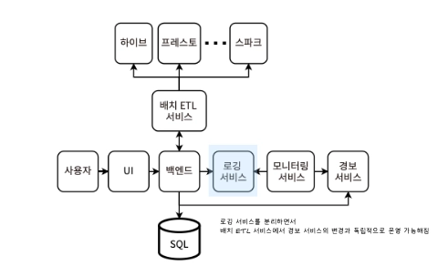
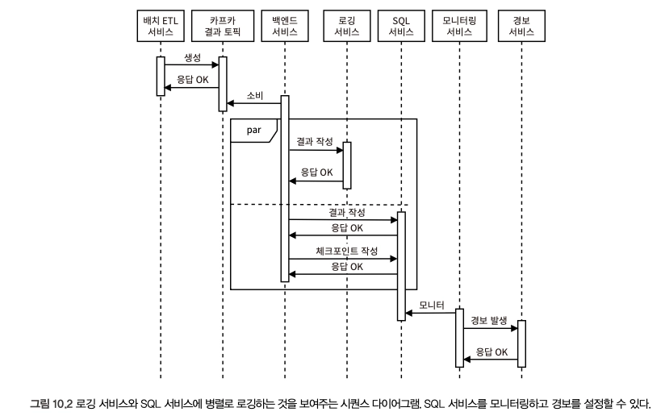

# 10장. 데이터베이스 배치 감사 서비스 설계

## 감사가 왜 필요한가?

- 트랜잭션 감독자의 역할 IN 데이터 배치 감사
    1. 수동으로 정의된 유효성 검사
    2. 여러 서비스/DB 간 데이터 차이와 일관성 복원
- 데이터 손실을 방지하기 위해 복제나 백업을 구현해야 한다
    - 이는 몇 초 이상 걸릴 수 있으며, 진행 중에 리더 호스트가 실패할 수도 있다
    - 늦은 복제로 인한 데이터 손실을 방지하기 위한 기술 중 하나가 **정족수 일관성**이다
        - Cassandra - 성공 반환 전에 여러 노드의 memtable에 쓰기 복제 → memtable은 주기적으로 SSTable 디스크로 flush
        - MongoDB - 일관성을 위해 의도적으로 리더 호스트의 데이터 손실 감내
- 서비스는 데이터를 받을 때 유효성을 검증해야 하며, 유효하지 않은 경우 적절한 4xx 응답을 반환해야 한다
- 감사 주체
    1. 외부 감사 프로세스
    2. 데이터베이스 (제약 조건 등)
        - https://dev.to/jonlauridsen/database-constraints-considered-harmful-38
        - 외래 키 제약 금지 주장
            - https://github.com/github/gh-ost/issues/331#issuecomment-266027731
            - https://github.com/alibaba/Alibaba-Java-Coding-Guidelines#sql-rules
    3. 애플리케이션 
- 감사는 또 다른 유효성 검사 계층이다. 유효하지 않은 데이터가 유지되는 것을 막기 위한 최선의 노력이자 미리 대비해야 할 것 중 하나이다.
- 사용 사례
    1. 큰 파일 (≥ 1GB)과 같이 생성 방식을 통제할 수 없는 조직 외부의 파일을 검증하는 것
        - MySQL의 LOAD DATA, HDFS, Hive,Spark 의 NoSQL 옵션 등으로도 처리 가능
    2. 중복되거나 누락된 데이터 검사
        - 이전에 수집된 데이터를 활용해 이상 감지 알고리즘을 적용할 수 있다
- **수동으로 정의된 유효성 검사의 가능성**
    - 테이블에 매시간 최소한의 새로운 행이 기록되어야 한다
    - 특정 문자열 열은 null 값을 포함할 수 없으며, 문자열 길이는 1~255 사이여야 한다
    - 특정 문자열 열은 특정 정규 표현식과 일치하는 값을 가져야 한다
    - 특정 정수 열은 음수가 아니어야 한다

## 간단한 SQL 배치 감사 서비스

> SQL 테이블을 감사하는 스크립트 구성
> 
1. 데이터베이스 쿼리를 실행한다
2. 결과를 변수로 읽는다
3. 이 변수의 값을 특정 조건과 비교한다

> 배치 감사 서비스로 확장
> 
1. SQL 데이터베이스와 쿼리 (→ 파일 템플릿 구현)
2. 쿼리 결과에 대해 실행할 조건
3. 감사 통과 여부에 따른결정 *감사 실패 시 경보 트리거

[템플릿 활용]

- 사용자는 DB, 쿼리, 조건 값을 입력하고, 템플릿 내 매개변수를 해당 값으로 대체하여 파일을 생성한다
- 서비스는 해당 파일을 읽어 유효성 검사 함수를 실행하는 새로운 Airflow/cron 작업을 만든다

## 요구사항

> 사용자가 SQL이나 Hive, Trino 쿼리를 정의해 주기적으로 데이터베이스 테이블의 배치 검사를 수행할 수 있는 시스템을 설계한다.
> 
- 감사 작업의 CRUD
    - 분, 시간, 일, 사용자 지정 시간 간격
    - 소유자
    - SQL, HQL, Trino, Cassandra 등의 dialect로 작성된 유효성 검사 DB 쿼리
- 실패한 작업이 존재하면 경보 발생
- 과거/현재 실행 중인 로그 조회 (오류 발생 여부, 조건문 결과 등)
- 발생한 경보의 상태, 발생 시간, 해결 여부, 해결된 시간 기록 등
- 감사 작업은 최대 6시간 이내에 완료
- DB 쿼리는 15분 이낸에 완료 (장시간 실행 쿼리를 시스템 레벨에서 차단해야 함)

### 비기능적 요구사항

- Security - 작업은 소유자만 CRUD 가능
- Accuracy - 작업 구성에서 정의한대로 정확한 감사 작업 결과가 나와야 함
- Scale - 10000개 미만 작업, 10000개 DB Statement로 예상했을 때, 이는 UI를 통해서만 읽힘 (저트래픽)
- Availability - 다른 시스템에서 직접 의존하지 않는 내부 시스템 → 고가용성 필요X

## 고수준 아키텍처

1. 사용자는 공유 배치 ETL 서비스에 요청 → 작업의 상태 및 이력 확인을 포함한 배치 감사 작업 CRUD 실행
    1. 벡엔드 서비스 - 사용자 입력값을 템플릿에 대입 → 서비스 메모리 내에 저장
    2. 백엔드 서비스 → ETL 서비스로 템플릿 파일과 함께 요청 전송 
2. 공유 배치 ETL 서비스는 경보를 트리거하거나 트리거된 경보의 상태, 기록을 보지 않으며, 이는 사용자가 UI/백엔드를 통해 요청하여 조회가능하다

- 배치 감사 서비스는 공유 배치 ETL 서비스의 Wrapper
- 감사 작업 구성 - 작업 소유자, 크론 표현식, DB 유형, 실행할 쿼리
- 배치 감사 작업
    1. DB 쿼리 실행
    2. DB 쿼리 결과로 조건문 실행 
    
    → FaaS로 구현해 내장된 확장성을 활용하는 것도 좋은 방향
    
- 경보 처리
    1. ETL 서비스에서 트리거 
    2. 백엔드 서비스에서 트리거 
    
    - **백엔드 서비스는 경보 상태 및 기록 조회 요청 담당**
    - 두 서비스에 모두 구성을 유지해야 하는 부담을 덜기 위해, ETL 서비스에서는 유효성 검사 결과값을 Bool로 반환하고 백엔드 서비스에서 **경보 트리거 요청**을 담당하게끔 위임할 수 있다
        - 잠재적 버그 - 경보 요청을 생성하고 만드는 백엔드 서비스 호스트가 충돌하거나 사용할 수 없게 된 경우, 경보가 정상적으로 전송되지 않음
            1. 배치 ETL 서비스의 재시도 메커니즘에 의존 → 경보 요청이 보장될 때까지 백엔드 서비스로의 요청 차단
            2. 배치 ETL 서비스에서 분할된 카프카 토픽 관리 → 알림 요청 이후 체크포인팅 (경보 중복 이슈 고려해야 함)
- 감사 작업 결과를 SQL, 공유 로깅 서비스에 모두 기록하여 호스트가 장애에서 복구될 때마다 SQL 테이블 쿼리로 마지막 체크포인트를 얻을 수 있다
    
    
    
    - 로깅 서비스에 중복 결과를 작성하게 된다면?
        1. 그냥 작성 (중복을 허용하는 경우)
        2. 로깅 서비스에서 중복 처리
        3. 로깅 서비스에 쓰기 전 쿼리로 미리 확인 (트래픽 2배)

## 데이터베이스 쿼리 제약

> 이 시스템에서 가장 비용이 많이 들고 오래 실행되는 계산이 데이터베이스 쿼리이므로, 배치 ETL 서비스는 실행 가능한 쿼리의 속도와 기간에 제약을 정해야 한다.
> 
1. 쿼리 실행 시간 제한
    - 작업 구성 생성/편집 - 실행 중인 작업의 실행 시간 분리하기
    - 비차단/비동기 경험을 제공하기 위해 쿼리 실행 완료 시 사용자에 알림을 보내고, 작업 구성에 대한 승인 여부를 받게 할 수 있다
    - 여러 사용자의 동시 쿼리 편집 케이스 고려 (e.g. 편집~검증까지 작업 비활성화)
2. 제출 전 쿼리 문자열 확인
    - 제출 전 사용자에게 쿼리 문자열의 즉각적인 피드백 제공
    - 유효하지 않거나 비용이 많이 드는 쿼리인지 사전에 검사하여 차단 (`DESCRIBE`)
    - 쿼리 실행 계획 표시하여 실행 시간을 최소화하게끔 조정 유도
        - e.g. Hive - https://cwiki.apache.org/confluence/display/Hive/LanguageManual+Explain
3. 초기 사용자 훈련

## 과도한 동시 쿼리 방지

> 배치 ETL 서비스가 실행할 수 있는 동시 쿼리 수에 제한을 둬야 한다.
> 
- 동시 쿼리 수가 예상 용량에 근접했을 때 경보 트리거하는 등으로 활용
- 동시 쿼리 수에 대한 구성 제한은 데이터베이스 감사 서비스가 아닌 쿼리 서비스에 위치하는 것이 적절함
- 배치 ETL 서비스에서 쿼리 실행 전 백엔드 서비스를 통해 미해결 경보가 존재하는지 확인하는 방법도 있음

## 데이터베이스 스키마 메타데이터 사용자

- 사용자의 쿼리 작성을 돕기 위해 서비스는 스키마 메타데이터에서 작업 구성을 자동으로 도출할 수 있다
    - e.g. WHERE절 컬럼 제안 쿼리 템플릿, 최신 파티션만 테스트하는 쿼리 제안
- 사용자의 수동 감사 실행, 파티션에 대해 제한된 수의 감사 예약 등 기능을 지원해야 함
- 테이블 감사는 데이터의 갱신 주기 SLA에 따라 구성될 수 있고, 이는 데이터의 최신성과 연관이 있다
    - 데이터베이스 메타데이터 카탈로그/플랫폼 - Amundsen, DataHub, Metacat
    - 해당 도구로 갱신 주기 SLA, 테이블에 관련된 사건 기록 등 관리
    - 이를 통해 사용자가 테이블의 메타데이터 변경사항을 구독 및 영향이 미치는 문제에 대해 경보를 받게끔 할 수 있다

## 데이터 파이프라인 검사

- 여러 단계로 감사 작업을 구성하고, 각 작업에서는 특정 테이블에 쓰고 다음 단계에서 읽는 방식이다
- 특정 감사 작업 실패 시 서비스 액션
    1. 상위 작업 실패 시 하위 감사 비활성화하여 리소스 절약
    2. 해당 테이블 쿼리를 포함하는 다른 작업과 그 하위 작업까지 비활성화
    3. 모든 비활성화된 작업의 소유자와 모든 하위 작업의 소유자에 CRITICAL 경보로 알림
    
    +) 데이터베이스 메타데이터 플랫폼에 테이블 이상 업데이트
    
- 이러한 작업 간 종속성은 Trigger rule을 통해 구성할 수 있다
- https://airflow.apache.org/docs/apache-airflow/stable/core-concepts/dags.html

## 기타 감사 가능 유형

- **데이터 센터 간 일관성 검사** - ****샘플링 테스트 실행 기능
- **업스트림과 다운스트림 데이터 비교** - 테이블의 최신 파티션을 비교해 일관성을 보장하는 감사 작업

## 기타 논의 가능한 주제

- 확장 가능한 배치 ETL 서비스, 경보 서비스 설계
- 템플릿 → 작업 생성 함수 코딩 (코딩 테스트)
- 데이터 무결성 문제의 원인을 어떻게 발견하고 해결할 것인가
- 특정 감사 작업은 한 번 실행하면 실패했다가 소유자가 문제 해결 중에 동일한 쿼리를 실행하면 통과할 수 있는데, 서비스 단에서 이를 지원하기 위해 어떤 로깅이나 기능을 제공할 수 있는가
- 동일하거나 유사한 감사 작업을 찾고 중복을 제거하는 것
- 중복 경보 제거 로직 중 데이터베이스 배치 감사 서비스 or 공유 서비스 중 어느 부분을 어디에서 구현할 것인지
- 스케줄링이 아닌 특정 이벤트에 의해 테스트 트리거
