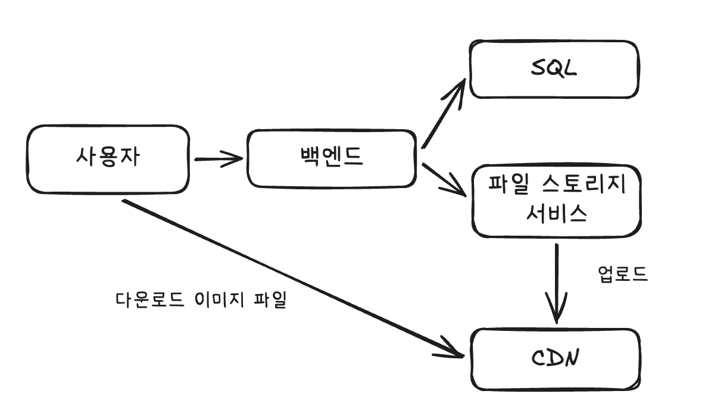
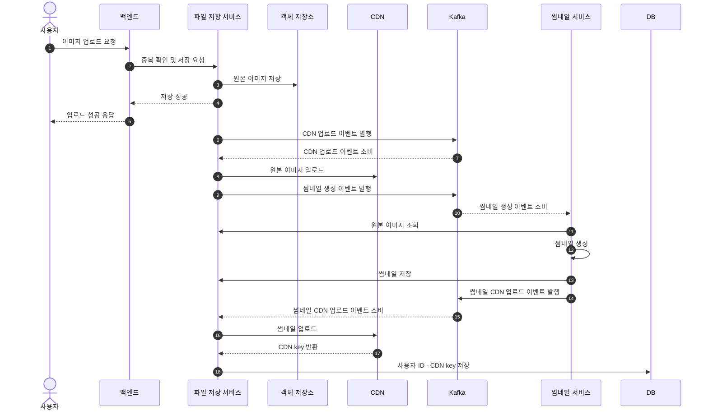
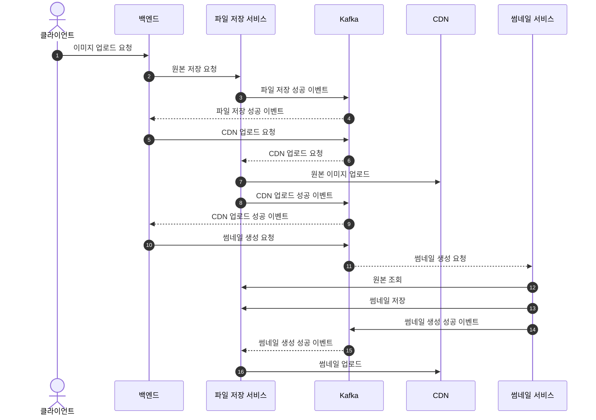

# 플리커 설계

기능: 이미지와 비디오를 공유하고 댓글을 달 수 있는 소셜 애플리케이션
썸내일 처리 방식
1) 클라이언트가 썸내일을 요청할 때마다 서버가 전체 해상도 이미지에서 썸내일을  생성하는 방식 -> 비용이 많이 들고 처리와 저장을 기능 분할하기 힘들다
2) 파일이 업로드 된 직후 썸내일을 생성하고 저장하고 뷰어가 요청하면 제공 -> 몇 KB 크기이기 때문에 비용이 낮고 썸내일과 전체 해상도 이미지 파일을 모두 클라이언트 캐시 가능

### 고수준 아키텍쳐

이미지 파일과 이미지 메타데이터(주로 JSON 형식) 저장하기 위한 CDN. CDN과 별개로 아래 이유 때문에 별도 파일 저장 서비스를 둘 수도 있음
- CDN에서 데이터를 복제하면서 지연 시간이 발생할 수 있음 -> 그 사이 많은 뷰어의 요청을 처리하기 위함
- CDN의 보안문제나 기타 장애 등을 대비한 폴백

### 사진 업로드하기
##### 클라이언트에서 썸내일 생성하기
- 썸내일 생성 -> 압축(Gzip, Brotil) -> POST 요청으로 업로드 -> CDN에 기록, 복제
- 하지만 클라이언트 기기를 제어할 수 없고 그 환경을 자세히 알지 못해 버그를 재현하기 어려움. 서버에 비해 클라에서 발생할 수 있는 더 많은 실패 시나리오를 예상해야 함

##### 서버에서 썸내일 생성하기
- 중복 업로드 검사 -> 파일을 파일 저장 서비스와 CDN에 업로드 -> 썸내일 생성 후 파일 저장 서비스와 CDN에 업로드

**코레오그래피 사가 패턴 접근 방식**
하나의 비즈니스 트랜잭션을 중앙 조율자 없이 이벤트 기반으로 진행 - 각 서비스가 일을 수행하고 이벤트를 발생하면 다른 서비스는 그 이벤트를 받아 각자의 동작 수행

**오케스트레이션 사가 패턴 접근 방식**

**서버 사이드와 클라 사이드 생성 모두 구현하기**
클라이언트에서 먼저 시도 후 실패하면 서버에서 생성하는 방식
